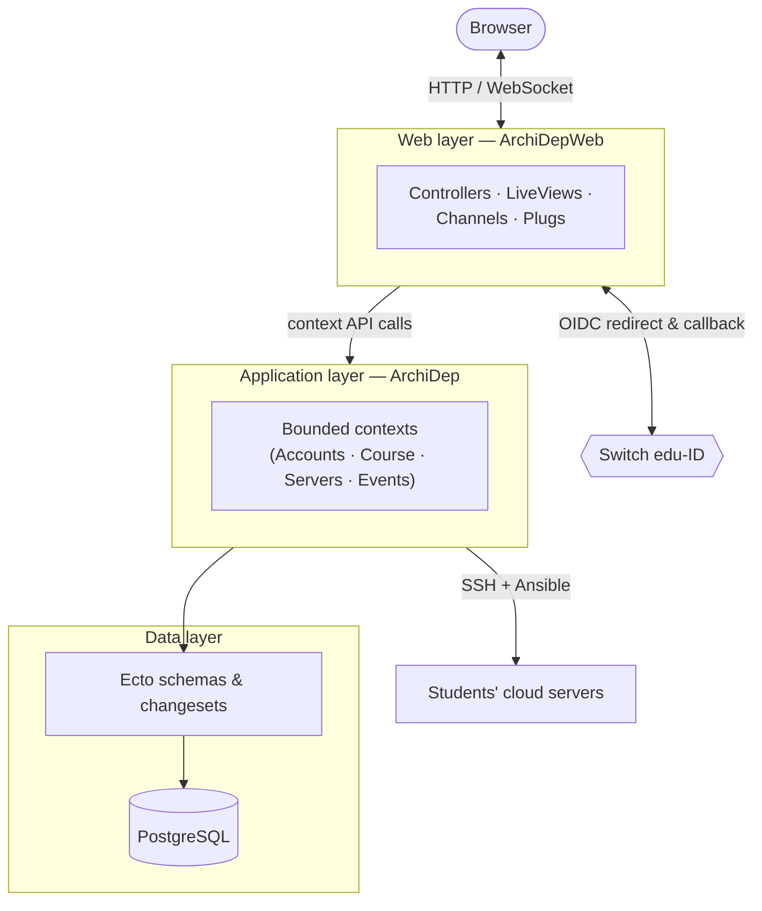
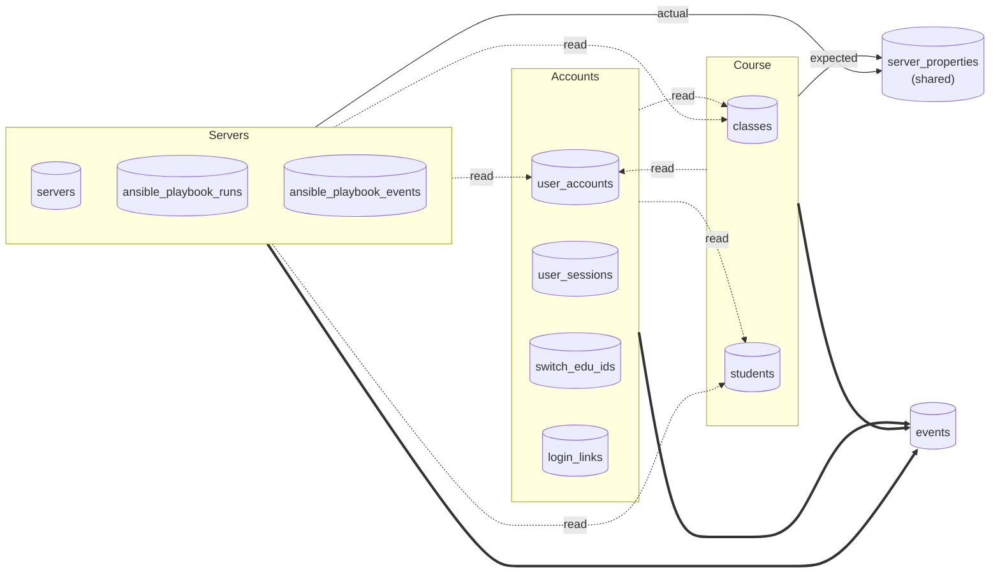

# Contributing

Please read this document to understand how the ArchiDep dashboard application
is structured and what guidelines to follow when contributing.

The adjacent [`AGENTS.md`](./AGENTS.md) file contains additional instructions
for AI assistants and automated agents.

<!-- START doctoc generated TOC please keep comment here to allow auto update -->
<!-- DON'T EDIT THIS SECTION, INSTEAD RE-RUN doctoc TO UPDATE -->

- [Application Overview](#application-overview)
  - [Integration with other components](#integration-with-other-components)
- [Application Structure](#application-structure)
- [General Coding Guidelines](#general-coding-guidelines)
- [Application Architecture & Implementation](#application-architecture--implementation)
  - [Overall system](#overall-system)
    - [Development Environment](#development-environment)
  - [Internal architecture](#internal-architecture)
  - [Bounded contexts](#bounded-contexts)
  - [Authentication](#authentication)
  - [Authorization](#authorization)
  - [Impersonation](#impersonation)
  - [Events & Auditing](#events--auditing)
  - [Notifications](#notifications)
  - [Telemetry](#telemetry)
  - [Other Libraries & Tools](#other-libraries--tools)
- [Formatting & Linting](#formatting--linting)
- [Testing](#testing)
  - [Test Support](#test-support)
  - [Test coverage](#test-coverage)
  - [Test fixtures](#test-fixtures)
  - [Mocks & Contract Tests](#mocks--contract-tests)
- [Useful Commands](#useful-commands)
  - [Setup & Composite Commands](#setup--composite-commands)
  - [Formatting Commands](#formatting-commands)
  - [Linting Commands](#linting-commands)
  - [Testing Commands](#testing-commands)
- [References](#references)
  - [Tooling References](#tooling-references)
  - [Testing References](#testing-references)
- [For AI Agents](#for-ai-agents)

<!-- END doctoc generated TOC please keep comment here to allow auto update -->

---

## Application Overview

This application is a real-time dashboard for teachers and students of the Media
Engineering Architecture & Deployment course. It is one of the two main parts of
the whole ArchiDep website, the other part being a static site that contains
most of the course material (see [`CONTRIBUTING.md` in the `course`
directory](../course/CONTRIBUTING.md)).

Both teachers and students can register using their [Switch edu-ID
account][switch-edu-id].

The main student-facing features are:

- Display credentials to access an SSH server that has been set up for them to
  learn about SSH at the beginning of the course, before they set up their
  individual cloud servers.
- Allow students to register the cloud server they will create during the
  exercises, and to check whether the server is correctly configured.

The main teacher-facing features are:

- Register classes and students each year/semester.
- Automatically set up and monitor the students' cloud servers.

### Integration with other components

The overall UI (header & sidebar) is shared between the dashboard application
and the course material site to provide a seamless experience when switching
between the two. The Tailwind CSS theme for the whole website, used by both
components, can be found in the `theme` directory (see [`CONTRIBUTING.md` in the
`theme` directory](../theme/CONTRIBUTING.md)).

---

## Application Structure

- **Main Parts**
  - `lib/archidep`: The main Elixir application that implements all the business
    logic, including user management, class/student and server management, and
    automatic interactions with cloud servers. Most of this logic lives in the
    [bounded contexts](#bounded-contexts), but the directory also contains a
    number of cross-cutting modules:
    - `application.ex`: The OTP application and supervision tree.
    - `repo.ex`: The [Ecto][ecto] repository (PostgreSQL).
    - `authentication.ex`: The current [authenticated
      user/session](#authentication).
    - `policy.ex`: The [authorization policy](#authorization) behaviour.
    - `config.ex` & `config/`: Typed access to application configuration.
    - `mailer.ex`: Email delivery via Swoosh.
    - `tracker.ex`: Presence tracking (Phoenix Presence).
    - `prom_ex.ex` & `monitoring/`: [Telemetry and metrics](#telemetry).
    - `sentry.ex`: [Error reporting](#telemetry) filtering for Sentry.
    - `git.ex`, `client_metadata.ex`, `http/`, `errors/`, `release.ex`: Git
      build metadata, business-event client metadata, the HTTP client wrapper,
      shared error types, and release tasks.
    - `helpers/`: Shared helper modules used across contexts (e.g.
      [`ContextHelpers`](./lib/archidep/helpers/context_helpers.ex),
      `ChangesetHelpers`, `SchemaHelpers`, `UseCaseHelpers`, `GenStageHelpers`).
  - `lib/archidep_web`: The Phoenix web interface, including controllers, views,
    APIs, templates, live views, and channels.
- **Supporting Files**
  - `assets`: JavaScript for frontend integration with Phoenix LiveView.
  - `config`: Configuration files for the different environments (development,
    test, production).
  - `lib/mix/tasks`: Custom Mix tasks.
  - `mix.exs` and `mix.lock`: Project configuration and dependencies.
  - `priv`
    - `ansible`: Ansible playbooks and roles for student server setup. Those
      are executed by the application via SSH.
    - `repo/migrations`: Database migrations.
    - `repo/seeds.exs`: Script to populate the database with initial data.
    - `ssh`: SSH key pair used by the application to connect to student servers.
  - `test`: Automated test suites for the application. Tests are organized to
    mirror the structure of the `lib` directory.
- **Other Things**
  - `_elixir_ls`: Elixir Language Server files (ignored).
  - `_build`: Compiled application files (ignored).
  - `.credo.exs`: Configuration for the Credo static code analysis tool.
  - `cover`: Code coverage reports (ignored).
  - `deps`: Dependencies managed by Mix (ignored).
  - `.formatter.exs`: Configuration for the Mix code formatter.
  - `priv`
    - `static`: Generated static assets (ignored).
    - `uploads`: Directory for user-uploaded files in the local development
      environment (ignored).
  - `package.json`: npm workspace configuration for the application's frontend
    assets.
  - `rel`: Release configuration for building [production
    releases](https://hexdocs.pm/elixir/config-and-releases.html).

---

## General Coding Guidelines

The following guidelines concern the source code of the application at a general
level. See the next sections for more specific guidelines on architecture,
implementation, formatting and testing.

- **Main Frameworks, Languages and Libraries**
  - [Phoenix web framework][phoenix] written in [Elixir][elixir], and [Phoenix
    LiveView](https://hexdocs.pm/phoenix_live_view/welcome.html) for
    interactive, real-time user interfaces
  - JavaScript for frontend integration with Phoenix LiveView

- **Elixir Guidelines**
  - Prefer pure functions without side effects.
  - Prefer pattern matching and immutability.
  - Try to make impossible states unrepresentable.
  - Use `with` statements for chaining operations that may fail. Use a `case`
    statement for a single operation that may fail.
  - Avoid Elixir anti patterns (links below under [References](#references)).
    Indicate when existing code seems to violate these anti patterns. Reference
    the relevant anti-pattern(s) when appropriate.

- **Phoenix Guidelines**
  - Use Ecto for database interactions.
  - Write migrations in `priv/repo/migrations/`.
  - Make migrations reversible whenever possible.
  - Use UUIDs for primary keys.
  - Prefer function components over live components unless stateful behavior is
    required.
  - Prefer reusable components. Suggest adding new ones for existing code when
    appropriate.
  - Use contexts to organize related functionality. Each context should have a
    clear purpose and interface.
  - If a [GenServer][gen-server] is non-trivial, separate its API from its
    implementation. Define the API in a module (e.g.
    `ArchiDep.Servers.ServerTracking.ServerManager`) and the implementation in a
    separate companion module suffixed with `State` (e.g.
    `ArchiDep.Servers.ServerTracking.ServerManagerState`) to facilitate unit
    testing of the implementation. A `Behaviour` companion module (e.g.
    `ServerManagerBehaviour`) can also be defined so the GenServer can be
    [mocked](#mocks--contract-tests).

    The API module should handle starting the GenServer and managing its
    lifecycle and process-related aspects, while the implementation module
    should focus on the business logic and state management.

  - Always use [Gettext][gettext] for user-facing strings to support
    internationalization, with the `ArchiDepWeb.Gettext` backend that uses
    [Cldr][cldr] and [Cldr Messages][cldr-messages] for translated strings. This
    module is already included in standard HTML helpers in `ArchiDepWeb`. Add it
    to other modules as needed.

- **Bounded Contexts Guidelines**
  - All business logic should be organized into the application's various
    [bounded contexts](#bounded-contexts). Each context should have a clear
    purpose and interface.
  - All significant actions and events should be persisted as business events
    for auditing and logging purposes. See the various contexts' `Events`
    submodules for examples.
  - Use [`Ecto.Multi`][ecto-multi] for complex operations that involve multiple
    database actions to ensure atomicity and consistency.
  - Always persist business events in the same `Ecto.Multi` operation as
    the main action they relate to, to ensure consistency between the system's
    state and its event log.
  - Use [`Ecto.Changeset`][ecto-changeset] for data validation and casting.
    Define changesets in the related schema modules. All changeset-producing
    functions should be suffixed with `_changeset`. Look for refactoring
    opportunities as that may not always be the case in existing code.
  - Use [`Ecto.Query`][ecto-query] for database queries. Define queries as named
    functions in the related context's schemas rather than in use cases.
  - Try to perform the necessary joins and load related data in the initial
    query rather than loading related data later.
  - Use the custom macros in
    [`ArchiDep.Helpers.ContextHelpers`](./lib/archidep/helpers/context_helpers.ex)
    to avoid boilerplate code in contexts. Use the existing contexts as
    examples.

- **Documentation**
  - Document all non-test modules with `@moduledoc`. Try to be as descriptive as
    possible about the purpose of the module and how it fits into the overall
    application.

---

## Application Architecture & Implementation

This section covers how the application is structured and implemented at a high
level, including its architecture, main components, and key libraries and tools
used.

### Overall system

This application is not standalone. It is part of the whole ArchiDep website
which also includes:

- A static site that contains most of the course material, implemented with
  [Jekyll][jekyll] and found in the `course` directory. The site compiles into
  this application's `priv/static` directory. See [`CONTRIBUTING.md` in the
  `course` directory](../course/CONTRIBUTING.md) for more information.
- A shared Tailwind CSS theme for both this application and the course site,
  found in the `theme` directory. The theme builds into this application's
  `priv/static/assets/theme` directory. See [`CONTRIBUTING.md` in the `theme`
  directory](../theme/CONTRIBUTING.md) for more information.

Both of these other components must be built for the application to compile and
work properly.

The document structure and full-text search index of the course material site
are exported as JSON files for integration with this application.

#### Development Environment

In development, this application will serve requests for the static site's
contents from the `priv/static` directory, which is populated by a local Jekyll
server that compiles the course material with live reload. See the [Run the
website in development mode](../README.md#run-the-website-in-development-mode)
section in the main [README.md](../README.md) file for instructions on how to
set up the development environment.

### Internal architecture

This application follows a three-tier layered architecture:

- **Web Layer**: The [`ArchiDepWeb` module](./lib/archidep_web.ex) contains all
  web-related functionality, including controllers, views, templates, live
  views, channels, and plugs. It handles HTTP requests and responses, user
  sessions, and real-time communication via WebSockets. It is documented in
  detail in
  [`lib/archidep_web/CONTRIBUTING.md`](./lib/archidep_web/CONTRIBUTING.md).

  It also redirects the user to [Switch edu-ID][switch-edu-id] for
  authentication and handles the authentication callback.

- **Application Layer**: The [`ArchiDep` module](./lib/archidep.ex) contains the
  business logic organized into bounded contexts. Each context encapsulates a
  specific area of functionality, such as user accounts or servers. Contexts
  expose a public API for interacting with the underlying data and operations.

  The [servers context](./lib/archidep/servers.ex) also interacts with the cloud
  servers registered by students via [SSH][ssh] and [Ansible][ansible] to
  perform automatic setup and monitoring.

- **Data Layer**: The data layer is implemented in the contexts using
  [Ecto][ecto], [Ecto SQL][ecto-sql] and [Postgrex][postgrex], with the main
  data store being a [PostgreSQL][postgresql] database. Each context manages its
  own data with [Ecto Schemas][ecto-schema] and [Ecto
  Changesets][ecto-changeset], and provides functions to query and manipulate
  it.

### Bounded contexts

The application is organized into several bounded contexts, each responsible for
a specific area of functionality. Each context will generally have the following
minimal structure:

- A public API module (e.g. `ArchiDep.SomeContext`) that documents the purpose
  of the context and exposes the main functions that are called by the web
  interface or other contexts.
- A type definitions module (e.g. `ArchiDep.SomeContext.Types`) that defines
  typespecs specific to the context.
- A behaviour module (e.g. `ArchiDep.SomeContext.Behaviour`) that defines the
  interface for the context. This is useful for [mocking the context in
  tests](#mocks--contract-tests).
- An implementation module (e.g. `ArchiDep.SomeContext.Context`) that implements
  the behaviour. It generally does not contain the actual business logic but
  delegates to use case modules.
- A set of use case modules (e.g. `ArchiDep.SomeContext.UseCases`) that
  implement specific business logic and operations. This is where you will find
  the core functionality of the context.

  Use cases should be small and focused, each handling a single operation or
  action. Each use case should be implemented in its own module to improve
  readability and facilitate unit testing.

  Use cases should be named with a verb that describes the action they perform,
  e.g. `ArchiDep.SomeContext.UseCases.CreateSomething`. Similar use cases can be
  grouped in a single module if they are small and closely related, e.g.
  `ArchiDep.SomeContext.UseCases.ReadStuff` with functions to read different
  things.

- A set of schema modules (e.g. `ArchiDep.SomeContext.Schemas`) that define
  the Ecto schemas and changesets for the context.
- An [authorization policy module](#authorization) (e.g.
  `ArchiDep.SomeContext.Policy`) that defines the rules for what actions are
  allowed based on the user's role and their relationship to the resource.
- A set of event schemas (e.g. `ArchiDep.SomeContext.Events.SomethingHappened`)
  that define business events related to the context. Each event represents a
  significant action or change that has happened in the system, such as user
  registration, class edition, or server setup completion.
- An optional real-time pub/sub module (e.g. `ArchiDep.SomeContext.PubSub`) that
  defines topics and functions to broadcast events related to the context.

These are the current context in this application (read each main context module
for an overview of its area of responsibility):

- [`Accounts` context](./lib/archidep/accounts.ex): user account and session
  management — registration, login (Switch edu-ID OIDC and login links), logout,
  sessions and impersonation. Documented in detail in
  [`lib/archidep/accounts/CONTRIBUTING.md`](./lib/archidep/accounts/CONTRIBUTING.md).

- [`Course` context](./lib/archidep/course.ex): class and student management,
  bulk student import, expected server properties, and integration with the
  course material. Documented in detail in
  [`lib/archidep/course/CONTRIBUTING.md`](./lib/archidep/course/CONTRIBUTING.md).

- [`ArchiDep.Servers` context](./lib/archidep/servers.ex): cloud server
  registration and management — students register their server and the
  application connects to it via [SSH][ssh] and configures and monitors it with
  [Ansible][ansible]. Documented in detail in
  [`lib/archidep/servers/CONTRIBUTING.md`](./lib/archidep/servers/CONTRIBUTING.md).

- [`Events` context](./lib/archidep/events.ex): the event-sourcing and audit
  backbone — it stores the business events recorded by all the other contexts
  and exposes an admin-only read API over them. See [Events &
  Auditing](#events--auditing).

Note that some contexts have schemas that represent different views of the same
database tables. There will generally be one main schema used for writes in the
context most responsible for that data, and other contexts will have read views
of the same data for their specific purposes. For example:

- The [`ArchiDep.Accounts` context](./lib/archidep/accounts.ex) context has
  a [`ArchiDep.Accounts.Schemas.UserAccount`
  schema](./lib/archidep/accounts/schemas/user_account.ex) used for
  registration and login. This schema is backed by the `user_accounts` table in
  the database and is used for writes.
- The [`ArchiDep.Servers` context](./lib/archidep/servers.ex) has a
  [`ArchiDep.Servers.Schemas.ServerOwner`
  schema](./lib/archidep/servers/schemas/server_owner.ex) used to represent
  the owner of a server, e.g. the entity that owns it in the context of
  server-related operations. This schema is also backed by the `user_accounts`
  table in the database but is mostly used for reads or updates of a few
  server-related fields.

The diagram below summarises which context owns (writes) which table and which
tables are read across context boundaries through such read-view schemas:

Reading the diagram:

- A **table inside a context box** is owned and written by that context.
- A **dashed `read` edge** is a read-view schema: `Course.User` and
  `Servers.ServerOwner` read `user_accounts`; `Accounts.UserGroup` /
  `Servers.ServerGroup` read `classes`; `Accounts.PreregisteredUser` /
  `Servers.ServerGroupMember` read `students`.
- **`server_properties`** is genuinely shared — Course writes the _expected_
  properties of a class while Servers writes the _actual_ properties detected on
  a server.
- The **thick edges** to `events` show that every context appends business
  events to the Events-owned `events` table (see [Events &
  Auditing](#events--auditing)); the Events context in turn resolves each
  event's affected entity back across the Accounts, Course and Servers contexts
  (read-only).

### Authentication

Teachers and students register and log in using their existing [Switch
edu-ID][switch-edu-id] accounts over OpenID Connect (via [Ueberauth][ueberauth]
and the [Ueberauth OIDC][ueberauth-oidcc] strategy), with one-time login links
as a fallback. Authentication, sessions and the related web wiring
(`ArchiDep.Authentication`, `ArchiDepWeb.Auth*`, `LiveAuth`) are implemented in,
and documented with, the [Accounts
context](./lib/archidep/accounts/CONTRIBUTING.md#authentication).

### Authorization

All application contexts implement authorization policies to restrict access to
resources and actions based on the user's role (teacher or student) and their
relationship to the resource (e.g. a student can only access their own data).

Look at the following modules for the implementation:

- The [`ArchiDep.Policy` behaviour](./lib/archidep/policy.ex) defines the
  interface for authorization policies. Each context implements its own policy
  module that uses this behaviour, e.g. the
  [`ArchiDep.Accounts.Policy` module](./lib/archidep/accounts/policy.ex) for
  the accounts context.
- The [`ArchiDep.Helpers.AuthHelpers`
  module](./lib/archidep/helpers/auth_helpers.ex) provides helper functions to
  use authorization policy modules in the implementation of contexts.

### Impersonation

Teachers can impersonate students to help them with issues, seeing the
application exactly as the student would, and stop at any time. Impersonation is
recorded on the teacher's own session and is implemented in the [Accounts
context](./lib/archidep/accounts/CONTRIBUTING.md#impersonation).

### Events & Auditing

The [`Events` context](./lib/archidep/events.ex) implements **event sourcing**
for auditing: every significant action across the application is persisted as an
immutable business event, and the context exposes a read API over the resulting
audit log.

- **Recording events.** Each context defines event modules under its `Events`
  submodule (e.g. `ArchiDep.Course.Events.ClassCreated`) with `use ArchiDep,
:event`; they implement the
  [`Event` protocol](./lib/archidep/events/store/event.ex) (`event_stream/1`,
  `event_type/1`). Events are built with the helpers in
  [`ArchiDep.Helpers.UseCaseHelpers`](./lib/archidep/helpers/use_case_helpers.ex)
  (`new_creation_event/3`, `new_update_event/3`, `add_to_stream/2`, …) and
  persisted into the `events` table
  ([`StoredEvent`](./lib/archidep/events/store/stored_event.ex)) within the
  **same `Ecto.Multi`** as the action they describe, so application state and the
  audit log always stay consistent (see the [coding
  guidelines](#general-coding-guidelines)).
- **Streams, initiators and chains.** Events are grouped into per-entity streams
  (e.g. `course:classes:{id}`) with a monotonically increasing `version`. The
  entity that caused an event (a user or a tracked server) is recorded through
  the [`EventInitiator`
  protocol](./lib/archidep/events/store/event_initiator.ex), which
  `ArchiDep.Authentication` implements. Events also carry `causation_id` and
  `correlation_id` so related events form chains: pass a prior event (or an
  [`EventReference`](./lib/archidep/events/store/event_reference.ex)) as the
  `:caused_by` option to link them.
- **Reading the audit log.** The context's public API
  ([`events.ex`](./lib/archidep/events.ex)) exposes `fetch_events/2` (keyset
  pagination via `:older_than`/`:newer_than` cursors and a `:limit`) and
  `fetch_event/2`; both resolve each event's affected entity across the
  Accounts, Course and Servers contexts for display. Reading the audit log is
  **root-only** ([`Policy`](./lib/archidep/events/policy.ex)).

### Notifications

The application uses [Flashy][flashy] to display user notifications (toasts) for
success, error and informational messages, from controllers, live views and live
components. This is part of the web layer and is documented in
[`lib/archidep_web/CONTRIBUTING.md`](./lib/archidep_web/CONTRIBUTING.md#notifications).

### Telemetry

This application uses the standard [Telemetry][telemetry] integration provided
by [Phoenix][phoenix-telemetry] and [Ecto][ecto-telemetry] to track basic
metrics such as request durations, database query times, etc. The [Phoenix
LiveDashboard][live-dashboard] (with `ArchiDepWeb.Telemetry`) and the Swoosh
mailbox preview are mounted in development.

It also uses the [PromEx][prom-ex] library
([`ArchiDep.PromEx`](./lib/archidep/prom_ex.ex)) to collect and expose metrics
in [Prometheus][prometheus] format. Besides the standard PromEx plugins
(Application, BEAM, Ecto, Phoenix and Phoenix LiveView), the
[`ArchiDep.Monitoring.Metrics` module](./lib/archidep/monitoring/metrics.ex)
defines application-specific metrics as a [PromEx plugin][prom-ex-plugin]:

- **Event metrics**, derived from `:telemetry` events — logins and logouts,
  Ansible playbook run outcomes, and server-tracking connection state changes.
- **Polling metrics**, which periodically count domain data — user accounts and
  sessions, classes and students, stored events, and servers and Ansible
  pipeline state.

### Other Libraries & Tools

- [Floki][floki] to parse and manipulate HTML documents in automated tests. See
  controller and live view tests in the `test/archidep_web` directory for
  examples.

  The [`ArchiDepWeb.Support.HtmlTestHelpers`
  module](./test/support/html_test_helpers.ex) provides helper functions to
  work with Floki in tests.

- [GenStage][gen-stage] to implement data processing pipelines. See the
  [`ArchiDep.Servers.Ansible.Pipeline`
  module](./lib/archidep/servers/ansible/pipeline.ex) module and its
  submodules, which implement a GenStage pipeline to process Ansible playbook
  runs on students' cloud servers.

  [ExCmd][ex-cmd] is also used in that pipeline to run Ansible commands in
  subprocesses and capture their output. ExCmd runs and communicates with
  external programs using a back-pressure mechanism. It provides a robust
  alternative to Elixir's built-in Port with improved memory management through
  demand-driven I/O.

- [Heroicons][heroicons] for SVG icons in the web interface, via the
  [`heroicons` Hex package][heroicons-hex].

- [Sentry][sentry] and its [Elixir integration][sentry-elixir] to report errors
  and exceptions in development and production. You will find the related
  configuration in the `config` directory, as well as the [`ArchiDep.Sentry`
  module](./lib/archidep/sentry.ex) which filters errors before they are
  sent to Sentry.

- [SSHEx][ssh-ex] is used to interact with registered servers via [SSH][ssh].
  See the [`ArchiDep.Servers.ServerTracking.ServerConnection`
  module](./lib/archidep/servers/server_tracking/server_connection.ex) for
  its main usage.

- [UAInspector][ua-inspector] to parse user agent strings and identify browsers,
  operating systems, devices, etc. See the
  [`ArchiDepWeb.Helpers.UserAgentFormatHelpers`
  module](./lib/archidep_web/helpers/user_agent_format_helpers.ex) for more
  information.

---

## Formatting & Linting

- Follow the [Elixir Style Guide][elixir-style-guide].
- Use the official Mix formatter for code formatting. Run the [`mix
format`][mix-format] command before submitting changes. Prefer formatting
  individual files or specific directories that have changed. See [Formatting
  Commands](#formatting-commands) below.
- When modifying code and making lines longer, the Mix formatter will split
  lines as needed, but it will not join lines that were previously split after
  shortening the code. If you happen to shorten lines when editing code, look
  for opportunities to join lines that were previously split.
- Use [Credo][credo] for static code analysis. Run the `mix credo --strict`
  command before submitting changes. Prefer running Credo on individual files or
  specific directories that have changed. See [Linting
  Commands](#linting-commands) below. The Credo configuration (`.credo.exs`)
  also enables additional checks from the [CredoContrib][credo-contrib] and
  [CredoNaming][credo-naming] plugins.
- When modifying code, look for opportunities to fix existing Credo issues in
  the same file or function. Suggest simple fixes and ask for confirmation
  before making more complex changes.
- Use [Dialyzer][dialyzer] for static type analysis. Run the `mix dialyzer`
  command before submitting changes. See [Linting Commands](#linting-commands)
  below. Only do this once you have successfully checked the code with the Mix
  formatter and Credo, as Dialyzer takes a while to run.

---

## Testing

- Use [ExUnit][ex-unit] for unit and integration tests.
- All new code should include relevant tests in the `test/` directory.
- Prefer [doctests][ex-unit-doctests] for helper modules with simple functions.
- Write tests for edge cases and error handling.
- Prefer writing tests in a test-driven manner (TDD).
- Prefer running tests in specific files or directories that have changed. See
  [Testing Commands](#testing-commands) below.
- Prefer comprehensive unit test coverage and a few integration tests for
  critical paths.
- Write separate tests for the API and implementation of [GenServer][gen-server]
  modules to facilitate unit testing of the implementation.

### Test Support

The `test/support/` directory provides shared testing infrastructure beyond the
[fixtures](#test-fixtures) and [mocks](#mocks--contract-tests) described below:

- **Case templates** (used with `use`):
  - `ArchiDep.Support.DataCase` (`test/support/data_case.ex`) for tests that
    access the data layer; it sets up the Ecto SQL sandbox so database changes
    are rolled back after each test.
  - `ArchiDepWeb.Support.ConnCase` (`test/support/conn_case.ex`) for
    controller/request tests built on `Phoenix.ConnTest`.
  - `ArchiDepWeb.Support.LiveCase` (`test/support/live_case.ex`) for live view
    and live component tests.
  - `ArchiDepWeb.Support.ChannelCase` (`test/support/channel_case.ex`) for
    channel and socket tests built on `Phoenix.ChannelTest`.
- **Authentication setup helpers** (defined in `ConnCase`, also available to
  `LiveCase`): `conn_with_auth/2` authenticates a connection with a given
  session, while `register_and_log_in_root/1` and `register_and_log_in_student/1`
  are named `ExUnit` setup helpers (use as `setup :register_and_log_in_root`)
  that build a user account and authenticate the test connection, adding
  `:conn`, `:auth`, `:session` and `:user_account` (plus `:student` and
  `:preregistered_user` for the student variant) to the test context. Prefer
  these over hand-rolling authentication boilerplate in web tests.
- **GenServer testing utilities** (supporting the API/implementation split
  above): `ArchiDep.Support.GenServerProxy` forwards calls, casts and messages
  to a target process so a test can act as another process;
  `ArchiDep.Support.NoOpGenServer` is an inert GenServer; and
  `ArchiDep.Support.ServerManagerStateTestUtils` helps test the server manager
  state.
- **Helper modules**: `ArchiDep.Support.ProcessTestHelpers` (wait for a
  process's state to satisfy a condition), `ArchiDep.Support.DateTestHelpers`
  (manipulate dates/datetimes), `ArchiDep.Support.TelemetryTestHelpers` (assert
  on telemetry events) and `ArchiDepWeb.Support.HtmlTestHelpers` (Floki HTML
  helpers).

### Test coverage

- Use [ExCoveralls][ex-coveralls] to measure test coverage. See [Testing
  Commands](#testing-commands) below.
- Aim for high coverage, but do not sacrifice code quality or maintainability
  just to increase coverage numbers.

### Test fixtures

- Use [ExMachina][ex-machina] for test fixtures.
- Prefer using ExMachina's `build` function and not interacting with the
  database when possible. Otherwise, use ExMachine's `insert` function to insert
  records in the database.
- Define factory modules scoped by context under `test/support/` to generate all
  common data for each context. The modules are namespaced under
  `ArchiDep.Support`, suffixed with `Factory`, and their files named accordingly
  (e.g. `ArchiDep.Support.AccountsFactory` in
  `test/support/accounts_factory.ex`). Common building blocks live in the shared
  `ArchiDep.Support.Factory` and `ArchiDep.Support.FactoryHelpers` modules.
- When writing tests, prefer reusing existing factories rather than creating new
  ones. If existing factories do not meet your needs, consider extending them
  or creating new ones in the appropriate context.
- Use ExMachina sequences to generate unique values for unique fields (e.g.
  usernames or email addresses).
- Use [Faker][faker] to generate realistic random data.
- Prefer generating random but valid data in standard factories to help catch
  edge cases and improve test robustness.
- Write specific tests with hardcoded values when necessary to test particular
  edge cases or scenarios.

### Mocks & Contract Tests

- Use [Hammox][hammox] for mocks and contract tests. Hammox builds on
  [Mox][mox] and additionally verifies at runtime that mock expectations conform
  to the mocked behaviour's typespecs. (Mox itself is not a direct dependency.)
- Define behaviour modules for all context modules and for complex internal
  dependencies to facilitate mocking.
- Define mocks with `Hammox.defmock` for these behaviours. See
  `test/support/mocks.ex` for existing mocks (the per-context `ContextMock`s as
  well as `ServerManagerMock`, `Ansible.Mock` and `Http.Mock`).
- Prefer testing the web application with mocks of the context modules.
- Prefer testing context modules with complex internal dependencies using mocks.
- But do write integration tests that do not use mocks for critical paths.

---

## Useful Commands

### Setup & Composite Commands

These [Mix aliases](./mix.exs) bundle common workflows:

- `mix setup`: Install dependencies, set up the database (create, migrate,
  seed), download the [UAInspector][ua-inspector] database, and install and
  build the frontend assets. Run this after cloning; see the main
  [README.md](../README.md).
- `mix ecto.setup`: Create the database, run migrations and run the seed script.
- `mix ecto.reset`: Drop and recreate the database (`ecto.drop` then
  `ecto.setup`).
- `mix check`: Run the full quality suite — test coverage (`coveralls.html
--raise`), formatting check, Dialyzer and an unused-dependency check. This
  mirrors what runs in CI.
- `mix check.security`: Run the [Sobelow][sobelow] security scanner.
- `mix start` (alias for `mix phx.server`): Start the Phoenix server.

Continuous integration runs the equivalent checks via the workflows in
[`.github/workflows`](../.github/workflows) (`build.yml`), so running `mix
check` locally before submitting changes is recommended.

### Formatting Commands

- `mix format`: Format the code in the whole project according to the rules
  defined in `.formatter.exs`.
- `mix format path/to/file.ex`: Format a specific file.
- `mix format path/to/directory/**/*.{ex,exs}`: Format all files in a specific
  directory.
- `mix format --check-formatted`: Check if the code is correctly formatted
  without making any changes. This is useful for CI pipelines.

### Linting Commands

- `mix credo --strict`: Run Credo to analyze the code of the entire project for
  style and consistency issues.
- `mix credo --strict path/to/file.ex`: Run Credo on a specific file.
- `mix credo --strict path/to/directory/**/*.{ex,exs}`: Run Credo on all files
  in a specific directory.
- `mix dialyzer`: Run Dialyzer to perform static type analysis on the entire
  project.

### Testing Commands

- `mix test`: Run all tests in the project.
- `mix test path/to/file_test.exs`: Run tests in a specific test file.
- `mix test path/to/directory/**/*_test.exs`: Run all tests in a specific
  directory.
- `mix coveralls.html`: Generate an HTML report of test coverage and the
  `cover/cov.coverdata` file using ExCoveralls.

---

## References

- [Phoenix][phoenix]
  - [Phoenix Documentation](https://hexdocs.pm/phoenix/overview.html)
  - [Phoenix LiveView Documentation][phoenix-live-view]
  - [Phoenix LiveView API Documentation](https://hexdocs.pm/phoenix_live_view/Phoenix.LiveView.html)
- [Ecto][ecto]
  - [Ecto Module](https://hexdocs.pm/ecto/Ecto.html)
  - [Ecto SQL][ecto-sql]
- [Gettext][gettext], [Cldr][cldr] and [Cldr Messages][cldr-messages] for
  internationalization
- [Elixir][elixir]
  - [Elixir Documentation](https://hexdocs.pm/elixir/introduction.html)
    - [Anti Patterns](https://hexdocs.pm/elixir/what-anti-patterns.html)
      - [Code-related Anti Patterns](https://hexdocs.pm/elixir/code-anti-patterns.html)
      - [Design-related Anti Patterns](https://hexdocs.pm/elixir/design-anti-patterns.html)
      - [Process-related Anti Patterns](https://hexdocs.pm/elixir/process-anti-patterns.html)
      - [Meta-programming Anti Patterns](https://hexdocs.pm/elixir/macro-anti-patterns.html)
  - [Elixir Style Guide][elixir-style-guide]
    - [mix format][mix-format]

### Tooling References

- [Credo][credo] for static code analysis
- [Dialyzer][dialyzer] for static type analysis, using [Dialyxir][dialyxir] and
  its [Dialyzer Mix Task][dialyxir-mix]

### Testing References

- [ExUnit][ex-unit] test framework
- [ExCoveralls][ex-coveralls] for test coverage
- [ExMachina Documentation][ex-machina] for test fixtures
- [Mox Documentation][mox] & [Hammox Documentation][hammox] for mocks & contract
  tests

---

## For AI Agents

Follow the instructions and guidelines in this document and read the adjacent
[`AGENTS.md`](./AGENTS.md) file for additional instructions targeted towards AI
agents.

[ansible]: https://docs.ansible.com
[cldr]: https://hexdocs.pm/ex_cldr/readme.html
[cldr-messages]: https://hexdocs.pm/ex_cldr_messages/readme.html
[credo]: https://hexdocs.pm/credo/overview.html
[credo-contrib]: https://hexdocs.pm/credo_contrib/readme.html
[credo-naming]: https://hexdocs.pm/credo_naming/readme.html
[dialyxir]: https://hexdocs.pm/dialyxir/readme.html
[dialyxir-mix]: https://hexdocs.pm/dialyxir/Mix.Tasks.Dialyzer.html
[dialyzer]: https://www.erlang.org/doc/apps/dialyzer/dialyzer.html
[ecto]: https://hexdocs.pm/ecto/getting-started.html
[ecto-changeset]: https://hexdocs.pm/ecto/Ecto.Changeset.html
[ecto-query]: https://hexdocs.pm/ecto/Ecto.Query.html
[ecto-multi]: https://hexdocs.pm/ecto/Ecto.Multi.html
[ecto-schema]: https://hexdocs.pm/ecto/Ecto.Schema.html
[ecto-sql]: https://hexdocs.pm/ecto_sql/Ecto.Adapters.SQL.html
[ecto-telemetry]: https://hexdocs.pm/ecto/Ecto.Repo.html#module-telemetry-events
[elixir]: https://elixir-lang.org
[elixir-style-guide]: https://github.com/christopheradams/elixir_style_guide
[ex-cmd]: https://hexdocs.pm/ex_cmd/readme.html
[ex-coveralls]: https://hexdocs.pm/excoveralls/readme.html
[heroicons-hex]: https://hexdocs.pm/heroicons
[ex-machina]: https://hexdocs.pm/ex_machina/readme.html
[ex-unit]: https://hexdocs.pm/ex_unit/ExUnit.html
[ex-unit-doctests]: https://hexdocs.pm/ex_unit/ExUnit.DocTest.html
[faker]: https://hexdocs.pm/faker/readme.html
[flashy]: https://hexdocs.pm/flashy/readme.html
[floki]: https://hexdocs.pm/floki/Floki.html
[gen-server]: https://hexdocs.pm/elixir/GenServer.html
[gen-stage]: https://hexdocs.pm/gen_stage/GenStage.html
[gettext]: https://hexdocs.pm/gettext/Gettext.html
[hammox]: https://github.com/msz/hammox
[heroicons]: https://heroicons.com
[jekyll]: https://jekyllrb.com
[live-dashboard]: https://hexdocs.pm/phoenix_live_dashboard
[mix-format]: https://mix.hexdocs.pm/Mix.Tasks.Format.html
[mox]: https://hexdocs.pm/mox/Mox.html
[phoenix]: https://www.phoenixframework.org
[phoenix-live-view]: https://hexdocs.pm/phoenix_live_view/welcome.html
[phoenix-pub-sub]: https://hexdocs.pm/phoenix_pubsub/Phoenix.PubSub.html
[phoenix-telemetry]: https://hexdocs.pm/phoenix/telemetry.html
[postgresql]: https://www.postgresql.org
[postgrex]: https://hexdocs.pm/postgrex/Postgrex.html
[prom-ex]: https://hexdocs.pm/prom_ex/readme.html
[prom-ex-plugin]: https://hexdocs.pm/prom_ex/writing-promex-plugins.html
[prometheus]: https://prometheus.io
[sentry]: https://sentry.io
[sentry-elixir]: https://docs.sentry.io/platforms/elixir/
[sobelow]: https://github.com/nccgroup/sobelow
[ssh]: https://en.wikipedia.org/wiki/Secure_Shell
[ssh-ex]: https://github.com/witchtails/sshex
[switch-edu-id]: https://eduid.ch/
[switch-edu-id-oidc]: https://help.switch.ch/eduid/docs/services/openid-connect/
[telemetry]: https://hexdocs.pm/telemetry/readme.html
[ua-inspector]: https://hexdocs.pm/ua_inspector/readme.html
[ueberauth]: https://github.com/ueberauth/ueberauth
[ueberauth-oidcc]: https://hexdocs.pm/ueberauth_oidcc/readme.html
