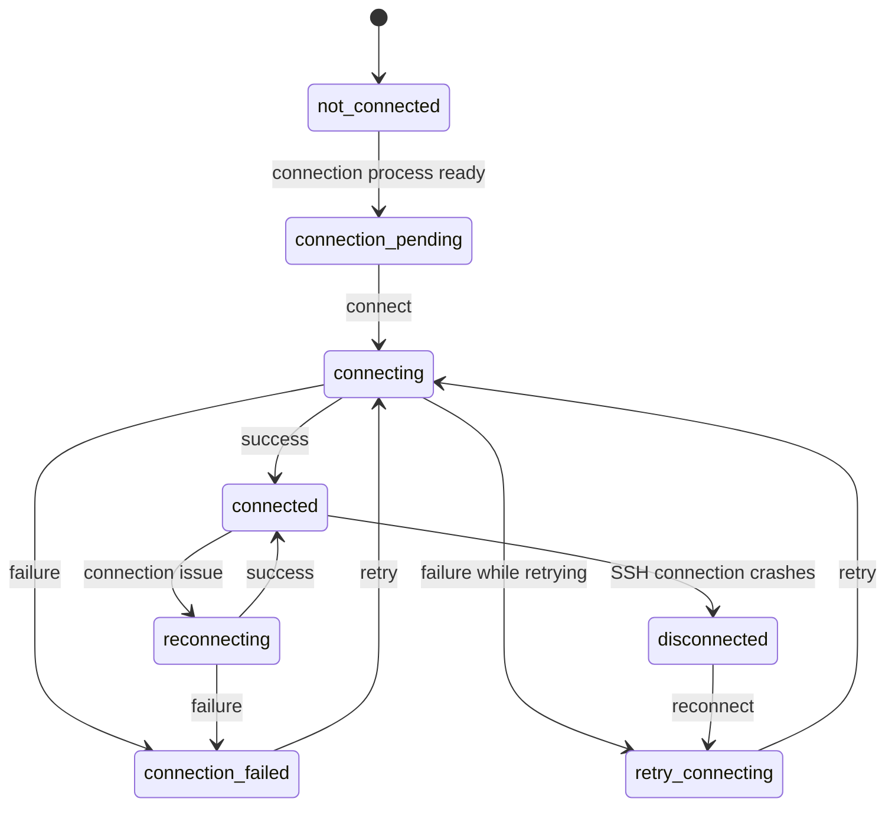
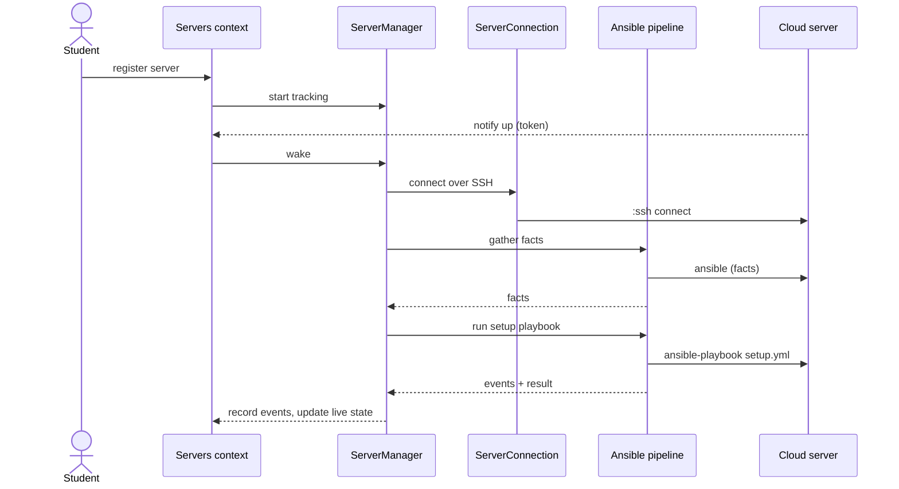

# Contributing

This document describes the **Servers bounded context** of the ArchiDep
dashboard application. It is part of the application documented in the
[`app/CONTRIBUTING.md`][app-contributing] file at the application root, which
covers the overall architecture, the general [bounded context
anatomy][bounded-contexts], coding guidelines, [authorization][authorization]
and tooling that also apply here. Read that document first.

> **Note:** This is the largest context. Beyond its data model and public API,
> it has two runtime subsystems documented below: the
> [server-tracking](#server-tracking) processes and the [Ansible
> pipeline](#ansible-pipeline).

- [Overview](#overview)
- [Context Structure](#context-structure)
- [Domain Model](#domain-model)
- [Servers](#servers)
- [Server Groups & Members](#server-groups--members)
- [Server Properties](#server-properties)
- [Use Cases](#use-cases)
- [Business Events](#business-events)
- [Authorization](#authorization)
- [Server Tracking](#server-tracking)
- [Ansible Pipeline](#ansible-pipeline)
- [References](#references)

---

## Overview

The Servers context (`ArchiDep.Servers`, [`servers.ex`](../servers.ex) /
[`context.ex`](./context.ex)) lets students **register the cloud server** they
create during the course and have the application **connect to it over SSH,
configure it with Ansible, and monitor it**.

Key concepts a contributor must understand:

- **A registered server.** A [`Server`](./schemas/server.ex) records the SSH
  connection details of a student's cloud machine. The application connects to
  it, runs setup steps, and tracks its live state. See [Servers](#servers).
- **Owners, groups and members are read-views.**
  [`ServerOwner`](./schemas/server_owner.ex),
  [`ServerGroup`](./schemas/server_group.ex) and
  [`ServerGroupMember`](./schemas/server_group_member.ex) are this context's
  views of the `user_accounts`, `classes` and `students` tables that the
  [Accounts](../accounts/CONTRIBUTING.md) and
  [Course](../course/CONTRIBUTING.md) contexts own. See [Server Groups &
  Members](#server-groups--members).
- **Expected vs. actual properties.** A server has both the
  [expected properties](#server-properties) defined for its class and the
  last-known properties gathered from the machine, so deviations can be flagged.
- **Quotas.** A student may own at most **5 servers**, of which at most **1**
  may be active at a time (see [`ServerOwner`](./schemas/server_owner.ex)).
- **Runtime subsystems.** Connecting, monitoring and configuring servers is
  performed by per-server [server-tracking](#server-tracking) processes and an
  [Ansible](#ansible-pipeline) execution pipeline. The use cases hand off to
  these; the context records the resulting [business events](#business-events).

---

## Context Structure

The context follows the standard [bounded context anatomy][bounded-contexts]:

- **Public API** — [`servers.ex`](../servers.ex) delegates to
  [`context.ex`](./context.ex) (which implements
  [`behaviour.ex`](./behaviour.ex)), which in turn routes each operation to a
  [use case](#use-cases). See [Use Cases](#use-cases) for the operations and the
  module that implements each.
- **Types** — [`types.ex`](./types.ex) (the server input data, plus the
  `server_job` and `server_problem` types describing live state).
- **Schemas** — [`schemas/`](./schemas), see [Domain Model](#domain-model).
- **Use cases** — [`use_cases/`](./use_cases), see [Use Cases](#use-cases).
- **Policy** — [`policy.ex`](./policy.ex), see [Authorization](#authorization).
- **Events** — [`events/`](./events), see [Business Events](#business-events).
- **PubSub** — [`pub_sub.ex`](./pub_sub.ex) broadcasts server
  create/update/delete on the `servers:new`, `server-groups:{id}:servers`,
  `server-owners:{id}:servers` and `servers:{id}` topics.
- **Runtime subsystems** (not part of the standard anatomy) — the
  [`server_tracking/`](./server_tracking) processes (with
  [`supervisor.ex`](./supervisor.ex) and the [`ssh.ex`](./ssh.ex) helpers) and
  the [`ansible/`](./ansible) pipeline (with the [`ansible.ex`](./ansible.ex)
  facade). See [Server Tracking](#server-tracking) and [Ansible
  Pipeline](#ansible-pipeline).

---

## Domain Model

The context's schemas and the database tables they back:

- [`Server`](./schemas/server.ex) (`servers`): A registered cloud server (see
  [Servers](#servers)).
- [`ServerOwner`](./schemas/server_owner.ex) (`user_accounts`): A read-view of
  the account that owns servers; also tracks the owner's server-count quotas.
- [`ServerGroup`](./schemas/server_group.ex) (`classes`): A read-view of a class
  as a group of servers (see [Server Groups &
  Members](#server-groups--members)).
- [`ServerGroupMember`](./schemas/server_group_member.ex) (`students`): A
  read-view of a student as a member of a server group.
- [`ServerProperties`](./schemas/server_properties.ex) (`server_properties`): A
  server's hardware/OS properties (see [Server Properties](#server-properties)).
- [`ServerRealTimeState`](./schemas/server_real_time_state.ex) (in-memory, not
  persisted): the live connection state and current job of a server, used by the
  [server-tracking](#server-tracking) processes to drive the UI.
- [`AnsiblePlaybook`](./schemas/ansible_playbook.ex) (in-memory),
  [`AnsiblePlaybookRun`](./schemas/ansible_playbook_run.ex)
  (`ansible_playbook_runs`) and
  [`AnsiblePlaybookEvent`](./schemas/ansible_playbook_event.ex)
  (`ansible_playbook_events`): the definition, executions and per-event log of
  the Ansible automation (see [Ansible Pipeline](#ansible-pipeline)).

`ServerOwner`, `ServerGroup` and `ServerGroupMember` are read-views of the
`user_accounts`, `classes` and `students` tables owned by the
[Accounts](../accounts/CONTRIBUTING.md#domain-model) and
[Course](../course/CONTRIBUTING.md#domain-model) contexts (the Servers context
only writes a few server-related fields, such as the owner's server-count
quotas).

---

## Servers

A [`Server`](./schemas/server.ex) is a student's registered cloud machine.
Notable fields:

- **SSH connection** — `ip_address` (globally unique), `ssh_port` (default 22),
  the initial `username` used for setup, the `app_username` the application uses
  afterwards (`archidep` for group members), and `ssh_host_key_fingerprints`.
- **Ownership** — `owner` ([`ServerOwner`](./schemas/server_owner.ex)) and
  `group` ([`ServerGroup`](./schemas/server_group.ex)).
- **Properties** — `expected_properties` and `last_known_properties` (see
  [Server Properties](#server-properties)).
- **`secret_key`** — a per-server token used to authenticate the server's own
  ["notify up" callback](#use-cases).
- **`active`** flag and `version` (optimistic lock).

**Lifecycle.** There is **no explicit status column**. A server's progress is
implicit in timestamp fields set as setup proceeds — `set_up_at` (initial
configuration done) and `open_ports_checked_at` (network verified) — together
with the `active` flag (`active?/3` also requires the owner and group to be
active). Its **live** connection state (connecting, connected, running a job,
problems, …) is held in the in-memory
[`ServerRealTimeState`](./schemas/server_real_time_state.ex) by the
[server-tracking](#server-tracking) processes, not in the database.

**Quotas.** Counts are tracked on [`ServerOwner`](./schemas/server_owner.ex)
(`server_count`, `active_server_count`, with optimistic locks) and enforced on
creation: at most **5 servers** per owner and **1 active** at a time.

---

## Server Groups & Members

A [`ServerGroup`](./schemas/server_group.ex) is the Servers-context view of a
[class](../course/CONTRIBUTING.md#classes): its `active`/date-window state,
`servers_enabled` flag, the teacher SSH public keys to install on the servers
(`ssh_public_keys_to_install`), and the class's expected server properties. A
[`ServerGroupMember`](./schemas/server_group_member.ex) is the view of a
[student](../course/CONTRIBUTING.md#students): their `username`,
`username_confirmed`, `domain`, and `active`/`servers_enabled` flags, linked to
a `ServerOwner` once they log in.

These read-views are how the Servers context enforces that a student may only
add servers when their class and membership allow it (see
[Authorization](#authorization)).

---

## Server Properties

[`ServerProperties`](./schemas/server_properties.ex) (`server_properties` table)
describes a server's hardware and OS: `hostname`, `machine_id`, CPU/core/vCPU
counts, `memory`, `swap`, `architecture`, `os_family`, `distribution` (and
release/version). It is **shared with the Course context**, which owns the
_expected_ properties of a class (see [Expected Server
Properties](../course/CONTRIBUTING.md#expected-server-properties)).

Each [`Server`](./schemas/server.ex) references two `ServerProperties` records:

- `expected_properties` — what the class expects (a template, where
  blank/`0`/`*` values mean "any").
- `last_known_properties` — the actual values gathered from the machine via
  Ansible facts.

`detect_mismatches/2` compares the two (with tolerances — e.g. 20% for memory,
10% for swap) so the UI can warn about servers that do not match expectations
(e.g. an oversized, costly VM, or the wrong OS).

---

## Use Cases

Each public operation of [`servers.ex`](../servers.ex) is implemented by a use
case module under [`use_cases/`](./use_cases). Write operations have
`validate_*` companions that return a changeset for live form validation. Most
server operations are **student self-service on their own server**; the
exceptions are marked **root-only**.

**Server management**

- [`CreateServer`](./use_cases/create_server.ex) — `create_server/3` (+
  `validate_server/3`): register a server in a group (allowed for a confirmed,
  servers-enabled group member).
- [`UpdateServer`](./use_cases/update_server.ex) — `update_server/3` (+
  `validate_existing_server/3`): edit a server. Routed through the
  [server-tracking](./server_tracking) manager so it is not changed while busy.
- [`DeleteServer`](./use_cases/delete_server.ex) — `delete_server/2`: remove a
  server. **Root-only.**
- [`ManageServer`](./use_cases/manage_server.ex) — `retry_connecting/2` and
  `retry_checking_open_ports/2` (owner), and `retry_ansible_playbook/3`
  (**root-only**): retry a failed step. Hands off to the
  [server-tracking](./server_tracking) manager.
- [`ServerCallbacks`](./use_cases/server_callbacks.ex) — `notify_server_up/2`:
  a callback the **server itself** makes when it comes online, authenticated by
  the server's `secret_key` ([`Phoenix.Token`](./use_cases/server_callbacks.ex),
  no user session).

**Reads**

- [`ReadServers`](./use_cases/read_servers.ex) — `list_my_servers/1`,
  `fetch_server/2` (own servers).
- [`ReadServerGroups`](./use_cases/read_server_groups.ex) —
  `list_server_groups/1`, `fetch_server_group/2`, `list_server_group_members/2`,
  `list_all_servers_in_group/2`, `watch_server_ids/2` (**root-only**), and
  `fetch_authenticated_server_group_member/1` (any authenticated user, to load
  their own membership).
- [`ReadAnsible`](./use_cases/read_ansible.ex) —
  `fetch_ansible_playbook_runs/1`, `fetch_ansible_playbook_run/2`,
  `fetch_ansible_playbook_events_for_run/2` (**root-only**).

---

## Business Events

Following the application's [event-logging convention][bounded-contexts], every
significant action is persisted as a business event under [`events/`](./events),
on the `servers:servers:{id}` stream. Many are recorded by the runtime
subsystems as setup progresses.

- **Lifecycle:** [`ServerCreated`](./events/server_created.ex),
  [`ServerUpdated`](./events/server_updated.ex),
  [`ServerDeleted`](./events/server_deleted.ex).
- **Connection:** [`ServerConnected`](./events/server_connected.ex),
  [`ServerDisconnected`](./events/server_disconnected.ex),
  [`ServerReconnecting`](./events/server_reconnecting.ex),
  [`ServerRetriedConnecting`](./events/server_retried_connecting.ex),
  [`ServerNotifiedUp`](./events/server_notified_up.ex).
- **Setup & checks:** [`ServerSetUp`](./events/server_set_up.ex),
  [`ServerFactsGathered`](./events/server_facts_gathered.ex),
  [`ServerOpenPortsChecked`](./events/server_open_ports_checked.ex),
  [`ServerRetriedCheckingOpenPorts`](./events/server_retried_checking_open_ports.ex).
- **Ansible:**
  [`AnsiblePlaybookRunStarted`](./events/ansible_playbook_run_started.ex),
  [`AnsiblePlaybookRunRunning`](./events/ansible_playbook_run_running.ex),
  [`AnsiblePlaybookRunFinished`](./events/ansible_playbook_run_finished.ex),
  [`AnsiblePlaybookEventOccurred`](./events/ansible_playbook_event_occurred.ex),
  [`ServerRetriedAnsiblePlaybook`](./events/server_retried_ansible_playbook.ex).

---

## Authorization

The context's [`Policy`](./policy.ex) implements the application-wide
[`ArchiDep.Policy` behaviour][authorization]. Root users may do anything;
otherwise:

- A **group member** may `create_server`/`validate_server` in their group only
  if their username is confirmed and servers are enabled (at the group or member
  level).
- A **server owner** may `fetch_server`, `update_server` (and its validation),
  `retry_connecting` and `retry_checking_open_ports` on their **own** servers
  (still subject to the confirmed/enabled checks for updates).
- Any authenticated user may `list_my_servers` and
  `fetch_authenticated_server_group_member`.
- **Root-only:** `delete_server`, `retry_ansible_playbook`, all the server-group
  and Ansible read operations, and `list_all_servers_in_group`.
- `notify_server_up` is not user-authorized at all — it is authenticated by the
  server's `secret_key`.

Failed authorization on group/server lookups is deliberately reported as
"not found" to avoid leaking the existence of other groups/servers.

---

## Server Tracking

Once a server is registered, the application keeps a tree of supervised
processes **per server** that connect to it over SSH, drive its setup, and track
its live state. This is the **server-tracking** subsystem
([`server_tracking/`](./server_tracking)).

The supervision tree is rooted at
[`ArchiDep.Servers.Supervisor`](./supervisor.ex) (a child of the application
supervisor):

```text
ArchiDep.Servers.Supervisor                      (rest_for_one)
├── Ansible.Pipeline.AnsiblePipelineSupervisor    — the Ansible pipeline (see Ansible Pipeline)
├── ServerTracking.ServerDynamicSupervisor        — starts one supervisor per tracked server
│   └── ServerTracking.ServerSupervisor           — per server (rest_for_one)
│       ├── ServerTracking.ServerManager          — lifecycle state machine
│       └── ServerTracking.ServerConnection        — SSH connection
└── ServerTracking.ServersOrchestrator            — decides which servers to track
```

- **[`ServersOrchestrator`](./server_tracking/servers_orchestrator.ex)** decides
  which servers should be tracked and starts/stops their per-server supervisors
  through the
  [`ServerDynamicSupervisor`](./server_tracking/server_dynamic_supervisor.ex).
- Each tracked server gets a
  [`ServerSupervisor`](./server_tracking/server_supervisor.ex) running two
  GenServers:
  - **[`ServerManager`](./server_tracking/server_manager.ex)** is the per-server
    state machine. Following the [API/implementation split][bounded-contexts]
    convention, its logic lives in
    [`ServerManagerState`](./server_tracking/server_manager_state.ex), which
    determines the next action from the current state (the `server_job` and
    `server_problem` types in [`types.ex`](./types.ex)): connect, gather facts,
    check open ports, run [Ansible](./ansible) setup playbooks, surface problems
    and handle retries. It records the [business events](#business-events) and
    holds the [`ServerRealTimeState`](./schemas/server_real_time_state.ex). A
    [`ServerManagerBehaviour`](./server_tracking/server_manager_behaviour.ex)
    lets it be mocked in tests.
  - **[`ServerConnection`](./server_tracking/server_connection.ex)** owns the
    actual SSH connection (Erlang's `:ssh` to connect, [SSHEx][ssh-ex] to run
    commands). It is linked to the SSH process, so it crashes if the connection
    drops; the supervisor restarts it and the `ServerManager` triggers a
    reconnection. Its state machine is
    [`ServerConnectionState`](./server_tracking/server_connection_state.ex)
    (diagrammed below).
- **[`ServerProblems`](./server_tracking/server_problems.ex)** provides helpers
  to create and identify the problems a server can have (failed connection,
  authentication, port checks, etc.).
- **[`ArchiDep.Servers.SSH`](./ssh.ex)** holds SSH helpers used throughout:
  parsing host-key fingerprints (MD5/SHA-256) and locating the application's SSH
  key pair from configuration.

The [`ServerConnection`](./server_tracking/server_connection.ex) state machine
([`ServerConnectionState`](./server_tracking/server_connection_state.ex))
governs (re)connection:



The [use cases](#use-cases) hand off to this subsystem: creating, updating and
deleting a server, and the retry operations, route through the `ServerManager`
(which refuses changes while the server is busy), and `notify_server_up` wakes a
manager that is waiting for its server to come online.

**Real-time state for the UI.** The
[`ServerTracker`](./server_tracking/server_tracker.ex) GenServer exposes the
live state of a set of servers to the web layer over [Phoenix
Tracker][phoenix-tracker] (the `ArchiDep.Tracker` on the `servers` topic). A
live view starts a `ServerTracker` for the servers it displays and receives
updates as their state changes.

---

## Ansible Pipeline

The application configures and inspects each server by running
[Ansible][ansible] against it. Because many servers may need work at once, runs
go through a **GenStage pipeline** ([`ansible/`](./ansible)) that bounds
concurrency and applies back-pressure, supervised by
[`AnsiblePipelineSupervisor`](./ansible/pipeline/ansible_pipeline_supervisor.ex)
(a child of the [Servers supervisor](#server-tracking)).

- **[`AnsiblePipelineQueue`](./ansible/pipeline/ansible_pipeline_queue.ex)** is
  a GenStage **producer**. The [`ServerManager`](#server-tracking) enqueues
  tasks on it — gathering a server's facts, or running a playbook with a set of
  variables — and it dispatches them according to consumer demand. If a server
  goes offline, its pending tasks are dropped.
- **[`AnsiblePipelineConsumer`](./ansible/pipeline/ansible_pipeline_consumer.ex)**
  is a `ConsumerSupervisor` that starts one
  [`AnsiblePipelineRunner`](./ansible/pipeline/ansible_pipeline_runner.ex) task
  per dispatched task (playbooks run only while the server is online).
- **[`Runner`](./ansible/runner.ex)** invokes the Ansible command-line tool in a
  subprocess via [ExCmd][ex-cmd] (which streams its output with back-pressure).
  It makes Ansible emit machine-readable output — JSON for fact gathering and
  **JSONL** (one event per line) for playbook runs — so events can be processed
  as they happen.
- **[`Tracker`](./ansible/tracker.ex)** consumes that stream: it persists the
  [`AnsiblePlaybookRun`](./schemas/ansible_playbook_run.ex) and each
  [`AnsiblePlaybookEvent`](./schemas/ansible_playbook_event.ex), emits the
  corresponding [Ansible business events](#business-events), and reports live
  events and success/failure back to the `ServerManager`.

The playbooks themselves are bundled in
[`priv/ansible/playbooks`](../../../priv/ansible) (e.g. `setup.yml`) and baked
into the application at compile time by
[`PlaybooksRegistry`](./ansible/playbooks_registry.ex); the
[`ArchiDep.Servers.Ansible`](./ansible.ex) facade exposes them (e.g.
`setup_playbook/0`). [`Pipeline`](./ansible/pipeline.ex) identifies the default
pipeline so that tests can run an isolated one. Teachers can review past runs
and their events through the [`fetch_ansible_playbook_*` read
operations](#use-cases).

Putting the runtime subsystems together, setting up a freshly registered server
looks like this:



---

## References

- [Application documentation][app-contributing] — overall architecture,
  [bounded context anatomy][bounded-contexts] and [authorization][authorization]
- [Course context](../course/CONTRIBUTING.md) — owns the classes/students and
  the [expected server
  properties](../course/CONTRIBUTING.md#expected-server-properties)
- [SSH][ssh] and [Ansible][ansible] — used by the runtime subsystems to set up
  and monitor servers

[app-contributing]: ../../../CONTRIBUTING.md
[authorization]: ../../../CONTRIBUTING.md#authorization
[bounded-contexts]: ../../../CONTRIBUTING.md#bounded-contexts
[ssh]: https://en.wikipedia.org/wiki/Secure_Shell
[ssh-ex]: https://github.com/witchtails/sshex
[ansible]: https://docs.ansible.com
[ex-cmd]: https://hexdocs.pm/ex_cmd/readme.html
[phoenix-tracker]: https://hexdocs.pm/phoenix_pubsub/Phoenix.Tracker.html
