# Command Line

Architecture & Deployment <!-- .element: class="subtitle" -->

---

## A short history of computers & computer interfaces

For old time's sake.

---

### The first computer & program (1830s-1840s)

Designed by Charles Babbage, programmed by Ada Lovelace <!-- .element: class="subtitle" -->

<div class="grid grid-cols-12 gap-4 items-center">
  <div class="col-span-4">
    
  </div>
  <div class="col-span-4">
    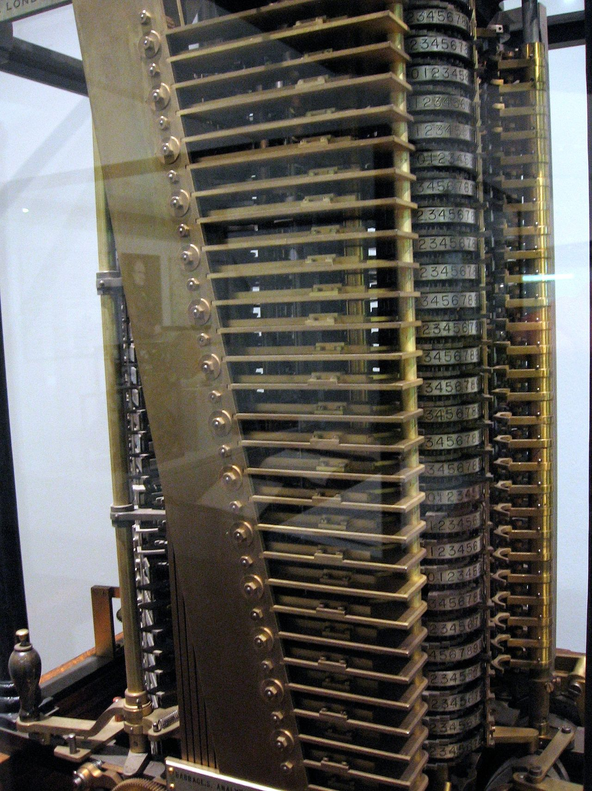
  </div>
  <div class="col-span-4">
    
  </div>
</div>

**Notes:**

[Charles Babbage][charles-babbage], an English mathematician, designed the
mechanical [Analytical Engine][analytical-engine] in 1837: the first
[digital][digital], [programmable][programmable], [general-purpose
computer][general-purpose-computer]. It was a design; it was never built.

In 1842, [Ada Lovelace][ada-lovelace] translated into English and extensively
annotated a description of the engine, including a way to calculate [Bernoulli
numbers][bernoulli-numbers] using the machine (widely considered to be the
[first complete computer program][note-g]). She has been described as the first
computer programmer.

---

### ENIAC (1946)

No interface at all; switches, switches everywhere <!-- .element: class="subtitle" -->

<div class="grid grid-cols-10">
  <div class="col-span-8 col-start-2">
    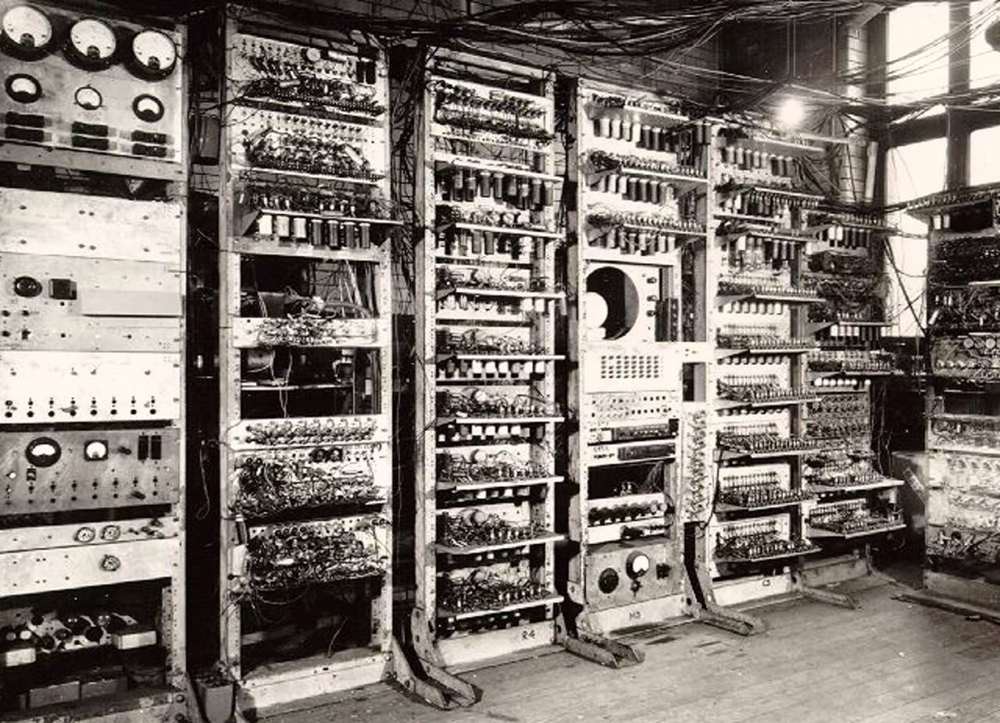
  </div>
</div>

**Notes:**

At that time, there was no such thing as a stored computer program. Programs
were **physically hard-coded**. On the [ENIAC][eniac], this was done using
function tables with **hundreds of ten-way switches**, which took weeks. That
means it was useless for anything that you could compute by hand in less than a
week.

There is nothing here to type on and nothing to click on: you programmed this
machine by rewiring it. Everything that follows is a departure from that.

---

### Punched cards (1950s)

One of the first user interfaces <!-- .element: class="subtitle" -->

<div class="grid grid-cols-12 gap-8">
  <div class="col-span-5 col-start-2">
    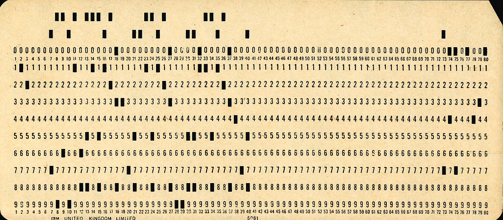

Invented in 1725 <!-- .element: style="margin-top: 0;" -->

  </div>
  <div class="col-span-5 col-start-7">
    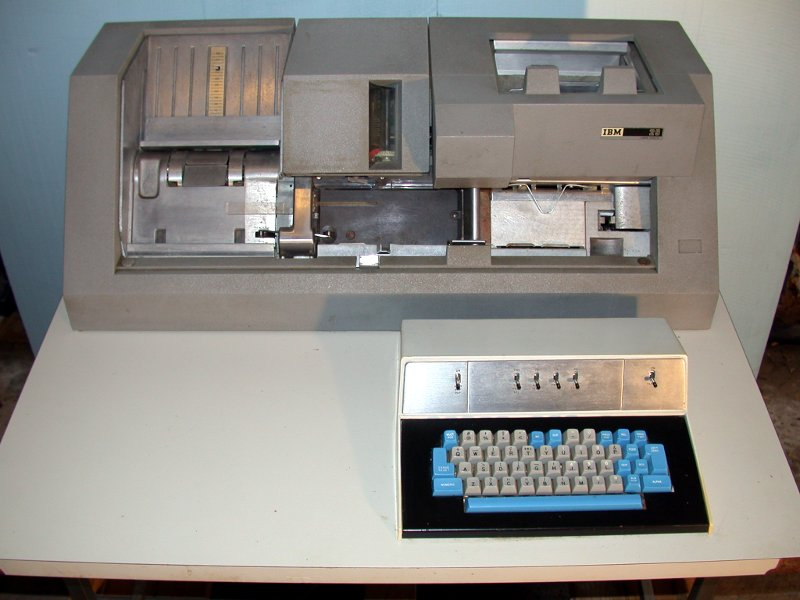
  </div>
</div>

**Notes:**

Many early general-purpose digital computers used [punched cards][punched-card]
for data input, output and storage. Someone had to use a [keypunch][keypunch]
machine to write your cards, then feed them to the computer.

Punched cards are much older than computers. They were first invented around
1725 to control mechanical [looms][loom].

A standard IBM card has 80 columns, and each column holds one character. That
makes one card about 80 bytes, usually one line of a program. A megabyte would
take about 12,500 cards. It is also why terminals are still 80 columns wide by
default.

---

### A typical program (1950s)

<p class="subtitle italic">Whatever you do, <strong>DON'T</strong> drop it!</p>

<div class="grid grid-cols-10">
  <div class="col-span-6 col-start-3">
    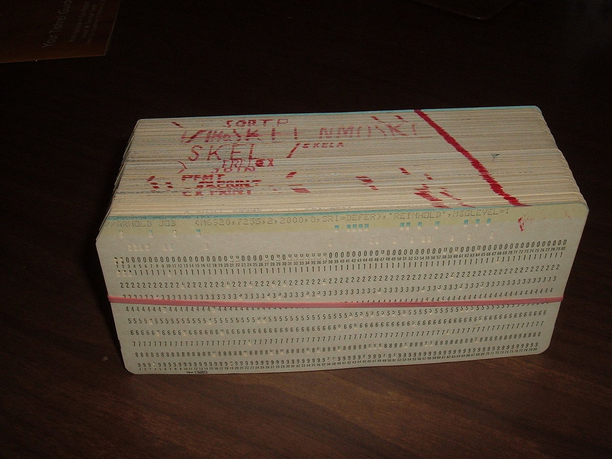
  </div>
</div>

---

### TeleTYpewriter (1960s)

<p class="subtitle">The first <strong>command line interfaces (CLI)</strong></p>

<div class="grid grid-cols-10">
  <div class="col-span-8 col-start-2">
    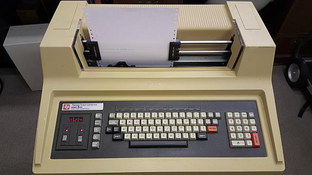
  </div>
</div>

**Notes:**

[Teletypewriters (TTYs)][tty] became the most popular **computer terminals** in
the 1960s. They were basically electromechanical typewriters adapted as a user
interface for early [mainframe computers][mainframe].

This is where both words come from. A **terminal** is the thing at the end of
the wire, where the human sits; the computer is elsewhere, and is shared. **TTY**
is the abbreviation of teletypewriter, and it is still the name Unix systems use
for a terminal today.

This is also when the first [**command line interfaces (CLI)**][cli] were
created. As you typed commands, a program running on the computer would
interpret that input, and the output would be printed on physical paper.

---

### Video terminals (1970s)

<div class="grid grid-cols-10">
  <div class="col-span-6 col-start-3">
    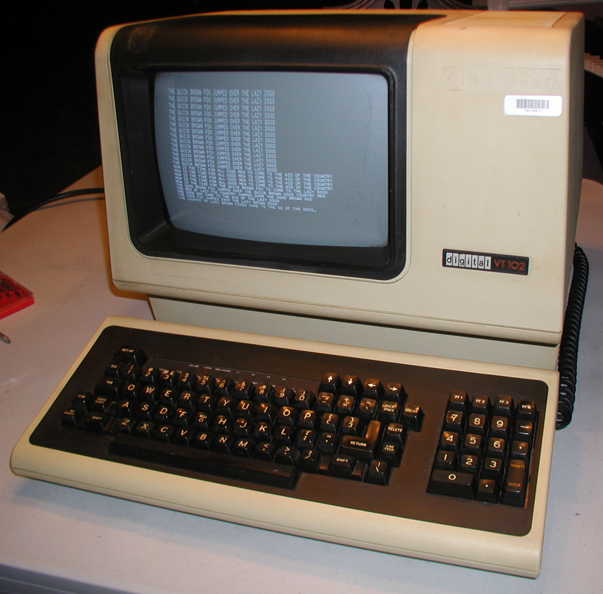
  </div>
</div>

**Notes:**

As available memory increased, **video terminals** such as the [VT100][vt100]
replaced TTYs in the 1970s. Initially they only displayed text. Hence they were
fundamentally the same as TTYs: textual input/output devices.

---

### Unix (1970s)

The first portable operating system <!-- .element: class="subtitle" -->

<div class="grid grid-cols-10">
  <div class="col-span-8 col-start-2">
    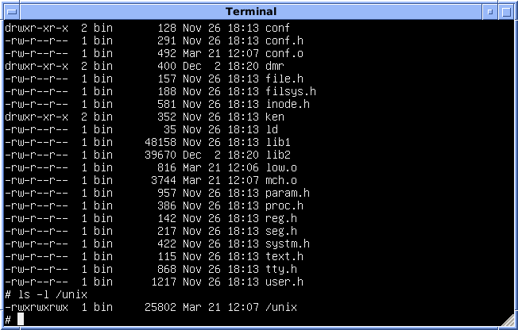
  </div>
</div>

**Notes:**

It's also in this period that the [Unix][unix] operating system was developed.
Compared to earlier systems, Unix was the first **portable operating system**
because it was written in the [C programming language][c], allowing it to be
installed on multiple platforms.

[Linux][linux] is a Unix-like system written from scratch: it shares no code
with Unix, but it works the same way and runs the same commands. [macOS][macos]
descends from Unix more directly, and borrows parts of [FreeBSD][freebsd].
Everything you learn in this course applies to all of them.

---

### Shells (1970s)

Text-based at that time <!-- .element: class="subtitle" -->

<div class="grid grid-cols-10">
  <div class="col-span-6 col-start-3">
    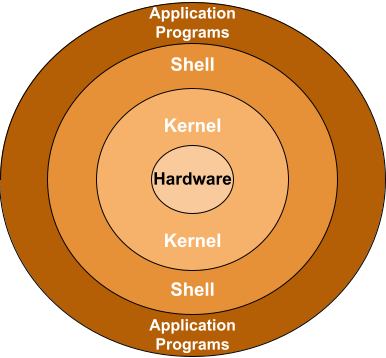
  </div>
</div>

**Notes:**

In Unix-like systems, the program serving as the **command line interpreter**
(handling input/output from the terminal) is called a [**shell**][unix-shell].
It is called this way because it is the outermost layer around the operating
system; it wraps and hides the lower-level kernel interface.

---

### Graphical User Interfaces (1980s)

Also a type of shell <!-- .element: class="subtitle" -->

<div class="grid grid-cols-12">
  <div class="col-span-6 col-start-4">
    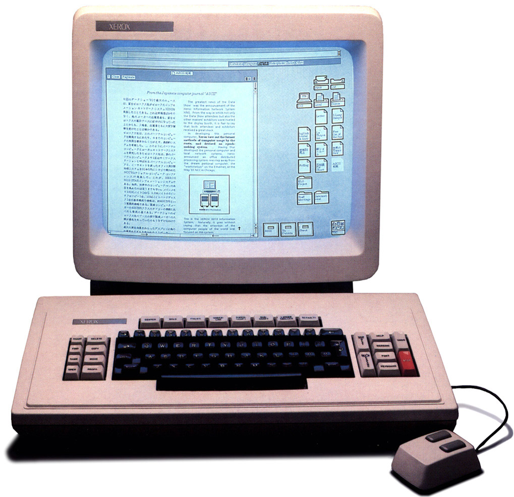
  </div>
</div>

**Notes:**

Eventually, [graphical user interfaces (GUIs)][gui] were introduced in reaction
to the perceived steep learning curve of command line interfaces. They are one
of the most common end user computer interface today.

Note that the GUI of a computer is also a shell. It's simply a different way to
interact with the kernel (graphical instead of textual).

---

### And since (2000s-today)

New ways to talk to the same machine <!-- .element: class="subtitle" -->

<div class="grid grid-cols-3 gap-4">
  <div>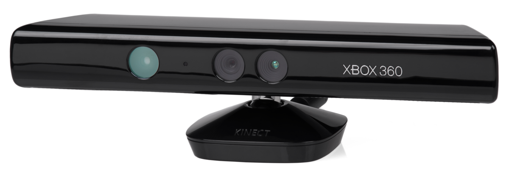</div>
  <div>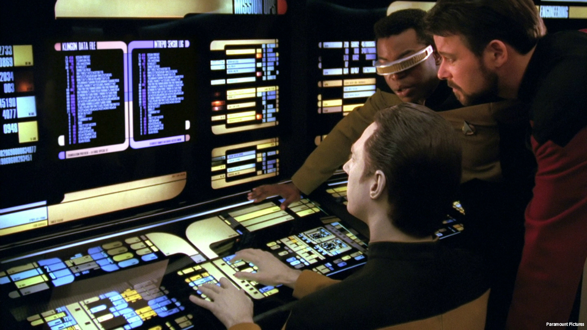</div>
  <div>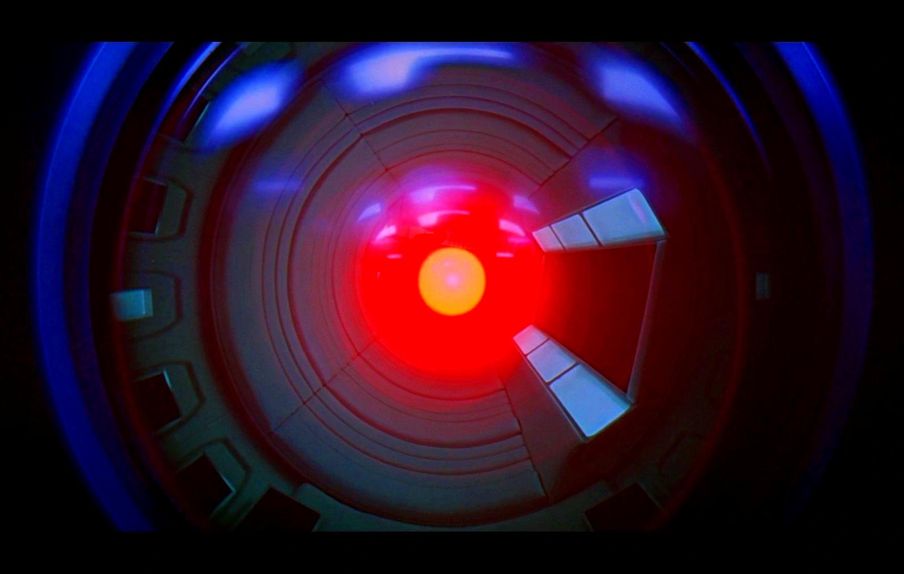</div>
  <div>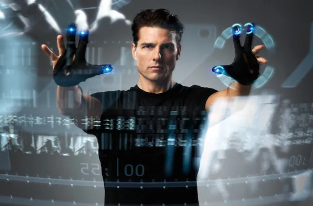</div>
  <div>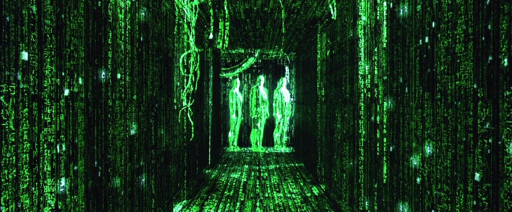</div>
  <div>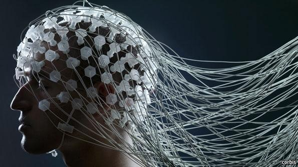</div>
</div>

**Notes:**

[Motion sensing][motion-sensing], [touch][tui], [voice][vui], [augmented
reality][augmented-reality], [virtual reality][virtual-reality], and perhaps
one day a [brain-computer interface][brain-interface].

Every one of these was going to replace what came before it, and none of them
replaced the command line. It is sixty years old and it is what you will use to
run a server later in this course.

---

### Terminal, shell, command

Three words, three different things <!-- .element: class="subtitle" -->



flowchart LR
you["You"] -- keystrokes --> term["Terminal"]
term -- what you typed --> shell["Shell (bash, zsh)"]
shell -- starts --> cmd["Command (ls, cd, git)"]
cmd -- output --> term



**Notes:**

The **terminal** is the window: it draws text and it collects your keystrokes.
It knows nothing about commands. On macOS it is the Terminal application, on
Windows it is the Windows Terminal running the WSL.

The **shell** is a program running inside that window. It reads the line you
typed, works out which command you meant, starts it, and gives you the prompt
back when it is done. [Bash][bash] and [Zsh][zsh] are shells.

The **command** is another program, which the shell starts for you. `ls` is a
file on your disk, like `git` or `code`.

The three are separate programs, and they can be replaced separately: the same
shell runs in any terminal, and a terminal can run any shell.

---

### Why the command line today?

- Servers often have **no GUI**
- Development tools often have **no GUI** either
- **Automation**: what you can type, you can script
- **AI coding agents** run in a terminal

**Notes:**

**Servers.** The machine you will be given later in this course has no screen,
no mouse and no desktop. Text is the only interface it has. A GUI consumes
valuable resources (CPU, memory, disk space) that are better spent on the
server's main job: serving requests to clients.

**Development tools.** Git, Docker, package managers, compilers: the command
line is the complete interface, and the graphical clients built on top expose a
subset of it. It's much faster to develop a command line interface for a new
tool than a GUI, and it is much easier to maintain.

**Automation.** A sequence of commands that works is a script; a script that
works runs without you, on a schedule, or on a hundred machines.

**AI coding agents.** They run in a terminal and they drive these same commands.
Reading what an agent is about to do to your machine requires knowing what
`rm -rf` means.

---

### Where things are (Linux & the WSL)

```
/
├── bin
├── etc
├── home
│   ├── batman
│   └── jde              <-- ~
│       ├── Documents
│       ├── Downloads
│       └── Pictures
├── tmp
├── usr
│   └── bin
└── var
```

**Notes:**

There is **one** tree, and it starts at `/`, the root of the filesystem. There
are no drive letters: everything is somewhere under `/`.

Your own files are in your **home directory**, `/home/jde` for user `jde`. `~`
is a shortcut for it.

A path is a route through this tree. From `/home/jde/Documents`, `..` is
`/home/jde`, so `../Downloads` is `/home/jde/Downloads` and `../..` is `/home`.

---

### Where things are (macOS)

```
/
├── Applications
├── bin
├── etc
├── tmp
├── Users
│   ├── batman
│   └── jde              <-- ~
│       ├── Documents
│       ├── Downloads
│       └── Pictures
├── usr
│   └── bin
└── var
```

**Notes:**

The same tree, with the home directories under `/Users` instead of `/home`, and
with `/Applications` where the graphical applications are installed.

Everything else you will learn is identical, which is the point: macOS is a Unix
system, and so is the Linux running in the WSL and on the server.

[ada-lovelace]: https://en.wikipedia.org/wiki/Ada_Lovelace
[analytical-engine]: https://en.wikipedia.org/wiki/Analytical_Engine
[augmented-reality]: https://en.wikipedia.org/wiki/Augmented_reality
[bash]: https://en.wikipedia.org/wiki/Bash_(Unix_shell)
[bernoulli-numbers]: https://en.wikipedia.org/wiki/Bernoulli_number
[brain-interface]: https://en.wikipedia.org/wiki/Brain–computer_interface
[c]: https://en.wikipedia.org/wiki/C_(programming_language)
[charles-babbage]: https://en.wikipedia.org/wiki/Charles_Babbage
[cli]: https://en.wikipedia.org/wiki/Command-line_interface
[digital]: https://en.wikipedia.org/wiki/Digital_data
[eniac]: https://en.wikipedia.org/wiki/ENIAC
[freebsd]: https://en.wikipedia.org/wiki/FreeBSD
[general-purpose-computer]: https://en.wikipedia.org/wiki/Computer
[gui]: https://en.wikipedia.org/wiki/Graphical_user_interface
[keypunch]: https://en.wikipedia.org/wiki/Keypunch
[linux]: https://en.wikipedia.org/wiki/Linux
[loom]: https://en.wikipedia.org/wiki/Loom
[macos]: https://en.wikipedia.org/wiki/MacOS
[mainframe]: https://en.wikipedia.org/wiki/Mainframe_computer
[motion-sensing]: https://en.wikipedia.org/wiki/Motion_detection
[note-g]: https://en.wikipedia.org/wiki/Note_G
[programmable]: https://en.wikipedia.org/wiki/Computer_program
[punched-card]: https://en.wikipedia.org/wiki/Punched_card
[tty]: https://en.wikipedia.org/wiki/Teleprinter
[tui]: https://en.wikipedia.org/wiki/Touch_user_interface
[unix]: https://en.wikipedia.org/wiki/Unix
[unix-shell]: https://en.wikipedia.org/wiki/Unix_shell
[virtual-reality]: https://en.wikipedia.org/wiki/Virtual_reality
[vt100]: https://en.wikipedia.org/wiki/VT100
[vui]: https://en.wikipedia.org/wiki/Voice_user_interface
[zsh]: https://en.wikipedia.org/wiki/Z_shell
