Learn what a command line interface is and learn the basics of navigating and
manipulating your filesystem in a Unix shell.

## Back to the command line

[Command line interfaces][cli] are still in wide use today.

### What is a Command Line Interface (CLI)?

A CLI is a tool that allows you to use your computer by **writing** what you
want to do (i.e. **commands**), instead of clicking on things.

It's been installed on computers for a long time, but it has evolved ["a
little"][building-the-future-of-the-command-line] since then. It usually looks
something like this:

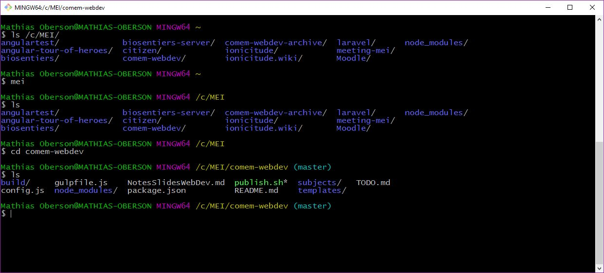

### Why use it?

A CLI is not very user-friendly or visually appealing but it has several
advantages:

- It requires very **few resources** (e.g. memory),
  which is convenient where resources are scarce
  (e.g. embedded systems, web servers).
- It can be easily **automated** through scripting.
- It is ultimately **more powerful and efficient** than any GUI for many
  computing tasks.

For these reasons, a lot of tools, **especially development tools**,
don't have any GUI and are only usable through a CLI.
Or they have a limited GUI that does not have as many options as the CLI.

**Thus, using a CLI is a requirement for any developer today.**

### Open a CLI

**CLIs are available on every operating system.**



On **Unix-like** systems _(like macOS or Linux)_, it's an application called the
**Terminal**.

You can use it right away, as it's the _de-facto_ standard.

<!-- col -->

On **Windows**, the default CLI is called **cmd** (or **Invite de commandes** in
French) However, it does not use the same syntax as Unix-like CLIs _(plus, it's
bad)_.

You also have [PowerShell][powershell] which is
better, but is not a Unix-like CLI either.

**You'll need to install an alternative.**





Software terminals are an emulation of old physical terminals like [TTYs][tty]
or the [VT100][vt100]. You will still find references to the term "TTY" in the
documentation of some modern command line tools.



### Install WSL (Windows users only)

You're going to install the [**Windows Subsystem for Linux (WSL)**][wsl], a tool
that allows you to run a Linux environment on your Windows machine, without
using a virtual machine or setting up a dual boot.


Follow [the installation instructions for the WSL][wsl-install]. The default
Linux distribution installed will be Ubuntu, which is perfect for the purposes
of this course.

It will ask you for a **username** and a **password**. We suggest you use the
same username as for the rest of the course, and that you use the same password
as your Windows user account's.

### Windows users: drives and copy/paste

This is how you reference or use your **drives** (`C:`, `D:`, etc) in the
Windows Subsystem for Linux (WSL):

```bash
$> cd /mnt/c/foo/bar
$> cd /mnt/d/foo
```

**Copy/Paste**

In a terminal, `Ctrl-C` already means something else: it **stops the command
that is running** (see [stopping running
commands](#stopping-running-commands)). It therefore **can't** be used as a
shortcut to copy things from the CLI. Instead, the **W**indows **S**ubsystem for
**L**inux (WSL) has two custom shortcuts:

- `Ctrl-Shift-C` to **copy** things from the CLI
- `Ctrl-Shift-V` to **paste** things to the CLI

## How to use the CLI

When you open the CLI you will find a blank screen that looks like this:

```bash
$>
```

These symbols represent **the prompt** and are used to indicate that you have
the lead. **The computer is waiting for you to type something** for it to
execute.



The prompt is not always `$>`.

For example, on earlier macOS versions, it used to be `bash3.2$`, indicating the
name of the shell ([Bash][bash]) and its version.

On more recent macOS versions using [the Z shell (Zsh)][zsh], the prompt might
indicate your username, your computer's name and the current directory, e.g.
`jde@MyComputer ~ %`.

<div class="grid grid-cols-2 gap-4">
  <div>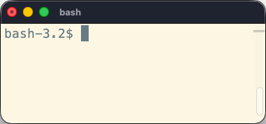</div>
  <div>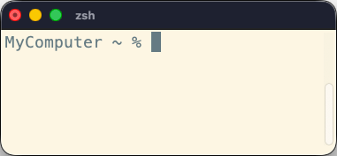</div>
</div>



**For consistency, we will always use `$>` to represent the prompt.**

### Work in progress...



When the computer is working, the prompt disappears and you no longer have
control.

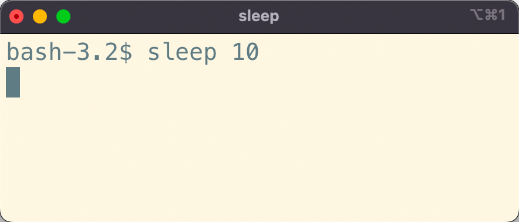

<!-- col -->

When the computer is done working, it will indicate that you are back in control
by showing the prompt again.

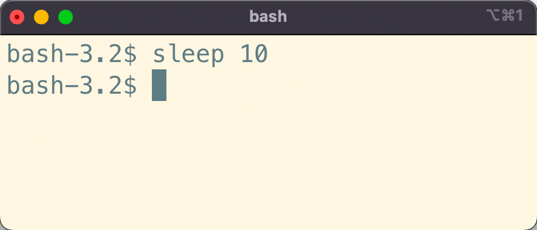





The `sleep` command tells the computer to do nothing for the specified number
of seconds.



### Writing commands

A command is a **word** that you have to type in the CLI that will **tell the computer what to do**.

The syntax for using commands looks like this:

```bash
$> name arg1 arg2 arg3 ...
```

Note the use of **spaces** to separate the different **arguments** of a command.

- `name` represents the **command** you want to execute.
- `arg1 arg2 arg3 ...` represent the **arguments of the command**, each of them **separated by a space**.

### Options vs. values

There are two types of arguments to use with a command (if needed):

**Options** usually specify **how** the command will behave.
By convention, they are preceded by `-` or `--`:

```bash
$> ls -a -l
```

We use the `ls` command to **l**i**s**t the content of the current directory.
The options tell `ls` **how** it should do so:

- `-a` tells it to print **a**ll elements (including hidden ones).
- `-l` tells it to print elements in a **l**ist format, rather than on one line.

**Values** not preceded by anything usually specify **what** will be used by the
command:

```bash
$> cd /Users/Batman
```

Here, we use the `cd` command to move to another directory (or **c**hange
**d**irectory).

And the argument `/Users/Batman` tells the command **what** directory we want to
move to.

#### Options with values

**Values** can also be linked to an option:

```bash
$> head -n 5 notes.txt
```

The `head` command prints the beginning of a file. In this example, it takes
**one option**:

- `-n` tells it how many li**n**es to print; it is followed **immediately** by
  `5`, which is the **value** of that option.

It then takes **one value**:

- `notes.txt` is the file to print the beginning of.

There are two values in this example: one linked to the `-n` option, and one
used by the overall command.

### Naming things when using CLI

You should avoid the following characters in directories and file names you want to manipulate with the CLI:

- **spaces** _(they're used to separate arguments in command)_.
- **accents** (e.g. `é`, `à`, `ç`, etc).

They can cause **errors** in some scripts or tools, and will inevitably complicate using the CLI.
If you have a `Why So Serious` directory, this **WILL NOT work**:

```bash
$> ls Why So Serious
```

This command will be interpreted as a call to the `ls` command with **three arguments**: `Why`, `So` and `Serious`.

You **can** use arguments containing spaces, but you have to **escape** them first, either with **quotation marks** or **backslashes**:



```bash
$> ls "Why So Serious"
```

<!-- col -->

```bash
$> ls Why\ So\ Serious
```



### Auto-completion

It's not fun to type directory names, especially when they have spaces you must escape in them,
so the CLI has **auto-completion**. Type the first few characters of the file or directory you
need, then hit the `Tab` key:

<div class="flex flex-col sm:flex-row items-center gap-4">
  <div class="grow">
    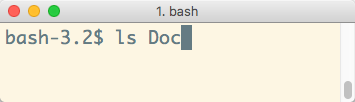
  </div>
  <kbd class="kbd shrink-0 hidden sm:inline-flex animate-pulse">- Tab -></kbd>
  <kbd class="kbd shrink-0 sm:hidden animate-pulse">v Tab v</kbd>
  <div class="grow">
    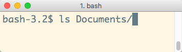
  </div>
</div>

If there are multiple files or directories that begin with the **same characters**,
pressing `Tab` will not display anything.
You need hit `Tab` **a second time** to display the list of available choices:

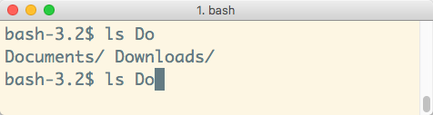

You can type just enough characters so that the CLI can determine which one you want (in this case `c` or `w`),
then hit `Tab` again to get the full path.

### Getting help

You can get help on most advanced commands by executing them with the `--help` option.
As the option's name implies, it's designed to **give you some help** on how to use the command:

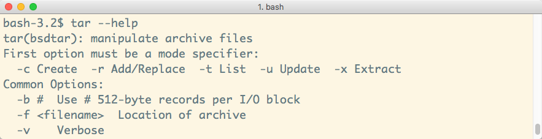

Some commands don't have the `--help` option, but there are alternative sources
of information depending on what operating system you're on:

- On Linux (including the WSL) or macOS, use `man ls` to display the **manual**
  for the `ls` command.
- There is also [tldr pages][tldr-pages]: simplified, community-driven manual
  pages that show the most common uses of a command instead of all its options.
  Install a client with `brew install tlrc` on macOS, or with
  `sudo apt install tldr` in the WSL or on Ubuntu.

#### Interactive help pages

Some help pages or commands will take over the screen to display their content, hiding the prompt and previous interactions.

Usually, it means that there is content that takes more than one screen to be shown.
You can "scroll" up and down line-by-line using the arrow keys or the `Enter` key.

To quit these interactive documentations, use the `q` (**q**uit) key.

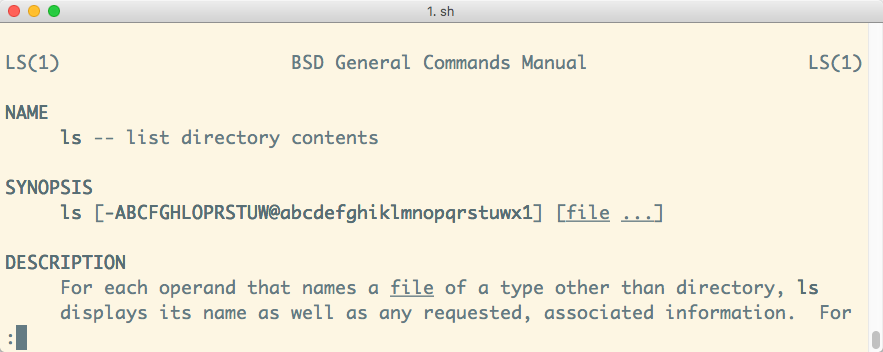

#### Unix Command Syntax

When reading a command's manual or documentation,
you may find some strange syntax that make little sense to you, like:

```bash
cd [-L|[-P [-e]] [-@]] [dir]
ls [-ABCFGHLOPRSTUW@abcdefghiklmnopqrstuwx1] [file ...]
```

Here are some explanations:

- `[]`: Whatever's inside is **optional** (ex: `[-e]`).
- `|`: You have to **choose between** options (ex: `-L|-P`).
- `...`: Whatever's before can be **repeated** (ex: `[file ...]`).

Depending on the documentation, you will also see symbols like this:

- `<value>`
- `--option=VALUE`

**DON'T WRITE `<value>` or `VALUE`**.
Replace it by an appropriate value for that option or argument.

## Using the filesystem

### The `pwd` command

When you open a CLI, it places you in your **home directory**. From there you
can navigate your filesystem to go to other directories _(more on that later)_.

But first, you might want to check **where** you currently are.
Use the `pwd` command:

```bash
$> pwd
/Users/Batman
```



`pwd` means "**p**rint **w**orking **d**irectory": it gives you the absolute
path to the directory you're currently in.



### The `ls` command

Now that you know where you are, you might want to know **what your current directory is containing**.

Use the `ls` command:

```bash
$> ls
(lots and lots of files)
```



`ls` means "**l**i**s**t": it lists the contents of a directory.



By default, `ls` doesn't list **hidden elements**.
By convention in Unix-like systems, files that start with `.` (a dot) are hidden.

If you want it to do that, you need to pass the `-a` (**a**ll) option:

```bash
$> ls -a
(lots and lots of files, including the hidden ones)
```

### The `cd` command

It's time to go out a little and move to another directory.

Suppose you have a `Documents` directory in your home directory, that contains
another directory `TopSecret` where you want to go. Use the `cd` (**c**hange
**d**irectory) command, passing it as argument **the path to the directory** you
want to go to:

```bash
$> pwd
/Users/Batman

$> cd Documents/TopSecret

$> pwd
/Users/Batman/Documents/TopSecret
```

This is a **relative path**: it is relative to the current working directory.

#### Absolute paths

You can also go to a specific directory anywhere on your filesystem like this:

```bash
$> cd /Users/Batman/Documents

$> pwd
/Users/Batman/Documents
```

This is an **absolute path** because it starts with a `/` character. It starts
at the root of your filesystem so it does not matter where you are now.



You also have **auto-completion** with the `cd` command. Hit the `Tab` key after
entering some letters.



#### The `.` path

The `.` path represents the current directory. The following commands are
strictly equivalent:



```bash
$> cd Documents/TopSecret
```

<!-- col -->

```bash
$> cd ./Documents/TopSecret
```



You can also _not go anywhere_:

```bash highlight_lines="4"
$> pwd
/Users/Batman

$> cd .

$> pwd
/Users/Batman
```

Or make a compressed archive of the current directory with the [`tar` (**t**ape
**ar**chive)][tar] command:

```bash
$> tar -c -z -v -f /somewhere/archive.tar.gz .
```

This does not seem very useful now, but it will be in further tutorials.

#### The `..` path

To go up into the parent directory, use the `..` path (**don't forget the space between `cd` and `..`**):

```bash highlight_lines="4"
$> pwd
/Users/Batman/Documents

$> cd ..

$> pwd
/Users/Batman
```

You can also drag and drop a directory from your Explorer or your Finder to the CLI to see its absolute path automatically written:

```bash
$> cd
(Drag and drop a directory from your Explorer/Finder, and...)
$> cd /Users/Batman/Pictures/
```



**Windows users:** dropping a directory into the WSL may write a Windows path
such as `C:\Users\jde\Pictures`, which your Linux shell does not understand. In
that case, write the path yourself in the `/mnt/c/...` form.



At any time and from anywhere, you can return to your **home directory** with
the `cd` command, without any argument or with a `~` (tilde):



```bash
$> cd
$> pwd
/Users/Batman
```

<!-- col -->

```bash
$> cd ~
$> pwd
/Users/Batman
```





To type the `~` character, use this combination:

- `AltGr-^` on **Windows**
- `Alt-N` on **Mac**

These are **dead keys**: nothing appears on screen until you press the space bar
afterwards.



#### Path reference

| Path        | Where                                                                                                             |
| :---------- | :---------------------------------------------------------------------------------------------------------------- |
| `.`         | The current directory.                                                                                            |
| `..`        | The parent directory.                                                                                             |
| `foo/bar`   | The file/directory `bar` inside the directory `foo` in the current directory. This is a **relative path**.        |
| `./foo/bar` | _Same as the above_                                                                                               |
| `/foo/bar`  | The file/directory `bar` inside the directory `foo` at the root of your filesystem. This is an **absolute path**. |
| `~`         | Your home directory. This is an **absolute path**.                                                                |
| `~/foo/bar` | The file/directory `bar` inside the directory `foo` in your home directory. This is an **absolute path**.         |

#### Your projects directory

Throughout this course, you will often see the following command (_or something resembling it_):

```bash
$> cd /path/to/projects
```

This means that you use **the path to the directory in which you store your projects**.
For example, on John Doe's macOS system, it could be `/Users/jde/Projects`.



Do not actually write `/path/to/projects`. It will obviously fail, unless you
happen to have a `path` directory that contains a `to` directory that contains a
`projects` directory...





**Windows users:** if your username contains **spaces** or **accents**, you
should **NOT** store your projects under your home directory. You should find a
path elsewhere on your filesystem. This will save you **a lot of needless pain
and suffering**.



### The `mkdir` command

You can create directories with the CLI.

Use the `mkdir` (**m**a**k**e **dir**ectory) command to create a new directory in the current directory:

```bash
$> mkdir BatmobileSchematics
$> ls
BatmobileSchematics
```

You can also create a directory elsewhere:

```bash
$> mkdir ~/Documents/TopSecret/BatmobileSchematics
```

This will only work if all directories down to `TopSecret` already exist. To
automatically create all intermediate directories, add the `-p` (**p**arents)
option:

```bash
$> mkdir -p ~/Documents/TopSecret/BatmobileSchematics
```

### The `touch` command

The `touch` command updates the last modification date of a file.
It also has the useful property of creating the file if it doesn't exist.

Hence, it's a **quick way to create an empty file** in the CLI:

```bash
$> touch foo.txt

$> ls
foo.txt
```

### The `echo` command

The `echo` command simply **echo**es its arguments back to you:

```bash
$> echo Hello World
Hello World
```

This seems useless, but can be quite powerful when combined with Unix features like [redirection][redirection].
For example, you can **redirect the output to a file**.

The `>` operator means _"**write** the output of the previous command into a file"_.
This allows you to quickly create a simple text file:

```bash
$> echo foo > bar.txt

$> ls
bar.txt
```

If the file already exists, it is overwritten.
You can also use the `>>` operator, which means _"**append** the output of the previous command to the end of a file"_:

```bash
$> echo bar >> bar.txt
```

### The `cat` command

The `cat` command can display one file or con**cat**enate multiple files in the CLI.
For example, this displays the contents of the previous example's file:

```bash
$> cat bar.txt
foo
bar
```

This creates a new `hello.txt` file and displays the result of concatenating the two files:

```bash
$> echo World > hello.txt

$> cat bar.txt hello.txt
foo
bar
World
```

### Stopping running commands

Sometimes a command will take too long to execute.

As an example, run this command which will wait one hour before exiting:

```bash
$> sleep 3600
```

As you can see, the command keeps executing and you **no longer have a prompt**.
Anything you type is ignored, as it is no longer interpreted by the shell,
but by the `sleep` command instead (which doesn't do anything with it).

By convention in Unix shells, you can always terminate a running command by
typing `Ctrl-C` (press the **C** key while holding the **C**on**tr**o**l** key).



Note that `Ctrl-C` **forces termination** of a running command. It might not
have finished what it was doing.



## Nano

<div class="flex justify-center">
  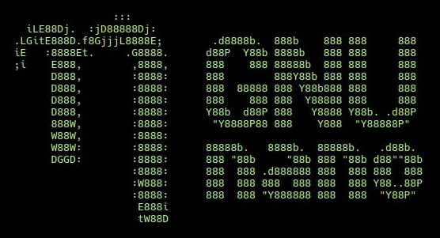
</div>

> Nano: a simple CLI editor to keep your sanity.

### Editing a file without a window

Sooner or later you will have to edit a file on a machine that has no graphical
interface, like the server you will be given later in this course. You then
need an editor that runs in the terminal.

[Nano][nano] is one, it is simple to use, and it is installed on most Unix-like
systems (including the WSL). It is the one we suggest you use.

Open a file by running the `nano` command with the path to the file you want to
create or edit:

```bash
$> nano test.txt
```

### Editing files with nano

Editing files is much more straightforward and intuitive with nano. Once the
file is open, you can simply type your text and move around with arrow keys:




Nano also helpfully prints its main keyboard shortcuts at the bottom of the
window. The most important one is `^X` for Exit. In keyboard shortcut parlance,
the `^` symbol always represents the control key.



So, **to exit from nano, type `Ctrl-X`**.

#### Saving files

When you exit nano with `Ctrl-X`, it will ask you whether you want to save your
changes:


Press the `y` key to save or the `n` key to discard your changes.

#### Confirming the filename

When saving changes, nano will always ask you to **confirm the filename** where
the changes should be saved:


As you can see, it tells you the name of the file you opened. Now you can:

- Simply press `Enter` to save the file.
- Or, change the name to save your changes to another file (and keep the
  unmodified original).

### Setting nano as the default editor

Editing the shell configuration will depend on your shell: for Zsh (the default
terminal shell on macOS) or Bash shell (the default in the WSL and most Linux
systems), you have to set the `$EDITOR` environment variable. You can do that by
adding the following line to your **`~/.zshrc` or `~/.bashrc` file**
depending on which shell you are using:

```bash
export EDITOR=nano >> ~/.bashrc  # on WSL or Linux
export EDITOR=nano >> ~/.zshrc   # on macOS
```

Remember that you must **relaunch your terminal** for this change to take
effect.

If you are unsure of what shell you are using, type in the following
command. The output will display the name of your current shell.

```bash
$> echo $0
bash
```



Now that you know how to use nano, you can also edit your Bash profile file with
the following command: `nano ~/.bashrc`.





On Ubuntu, you can list available editors and choose the default one with the
following command:

```bash
$> sudo update-alternatives --config editor
```



## Vim

[**Vim**][vim] is an infamous CLI editor originally developed in 1991 for the
Unix operating system.



The name comes from "**vi** i**m**proved", because Vim is an improved clone of
an earlier editor: [vi][vi] (from "**vi**sual"), developed in 1976.



### Help, Vim opened and I can't get out

**Some developer tools open Vim for you**, without asking. Git, for example,
opens an editor when you describe a change, and on many systems that editor is
Vim. You find yourself in a full-screen editor where what you type does nothing,
or something you did not ask for, and where none of the usual ways out work.

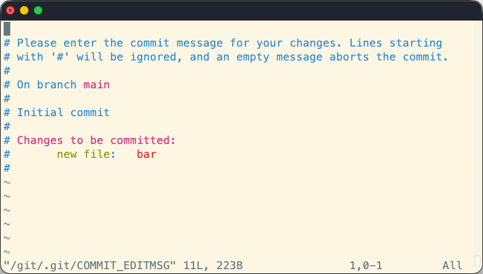

If this happens (_and it will_), there's **one** imperative rule to follow:

**DO NOT PANIC!**

To leave Vim without saving anything, type this, in this order:

1. The `Esc` key.
2. `:q!` — a colon, the letter `q`, then an exclamation mark.
3. The `Enter` key.

You are back at your prompt, and the file is unchanged.



To avoid meeting Vim by accident in the first place, tell your tools to use nano
instead: see [setting nano as the default
editor](#setting-nano-as-the-default-editor).



### Should you learn it?

Knowing how to escape Vim is enough for this course: nano is the editor we
suggest you use, and every exercise that asks you to edit a file on a server
works with it.

Vim is worth more than that, though, if you want to be at home on the command
line. Sometimes it's just the **only editor you have** (e.g. on a server). It is
also much more powerful than nano and will let you edit text at the speed of
light once you know your way around it. Some developers use nothing else.

If that tempts you, [the appendix on Vim](#appendix-vim) at the end of this page
explains how it works, walks you through one complete edit, and points you at a
tutorial.

## The `PATH` variable

When you type a command in the CLI, it will try to see **if it knows this
command** by looking in some directories to see if there is an **executable file
that matches the command name**.

```bash
$> rubbish
bash: rubbish: command not found
```

This means that the CLI failed to find the executable named `rubbish` in any of
the directories where it looked.

The list of the directories (and their paths) in which the CLI searches is
stored in the `PATH` environment variable, each of them being separated with a
`:`.

You can print the content of your `PATH` variable to see this list:

```bash
$> echo $PATH
/usr/local/bin:/bin:/usr/bin:/custom/dir
```

### Understanding the `PATH`

Assuming your `PATH` looks like this:

```bash
$> echo $PATH
/usr/local/bin:/bin:/usr/bin:/custom/dir
```

What happens when you run the following command?

```bash
$> ls -a -l
```

1. The shell will look in the `/usr/local/bin` directory. _There is no
   executable named `ls` there, moving on..._
2. The shell will look in the `/bin` directory. **There is an executable named
   `ls` there!** Execute it with arguments `-a` and `-l`.
3. We're done here. No need to look at the rest of the `PATH`. If there happens
   to be an `ls` executable in the `/custom/dir` directory, it will **not be
   used**.

### Finding commands

You can check where a command is with the `which` command:

```bash
$> which ls
/bin/ls
```

If there are multiple versions of a command in your `PATH`, you can add the `-a`
option to list them **a**ll:

```bash
$> which -a git
/opt/homebrew/bin/git
/usr/bin/git
```



Remember, the shell will use the first one it finds, so in this example it
would use `/opt/homebrew/bin/git` if you type `git`, completely ignoring
`/usr/bin/git`.



### Using non-system commands

Many development tools you install come with executables that you can run from the CLI (e.g. Git, Node.js, MongoDB).

Some of these tools will install their executable in a **standard directory** like `/usr/local/bin`, which is already in your `PATH`.
Once you've installed them, you can simply run their new commands.
Git and Node.js, for example, do this.

However, sometimes you're downloading only an executable and saving it in a directory somewhere that is **not in the `PATH`**.

#### Custom command example

Run the following commands to write a simple Hello World shell script and make
it into an executable:

```bash
$> mkdir -p ~/hello-program/bin
$> printf '#!/bin/sh\necho Hello World\n' > ~/hello-program/bin/hello
$> chmod +x ~/hello-program/bin/hello
```



The `printf` command prints its argument, here interpreting `\n` as a line
break, and the `>` operator writes that output into the file (as seen in [the
`echo` command](#the-echo-command)). The file you have just created contains
these two lines:

```bash
#!/bin/sh
echo Hello World
```

The first line tells the system which program should run the script. The second
line is the script itself.

A new file is not executable, so the `chmod` (**ch**ange **mod**e) command is
used to add (`+`) the permission to e**x**ecute it.



You should now be able to find it in the `~/hello-program/bin` directory:

```bash
$> ls ~/hello-program/bin
hello
```

It's now installed, we can find it using the CLI, but it still cannot be run. Why?

```bash
$> hello
command not found: hello
```

#### Executing a command in a directory that's not in the `PATH`

You can run a command from anywhere by writing **the absolute path to the executable**:

```bash
$> ~/hello-program/bin/hello
Hello World
```

You can also **manually go to the directory** containing the executable and **run the command there**:

```bash
$> cd ~/hello-program/bin
$> ./hello
Hello World
```



When the first word on the CLI starts with `/`, `~/`, `./` or `../`, the shell
interprets it as a file path. Instead of looking for a command in the `PATH`,
it simply executes that file.



But, ideally, you want to be able to **just type `hello`**, and have the script be executed.
For this, you need to **add the directory containing the executable** to your `PATH` variable.

### Updating the `PATH` variable

To add a new path in your `PATH` variable, you have to edit a special file, used
by your CLI interpreter (shell). This file depends upon the shell you are using:

| CLI                        | File to edit |
| :------------------------- | :----------- |
| WSL / Bash                 | `~/.bashrc`  |
| Terminal / [Zsh][zsh-site] | `~/.zshrc`   |

Open the adequate file (`.bashrc` for this example) from the CLI with `nano` or
your favorite editor if it can display hidden files:

```bash
$> nano ~/.bashrc
```

Add this line at the bottom of your file (use `i` to enter **insert** mode if
using Vim):

```bash
export PATH="$HOME/hello-program/bin:$PATH"
```

If you're in nano, press `Ctrl-X`, then answer `Yes` and confirm the filename.
If you're in Vim, press `Esc` when you're done typing, then `:wq` and `Enter` to
save and quit.

#### Does it work?



Remember to **close and re-open your CLI** to have the shell reload its
configuration file.





<!-- col order-1 md:order-none flex items-end -->

You should now be able to run the Hello World shell script as a command simply
by typing `hello`:

<!-- col order-3 md:order-none flex items-end -->

You don't even have to be in the correct directory:

<!-- col order-2 md:order-none -->

```bash
$> hello
Hello World
```

<!-- col order-4 md:order-none -->

```bash
$> cd
$> pwd
/Users/jde
$> hello
Hello World
```



And your CLI knows where it is:

```bash
$> which hello
/Users/jde/hello-program/bin/hello
```

It knows this because the directory containing the script is now in your PATH:

```bash
$> echo $PATH
/Users/jde/hello-program/bin:/usr/bin:/bin:/usr/sbin:/sbin:/usr/local/bin
```

#### What have I done?

You have **added a directory to the `PATH`**:

```bash
export PATH="$HOME/hello-program/bin:$PATH"
```

This line says:

- Modify the `PATH` variable.
- In it, put the new directory `$HOME/hello-program/bin` and the previous value of the `PATH`, separated by `:`.

The next time you run a command, your shell will **first look** in this directory for executables, then in the **rest of the `PATH`**.

**Common mistakes**

- What you must put in the `PATH` is **NOT** the path to the executable,
  but the path to the **directory containing the executable**.
- You must re-open your CLI for the change to take effect: the shell
  configuration file (e.g. `~/.bashrc`) is only applied when the shell starts.

## Appendix: unleash your terminal

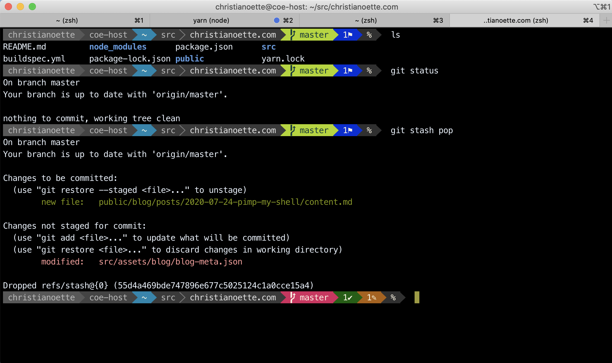

This appendix is a collection of things you may enjoy once the command line
stops feeling foreign. None of it is needed for this course, and none of it is
installed for you.

### Oh My Zsh

Command-line shells have been worked on for a very long time. Modern shells
such as the [Z shell (Zsh)][zsh] have a whole community that created many
plugins to simplify your daily command-line work.

On macOS or Linux, you may want to install [Oh My Zsh][oh-my-zsh] to fully
unleash the power of your Terminal. It has [plugins][oh-my-zsh-plugins] to
integrate with Homebrew, Git, various programming languages like Ruby, PHP, Go,
and much more.

On Windows, you can [install Zsh and Oh My Zsh in the WSL][oh-my-zsh-windows] as
well.

### Other tools for the command line lover

- [`bat`](https://github.com/sharkdp/bat): a `cat` clone with wings
- [`tldr`](https://github.com/tldr-pages/tldr): better `man` pages
- [`fzf`](https://junegunn.github.io/fzf/) to quickly find files
- [`ack`](https://beyondgrep.com) to search for text in files (`grep`
  alternative)
- [`rsync`](https://rsync.samba.org) for incremental file transfers (`cp` &
  `scp` alternative)



A Terminal [multiplexer](https://en.wikipedia.org/wiki/Multiplexer) like:

- [tmux](https://github.com/tmux/tmux/wiki) 💙
- [screen](https://www.gnu.org/software/screen/)

<!-- col -->

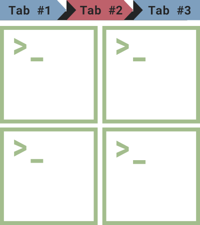



## Appendix: Vim

This appendix is for the curious. Nothing in this course requires Vim — nano
does everything the exercises ask for — but if you want to learn the editor
rather than merely escape it, this is where to start.

Open a file by running the `vim` command with the path to the file you want to
create/edit:

```bash
$> vim test.txt
```

### How Vim works

Vim can be unsettling at first, until you know how it works.

**Let go of your fear. And your mouse**, it's mostly useless in Vim. You control
Vim by **typing**.

The first thing to understand with Vim is that it has _3 modes_:

- **Normal** mode (the one you're in when Vim starts).
- **Insert** mode (the one to use to insert text).
- **Command** mode (the one to use to save and/or quit).

To go into each mode, use these keys:

| From           | Type  | To go to |
| :------------- | :---- | :------- |
| Normal         | `i`   | Insert   |
| Normal         | `:`   | Command  |
| Insert/Command | `Esc` | Normal   |

Since the same keys do different things in different modes, you must always
know which one you are in. **The bottom line of the window tells you**: in
**Insert** mode, Vim prints `-- INSERT --` in the bottom-left corner; in
**Command** mode, it shows the `:` and the command you are typing there; in
**Normal** mode, it shows neither, only the name of the file it opened, or
nothing at all. Whenever you are lost, press `Esc` and look there.

### Normal mode

The **Normal** mode of Vim is the one you're in when it starts. What you type
in this mode does not go into your file: each key is a command instead, which is
why typing into Vim when it has just opened seems to do nothing, or something
strange.

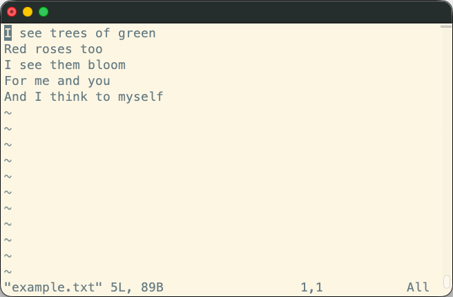



The `~` characters down the left side of the window are **not** in your file.
Vim draws them to mark the lines after the last one, so an empty file is a full
screen of them.



To write something, you first have to switch to the **Insert** mode.



At anytime, you can hit the `Esc` key to go back to the **Normal** mode.



### Insert mode

The **Insert** mode is the one in which Vim behaves like the editor you expect:
what you type goes into the file.

You enter it from the **Normal** mode, with the key that matches where you want
to start typing:

| Command | Effect                                           |
| :------ | :----------------------------------------------- |
| `i`     | **I**nsert before the character under the cursor |
| `a`     | **A**ppend after the character under the cursor  |
| `o`     | **O**pen a new empty line below the current one  |

Vim prints `-- INSERT --` in the bottom-left corner to tell you that you are in
this mode. Type your text, then press `Esc` to go back to the **Normal** mode.

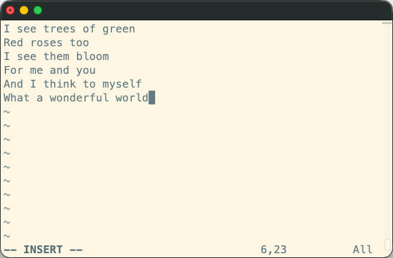

### Back in normal mode: moving and editing

Now that your file has some text in it, you can move the cursor around with the
arrow keys.

You can also use some commands to interact with the text:

| Command | Effect                                             |
| :------ | :------------------------------------------------- |
| `x`     | Delete the character under the cursor              |
| `dw`    | Delete a word, with the cursor on its first letter |
| `dd`    | Delete the complete line the cursor is on          |
| `u`     | Undo the last command                              |

#### Moving without the arrow keys

The arrow keys work, but Vim power users move with four letters instead, sitting
right under the fingers of your right hand on the home row:

| Key | Moves the cursor |
| :-- | :--------------- |
| `h` | Left             |
| `j` | Down             |
| `k` | Up               |
| `l` | Right            |

`h` and `l` are the leftmost and rightmost of the four, which is the easiest way
to remember which is which. `j` looks like an arrow pointing down, which takes
care of the other two.

This only works in **Normal** mode: in **Insert** mode, those keys type the
letters `h`, `j`, `k` and `l` into your file, as they should.



It feels pointless until you stop moving your hand to the arrow keys and back
several times a minute. Vim is far from the only program that uses these keys
to move around: `less`, `man` pages and many other terminal tools do too, so
the habit pays off outside Vim.



### Command mode

The **Command** mode, which you can only access from the **Normal** mode,
is the one you'll mostly use to save and/or quit.

To enter the **Command** mode, hit the `:` key. The colon appears at the
**bottom of the window**, and so does everything you type after it: a command
is never typed into your text. Press `Enter` to run it, or `Esc` to abandon it
and go back to the **Normal** mode.

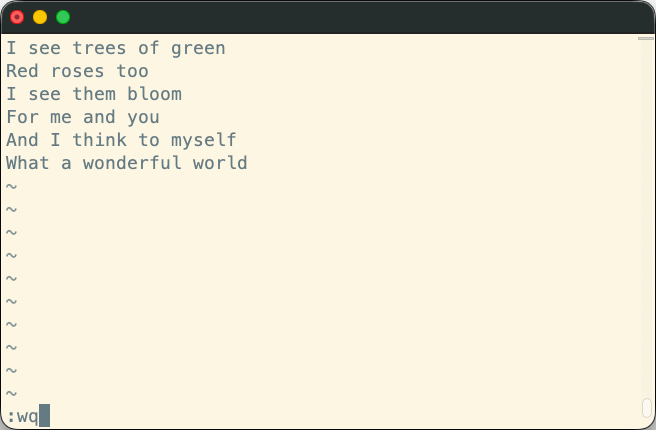

From there, you can use some commands:

| Command     | Effect                                                                |
| :---------- | :-------------------------------------------------------------------- |
| `q`         | **Q**uit Vim (will fail if you have unsaved modifications)            |
| `w`         | **W**rite (save) the file and all its modifications                   |
| `q!`        | Force (**!**) Vim to **q**uit (any unsaved modification will be lost) |
| `wq` or `x` | **W**rite and **q**uit, i.e. save the file then quit Vim.             |

### Trying it yourself

The quickest way to stop being afraid of Vim is to go through one complete edit
from beginning to end. Move to a directory where you can safely create a file,
then:

1. Run `vim test.txt` to open a new, empty file. You are in **Normal** mode:
   there is no `-- INSERT --` at the bottom of the window.
2. Press `i` to switch to **Insert** mode. `-- INSERT --` appears in the
   bottom-left corner.
3. Type a line of text, for example `Hello from Vim.`
4. Press `Esc` to go back to **Normal** mode. The `-- INSERT --` indicator
   disappears.
5. Type `:wq`. The three characters appear at the bottom of the window instead
   of in your text. Press `Enter`: Vim saves the file and quits.
6. Run `cat test.txt` to check that your line is there.

Do it a few times, and the three modes stop being mysterious.

### Learning more

You now know enough Vim to open a file, change it and get out again. To go
further, Vim comes with its own interactive tutorial, which takes roughly half
an hour:

```bash
$> vimtutor
```

It is installed together with Vim on most systems. If your own machine does not
have it, the [SSH exercise server]() you will connect to later in this course does. [Open
Vim](https://openvim.com) is an equivalent tutorial that runs in your browser.

[bash]: https://en.wikipedia.org/wiki/Bash_(Unix_shell)
[building-the-future-of-the-command-line]: https://github.com/readme/featured/future-of-the-command-line
[cli]: https://en.wikipedia.org/wiki/Command-line_interface
[nano]: https://en.wikipedia.org/wiki/GNU_nano
[oh-my-zsh]: https://ohmyz.sh
[oh-my-zsh-plugins]: https://github.com/ohmyzsh/ohmyzsh/wiki/Plugins
[oh-my-zsh-windows]: http://kevinprogramming.com/using-zsh-in-windows-terminal/
[powershell]: https://en.wikipedia.org/wiki/PowerShell
[redirection]: https://en.wikipedia.org/wiki/Redirection_(computing)
[tar]: https://en.wikipedia.org/wiki/Tar_(computing)
[tldr-pages]: https://tldr.sh
[tty]: https://en.wikipedia.org/wiki/Teleprinter
[vi]: https://en.wikipedia.org/wiki/Vi_(text_editor)
[vim]: https://en.wikipedia.org/wiki/Vim_(text_editor)
[vt100]: https://en.wikipedia.org/wiki/VT100
[wsl]: https://learn.microsoft.com/en-us/windows/wsl/about
[wsl-install]: https://learn.microsoft.com/en-us/windows/wsl/install
[zsh]: https://en.wikipedia.org/wiki/Z_shell
[zsh-site]: http://zsh.sourceforge.net/
