# Secure Shell (SSH)

Architecture & Deployment <!-- .element: class="subtitle" -->

---

## What is SSH?

SSH is a **cryptographic network protocol** for operating network services
**securely over an unsecured network**.

---

### What is it used for?

  

    <iconify-icon icon="fluent:window-text-24-regular" noobserver></iconify-icon> Command line login
  

  

    <iconify-icon icon="cib:git" noobserver></iconify-icon> Git
  

  

    <iconify-icon icon="fluent:folder-arrow-up-24-regular" noobserver></iconify-icon> SFTP
  

---

### How does it work?

SSH is a **client-server** protocol.



architecture-beta

    service sshcl1(fluent:window-text-24-regular)[SSH Client]
    service sshcl2(fluent:window-text-24-regular)[SSH Client]
    service sshcl3(fluent:window-text-24-regular)[SSH Client]
    service sshsrv(fluent:server-24-regular)[SSH Server]

    sshcl1:R --> L:sshsrv
    sshcl2:L --> R:sshsrv
    sshcl3:R --> T:sshsrv



**Notes:**

Using an SSH client, a user (or application) on machine A can connect to an SSH
server running on machine B, either to log in (with a command line shell) or to
execute programs.

---

### Same terminal, remote shell

**Notes:**

Without SSH, your terminal talks to a shell running on your own machine, and
every command you type runs there.

The **SSH client** is a command like any other: your local shell starts it when
you type `ssh`. It connects to the **SSH server** on the remote computer, which
starts a **shell on the server** for you. From then on, your terminal is the
same, but what you type goes through the secure channel to that remote shell,
and the commands it starts **run on the server**. Their output comes back
through the channel and is displayed in your terminal.

The prompt may look different, but nothing else in the window tells you which
machine you are talking to. The `hostname` command does: it prints the name of
the machine it runs on.

---

### How is it secure?

1. SSH establishes a **secure channel**.
2. It then requires **authentication**.

**Notes:**

Note that steps 1 and 2 are **separate and unrelated processes**.

---

### Step 1: the secure channel

  

    

      <iconify-icon icon="fluent:laptop-24-regular" noobserver width="160" height="160"></iconify-icon>
      SSH Client
    

  

  

    
  

  

    

      <iconify-icon icon="fluent:server-24-regular" noobserver width="160" height="160"></iconify-icon>
      SSH Server
    

  

_This is done for you and (mostly) automatic._

**Notes:**

SSH establishes a **secure channel** between client and server using various
**cryptographic techniques**. This is handled automatically by the SSH client
and server.

---

### Step 2: authentication

  

    

      

        
1. SSH Client

        
Hi, I'd like to log in as user "bob".

      

      <iconify-icon icon="fluent:laptop-24-regular" noobserver width="160" height="160"></iconify-icon>
      

        
3. SSH Client

        
Here's bob's password.

      

    

  

  

    

      
    

  

  

    

      

        
2. SSH Server

        
Oh yeah? How do I know you're bob?

      

      <iconify-icon icon="fluent:server-24-regular" noobserver width="160" height="160"></iconify-icon>
      

        
4. SSH Server

        
Go right ahead.

      

    

  

**Notes:**

The user or service that wants to connect to the SSH server must
**authenticate** to gain access, for example with a password.

---

### Security through cryptography

- [Symmetric encryption][symmetric-encryption]
- [Asymmetric cryptography][pubkey]
  - Key exchange
  - Digital signatures
- [Hash-based Message Authentication Codes (HMAC)][hmac]

**Notes:**

SSH establishes a **secure channel** between two computers **over an insecure
network** (e.g. a local network or the Internet). Establishing and using this
secure channel requires a combination of various cryptographic techniques.

---

### Symmetric encryption

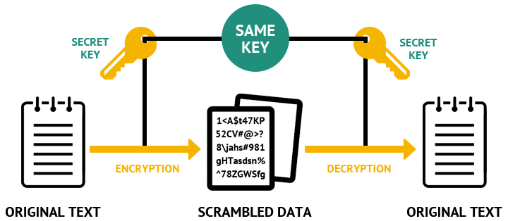

**Notes:**

[Symmetric-key algorithms][symmetric-encryption] can be used to encrypt
communications between two or more parties using a **shared secret**. [AES][aes]
is one such algorithm.

**Assuming all parties possess the secret key**, they can encrypt data, send it
over an insecure network, and decrypt it on the other side. An attacker who
intercepts the data **cannot decrypt it without the key** (unless a weakness is
found in the algorithm or [its implementation][enigma-operating-shortcomings]).

But **both parties must have the key**. It used to be **physically
transferred**, for example in the form of the codebooks used to operate the
German [Enigma machine][enigma] during World War II. That is **impractical for
modern computer networks**.

You can see what symmetric encryption with AES looks like in practice in [the
OpenSSL examples of the SSH subject][openssl-aes].

---

### Man-in-the-middle attack (MitM)

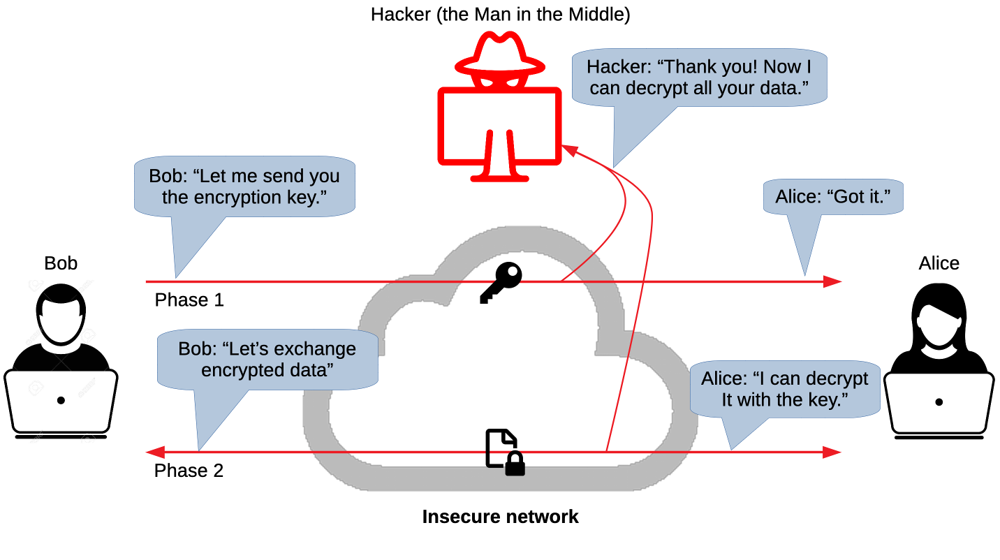

**Notes:**

**Sending the key over the insecure network risks it being
compromised** by a [Man-in-the-Middle attack][mitm].

---

### Asymmetric cryptography

  

    <strong class="text-2xl">Encryption</strong>
    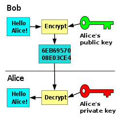
  

  

    <strong class="text-2xl">Key exchange</strong>
    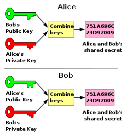
  

  

    <strong class="text-2xl">Digital Signatures</strong>
    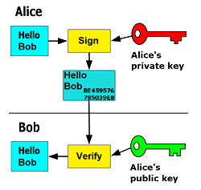
  

**Notes:**

[Public-key or asymmetric cryptography][pubkey] is any cryptographic system that
uses pairs of keys: **public keys** which may be disseminated widely, while
**private keys** which are known only to the owner. It has several use cases:

- Encrypting and decrypting data.
- Securely exchanging shared secret keys.
- Verifying identity and protecting against tampering.

---

### The properties of an asymmetric key pair

- **Quick & easy to generate a key pair**
- **Too slow & hard to find the private key from the public key**
- The private key can solve mathematical problems based on the public key,
  **proving ownership of that key** _(but not the other way around)_

**Notes:**

There is a mathematical relationship between a public and private key, based on
problems that currently admit no efficient solution such as [integer
factorization][integer-factorization], [discrete logarithm][discrete-logarithm]
and [elliptic curve][elliptic-curve] relationships.

Here's a [mathematical example][pubkey-math] based on integer factorization,
a problem that is computationally economical in one direction (multiplication)
but very computationally expensive in the other (factorization).

Effective security only requires keeping the private key private; **the public
key can be openly distributed without compromising security**.

---

### Asymmetric encryption

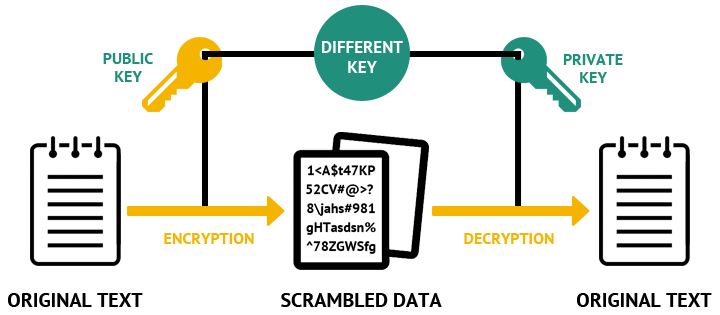

**Notes:**

One use case of asymmetric cryptography is **asymmetric encryption**, where the
**sender encrypts a message with the recipient's public key**. The message can
only be **decrypted by the recipient using the matching private key**.

Hence, you can encrypt data and send it to another party provided that you have
their public key. **No single shared key needs to be exchanged** (the private
key remains a secret known only to the recipient).

You can see what generating a key pair and asymmetric encryption with RSA look
like in practice in [the OpenSSL examples of the SSH subject][openssl-rsa].

---

### Asymmetric encryption and forward secrecy

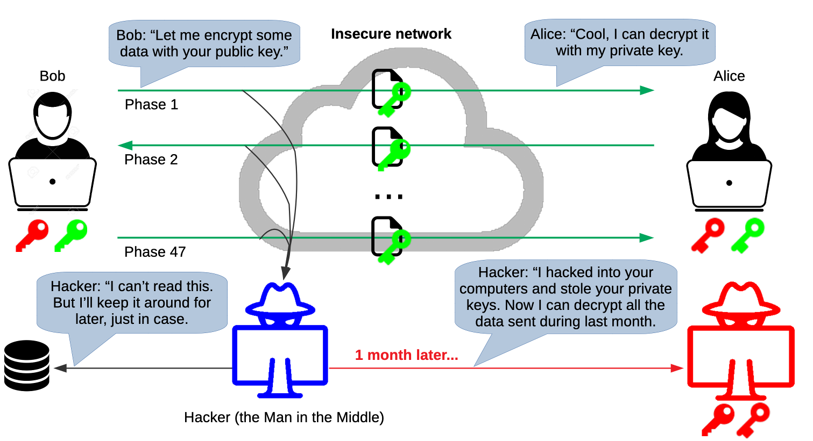

**Notes:**

Asymmetric encryption protects data sent over an insecure network from
attackers, but **only as long as the private keys remain private**. It does not
provide **forward secrecy**, meaning that if the private keys are compromised in
the future, all data encrypted in the past is also compromised.

---

### Symmetric vs. asymmetric encryption

<table class="text-4xl">
  <thead>
    <tr>
      <th></th>
      <th>Pros</th>
      <th>Cons</th>
    </tr>
  </thead>
  <tbody>
    <tr>
      <th>Symmetric encryption</th>
      <td><strong class="text-success">Fast</strong>, can be implemented in <strong class="text-success">hardware</strong></td>
      <td>Must send key</td>
    </tr>
    <tr>
      <th>Asymmetric encryption</th>
      <td><strong class="text-success">No shared key</strong></td>
      <td>Slow, no forward secrecy with long-lived keys</td>
    </tr>
  </tbody>
</table>

**Notes:**

So far we learned that:

- Symmetric encryption works but provides no solution to the problem of securely
  transmitting the shared secret key.
- Asymmetric encryption works even better as it does not require a shared secret
  key, but when it is used with a long-lived key pair, it does not provide
  forward secrecy.

Forward secrecy does not depend on the kind of encryption, but on **whether the
keys are thrown away after use**. A key that no longer exists cannot be stolen
later. As you will see, SSH gets forward secrecy from **temporary keys** that
are created for one connection and thrown away afterwards.

Additionally, it's important to note that **symmetric encryption is much faster
than asymmetric encryption**.

--v

### Symmetric encryption in hardware

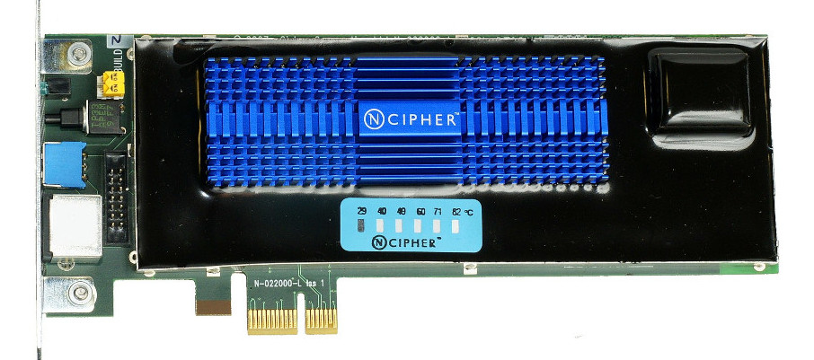

**Notes:**

Symmetric encryption is also less complex and can easily be implemented as
hardware (most modern processors support hardware-accelerated AES encryption).

This is a [hardware security module][hsm], a physical computing device that
safeguards and manages secrets, performs encryption and decryption functions for
digital signatures, strong authentication and other cryptographic functions

---

### What can we do?

It would be nice if we could share a **fast symmetric encryption key**...
without actually sharing it.

**Notes:**

<!-- slide-column -->

Ideally, we would want to be able to share a fast symmetric encryption key
without transmitting it physically or over the network. This is where asymmetric
cryptography comes to the rescue again. Encryption is not all it can do; it can
also do **key exchange**.

The [Diffie-Hellman Key Exchange][dh], invented in 1976 by Whitfield Diffie and
Martin Hellman, was one of the first public key exchange protocols allowing
users to **securely exchange secret keys** even if an attacker is monitoring the
communication channel.

---

#### Diffie-Hellman key exchange

<!-- Six copies of the same image, each clipped to one horizontal band of it and
     stacked in the same place, so that clicking through the fragments draws the
     analogy one row at a time. The first copy is in the flow and gives the
     stack its size: clipping is painting only, so it still occupies the whole
     image even while showing just the top band, and nothing moves as the rest
     appear. Each band's bottom inset is the next band's top inset, so the six
     tile the image exactly.

     Reveal caps slide images at 95% of their container, so every copy is
     narrower than the wrapper. The copy in the flow is an inline box and the
     slide centers it; the others are absolutely positioned, which makes them
     blocks that centering no longer reaches, so they are placed on the same
     axis by hand. -->

  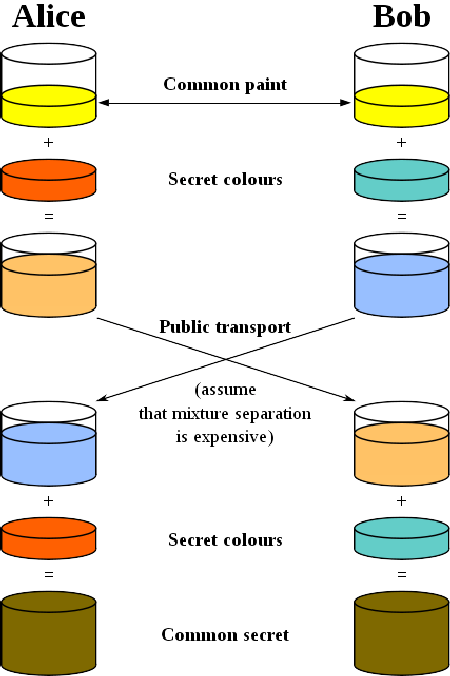
  
  
  
  
  

**Notes:**

This conceptual diagram illustrates the general idea behind the protocol:

1. Alice and Bob choose a **random, public starting color** (yellow) together.
2. They each separately choose a **secret color known only to themselves**
   (orange and blue-green).
3. They each **mix their own secret color with the mutually shared color**,
   giving orange-tan and light-blue.
4. They **publicly exchange** the two mixed colors. An attacker can see them go
   past, but **separating a mixture back into its ingredients is expensive**.
5. They each add **their own secret color** to the mixture they received from
   the other.
6. Both now hold a mixture of **all three colors** (yellow-brown).

Both sides apply **the same two secret colors to the same starting color**, only
in the opposite order — and mixing does not care about the order. That
**commutativity** is what makes the two results meet. The real protocol rests on
the same property: Alice computes `(g^b)^a` and Bob computes `(g^a)^b`, which
are both `g^(ab)`.

The result is a final color mixture that is **identical to the partner's final
color mixture**, and which was never shared publicly. When using large numbers
rather than colors, it would be computationally difficult for a third party to
determine the secret numbers.

---

### Man-in-the-Middle attack on Diffie-Hellman

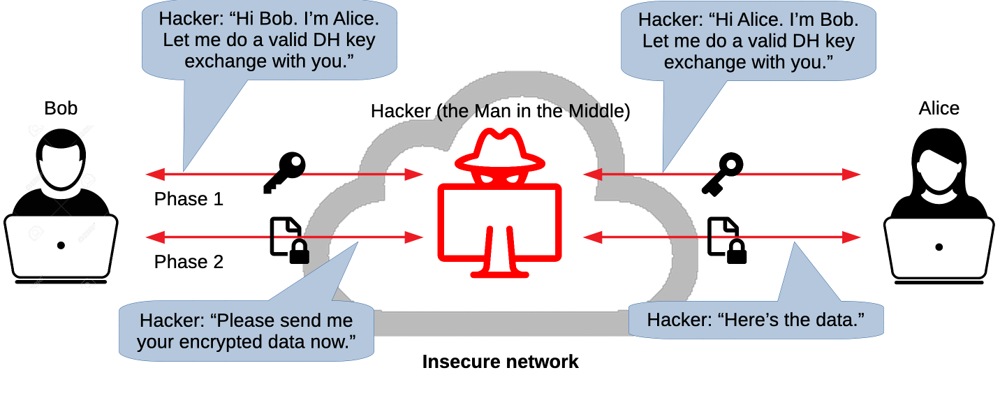

**Notes:**

The Diffie-Hellman key exchange solves the problem of transmitting the shared
secret key over the network by computing it using asymmetric cryptography. It is
therefore never transmitted.

However, **a Man-in-the-Middle attack is still possible** if the attacker can
position themselves between the two parties to **intercept and relay all
communications**.

---

### Asymmetric digital signature

**Notes:**

One of the other main uses of asymmetric cryptography is performing **digital
signatures**. A signature proves that the message came from a particular sender.

- Assuming **Alice wants to send a message to Bob**, she can **use her private
  key to create a digital signature based on the message**, and send both the
  message and the signature to Bob.
- Anyone with **Alice's public key can prove that Alice sent that message**
  (only the corresponding private key could have generated a valid signature for
  that message).
- **The message cannot be tampered with without detection**, as the digital
  signature will no longer be valid (since it is based on both the private key
  and the message).

Note that a digital signature **does not provide confidentiality**. Although the
message is protected from tampering, it is **not encrypted**.

You can see what signing a message and verifying the signature with RSA look
like in practice in [the OpenSSL examples of the SSH subject][openssl-signature].

---

### Cryptographic hash functions & MACs

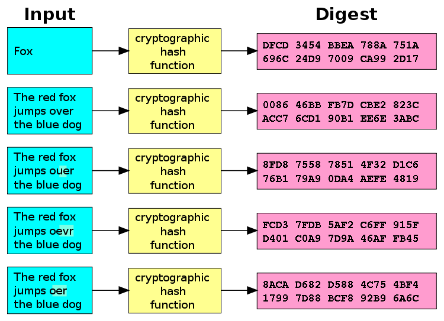

**Notes:**

A [cryptographic hash function][hash] is a [hash function][hash-non-crypto] that
has the following properties:

- The same message always results in the same hash (deterministic).
- Computing the hash value of any message is quick.
- It is infeasible to generate a message from its hash value except by trying
  all possible messages (one-way).

- A small change to a message should change the hash value so extensively that
  the new hash value appears uncorrelated with the old hash value.
- It is infeasible to find two different messages with the same hash value
  (collisions).

SSH uses [Message Authentication Codes (MAC)][mac], which are based on
cryptographic hash functions, to protect both the data integrity and
authenticity of all messages sent through the secure channel.

Most SSH connections today use [authenticated encryption][authenticated-encryption]
algorithms such as `chacha20-poly1305` or AES-GCM, where the integrity check is
built into the encryption algorithm instead of being a separate MAC. The idea is
the same: any modification of a message is detected.

---

### Combining it all together in SSH

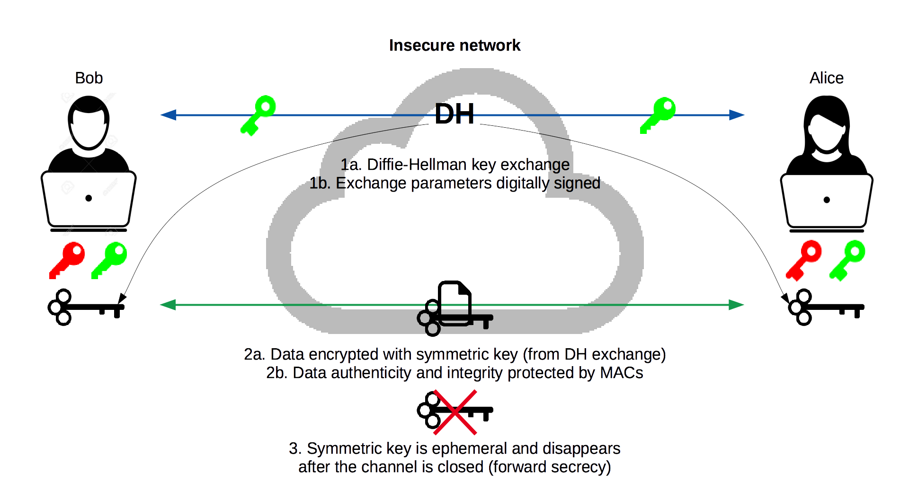

**Notes:**

SSH uses most of the previous cryptographic techniques we've seen together to
achieve as secure a channel as possible.

The symmetric key is not the only thing that disappears when the channel is
closed. The secret numbers each side chose for the Diffie-Hellman key exchange
(the secret colors in the diagram) are temporary too, and they are thrown away
as well. Without them, nobody can compute the symmetric key again, even with
the recorded exchange and the server's private key. This is what provides
**forward secrecy**.

---

#### Man-in-the-Middle attack on SSH

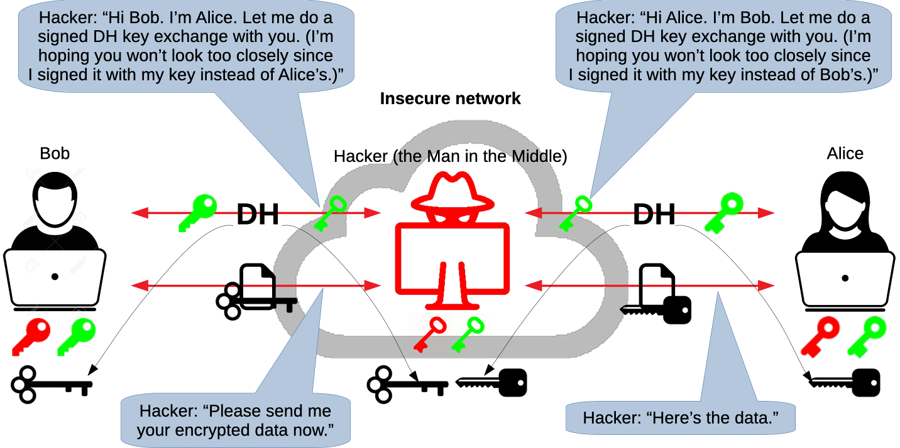

---

### One mechanism, both directions

<table class="text-3xl">
  <thead>
    <tr>
      <th>Who proves their identity?</th>
      <th>Who holds the private key?</th>
      <th>Where is the public key?</th>
    </tr>
  </thead>
  <tbody>
    <tr>
      <th>The server</th>
      <td>
        the server
         
        <code class="text-lg">/etc/ssh/ssh_host_*_key</code>
      </td>
      <td>
        your machine
         
        <em class="text-xl">(once you checked and accepted it)</em>
         
        <code class="text-lg">~/.ssh/known_hosts</code>
      </td>
    </tr>
    <tr>
      <th>You</th>
      <td>
        your machine
         
        <code class="text-lg">~/.ssh/id_ed25519</code>
      </td>
      <td>
        the server
         
        <em class="text-xl">
          (after you provided it)
        </em>
         
        <code class="text-lg">~/.ssh/authorized_keys</code>
      </td>
    </tr>
  </tbody>
</table>

**Notes:**

Both steps of a secure SSH connection use the same mechanism, a **digital
signature**, in opposite directions:

- During step 1, the secure channel, **the server signs** the Diffie-Hellman key
  exchange with its private key. Your SSH client checks the signature with the
  server's public key, which is in your known hosts file once you have checked
  its fingerprint.
- During step 2, authentication, **your SSH client signs** data that is unique
  to this connection with your private key. The server checks the signature with
  your public key, which you have put in its authorized keys file.

In both cases, the private key never leaves the machine it is on. Only a
signature is sent.

This is also why public key authentication is safer than a password against a
man-in-the-middle attack. If an attacker manages to put themselves in the middle
(for example because you did not check the server's public key), with a
password they receive **the password itself**, and they can reuse it to log in
as you. With a key, they only receive **a signature that is valid for that one
connection**, which is useless for any other.

---

### Threats countered

- Eavesdropping
- Connection hijacking
- DNS and IP spoofing
- Man-in-the-Middle attack

  As long as you <strong class="text-error screen:animate-pulse">check the public key</strong>!

**Notes:**

SSH counters the following threats:

- **Eavesdropping:** an attacker can intercept but not decrypt communications
  going through SSH's secure channel.
- **Connection hijacking:** an active attacker can hijack TCP connections due to
  a weakness in TCP. SSH's integrity checking detects this and shuts down the
  connection without using the corrupted data.
- **DNS and IP spoofing:** an attacker may hack your naming service to direct
  you to the wrong machine.
- **Man-in-the-Middle attack:** an attacker may intercept all traffic between
  you and the real target machine.

The last two are countered by the asymmetric digital signature performed by the
server on the DH key exchange, **as long as the client actually checks the
server-supplied public key**. Otherwise, there is no guarantee that the server
is genuine.

---

### Threats not countered

- Password cracking ([common passwords](https://en.wikipedia.org/wiki/List_of_the_most_common_passwords): 123456, password, qwerty1)
- Network attacks: IP/TCP DOS, traffic analysis
- Carelessness and coffee spills 
:coffee:

- Genius mathematicians (did you see [Sneakers][sneakers]?)

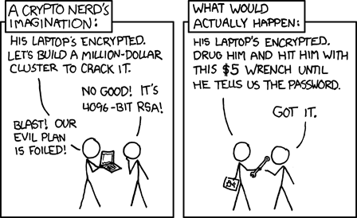

**Notes:**

SSH does not counter the following threats:

- **Password cracking:** if password authentication is enabled, a weak password
  might be easily brute-forced or obtained through [side-channel
  attacks][side-channel]. Consider using public key authentication instead to
  mitigate some of these risks.

- **IP/TCP denial of service:** since SSH operates on top of TCP, it is
  vulnerable to attacks against weaknesses in TCP and IP, such as [SYN
  flood][syn-flood].
- **Traffic analysis:** although the encrypted traffic cannot be read, an
  attacker can still glean a great deal of information by simply analyzing the
  amount of data, the source and target addresses, and the timing.
- **Carelessness and coffee spills:** SSH doesn't protect you if you write your
  password on a post-it note and paste it on your computer screen.
- **Genius mathematicians:** did you see [Sneakers][sneakers]? A real, current
  example is the quantum computer. An attacker could record encrypted SSH
  connections today, and decrypt them later once a large enough quantum computer
  can break the Diffie-Hellman key exchange. This is called a ["store now,
  decrypt later"][openssh-pq] attack. Forward secrecy does not help here, since
  the key is computed instead of stolen. This is why OpenSSH uses a hybrid
  post-quantum key exchange by default: `sntrup761x25519-sha512` since version
  9.0, replaced by `mlkem768x25519-sha256` in version 10.0.

[aes]: https://en.wikipedia.org/wiki/Advanced_Encryption_Standard
[authenticated-encryption]: https://en.wikipedia.org/wiki/Authenticated_encryption
[dh]: https://en.wikipedia.org/wiki/Diffie%E2%80%93Hellman_key_exchange
[discrete-logarithm]: https://en.wikipedia.org/wiki/Discrete_logarithm
[elliptic-curve]: https://en.wikipedia.org/wiki/Elliptic-curve_cryptography
[enigma]: https://en.wikipedia.org/wiki/Enigma_machine#Operation
[enigma-operating-shortcomings]: https://en.wikipedia.org/wiki/Cryptanalysis_of_the_Enigma#Operating_shortcomings
[hash]: https://en.wikipedia.org/wiki/Cryptographic_hash_function
[hash-non-crypto]: https://en.wikipedia.org/wiki/Hash_function
[hmac]: https://en.wikipedia.org/wiki/HMAC
[hsm]: https://en.wikipedia.org/wiki/Hardware_security_module
[integer-factorization]: https://en.wikipedia.org/wiki/Integer_factorization
[mac]: https://en.wikipedia.org/wiki/Message_authentication_code
[mitm]: https://en.wikipedia.org/wiki/Man-in-the-middle_attack
[openssh-pq]: https://www.openssh.org/pq.html

[openssl-aes]: #symmetric-encryption-with-aes
[openssl-rsa]: #asymmetric-encryption-with-rsa
[openssl-signature]: #digital-signature-with-rsa
[pubkey]: https://en.wikipedia.org/wiki/Public-key_cryptography
[pubkey-math]: https://www.onebigfluke.com/2013/11/public-key-crypto-math-explained.html
[side-channel]: https://en.wikipedia.org/wiki/Cryptanalysis#Side-channel_attacks
[sneakers]: https://en.wikipedia.org/wiki/Sneakers_(1992_film)
[symmetric-encryption]: https://en.wikipedia.org/wiki/Symmetric-key_algorithm
[syn-flood]: https://en.wikipedia.org/wiki/SYN_flood
