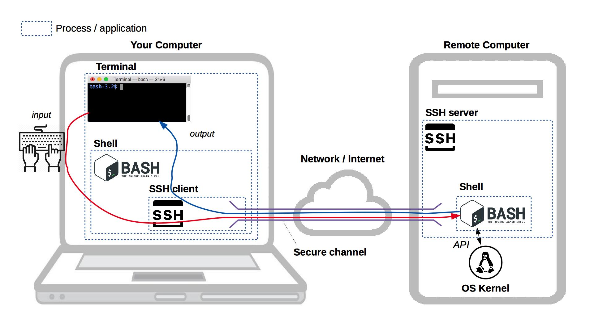
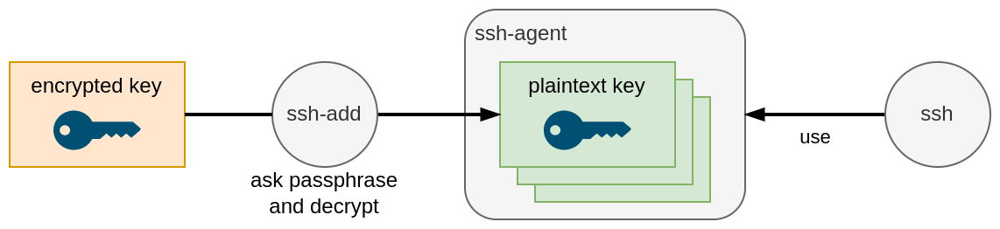
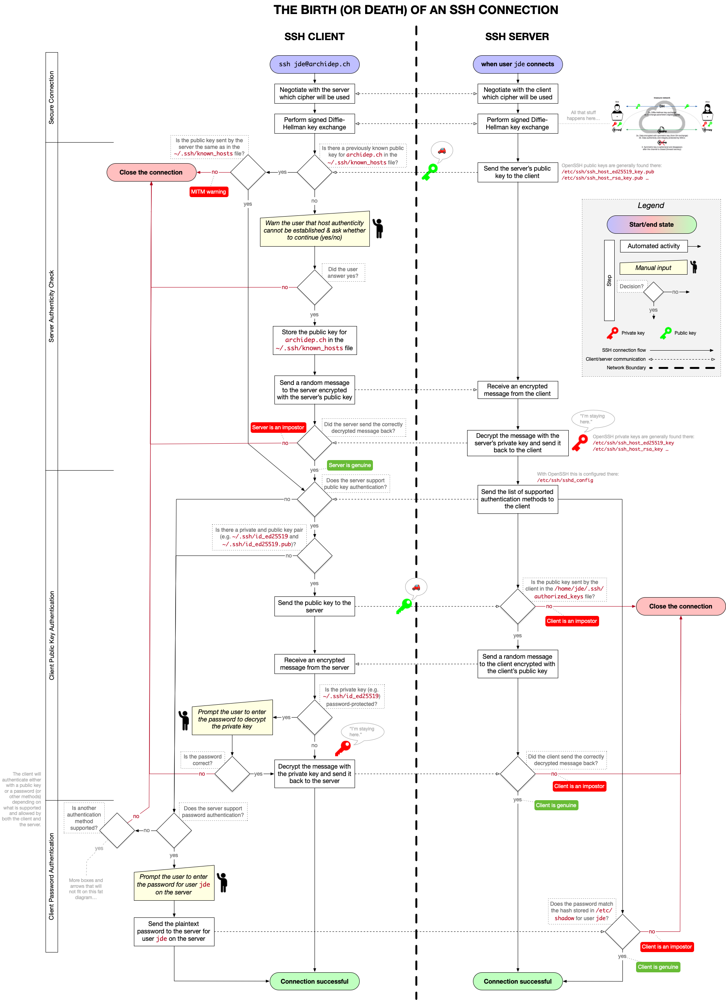

Learn about the SSH cryptographic network protocol and how to use the SSH command line tool to connect to other computers.

**You will need**

- A Unix CLI

**Recommended reading**

- [Command Line Introduction]()

## The `ssh` command

The `ssh` command is available on most Unix-like systems (e.g. Linux & macOS)
and in the WSL on Windows. Its basic syntax is:

```
ssh [user@]hostname [command]
```

Here are a few examples:

- `ssh example.com` - Connect to the SSH server at `example.com` and log in
  (with the same username as in your current shell).
- `ssh jde@example.com` - Connect to the SSH server at `example.com` and log in
  as user `jde`.
- `ssh jde@192.168.50.4 hostname` - Run the `hostname` command as user `jde`
  on the SSH server at `192.168.50.4`.

Run `man ssh` to see available options.

## SSH known hosts

When you connect to an SSH server for the first time, you will most likely get a
message similar to this:

```bash
$> ssh example.com
The authenticity of host 'example.com (192.168.50.4)' can't be established.
ED25519 key fingerprint is SHA256:colYVucS/YU0JSK7woiLAf5ChPgJYAR1BWJlET2EwDI.
Are you sure you want to continue connecting (yes/no/[fingerprint])?
```

What does this mean? _I thought SSH was **secure**?_

### Are you really the SSH server I'm looking for?

As the slides explain, when SSH establishes a secure channel, a Diffie-Hellman
asymmetric key exchange will occur to agree on a secret symmetric encryption
key. To secure this exchange, the server will perform an asymmetric digital
signature so that no attacker can impersonate the server.

To verify the signature, **your SSH client will ask the server for its public
key**. **This is where a man-in-the-middle attack is possible.** SSH warns you
that someone is sending you a public key, but it has no way of verifying whether
it's actually the server's public key, or whether it's the public key of an
attacker performing a man-in-the-middle attack.

Basically, **SSH makes the following guarantee**:

- Once you have established a secure channel to a given server, no third party
  can decrypt your communications. Forward secrecy is also guaranteed in the
  event your credentials are compromised in the future.

**SSH does not guarantee** that:

- You are connecting to the correct server. You may be connecting to an
  attacker's server.

#### How can I solve this problem?

If you are using SSH to transmit sensitive data, **you should check that the
server's public key is the correct one before connecting.**

One way to do this is to use the **key fingerprint** that is shown to you when
first connecting. The key fingerprint is a [cryptographic hash][hash] of the
public key:

```
ED25519 key fingerprint is SHA256:colYVucS/YU0JSK7woiLAf5ChPgJYAR1BWJlET2EwDI.
```

Some services that allow you to connect over SSH, like GitHub, [publish their
SSH key fingerprints on their website][github-fingerprints] so that users may
check them. In other cases, the key may be physically transmitted to you, or
dictated over the phone.

You should **check that both fingerprints match** before proceeding with the
connection. If they do not, either you typed the wrong server address, or an
attacker may be trying to hack your connection.

You do not have to compare the fingerprints by eye. Instead of answering `yes`,
you can paste the fingerprint you obtained from a trusted source (the full
`SHA256:...` value). SSH compares it with the fingerprint sent by the server,
and only continues the connection if they are the same.

### Known hosts file

If you accept the connection, SSH will save the server's address and public key
in its **known hosts file**. You can see the contents of this file with the
following command:

```bash
$> cat ~/.ssh/known_hosts
example.com ssh-ed25519 AAAAC3NzaC1lZDI1NTE5AAAAIJDLOpPWR7r89VjK9kPM...
```

The format of each line in this file is `hostname algorithm pubkey`.

The line above means that when SSH connects to `example.com`, it expects the
server to send this specific public key (`AAAAC3NzaC1lZDI1NTE5AAAAIJDLOpPWR7r...`)
for the [Ed25519][eddsa] algorithm.



On some systems, such as Ubuntu, the host names in this file are hashed, so that
someone who reads the file cannot find out which servers you connect to. The
lines then start with `|1|` followed by random-looking characters instead of the
host name. They work the same way.





Ed25519 is an asymmetric algorithm like RSA, although Ed25519 is based on
[elliptic curve cryptography][elliptic-curve] while RSA is based on prime
numbers. You may also see keys for other algorithms, such as
`ecdsa-sha2-nistp256` ([ECDSA][ecdsa]) or `ssh-rsa` ([RSA][rsa]). A server
usually has one key pair per algorithm.



#### Adding public keys to the known hosts file

Another solution to SSH man-in-the-middle attacks when first connecting is to
put the server's public key in the known hosts file yourself.

If you have previously obtained the server's public key (the full key, not just
the fingerprint), you can **add it to the known hosts file** before attempting
to connect.

If you do that, SSH will consider that the server is already a _known host_, and
will not prompt you to accept the public key.

#### Preventing future man-in-the-middle attacks

The known hosts file has another purpose. Once SSH knows to expect a specific
public key for a given domain or IP address, it will warn you if that public key
changes:

```
$> ssh 192.168.50.4
@@@@@@@@@@@@@@@@@@@@@@@@@@@@@@@@@@@@@@@@@@@@@@@@@@@@@@@@@@@
@    WARNING: REMOTE HOST IDENTIFICATION HAS CHANGED!     @
@@@@@@@@@@@@@@@@@@@@@@@@@@@@@@@@@@@@@@@@@@@@@@@@@@@@@@@@@@@
IT IS POSSIBLE THAT SOMEONE IS DOING SOMETHING NASTY!
Someone could be eavesdropping on you right now (man-in-the-middle attack)!
It is also possible that a host key has just been changed.
The fingerprint for the ED25519 key sent by the remote host is
SHA256:FUwFoK/hcqRAvJgDFmljwOur8t/mhfbm4tfIxdaVTQ8.
Please contact your system administrator.
Add correct host key in /path/to/.ssh/known_hosts to get rid of this message.
Offending ED25519 key in /path/to/.ssh/known_hosts:33
ED25519 host key for 192.168.50.4 has changed and you have requested strict checking.
Host key verification failed.
```

As the message mentions, either the server changed its SSH key pair, or **an
attacker may be intercepting your communications**.

If you're sure it's not an attack, for example if you know the server actually
changed its key pair, you can eliminate this warning by putting the correct
public key in the known hosts file, or by removing the offending line. The
`ssh-keygen` command can remove all the lines for a server for you, using its
`-R` (**r**emove) option:

```bash
$> ssh-keygen -R 192.168.50.4
```

The next time you connect, SSH will consider the server unknown again, and you
will get the initial warning asking you to check its key fingerprint.



This happens often when a server is deleted and a new one is created with the
same IP address or domain name. The new server has new host keys, but your
known hosts file still contains the keys of the old one.



## Password authentication

Establishing a secure channel is one thing, but that only ensures an attacker
cannot intercept communications. Once the channel is established, you must still
**authenticate**, i.e. **prove that you are in fact the user you are attempting
to log in as**.

How you authenticate depends on how the SSH server is configured. **Password
authentication** is one method. When enabled, the SSH server will prompt you for
the correct password; in this example, the password of the user named `jde` in
the server's user database:

```bash
$> ssh jde@192.168.50.4

The authenticity of host '192.168.50.4 (192.168.50.4)' can't be established.
ED25519 key fingerprint is SHA256:E4GYJCEoz+G5wv+EdkPyRLytgP7aTj9BS9lr1d38Xg0.
Are you sure you want to continue connecting (yes/no/[fingerprint])? yes
Warning: Permanently added '192.168.50.4' (ED25519) to the list of known hosts.

jde@192.168.50.4's password:
```



Most SSH clients will not display anything while you type your password. Simply
press `Enter` when you're done to submit it.



## Logging in with SSH

If you run the `ssh` command with no extra arguments and authenticate with your
password, **SSH will run the default [shell][shell]** configured for that user,
typically [Bash][bash] on Linux servers:

```bash
$> ssh jde@192.168.50.4
jde@192.168.50.4's password:
Welcome to Ubuntu 26.04 LTS (GNU/Linux 7.0.0-31-generic x86_64)

  System information as of Thu Sep 24 08:29:00 UTC 2026
  ...

$
```



Note that you may have a different command line prompt once you are connected,
in this example `$` instead of `$>`.



### Typing commands while connected through SSH

You are now **connected to a Bash shell running on the server**. Anything you
type is encrypted through SSH's secure channel and interpreted by that shell.
Any data that Bash outputs is also encrypted, sent back through the channel and
displayed in your terminal.

<p class='center'></p>

### Disconnecting

Disconnect with the command `exit` (or with `Ctrl-D` on Linux or macOS). You
should be back to the shell running on your local computer, with your usual
prompt:

```bash
$ exit
Connection to 192.168.50.4 closed.

$>
```

### Where am I?

Sometimes, you might forget what shell your terminal is connected to. Is it a
shell on your local machine or one running on the server?

If you're not sure, the `hostname` command may help you. It prints the network
name of the current machine:

```bash
$> hostname
MyComputer.local

$> ssh jde@192.168.50.4
jde@192.168.50.4's password:

$ hostname
example.com
```

In this example, the local computer is named `MyComputer.local`, while the
server is named `example.com`.

As you can see, the `hostname` command returns different results before and
after connecting to the server with SSH, because it's running on your local
machine the first time, but is running on the server the second time.

### Running a single command

When you execute `ssh` with the `[command]` option, it will execute the command
and close the connection as soon as that command is done.

Run this from your local shell:

```bash
$> hostname
MyComputer.local

$> ssh jde@192.168.50.4 echo Hello World
Hello World

$> hostname
MyComputer.local
```

As you can see, you are still in your local shell. The connection was closed as
soon as the `echo` command completed.

## Public key authentication

Password authentication works, but it has some drawbacks:

- Attackers may try to [brute force][brute-force] your password.
- If an attacker succeeds in performing a man-in-the-middle attack (for example
  if you forget to check the public key the first time you connect), they may
  steal your password.
- If the server is compromised, an attacker may modify the SSH server to steal
  your password.

As explained earlier, SSH uses asymmetric cryptography (among other techniques)
to establish its secure channel. It's **also possible to use asymmetric
cryptography to authenticate**.

### How does it work?

If you have a **private-public key pair**, you can **give your public key to the
server**. It is stored in the `~/.ssh/authorized_keys` file of your user account
on the server.

When you connect, your SSH client proves that you are the owner of that public
key with a **digital signature**:

- Your SSH client **signs** data that is unique to this connection **with your
  private key**, and sends the signature to the server.
- The server **checks the signature with your public key** from its
  `authorized_keys` file. Only the matching private key could have produced a
  valid signature.

This is the same mechanism that the server uses to prove its identity to you
when the secure channel is established, in the other direction: the server signs
with its private key, and your SSH client checks the signature with the server's
public key from your known hosts file.

This has advantages over password authentication:

- It's virtually impossible to [brute-force][brute-force] (it is larger and
  probably has much more [entropy][entropy] than your password).
- Your private key will not be compromised by a man-in-the-middle attack or if
  the server is compromised, as it is never transmitted to the server, only used
  to sign.
- An attacker who performs a man-in-the-middle attack only receives a signature
  that is valid for that one connection. Unlike a password, it cannot be reused
  to log in as you.



Note that **public key authentication is only as secure as the file containing
your private key**. If you publish that file anywhere or allow your local
machine to be compromised, the attacker will be able to impersonate you on any
server or service where you put your public key.





Remember, **your private key MUST remain private** (i.e. the `id_ed25519` file).
You should **never** give it to any person, server or web service. Only give
your public key (i.e. the `id_ed25519.pub` file).



### Using multiple keys

You may have multiple key pairs.

Some key pairs may have been generated by other programs or web services. For
example, some Git user interfaces generate a key pair to access GitHub, or
Amazon Web Services's Elastic Compute Cloud (EC2) generates key pairs to give
you access to their virtual machines.

Having multiple key pairs may be part of a security strategy to limit the access
an attacker might gain if one of them is compromised.

To generate a key with a custom name, use the `-f` (**f**ile) option when
generating the key with the `ssh-keygen` command. To use a specific key pair,
use the `ssh` command's `-i` (**i**dentity) option, which allows you to choose
the private key file you want to use:

```bash
$> ssh-keygen -f ~/.ssh/custom_key
$> ssh -i ~/.ssh/custom_key jde@192.168.50.4
```



It is the private key file you want to use with the `-i` option, not the public
key, as the private key is the one your SSH client will use to prove that it
owns the public key.



### Key management

A few tips on managing your key pairs:

- You may disseminate your **public key** freely to authenticate to other
  computers or services.
- **NEVER give your private key to anyone**.
- Conversely, you may copy your private key to another computer of yours if you
  want it to have the same access to other computers or services.
- **Back up your private and public key files** (`id_ed25519` and
  `id_ed25519.pub`) to avoid having to regenerate a pair if you lose your
  computer or switch to another computer. (If you create a new key pair, you
  will have to replace the old public key with the new one everywhere you used
  it.)
- Use [the `ssh-copy-id` command][ssh-copy-id] to copy your public key to other
  computers to use public key authentication instead of password authentication.

  _You will see how to do that in the SSH exercises._

- For web services using public key authentication (e.g. GitHub), you usually
  have to manually copy the public key file's contents (`id_ed25519.pub`) and
  provide it to them in your account's settings.

### Key protection

It's good practice to [protect your private key with a
**passphrase**][ssh-passphrase]. You can enter a passphrase when generating
your key pair with the `ssh-keygen` command. You can also [add a passphrase to
an existing key][ssh-passphrase-add] later.

- **Without a passphrase, anyone who gains access to your computer has the
  potential to copy your private key.** For example, family members,
  coworkers, system administrators and hostile actors could gain access.
- The **downside** to using a passphrase is that **you need to enter it every
  time you use SSH**. You can temporarily cache your passphrase using
  [ssh-agent][ssh-agent] so you don't have to enter it every time you connect.

  <p class='center'></p>

- **If a private key is compromised** (e.g. your computer is hacked or stolen),
  you should **remove the corresponding public key** from computers and web
  services you have copied it to.

## SSH for other network services

As mentioned initially, SSH is a network protocol. It can be used not only for
command line login, but to secure other network services.

A few examples are:

- [**S**ecure **C**o**p**y (`scp`)][scp] - A means of securely transferring
  computer files between a local and remote host.
- [rsync][rsync] - Utility for efficiently transferring and synchronizing files
  across computer systems.
- [SSH File Transfer Protocol (SFTP)][sftp] - Network protocol that provides
  file access, file transfer and file management.
- [Git][git] - Version control system that can use SSH (among other protocols)
  to transfer versioned data.

## References

- [How does SSH Work](https://www.hostinger.com/tutorials/what-is-ssh)
- [Understanding the SSH Encryption and Connection Process](https://www.digitalocean.com/community/tutorials/understanding-the-ssh-encryption-and-connection-process)
- [Diffie-Hellman Key Exchange][dh]
- [Simplest Explanation of the Math Behind Public Key Cryptography][pubkey-math]
- [SSH, The Secure Shell: The Definitive Guide](https://books.google.ch/books/about/SSH_The_Secure_Shell_The_Definitive_Guid.html?id=9FSaScltd-kC&redir_esc=y)
- [SSH Authentication Sequence and Key Files](https://serverfault.com/a/935667)

## Appendix: cryptography with OpenSSL

This appendix shows what some of the cryptographic techniques presented in the
slides look like in practice, using the [OpenSSL][openssl] command line tool,
which is installed on most computers. It is an **illustration**: you do not
need to know these commands, and you will not use them during this course. If
you are curious, you can run them yourself and see what happens.



On macOS, the `openssl` command is actually [LibreSSL][libressl], a fork of
OpenSSL. The commands below work with both, but some messages may be worded
differently.



### Symmetric encryption with AES

Create a [**plaintext**][plaintext] file containing the words "too many
secrets":

```bash
$> cd /path/to/projects
$> mkdir aes-example
$> cd aes-example
$> echo 'too many secrets' > plaintext.txt
```

Encrypt that file with the [AES][aes] algorithm. The `-in` (**in**put) option
is the file to encrypt, and the `-out` (**out**put) option is the file where the
[**ciphertext**][ciphertext] is written. The command prompts you for an
encryption password, from which the secret key is computed:

```bash
$> openssl aes-256-cbc -pbkdf2 -in plaintext.txt -out ciphertext.aes
enter aes-256-cbc encryption password:
Verifying - enter aes-256-cbc encryption password:
```

Look at the ciphertext stored in the `ciphertext.aes` file. The `-v` option of
the `cat` command makes it show **non-printing characters** as visible symbols
like `^Q` or `M-^H`, instead of sending them to your terminal. You should see
something like this:

```bash
$> cat -v ciphertext.aes
Salted__p7`qM-^HM-Z^QM-cM-z^YM-^[M-^]M-PM-hM-{nM- /
dM-^WYM-?^CM-^DM-J^]YM-^K_t^@M-^QM-^Kbt/M-^M!M-^Q
```

There is no trace of "too many secrets" in there.



The file starts with `Salted__`: this is not part of your message. It is a label
followed by a random value, the [**salt**][salt], which OpenSSL combined with
your password to compute the secret key. It is stored in the file because the
same salt is needed to compute the same key again when decrypting.



The ciphertext cannot be decrypted without the key. The `-d` option makes the same command **d**ecrypt its input instead of
encrypting it. Entering the same password as before decrypts the ciphertext:

```bash
$> openssl aes-256-cbc -pbkdf2 -d -in ciphertext.aes
enter aes-256-cbc decryption password:
too many secrets
```

With a different password, the decryption fails.



The example that showed you the ciphertext before uses `cat -v`. Do not display
a binary file with `cat` alone. Some of its bytes may happen to be control
characters that your terminal interprets as commands, which can leave it
displaying garbage. If that happens, the `reset` command restores it.



### Asymmetric encryption with RSA

Asymmetric encryption with [RSA][rsa] requires a **key pair, i.e. a private and
public key**. The following commands generate a private key in a file named
`private.pem`, then the corresponding public key in a file named `public.pem`:

```bash
$> cd /path/to/projects
$> mkdir rsa-example
$> cd rsa-example

# Generate a private key
$> openssl genrsa -out private.pem 2048

# Compute the public key from the private key (quick & easy)
$> openssl rsa -in private.pem -pubout -out public.pem
writing RSA key
```

By convention, these files use the `.pem` extension after the [Privacy-Enhanced
Mail (PEM) format][pem], a de facto standard format to store cryptographic data.

Create a plaintext and **encrypt it with the public key**. The `-pubin`
(**pub**lic **in**) and `-inkey` (**in**put **key**) options give the public key
to use. The `-pkeyopt` option selects [OAEP][oaep], the recommended way of
encrypting data with RSA:

```bash
$> echo 'too many secrets' > plaintext.txt

$> openssl pkeyutl -encrypt -pubin -inkey public.pem \
   -pkeyopt rsa_padding_mode:oaep \
   -in plaintext.txt -out ciphertext.rsa

$> ls
ciphertext.rsa plaintext.txt private.pem public.pem
```

The ciphertext is unreadable as well, and much longer than the plaintext: RSA
with a 2048-bit key always produces 256 bytes of ciphertext.

```bash
$> cat -v ciphertext.rsa
M-^_M-rVM-BM-"M-lXM-^XM-tM-il^MM-o*^TM-^EM-g9M-q^Q^BM-f^QM-no[...]
```

The ciphertext can be **decrypted with the corresponding private key**:

```bash
$> openssl pkeyutl -decrypt -inkey private.pem \
   -pkeyopt rsa_padding_mode:oaep -in ciphertext.rsa
too many secrets
```

You **cannot decrypt the ciphertext using the public key**, which is not a
private key at all:

```bash
$> openssl pkeyutl -decrypt -inkey public.pem \
   -pkeyopt rsa_padding_mode:oaep -in ciphertext.rsa
Could not find private key from public.pem
[...]
```

And of course, an attacker who has **another private key cannot decrypt it
either**:

```bash
# Generate another private key
$> openssl genrsa -out hacker-private.pem 2048

# Try to decrypt the ciphertext with it
$> openssl pkeyutl -decrypt -inkey hacker-private.pem \
   -pkeyopt rsa_padding_mode:oaep -in ciphertext.rsa
Public Key operation error
[...]
```

### Digital signature with RSA

In the same directory as the previous example, create a `message.txt` file with
a message to digitally sign. The following command uses the private key in
`private.pem` to generate a digital signature for that message, and stores it
in the `signature.rsa` file:

```bash
$> echo "Hello Bob, I like you" > message.txt

$> openssl dgst -sha256 -sign private.pem \
   -out signature.rsa message.txt
```

The signature is binary data. You can see it encoded in [Base64][base64]:

```bash
$> openssl base64 -in signature.rsa
```

Anyone with the public key can check that the signature is valid for the
message:

```bash
$> openssl dgst -sha256 -verify public.pem \
   -signature signature.rsa message.txt
Verified OK
```

If you modify the message file and check again, the signature no longer
matches the message:

```bash
$> echo "Hello Bob, I hate you" > message.txt

$> openssl dgst -sha256 -verify public.pem \
   -signature signature.rsa message.txt
Verification failure
```

## Appendix: the birth (or death) of an SSH connection

This diagram explains the SSH connection process in detail, step by step, from
the moment you run the `ssh` command until you are logged in, or until the
connection is closed. It shows what the SSH client and the SSH server each do,
what they send each other, and every point where the connection can fail.



- [PDF version](./images/ssh-connection.pdf)
- [PNG version](./images/ssh-connection.png)

[aes]: https://en.wikipedia.org/wiki/Advanced_Encryption_Standard
[base64]: https://en.wikipedia.org/wiki/Base64
[bash]: https://en.wikipedia.org/wiki/Bash_(Unix_shell)
[brute-force]: https://en.wikipedia.org/wiki/Brute-force_attack
[ciphertext]: https://en.wikipedia.org/wiki/Ciphertext
[dh]: https://en.wikipedia.org/wiki/Diffie%E2%80%93Hellman_key_exchange
[ecdsa]: https://en.wikipedia.org/wiki/Elliptic_Curve_Digital_Signature_Algorithm
[eddsa]: https://en.wikipedia.org/wiki/EdDSA
[elliptic-curve]: https://en.wikipedia.org/wiki/Elliptic-curve_cryptography
[entropy]: https://en.wikipedia.org/wiki/Password_strength#Entropy_as_a_measure_of_password_strength
[git]: https://git-scm.com
[github-fingerprints]: https://docs.github.com/en/authentication/keeping-your-account-and-data-secure/githubs-ssh-key-fingerprints
[hash]: https://en.wikipedia.org/wiki/Cryptographic_hash_function
[libressl]: https://www.libressl.org
[oaep]: https://en.wikipedia.org/wiki/Optimal_asymmetric_encryption_padding
[openssl]: https://www.openssl.org
[pem]: https://en.wikipedia.org/wiki/Privacy-Enhanced_Mail
[plaintext]: https://en.wikipedia.org/wiki/Plaintext
[pubkey-math]: https://www.onebigfluke.com/2013/11/public-key-crypto-math-explained.html
[rsa]: https://en.wikipedia.org/wiki/RSA_(cryptosystem)
[rsync]: https://en.wikipedia.org/wiki/Rsync
[salt]: https://en.wikipedia.org/wiki/Salt_(cryptography)
[scp]: https://en.wikipedia.org/wiki/Secure_copy
[sftp]: https://en.wikipedia.org/wiki/SSH_File_Transfer_Protocol
[shell]: https://en.wikipedia.org/wiki/Shell_(computing)
[ssh-agent]: https://www.cyberciti.biz/faq/how-to-use-ssh-agent-for-authentication-on-linux-unix/
[ssh-copy-id]: https://www.ssh.com/academy/ssh/copy-id
[ssh-passphrase]: https://docs.github.com/en/authentication/connecting-to-github-with-ssh/working-with-ssh-key-passphrases
[ssh-passphrase-add]: https://docs.github.com/en/authentication/connecting-to-github-with-ssh/working-with-ssh-key-passphrases#adding-or-changing-a-passphrase
