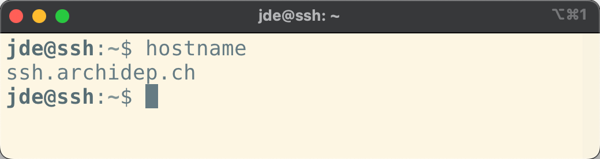
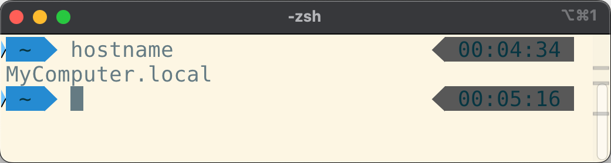
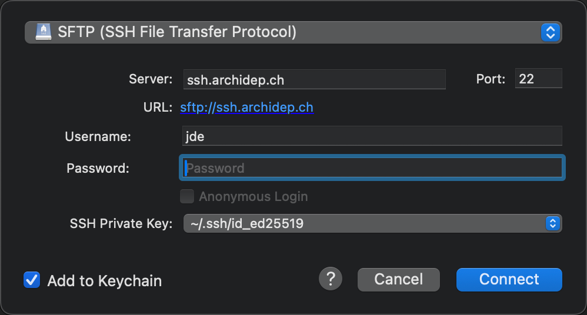

In this series of exercises, you will learn to use the `ssh` command to connect
to a remote server, and how to copy files to and from such a server using
various tools.

## :exclamation: Connect to the exercise server

An SSH exercise server has been prepared so that you can learn to use the `ssh`
command and other SSH-based tools. Your username and password for this server
are shown on the [dashboard][dashboard], along with the fingerprints of the
server's SSH host keys.

As we've seen, the basic syntax of the SSH command is as follows:

```bash
$> ssh <username>@<hostname>
```

To connect to the server:

- Determine the SSH command to connect to the exercise server. Replace the
  `<username>` placeholder by the username shown on the dashboard, and the
  `<hostname>` placeholder by `ssh.archidep.ch`.
- Execute that command in your console.
- Since you are probably connecting to this server for the first time,
  you should get the initial SSH connection warning indicating that the
  authenticity of the host cannot be established:

  ```
  The authenticity of host 'ssh.archidep.ch (W.X.Y.Z)' can't be established.
  ED25519 key fingerprint is SHA256:...
  Are you sure you want to continue connecting (yes/no/[fingerprint])?
  ```

  Before accepting, you should verify that the key fingerprint in the warning
  message corresponds to one of the fingerprints shown on the dashboard. You
  can do that by pasting the fingerprint from the dashboard (the one that starts
  with `SHA256:`) instead of answering `yes`. Your SSH client will compare it
  with the fingerprint the server sent, and will only continue if they match.



Answering yes without checking the key fingerprint exposes you to a potential
man-in-the-middle attack. An attacker could make you connect to a compromised
server and then intercept all traffic going through the SSH connection,
including your password.



- Enter or paste your password when prompted.



The password's characters will not appear as you type or after pasting. This is
a feature, not a bug. Passwords are not displayed to make it harder for someone
looking over your shoulder to read them.



You should now be connected to the server. You should see a welcome banner
giving you some information about the server's operating system, and the prompt
should have changed. Any command you type is now executed on the remote server.

## :question: Spot the difference

Run the following commands on the server:

- [`hostname`][hostname-command]
- [`whoami`][whoami-command]

Open another console and run these commands again. Since this is a fresh
console, they will be executed on your local machine this time. Observe the
difference in output when you are connected to the server or running the
commands on your local machine.



<!-- col text-center text-base -->

Connected to an SSH server



<!-- col text-center text-base -->

On your local machine







The `hostname` command prints the network name of the computer you are running
it on. This is likely to be different on your local machine than on the SSH
exercise server.



Another interesting command to run to see the difference between your machine
and the server is the [`uname` command][uname-command]. Try running it on the
server and your machine. Read the documentation and try some of its options to
get more information about your machine and the server.



If you want to quickly run a command on a remote server with SSH and
immediately disconnect, you can do so by providing more arguments to the
SSH command:

```bash
$> ssh <username>@<hostname> [command]
```

For example, assuming your username is `jde`, open a new console and execute the
following commands:

```bash
$> ssh jde@ssh.archidep.ch hostname
ssh.archidep.ch

$> hostname
MyComputer.local
```

You can see from the output that the first command was run on the server, but
that you are no longer connected by the time you ran the second command.



## :exclamation: Set up public key authentication

The goal of this step is to generate a public/private key pair on your machine
and to configure SSH to use public key authentication instead of password
authentication on the SSH exercise server.

This will improve security and avoid having to type your password on each SSH
connection. You will also need this key pair for the rest of the course: to
authenticate to GitHub, and to connect to your own server later.

**Disconnect from the server** (with the `exit` command) or open a new console
to run commands on your local machine.

### :question: Do I already have a key pair?

By default, SSH keys are stored in the `.ssh` directory in your home directory:

```bash
$> ls ~/.ssh
id_ed25519  id_ed25519.pub
```

If you have the `id_ed25519` and `id_ed25519.pub` files, you're good to go, since
SSH expects to find your main [Ed25519][eddsa] private key at
`~/.ssh/id_ed25519`. You might also have a default key pair using another
algorithm, such as an [ECDSA][ecdsa] key pair with files named `id_ecdsa` and
`id_ecdsa.pub`, or an [RSA][rsa] key pair with files named `id_rsa` and
`id_rsa.pub` if your system has an older SSH client.

If the directory doesn't exist or is empty, you don't have a key pair yet.



You may have a key with a different name, e.g. `github_rsa` & `github_rsa.pub`,
as it is sometimes generated by some software. You can use this key if you want,
but since it doesn't have the default name, you will have to add a `-i
~/.ssh/github_rsa` option to all your SSH commands. Generating a new key with
the default name for command line use would probably be easier.





On Windows, generate and keep your key pair **in the WSL**, in the `~/.ssh`
directory of your Linux home directory. Do not copy it to or from your Windows
files (under `/mnt/c`). Files stored there appear to be readable by anyone, and
SSH refuses to use a private key that other people can read. It stops with a
`WARNING: UNPROTECTED PRIVATE KEY FILE!` error.



### :exclamation: Generate a private-public key pair



Perform this step on your local machine, not on the SSH exercise server.



If you do not already have a key pair, you should generate one for the rest of
the exercise and the course. You will use the `ssh-keygen` command.



The `ssh-keygen` command is usually installed along with SSH and can generate a
key pair for you. It will ask you a couple of questions about the key:

- Where do you want to save it? Simply press enter to use the proposed default
  location (`~/.ssh/id_ed25519` for an Ed25519 key, `~/.ssh/id_rsa` for an RSA
  key, etc).
- What password do you want to protect the key with? Enter a password or simply
  press enter to use no password.



Simply running `ssh-keygen` with no arguments will ask you the required
information and generate a new key pair using your SSH client's default
algorithm:

```bash
$> ssh-keygen
Generating public/private ed25519 key pair.
Enter file in which to save the key (/home/jde/.ssh/id_ed25519):
Created directory '/home/jde/.ssh'.
Enter passphrase (empty for no passphrase):
Enter same passphrase again:
Your identification has been saved in /home/jde/.ssh/id_ed25519.
Your public key has been saved in /home/jde/.ssh/id_ed25519.pub.
The key fingerprint is:
SHA256:MmwL9n4KOUCuLoyvGJ7nWRDXjTSGAXO8AcCNVqmDJH0 jde@497820feb22a
The key's randomart image is:

+--[ED25519 256]--+
|.o===oo+         |
|.=.oE++ +        |
|= oo .oo .       |
|.=  oo           |
|  +.o = S        |
| . o.= +         |
|=   +.o          |
|*o..o+  .        |
|+*+o  oo         |
+----[SHA256]-----+
```



If you choose to enter a passphrase, you will not see anything in your terminal
when you type it. This is intentional, so that no one looking over your shoulder
can read it.





**Should I protect my key with a password?**

If you enter no password, your key will be stored **in the clear**. This will be
convenient as you will not have to enter a password when you use it. However,
any malicious code you allow to run on your machine could easily steal it.

If your key is protected by a password, you can run an [SSH agent][ssh-agent]
to unlock it only once per session instead of every time you use it.



You can verify that a key has indeed been created by listing the contents of the
SSH directory:

```bash
$> ls ~/.ssh
id_ed25519 id_ed25519.pub
```

### :exclamation: Use `ssh-copy-id` to copy your public key to the server

The `ssh-copy-id` command uses the same syntax as the `ssh` command to connect
to another computer (e.g. `ssh-copy-id jde@example.com`). Instead of opening a
new shell, however, it will **copy your local public key(s) to your user
account's `authorized_keys` file** on the target computer.

Execute that command now (replacing `jde` with your username):

```bash
$> ssh-copy-id jde@ssh.archidep.ch
```

You will probably have to enter your password, so that `ssh-copy-id` can log in
and copy your key. But once that is done, **SSH should switch to public key
authentication** and you should not have to enter your password again to log in.
SSH will use your private key to authenticate you instead. (You may have to
enter your private key's password though, if it is protected by one.)



Once you have set up public key authentication for an SSH server, that server is
in possession of your public key. Your SSH client can then use your private key
to prove that you are the owner of this public key, using the mathematical
relationship between the two. Your private key is never sent to the server
during this process.



Connect with the `ssh` command again to see public key authentication in action:

```bash
$> ssh jde@ssh.archidep.ch
```

If it worked, the connection should now open without asking for a password. Your
user account is still secured: authentication was performed transparently by
your SSH client, using your private key.

### :question: The `authorized_keys` file

**Now that you are connected to the server,** you can check that your public key
was added to your user's `authorized_keys` file:

```bash
$> ls ~/.ssh
authorized_keys

$> cat ~/.ssh/authorized_keys
ssh-ed25519 AAAAC3NzaC1lZDI1NTE5AAAA... jde@497820feb22a
```

When your SSH client connects to the SSH server, the server will look for your
public key (or keys) in this file and ask the SSH client to prove that it owns
one of the keys (using the corresponding private key which rests on your local
machine) using asymmetric cryptography.

The private key is never transmitted, and this new authentication process is
transparent, handled automatically for you by the SSH client and server, hence
why you no longer have to enter a password.



You can also create the `authorized_keys` file manually. Note that both the file
and its parent directory must have permissions that make it accessible only to
your user account, or the SSH server will refuse to use it for security reasons.
The following commands can set up the file on the target machine:

```bash
$> mkdir -p ~/.ssh && chmod 700 ~/.ssh
$> touch ~/.ssh/authorized_keys
$> chmod 600 ~/.ssh/authorized_keys
```

The [`chmod` command][chmod] changes the permission of files. We will learn
more about this command later on in the course.



### :exclamation: Is your password gone?

**Disconnect from the server** again. Now connect while telling your SSH client
**not** to use public key authentication:

```bash
$> ssh -o PubkeyAuthentication=no jde@ssh.archidep.ch
```

What happens? Why?



The server asks for your password again, and your password still works.

`ssh-copy-id` **added** a new way to authenticate to your user account. It did
not replace your password. Your SSH client now tries your key first, which is
why you no longer have to type your password, but the password is still
accepted.

Protecting a server with keys only means **also disabling password
authentication** on the server, which is done in the SSH server's configuration.
The virtual server you will create later in the course does not accept passwords
at all: you will give it your public key when you create it.



### :exclamation: Which key is where?

You have now seen several files containing keys, on two different machines.
Copy the following table and fill it in. For each file, write on which machine
it is stored (your machine or the server), what it contains, and whether it
must be kept secret. You can look for them with `ls` on both machines. The
server's own keys are in the `/etc/ssh` directory.

| File                                | Machine | Contains | Secret? |
| :---------------------------------- | :------ | :------- | :------ |
| `~/.ssh/id_ed25519`                 |         |          |         |
| `~/.ssh/id_ed25519.pub`             |         |          |         |
| `~/.ssh/authorized_keys`            |         |          |         |
| `~/.ssh/known_hosts`                |         |          |         |
| `/etc/ssh/ssh_host_ed25519_key`     |         |          |         |
| `/etc/ssh/ssh_host_ed25519_key.pub` |         |          |         |

Then answer these questions:

- Which of these files is used to prove to the server that you are you?
- Which of these files is used to prove to you that the server is the right
  server?
- An attacker copies your `id_ed25519.pub` file. What can they do with it?



| File                                | Machine      | Contains                                       | Secret? |
| :---------------------------------- | :----------- | :--------------------------------------------- | :------ |
| `~/.ssh/id_ed25519`                 | Your machine | Your private key                               | Yes     |
| `~/.ssh/id_ed25519.pub`             | Your machine | Your public key                                | No      |
| `~/.ssh/authorized_keys`            | The server   | The public keys allowed to log in as your user | No      |
| `~/.ssh/known_hosts`                | Your machine | The public keys of the servers you trust       | No      |
| `/etc/ssh/ssh_host_ed25519_key`     | The server   | The server's private host key                  | Yes     |
| `/etc/ssh/ssh_host_ed25519_key.pub` | The server   | The server's public host key                   | No      |

- Your private key, `~/.ssh/id_ed25519`, proves to the server that you are you.
  The server checks the proof with your public key, which it finds in
  `~/.ssh/authorized_keys`.
- The server's private host key proves to your machine that it is the right
  server. Your SSH client checks the proof with the server's public host key.
  The first time, you check it yourself with the fingerprint. After that, your
  SSH client finds it in `~/.ssh/known_hosts`.
- Nothing harmful. A public key can only be used to check a proof, not to make
  one. This is why you can give your public key to any server or service. The
  attacker would need your private key to log in as you.

The two sides work the same way: each one keeps a private key, and the other
side keeps the matching public key.



## :exclamation: Copy a file with the `scp` command

Create a simple text file on your local machine (using the following command or
with your favorite text editor):

```bash
$> echo World > hello.txt
```

The [`scp` (**s**ecure **c**o**p**y) command][scp-command] works in principle
like the [`cp` (**c**o**p**y) command][cp-command], which copies files on your
own machine, except that it can copy files to and from other computers that have
an SSH server running, using SSH to transfer the files. It reuses part of the
same syntax as the `ssh` command to connect to an SSH server. Try running this
command now (replacing `jde` with your username on the SSH exercise server):

```bash
$> scp hello.txt jde@ssh.archidep.ch:hello.txt
hello.txt 100% 6 0.6KB/s 00:00
```

This command copies your local `hello.txt` file to the home directory of the
`jde` user account on the remote computer.

To check that the file has indeed been copied, connect to the server and use
some of the commands you have learned so far:

```bash
$> ssh jde@ssh.archidep.ch

$> ls
hello.txt
...

$> cat hello.txt
World

$> exit
```

You can also copy files from the remote computer to your local computer:

```bash
$> scp jde@ssh.archidep.ch:hello.txt hello2.txt
hello.txt 100% 6 5.7KB/s 00:00

$> cat hello2.txt
World
```



Here are a few additional examples of how to use the `scp` command:

- `scp foo.txt jde@192.168.50.4:bar.txt`

  Copy the local file `foo.txt` to a file named `bar.txt` in `jde`'s home
  directory on the remote computer.

- `scp foo.txt jde@192.168.50.4:`

  Copy the file to `jde`'s home directory with the same file name.

- `scp foo.txt jde@192.168.50.4:/tmp/foo.txt`

  Copy the file to the absolute path `/tmp/foo.txt` on the remote computer.

- `scp jde@192.168.50.4:foo.txt jsmith@192.168.50.5:bar.txt`

  Copy the file from one remote computer to another.

- `scp -r foo jde@192.168.50.4:foo`

  **R**ecursively (the `-r` option) copy the contents of directory `foo` to
  the remote computer (a [recursive][recursion] copy means that the directory
  and all its subdirectories are copied).



## :exclamation: Copy files with an SFTP application

[SFTP][sftp] is an alternative to the original [FTP][ftp] protocol to transfer
files. Since FTP is [insecure][ftp-security] (e.g. passwords are sent
unencrypted), SFTP is an alternative that goes through SSH's secure channel and
therefore poses fewer security risks.

Most modern FTP clients support SFTP. Here's a couple:

- [FileZilla][filezilla]
- [WinSCP][winscp]
- [Cyberduck][cyberduck]

Many code editors also have SFTP support available through plugins.

Install one of these applications (or use your favorite SFTP application if you
already have one) and connect to the SSH exercise server with public key
authentication. You will need to configure a connection with the following
information:

- **Protocol:** SFTP
- **Host, hostname or server address:** `ssh.archidep.ch`
- **Username**: the username shown on the dashboard
- **Port:** 22 (the standard SSH port)
- **Private key** (or key file): your private key, `~/.ssh/id_ed25519`

Leave the password empty. The application will use your private key to prove
that it owns the public key in your `authorized_keys` file on the server, just
like the `ssh` command does. Make sure to select the **private key**
(`id_ed25519`), not the public key (`id_ed25519.pub`).



How to use these parameters depends on which application you use. They
may not be named exactly like this.



For example, here's how to do it with Cyberduck:





The `.ssh` directory is hidden, so it may not appear when you browse for your
private key:

- On macOS, use the `Cmd-Shift-.` shortcut in the file selection window to
  display hidden files and directories.
- On Windows, your private key is in the WSL, not in your Windows files. Type
  `\\wsl.localhost\` in the address bar of the file selection window, then open
  your Linux distribution's directory (e.g. `Ubuntu`), then `home`, your Linux
  username, and `.ssh`. You can also find your Linux files under **Linux** in
  the sidebar of the Windows file explorer.
- On most Linux distributions, the file manager will have an option to show
  hidden files under its menu.





On Windows, FileZilla and WinSCP may ask you to convert your private key to
another format. You can do so. The converted file is a copy of your private
key: keep it as private as the original.





When connecting for the first time, the application may issue the same
initial connection warning as when you connect using the command line. Be sure
to check the key fingerprint.



Once you have successfully connected to the server, copy another file to the
server using the SFTP application this time. These applications will usually
allow you to drag-and-drop files to and from the server. Play with it a bit and
see what you can do.

Now you know another way to copy files over SSH.

## :question: Sign a message with your key

When you log in with your key, your SSH client **signs** data from the
connection with your private key, and the server **checks the signature** with
your public key from `~/.ssh/authorized_keys`. You can do the same thing by
hand, with a message of your own.

On your machine, create a message and sign it with your private key:

```bash
$> echo "Hello Bob, I like you" > message.txt

$> ssh-keygen -Y sign -f ~/.ssh/id_ed25519 -n file message.txt
Signing file message.txt
Write signature to message.txt.sig
```

The `-f` option is the private key to sign with. The `-n` option is a label
saying what the signature is for (here, a **file**). The same label must be
given when checking the signature, so that a signature made for one purpose
cannot be reused for another. If your key is protected by a passphrase, you will
be asked for it.

The signature is in the new `message.txt.sig` file. Take a look at it with
`cat`.

Copy both files to the server. The `scp` command can copy several files at
once, if you list them before the destination:

```bash
$> scp message.txt message.txt.sig jde@ssh.archidep.ch:
```

Connect to the server and check the signature:

```bash
$> ssh-keygen -Y check-novalidate -n file -s message.txt.sig < message.txt
Good "file" signature with ED25519 key SHA256:oV28VA4IAtvQKMi6Tq21cCOy...
```

The `-s` option is the signature to check. The `<` character sends the contents
of `message.txt` to the command as its input. You will learn more about it later
in this course.

The command tells you that the signature is valid for this message, and which
key made it, by its fingerprint. It does not tell you whether that key is one
you trust. Display the fingerprint of the public key in your
`~/.ssh/authorized_keys` file, and compare the two:

```bash
$> ssh-keygen -l -f ~/.ssh/authorized_keys
256 SHA256:oV28VA4IAtvQKMi6Tq21cCOy... jde@example.com (ED25519)
```

Now modify the message **on the server**, and check the signature again:

```bash
$> echo "Hello Bob, I hate you" > message.txt

$> ssh-keygen -Y check-novalidate -n file -s message.txt.sig < message.txt
Signature verification failed: incorrect signature
Could not verify signature.
```

Then answer these questions:

- Which key made the signature, and on which machine was it?
- Which key checked it, and on which machine was it?
- An attacker intercepts your message, modifies it, and signs it with their own
  private key. Would the `ssh-keygen -Y check-novalidate` command accept their
  signature? How would you notice?
- What does the server do when you log in that you just did by hand?



- Your private key, `~/.ssh/id_ed25519`, on your machine, made the signature.
- Your public key, in `~/.ssh/authorized_keys` on the server, was used to
  check it (its fingerprint matches). The private key never left your machine:
  only the signature was copied.
- Yes: their signature is valid, since it was made with their private key for
  this exact message. But the fingerprint shown would be the fingerprint of
  their key, not the one in your `~/.ssh/authorized_keys` file. A valid
  signature only proves something if you know whose key made it. This is the
  same reason you check the server's fingerprint the first time you connect: an
  attacker in the middle can sign the key exchange with their own key.
- When you log in with your key, your SSH client signs data from the connection
  with your private key, and the server checks the signature with a public key
  from your `~/.ssh/authorized_keys` file. It only accepts a signature made by
  one of the keys listed there.



## :question: SSH agent

If you use a **private key that is password-protected**, you lose part of the
convenience of public key authentication: you don't have to enter a password to
authenticate to the server, but **you still have to enter the key's password**
to unlock it.



If you did not set a passphrase when generating your key, you can also [add a
passphrase afterwards][ssh-passphrase-add].



The `ssh-agent` command can help you there. It runs a helper program that will
let you unlock your private key(s) once, then use it multiple times without
entering the password again each time.



There are several ways to run an SSH agent:

- [How to use ssh-agent for authentication on Linux /
  Unix](https://www.cyberciti.biz/faq/how-to-use-ssh-agent-for-authentication-on-linux-unix/)
- [Generating a new SSH key and adding it to the ssh-agent
  (GitHub)][ssh-agent-run-github]
- [Single sign-on using SSH][ssh-agent-run]

You may already have an SSH agent running. Run the `ssh-add -l` command to
**l**ist (`-l`) unlocked keys:

- If you get an error message, it probably means that SSH agent is not running,
  for example:

  ```bash
  $> ssh-add -l
  Could not open a connection to your authentication agent.
  ```

- If it tells you that you have no identities, it means that SSH agent is
  running but that you have not unlocked any keys yet:

  ```bash
  $> ssh-add -l
  The agent has no identities.
  ```

If SSH agent is not already running, follow one of the guides above or run an
agent and have it start a new shell for you:

```bash
$> ssh-agent $SHELL
```

The advantage of this last technique is that the agent will automatically quit
when you exit the shell, which is good since it's not necessarily a good idea to
keep an SSH agent running forever [for security reasons][ssh-agent-security].

Once you have your agent running, the associated `ssh-add` command will take
your default private key (e.g. `~/.ssh/id_ed25519`) and prompt you for your
password to unlock it:

```bash
$> ssh-add
Enter passphrase for /Users/jde/.ssh/id_ed25519:
Identity added: /Users/jde/.ssh/id_ed25519 (...)
```

The **unlocked key** is now **kept in memory by the agent**. The `ssh` command
(and other SSH-related commands like `scp`) will not prompt you for that key's
password as long as the agent keeps running.

If you want to load another key than the default one, you can specify its path:

```bash
$> ssh-add /path/to/custom_id_ed25519
```



## :checkered_flag: What have I done?

You have learned to use the `ssh` command to connect to a remote server, and to
check that you are connecting to the right server with its key fingerprint.

You have learned to configure and use public key authentication instead of the
less secure password-based authentication mechanism, and you know which keys
are stored on your machine and which are stored on the server.

You have also learned to use the SSH protocol through other tools such as `scp`
or your favorite SFTP application to copy files.

If you are more security-minded, you may have also learned to protect your
private key with a passphrase and to use SSH agent to make it more convenient to
use SSH.

[chmod]: https://man7.org/linux/man-pages/man1/chmod.1.html
[cp-command]: https://linuxize.com/post/cp-command-in-linux/
[cyberduck]: https://cyberduck.io
[dashboard]: /app
[ecdsa]: https://en.wikipedia.org/wiki/Elliptic_Curve_Digital_Signature_Algorithm
[eddsa]: https://en.wikipedia.org/wiki/EdDSA
[filezilla]: https://filezilla-project.org/
[ftp]: https://en.wikipedia.org/wiki/File_Transfer_Protocol
[ftp-security]: https://en.wikipedia.org/wiki/File_Transfer_Protocol#Security
[hostname-command]: https://man7.org/linux/man-pages/man1/hostname.1.html
[recursion]: https://en.wikipedia.org/wiki/Recursion
[rsa]: https://en.wikipedia.org/wiki/RSA_(cryptosystem)
[scp-command]: https://linuxize.com/post/how-to-use-scp-command-to-securely-transfer-files/
[sftp]: https://en.wikipedia.org/wiki/SSH_File_Transfer_Protocol
[ssh-agent]: https://man7.org/linux/man-pages/man1/ssh-agent.1.html
[ssh-agent-run]: https://www.ssh.com/academy/ssh/agent
[ssh-agent-run-github]: https://docs.github.com/en/authentication/connecting-to-github-with-ssh/generating-a-new-ssh-key-and-adding-it-to-the-ssh-agent
[ssh-agent-security]: https://www.commandprompt.com/blog/security_considerations_while_using_ssh-agent/
[ssh-passphrase-add]: https://docs.github.com/en/authentication/connecting-to-github-with-ssh/working-with-ssh-key-passphrases
[uname-command]: https://man7.org/linux/man-pages/man1/uname.1.html
[whoami-command]: https://man7.org/linux/man-pages/man1/whoami.1.html
[winscp]: https://winscp.net
