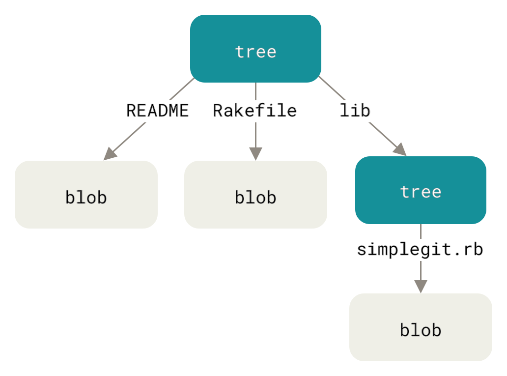

# {{ page.title }}

Architecture & Deployment <!-- .element: class="subtitle" -->

---

## What is Git?

<!-- .element: class="hidden" -->


[Git][git] is a [**version control system**][vcs]. It allows you to **take
snapshots** of your project over time.

- **Restore** files to a previous state
- **Compare** versions
- See **who changed what**
- **Collaborate** as a team

**Notes:**

Git was created in 2005 by Linus Torvalds, the creator of Linux, to manage the
source code of the Linux kernel. The alternatives were proprietary, and did not
support the way he wanted to develop Linux.

Linux is a large and complex piece of code with thousands of contributors, so
Git was designed for:

- **Speed**
- A **simple** design
- Strong support for **non-linear development** (thousands of parallel
  branches)
- Being fully **distributed**
- Handling **large projects** efficiently

_Figures of this deck from [Pro Git][pro-git], by Scott Chacon and Ben Straub
([CC BY-NC-SA 3.0][cc-by-nc-sa-3]); the workflow figure is adapted_

---

### Remember commits?

<simgit-story name='branchingOneLine' start-chapter='third-commit' end-chapter='third-commit' sizing='auto-height' theme='light' commit-representation='below' duration='1200' defer-until-visible='true' replay-on-revisit='true' controls='false'></simgit-story>

**Notes:**

Each **commit** (the circles above) records:

- A **snapshot** of the whole project as it was when you committed: not the
  changes you made, but the full content of every file.
- The **author**'s name and e-mail address, and the **date** of the commit.
- A **message** describing the change.
- A pointer to its **parent**: the previous commit, or commits. The history of
  the project is the chain of these pointers.

A commit is named by its **hash**, a [SHA-1][sha1] digest computed from its
content, such as:

```
24b9da6552252987aa493b52f8696cd6d3b00373
```

Git often shows only its first 7 characters, like `24b9da6`, which is usually
enough to tell commits apart.

Because the hash is computed from everything in the commit — the snapshot, the
author, the date, the message and the parent — changing any of these gives a
different hash, and therefore a different commit. This also gives Git
**integrity**: since all content is [hashed][hash] with a [cryptographic hash
function][cryptographic-hash-function], it's virtually impossible for files to
be lost or corrupted without Git knowing about it.

---

### Trees and blobs



**Notes:**

The snapshot of a commit is made of two kinds of objects:

- A **blob** is the content of one file.
- A **tree** is the listing of one directory: the name of each file in it, with
  the blob holding its content, and the name of each subdirectory, with the tree
  listing it in turn.

A commit points to the tree of the project's root directory, which is how it
holds the whole project. Blobs and trees are also named by the hash of their
content, so a file that has not changed since the previous commit is not stored
again: the new tree simply points to the blob that already exists.

See [how Git stores your project](#how-git-stores-your-project) for more.

---

## What is branching?

<!-- .element: class="hidden" -->


**Branching** means **diverging from the main line of development** and
**merging back** later.

- Work **in isolation**
- Pull changes from the main line **at your own pace**
- Choose **which features to release and when**

**Notes:**

Git's branching model is very **lightweight and fast**: it encourages workflows
that branch and merge often. Many teams using Git create a **separate branch**
to develop **each feature**.

This is a condensed version of the [branching chapter of the Git
Book](https://git-scm.com/book/en/v2/Git-Branching-Branches-in-a-Nutshell),
which you should read if you want more detailed information on the subject.

**Resources**

- [Git branching][branching]
- [Advanced merging][advanced-merging]
- [Understanding branches in Git][understanding-branches]
- [Branching workflows](https://git-scm.com/book/en/v2/Git-Branching-Branching-Workflows)
  - [A successful branching model](http://nvie.com/posts/a-successful-git-branching-model/) (for large teams)
  - [A successful branching model considered harmful](https://barro.github.io/2016/02/a-succesful-git-branching-model-considered-harmful/)
  - [Branch-per-feature](http://dymitruk.com/blog/2012/02/05/branch-per-feature/)
  - [Trunk-based development](https://trunkbaseddevelopment.com)

---

### Branches point to commits

A branch is a lightweight, movable **pointer to a commit**.

<simgit-story name='branchingOneLine' start-chapter='setup' end-chapter='third-commit' sizing='auto-height' theme='light' commit-representation='below' duration='1200' defer-until-visible='true' replay-on-revisit='true'></simgit-story>

**Notes:**

The default branch is `main` (or `master` with the default Git configuration).
The special `HEAD` pointer indicates the current branch.

As you start making commits, the current branch pointer **automatically moves**
forward to your latest commit.

---

### Example repository

This prepared repository serves to illustrate branching.

```bash
$> cd /path/to/projects

$> git clone https://github.com/ArchiDep/git-branching-ex.git

$> cd git-branching-ex

# We will talk more about this
$> git remote rm origin
```

**Notes:**

> 🛠️ Clone the example repository and move into it.

`git clone` downloads a copy of a repository, its whole history included. The
last command removes the link to the repository on GitHub, which is explained
with remotes later.

Open the project with your favorite editor and open the `index.html` page in a
browser. As you can see if you type `git log`, there are some commits already.

---

### Showing the commit graph

```bash
$> git config --global alias.graph \
   "log --oneline --decorate --graph --all"

$> git graph
* 4f94fa (HEAD -> main) Improve layout
* 9ab3fd Fix addition
* 387f12 First version
```

**Notes:**

The [`git log` command][git-log] can show you a representation of the commit
graph and its branches, with `git log --oneline --decorate --graph --all`. This
command is so useful that you should make an **alias** for it, `git graph`, as
it is used throughout these slides.

> 🛠️ Create the alias, and show the commit graph of the example repository.

---

### Create a new branch

```bash
$> git branch sub
```

<simgit-story name='branchingOneLine' start-chapter='third-commit' end-chapter='branch' sizing='auto-height' theme='light' commit-representation='below' duration='1200' defer-until-visible='true' replay-on-revisit='true'></simgit-story>

**Notes:**

> 🛠️ Our JavaScript calculator is missing some code. Let's create a branch to
> implement subtraction.

It's very fast and simple to create a new branch with the `git branch` command.
There is now a new pointer to the current commit. Note that `HEAD` didn't move:
we are still on the `main` branch.

Without arguments, `git branch` lists the branches, with a star next to the
current one:

```bash
$> git branch
  sub
* main
```

---

### Switch branches

```bash
$> git switch sub
Switched to branch 'sub'
```

<simgit-story name='branchingOneLine' start-chapter='branch' end-chapter='checkout' sizing='auto-height' theme='light' commit-representation='below' duration='1200' defer-until-visible='true' replay-on-revisit='true'></simgit-story>

**Notes:**

> 🛠️ Switch to the new branch.

This moves `HEAD` to point to the `sub` branch. No file has changed, because
`sub` points to the same commit as `main`.

You will also find `git checkout sub` in older documentation. It does the same
thing: `git switch` is a newer command dedicated to switching branches.

> 🛠️ You can now implement the subtraction in `subtraction.js`: replace
> `return '?';` with `return a - b;`.

---

### Check the status

```bash
$> git status
On branch sub
Changes not staged for commit:
  (use "git add <file>..." to update what will be committed)
  (use "git restore <file>..." to discard changes in working directory)
        modified:   subtraction.js

no changes added to commit (use "git add" and/or "git commit -a")
```

**Notes:**

> 🛠️ Check the status of your repository.

Git has noticed that `subtraction.js` was modified, but the change is **not
staged for commit**: if you committed now, it would not be included. To
understand why, you need to know the three parts of a Git project.

> 🛠️ See exactly what you changed with `git diff`.

`git status` says **which** files changed; `git diff` shows **what** changed in
them, line by line:

```bash
$> git diff
diff --git a/subtraction.js b/subtraction.js
index 1ef2791..612b196 100644
--- a/subtraction.js
+++ b/subtraction.js
@@ -1,5 +1,5 @@
 function subtract(a, b) {
-  return '?';
+  return a - b;
 }
```

---

### What's in a Git project?

```bash [|2-5,7-8|1,9-12|6]
my-project:       # the working directory
┣━━ .git:         # the git directory
┃   ┣━━ HEAD
┃   ┣━━ config
┃   ┣━━ hooks
┃   ┣━━ index     # the staging area
┃   ┣━━ objects
┃   ┗━━ ...
┣━━ file1.txt
┣━━ file2.txt
┗━━ dir:
    ┗━━ file3.txt
```

**Notes:**

A Git project has three main parts:

- The **Git directory**: this is where Git stores all the **snapshots** of the
  different **versions** of your files. This is the most important part of Git,
  and it is what is copied when you clone a repository from another computer or
  a server.

  You should never modify any of the files in this directory yourself; you could
  easily corrupt the Git repository. It is hidden by default, but you can see it
  on the command line. (The exception to this rule are **hooks**, scripts that
  you can write for Git to run automatically, which we will cover later.)

- The **working directory**: it contains the **files you are currently working
  on**; that is, **one specific version** of your project. These files are
  pulled out of the compressed database in the Git directory and placed in your
  project's directory for you to use or modify:
- The **staging area** (also called the **index**), that stores information
  about **what will go into the next commit (or version)**.

  Before file snapshots are **committed** in the Git directory, they must go
  through the _staging area_.

---

### The basic Git workflow


**Notes:**

This is one of the **most important things to remember about Git**:

- You **check out** (or **switch to**) a specific version of your files into the
  _working directory_.
- You **modify** files (or add new files) in your _working directory_.
- You **stage** the files, adding snapshots of them to your _staging area_.
- You make a **commit**, which takes the files as they are in the _staging area_
  and stores this snapshot of your project permanently to your _Git directory_.

---

### Using the staging area


**Notes:**

New snapshots of files **MUST go through the staging area** to be **committed**
into the Git directory.

---

### Stage the change

```bash
$> git add subtraction.js

$> git status
On branch sub
Changes to be committed:
  (use "git restore --staged <file>..." to unstage)
        modified:   subtraction.js
```

**Notes:**

> 🛠️ Stage your change, and check the status again.

`git add` puts a snapshot of the file, as it is now, into the **staging area**.
The change is now ready **to be committed**.

> 🛠️ Run `git diff` again, then `git diff --cached`.

`git diff` now shows nothing: it only shows the changes you have **not staged**,
the differences between the working directory and the staging area. The change
has moved to the staging area, where `git diff --cached` shows it: the
differences between the staging area and the last commit, which is exactly what
the next commit will contain. Check it before you commit.

---

### Commit on a branch

```bash
$> git commit -m "Implement subtraction"
[sub 712ff2] Implement subtraction
 1 file changed, 1 insertion(+), 1 deletion(-)
```

<simgit-story name='branchingOneLine' start-chapter='checkout' end-chapter='commit-on-a-branch' sizing='auto-height' theme='light' commit-representation='below' duration='1200' defer-until-visible='true' replay-on-revisit='true'></simgit-story>

**Notes:**

> 🛠️ Commit your change.

As you commit, the current branch (the one pointed to by `HEAD`) moves forward
to the new commit.

The working directory, the staging area and the last commit now all agree, so
`git status` has nothing to report:

```bash
$> git status
On branch sub
nothing to commit, working tree clean
```

Make a habit of reading `git status` after every step.

---

### Switch/checkout behavior

```bash
$> git switch main
Switched to branch 'main'
```

<simgit-story name='branchingOneLine' start-chapter='commit-on-a-branch' end-chapter='back-to-main' sizing='auto-height' theme='light' commit-representation='below' duration='1200' defer-until-visible='true' replay-on-revisit='true'></simgit-story>

Now check your files.

**Notes:**

> 🛠️ Oops, you just noticed that addition is not working correctly. You need to
> make a bug fix, but you don't want to mix that code with the new subtraction
> feature. Let's **go back to `main`**.

Two things happened when you ran `git switch main`:

- The `HEAD` pointer was **moved** back to the `main` branch.
- The files in your working directory were **restored** to the snapshot that
  `main` points to.

`subtraction.js` contains `return '?';` again: you are working on an **older
version** of the project. Your work is not lost: it is in the commit that `sub`
points to.

---

### Create another branch

```bash
$> git switch -c fix-add
Switched to a new branch 'fix-add'
```

<simgit-story name='branchingOneLine' start-chapter='back-to-main' end-chapter='another-branch' sizing='auto-height' theme='light' commit-representation='below' duration='1200' defer-until-visible='true' replay-on-revisit='true'></simgit-story>

**Notes:**

> 🛠️ Let's create a new branch to fix the bug.

You can create a new branch _and_ switch to it in one command with the `-c`
(**c**reate) option of the `switch` command (or the `-b` option of the older
`checkout` command).

Nothing changed yet because `fix-add` still points to the same commit as `main`.

---

### Work on a separate branch

```bash
$> git add addition.js
$> git commit -m "Fix addition"
[fix-add 2817bc] Fix addition
 1 file changed, 1 insertion(+), 1 deletion(-)
```

<simgit-story name='branching' start-chapter='another-branch' end-chapter='divergent-history' sizing='auto-height' theme='light' commit-representation='below' duration='1200' defer-until-visible='true' replay-on-revisit='true'></simgit-story>

**Notes:**

> 🛠️ Fix `addition.js` (replace `a * b` with `a + b`), then stage and commit
> your changes.

As on `sub`, the commit moves the current branch, `fix-add`, forward. `sub` and
its commit are left where they were.

---

### Divergent history

```bash
$> git switch sub
$> git switch fix-add
```

<simgit-story name='branching' start-chapter='divergent-history' end-chapter='switch-to-fix-add' sizing='auto-height' theme='light' commit-representation='below' duration='1200' defer-until-visible='true' replay-on-revisit='true'></simgit-story>

**Notes:**

> 🛠️ Switch back and forth between `sub` and `fix-add` a few times, and
> watch `subtraction.js` and `addition.js` change in your editor.

Your project history has now **diverged**: `sub` and `fix-add` both start from
the same commit, and each adds a different change to it. The two changes are
**isolated** from each other: `sub` has the subtraction but not the fix, and
`fix-add` has the fix but not the subtraction.

Every time you switch branches, Git **rewrites the files in your working
directory** to match the snapshot of the commit that the branch points to. This
works for any branch, and therefore any version of your project, at any time:
nothing is lost by switching, since every version is safely stored in a commit.

Switch from a **clean** working directory, when `git status` says there is
nothing to commit. If you have uncommitted changes that switching would
overwrite, Git refuses to switch rather than lose them:

```bash
$> git switch sub
error: Your local changes to the following files would be overwritten by checkout:
        subtraction.js
Please commit your changes or stash them before you switch branches.
Aborting
```

Commit your changes first, or discard them with `git restore`. And if your
uncommitted changes are to a file that is the same in both branches, Git
switches without complaint, and the changes simply follow you to the other
branch (which is rarely what you meant).

`git diff` can also compare two versions without switching: `git diff sub
fix-add` shows everything that differs between the two branches, here the
subtraction on one side and the addition fix on the other.

---

### Go back to the main line

We want to bring back those changes to the main line.

```bash
$> git switch main
```

<simgit-story name='branching' start-chapter='switch-to-fix-add' end-chapter='fast-forward-merge-checkout' sizing='auto-height' theme='light' commit-representation='below' duration='1200' defer-until-visible='true' replay-on-revisit='true'></simgit-story>

**Notes:**

Now that you've tested your fix and made sure it works, you want to **bring
those changes** back **into the `main` branch**.

Git's `merge` command can do that for you, but it can only **bring changes**
from another branch **into the current branch**, not the other way around. So
you must first switch to the `main` branch.

---

### Merge a branch

**Merge** the changes from the `fix-add` branch:

```bash
$> git merge fix-add
Updating 4f94fa..2817bc
Fast-forward
 addition.js | 2 +-
 1 file changed, 1 insertion(+), 1 deletion(-)
```

Notice the term **fast-forward**.

**Notes:**

> 🛠️ Merge `fix-add` into `main`.

---

### Fast-forward

<simgit-story name='branching' start-chapter='fast-forward-merge-checkout' end-chapter='fast-forward-merge' sizing='auto-height' theme='light' commit-representation='below' duration='1200' defer-until-visible='true' replay-on-revisit='true'></simgit-story>

**Notes:**

The `fix-add` branch pointed to a commit **directly ahead** of the commit `main`
pointed to. There is no divergent history, so Git simply has to **move the
pointer forward**. This is what is called a **fast-forward**.

---

### Delete a branch

```bash
$> git branch -d fix-add
Deleted branch fix-add (was 2817bc).
```

<simgit-story name='branching' start-chapter='fast-forward-merge' end-chapter='delete-branch' sizing='auto-height' theme='light' commit-representation='below' duration='1200' defer-until-visible='true' replay-on-revisit='true'></simgit-story>

**Notes:**

> 🛠️ Now that the fix is in `main`, the `fix-add` branch is no longer needed.
> Delete it.

Use the `-d` (**d**elete) option of the `branch` command. This only deletes the
pointer: the commit stays in the history of `main`.

---

### Merging a divergent history

<simgit-story name='branching' start-chapter='delete-branch' end-chapter='delete-branch' sizing='auto-height' theme='light' commit-representation='below' duration='1200' defer-until-visible='true' replay-on-revisit='true' controls='false'></simgit-story>

Can we do a fast forward here?

**Notes:**

Now we want to **merge** the subtraction feature into `main` as well. But `main`
has moved on since `sub` was created, so Git cannot do a fast-forward:

- `sub` points to commit `712ff2`, which contains our feature.
- `main` points to commit `2817bc`, which contains the addition fix.
- Commit `4f94fa` is their common ancestor.

If you moved `main` to `sub`'s current commit, you would **lose the addition
fix**, and commit `2817bc` would become **unreachable**: no branch would lead to
it any more. Git will not let you do that (at least not without insistence).

Instead, it will do a **three-way merge**, combining the changes of `main` and
`sub` (compared to their common ancestor). A **new commit** will be created
representing that state.

---

### Merge the divergent branch

```bash
$> git merge sub
Merge made by the 'ort' strategy.
 subtraction.js | 2 +-
 1 file changed, 1 insertion(+), 1 deletion(-)
```

**Notes:**

> 🛠️ Merge `sub` into `main`.

---

### Merge commit message

Git will ask you to confirm the commit message:

```txt
Merge branch 'sub'

# Please enter a commit message to explain why this merge is
# necessary, especially if it merges an updated upstream into
# a topic branch.
#
# Lines starting with '#' will be ignored, and an empty
# message aborts the commit.
```

If you are in Vim, press `Esc`, then type `:q!` and press `Enter`. If you are in
nano, use `Ctrl-X`, then `Y` and `Enter` to confirm.

**Notes:**

Git needs to create a new commit for this merge, so it **opens your configured
editor** with a generated commit message, and waits for you to exit the editor
before it makes the commit. The output of the `git merge` command only appears
once you have exited the editor.

The editor Git opens is the one named by the `EDITOR` environment variable, or
Vim if it is not set. If you find yourself in Vim, press `Esc` first: if you
typed anything, it takes you back to Vim's normal mode, where it expects
commands. Then `:q!` quits without saving what you may have typed, and Git
uses the generated message as it is. To have Git open nano instead, see [setting
nano as the default editor](#setting-nano-as-the-default-editor).

---

### Merge commit

<simgit-story name='branching' start-chapter='delete-branch' end-chapter='merge' sizing='auto-height' theme='light' commit-representation='below' duration='1200' defer-until-visible='true' replay-on-revisit='true'></simgit-story>

This commit has more than one parent.

**Notes:**

The **merge commit** that Git has just created is a commit like any other: a
snapshot of the whole project, with an author, a date and a message. To build
its snapshot, Git performed a **three-way merge**, comparing three commits:

- `4f94fa`, the **common ancestor** of the two branches;
- `2817bc`, the commit `main` pointed to, which changed `addition.js`;
- `712ff2`, the commit `sub` pointed to, which changed `subtraction.js`.

Each branch changed something the other did not touch, so Git could apply both
sets of changes to the common ancestor without having to choose between them.
The result has both the addition fix and the subtraction.

What makes this commit special is that it has **two parents**: `2817bc`, the
commit you were on, and `712ff2`, the commit of the branch you merged in. That
is how the history records that two lines of development were joined. As with
any commit, the current branch, `main`, moved forward to it, while `sub` stayed
where it was.

The history of `main` now includes the commits of both branches, which
`git graph` shows:

```bash
$> git graph
*   04fb82 (HEAD -> main) Merge branch 'sub'
|\
| * 712ff2 (sub) Implement subtraction
* | 2817bc Fix addition
|/
* 4f94fa Improve layout
* 9ab3fd Fix addition
* 387f12 First version
```

Had both branches changed the same lines of the same file, Git could not have
chosen between the two versions on its own. That is a **merge conflict**, which
you will see later.

---

### Delete `sub`

```bash
$> git branch -d sub
```

<simgit-story name='branching' start-chapter='merge' end-chapter='delete-sub' sizing='auto-height' theme='light' commit-representation='below' duration='1200' defer-until-visible='true' replay-on-revisit='true'></simgit-story>

**Notes:**

> 🛠️ Now that the subtraction is in `main`, delete the `sub` branch.

Git lets you delete it with `-d` because it is **fully merged**: its commit is
part of the history of `main`, so deleting the pointer loses nothing. Git
refuses to delete a branch whose commits are not in the history of the current
branch, since they would become hard to find again:

```bash
$> git branch -d sub
error: the branch 'sub' is not fully merged
hint: If you are sure you want to delete it, run 'git branch -D sub'
hint: Disable this message with "git config set advice.forceDeleteBranch false"
```

The history is now back to a single branch, `main`, which contains all the work
done on `sub` and `fix-add`. Branch, commit, merge, delete: this is the cycle
you will repeat for every feature and every fix.

[advanced-merging]: https://git-scm.com/book/en/v2/Git-Tools-Advanced-Merging
[branching]: https://git-scm.com/book/en/v2/Git-Branching-Branches-in-a-Nutshell
[cc-by-nc-sa-3]: https://creativecommons.org/licenses/by-nc-sa/3.0/
[cryptographic-hash-function]: https://en.wikipedia.org/wiki/Cryptographic_hash_function
[git]: https://git-scm.com
[git-log]: https://git-scm.com/docs/git-log
[hash]: https://en.wikipedia.org/wiki/Hash_function
[pro-git]: https://git-scm.com/book/en/v2
[sha1]: https://en.wikipedia.org/wiki/SHA-1
[understanding-branches]: https://blog.thoughtram.io/git/rebase-book/2015/02/10/understanding-branches-in-git.html
[vcs]: https://en.wikipedia.org/wiki/Version_control
