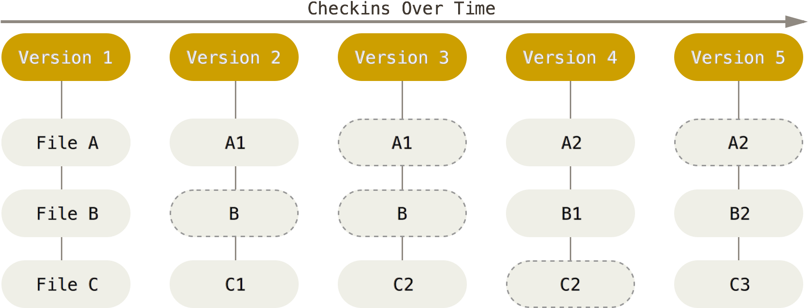
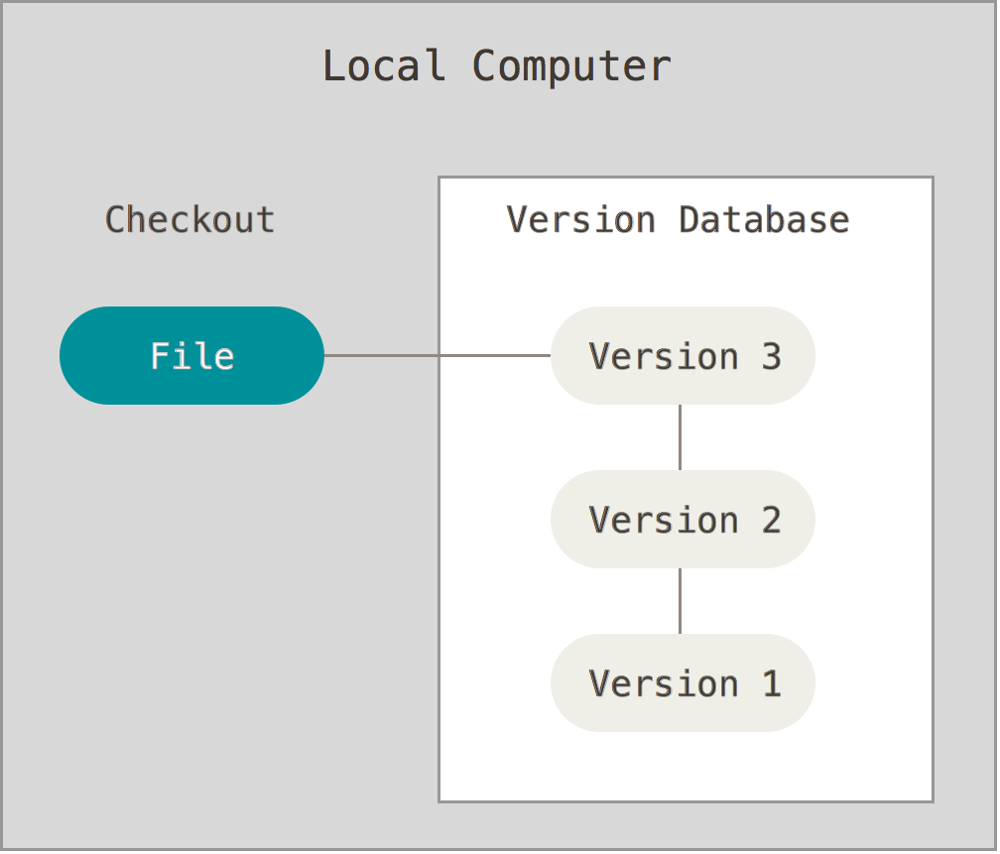
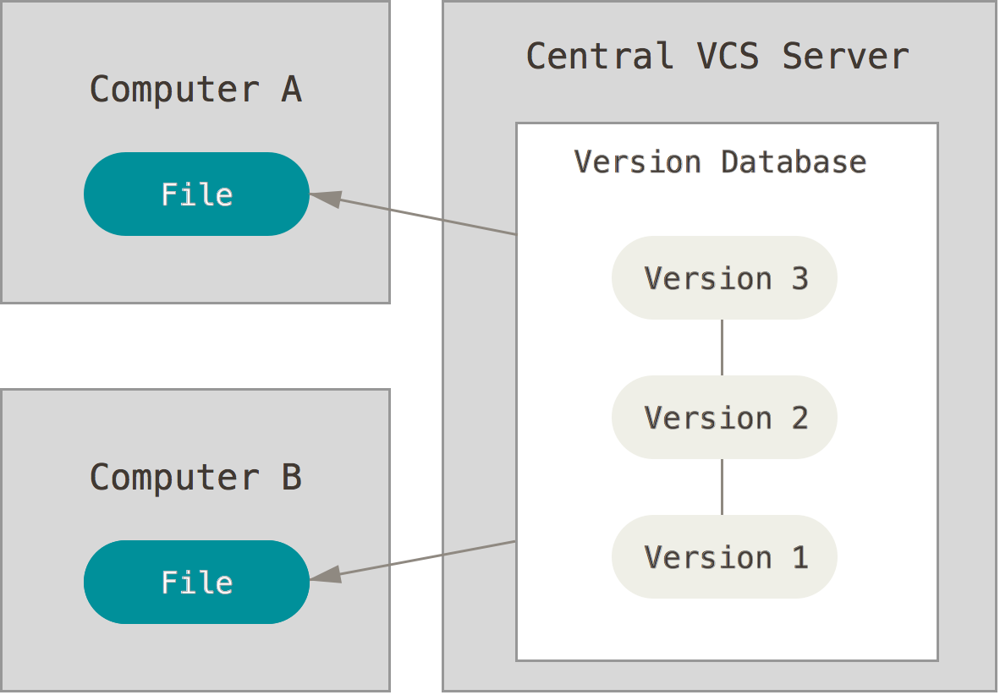
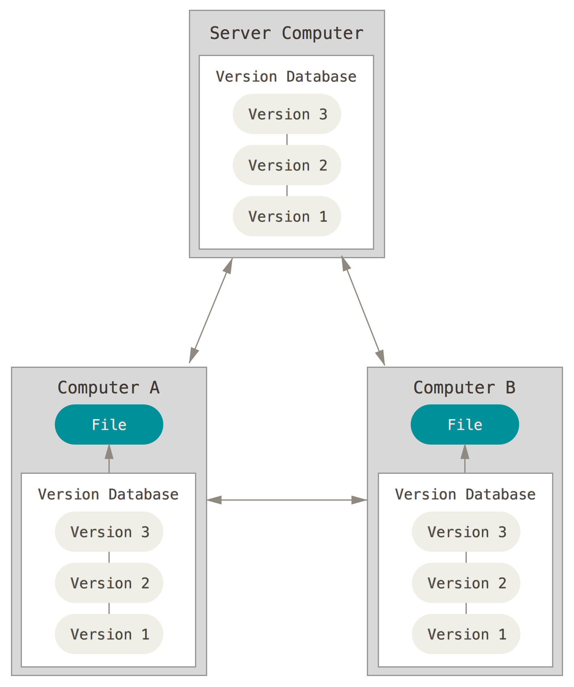
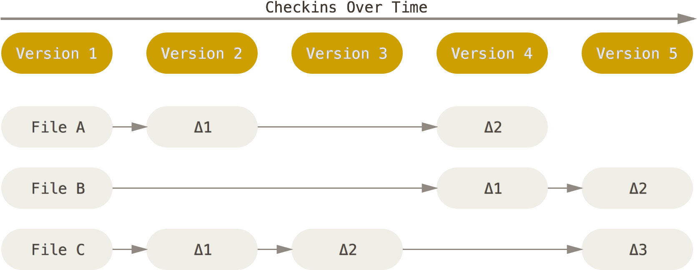

Learn the basics of [Git][git], one of the most popular distributed version
control systems. This is a condensed version of the first chapters of the [Git
Book][pro-git], which you should read if you want more detailed information on
the subject.

**You will need**

- A Unix CLI

**Recommended reading**

- [Command line]()

## Git and the command line

There are a lot of different ways to use Git: the original **command line
tools** and various **GUIs** of varying capabilities. But the command line is
the only place you can run **all** Git commands with all their options.

If you know how to run the command line version, you can easily figure out how
to use the GUI version, while the opposite is not necessarily true. So the
**command line** is what we will use.

## How Git stores your project

Git stores your project as a series of **snapshots**. Each time you commit, it
records what **all** your files look like at that moment, not just the changes
you made.



A snapshot is made of two kinds of objects:

- A **blob** is the content of one file.
- A **tree** is the listing of one directory: the name of each file in it, with
  the blob holding its content, and the name of each subdirectory, with the tree
  listing it in turn.

For example, here are the trees and blobs of a project with two files, `README`
and `Rakefile`, and a `lib` directory containing one more file,
`simplegit.rb`:


A **commit** points to the tree of your project's root directory, which is how
it holds the whole project. It also records its author, its date, a message, and
its **parent**: the commit that came before it. That chain of parents is your
project's history.

Every object, whether commit, tree or blob, is named by a **hash** of its
content: a long string of letters and digits, computed by a [cryptographic hash
function][cryptographic-hash-function] (SHA-1). The same content always gives
the same hash, and any change to it gives a different one. This has three
consequences:

- **A file that has not changed is not stored again.** Its content still has the
  same hash, so the new tree simply points to the blob that already exists. A
  snapshot of the whole project only costs the files that changed.
- **A commit cannot be changed.** Changing anything in it, even a single letter
  of its message, gives a different hash, and therefore a different commit.
- **Git notices when data is corrupted.** If stored content no longer matches
  its hash, Git knows it has been damaged.



It is sometimes said that Git is just a content-addressable file system: it
mostly just stores objects, named by the hash of their content. If you are
curious, `git cat-file -p` shows the content of any object. Here is a commit:

```bash
$> git cat-file -p 5233289
tree 9d8b9c81fd3a780a1ada92e68b8ffaffd4dbd5cf
parent af8051aa78016f10f1e0775ab9282d61a0862ffd
author John Doe <john.doe@example.com> 1486906554 +0100
committer John Doe <john.doe@example.com> 1486906554 +0100

Comment add function
```

Here's the tree it points to:

```bash
$> git cat-file -p 9d8b9c81
100644 blob 020333cd4ff6b5d4156215dc7df36210df3ae824    addition.js
100644 blob c7add86fef91e20012654afc2a32ea315f59cd8b    calculations.js
100644 blob cd558f6317227223c201057db00709eabb9bf9e7    index.html
100644 blob 1ef27915edde8b6afa1936b3db1d9c11d8ac85ba    subtraction.js
```

To learn more, read [Git Internals - Git Objects][git-objects] in the Pro Git
book.



## The basic Git commands

This section is a written version of the demonstration in the slides: the
commands you will use every day, what they do, and the options you will need
most often. You can practise all of them in [Hello Git][hello-git].

A few words come back throughout:

- A **repository** is your project together with its whole history. Git keeps
  that history in a hidden `.git` directory at the root of the project, the
  **Git directory**.
- A **commit** is a [snapshot](#how-git-stores-your-project) of your whole
  project at a particular moment in time, also often called a **version**.
  Think of it as a save point.
- The **working directory** (or **working tree**) is the files you see and
  edit: one version of the project, taken out of the repository for you to work
  on.
- The **staging area** (or **index**) is where you prepare the next commit: the
  changes you have put there are the ones the next commit will save.
- A **branch** is a named line of work. Technically, it is only a label that
  points to a commit, and moves forward each time you commit on it.
- **`HEAD`** is Git's "you are here" marker: it says which branch you are
  currently on.

### `git config`: set up Git

`git config` reads and changes Git's settings. You need it mostly once, on each
new computer, to tell Git who you are. Every commit records the name and e-mail
address of its author, and they are part of the commit forever: set them before
your first commit.

```bash
$> git config --global user.name "John Doe"
$> git config --global user.email john.doe@example.com
```

With `--global`, a setting applies to all your repositories on this computer,
and is saved in the `~/.gitconfig` file in your home directory. Without it, it
applies only to the repository you are in.

To check a setting, give only its name. `git config --list` shows all of them:

```bash
$> git config user.name
John Doe
```

### `git init`: create a new repository

`git init` turns the current directory into a new, empty Git repository. It
creates the Git directory (`.git`), where Git will store the history. Your files
are not touched, and none of them is part of the repository yet: Git only starts
tracking a file when you [add](#git-add-prepare-the-next-commit) it.

```bash
$> cd /path/to/projects/my-project
$> git init
Initialized empty Git repository in /path/to/projects/my-project/.git/
```

Use it once, when you start a new project from scratch. `git init my-project`
creates the `my-project` directory and the repository inside it in one go.



Make sure you are **not already inside a repository** before running `git init`.
Git looks for a repository in the current directory and in all its parents, so
running `git init` in a subdirectory of a project creates a second repository
nested inside the first, which is almost never what you want. Run `git status`
first: outside of any repository, it fails with `fatal: not a git repository`,
which is what you want in this case.

Also be careful to never run `git init` in your home directory, or any other
directory that contains other projects. It would make all of them part of the
same repository, which is almost never what you want.



### `git clone`: get an existing repository

Where `git init` starts a new, empty history, `git clone` gets a copy of a
repository that already exists, usually on a server such as GitHub:

```bash
$> cd /path/to/projects
$> git clone https://github.com/ArchiDep/git-branching-ex.git
Cloning into 'git-branching-ex'...
```

This creates a `git-branching-ex` directory containing the **whole** repository
— every commit of its history, not only the latest version — and fills its
working directory with the files of the default branch, ready to work on.
`git clone <url> <directory>` puts it in a directory with a name of your choice.

The copy remembers where it came from, under the name `origin`. You will see what
that means when you learn to collaborate with Git.

### `git status`: see where you are

`git status` tells you which branch you are on, and how your files differ from
the last commit. It sorts your changes into three groups:

- **Changes to be committed**: changes in the staging area, which the next
  commit will save.
- **Changes not staged for commit**: files you have modified since the last
  commit, but have not added to the staging area. The next commit will not
  include these changes.
- **Untracked files**: new files that Git does not track yet.

```bash
$> git status
On branch sub
Changes not staged for commit:
  (use "git add <file>..." to update what will be committed)
  (use "git restore <file>..." to discard changes in working directory)
        modified:   subtraction.js

no changes added to commit (use "git add" and/or "git commit -a")
```

When everything is committed, it says `nothing to commit, working tree clean`.

`git status` changes nothing, so you can run it as often as you like. Read it
after every step: it is how you check that a command did what you expected. It
also suggests the commands you are likely to need next, in parentheses.

### `git add`: prepare the next commit

`git add` puts a snapshot of a file, as it is right now, into the staging area.
Think of the staging area as a loading dock: you gather there what you want to
ship, and the commit ships everything on the dock at once.

```bash
$> git add subtraction.js   # one file
$> git add src              # everything in a directory
$> git add .                # everything in the current directory
```

Adding a new file also tells Git to start tracking it. Adding a deleted file
stages its deletion.

`git add` stages the file **as it is when you run it**. If you modify the file
again afterwards, the new change is not staged: `git status` then lists the file
both under "Changes to be committed" and under "Changes not staged for commit",
and you have to add it again to include the new change.

`git add .` is convenient because it stages everything in the current directory
and its subdirectories in one go, but it adds everything, including files you
might not want in your repository. Check with `git status` before you commit.

### `git diff`: see exactly what changed

`git status` tells you **which** files changed; `git diff` shows you **what**
changed in them, line by line. Without options, it shows the changes you have
**not staged** yet: the differences between your working directory and the
staging area.

```bash
$> git diff
diff --git a/subtraction.js b/subtraction.js
index 1ef2791..612b196 100644
--- a/subtraction.js
+++ b/subtraction.js
@@ -1,5 +1,5 @@
 function subtract(a, b) {
-  return '?';
+  return a - b;
 }

 calculate('subtraction', subtract);
```

Lines starting with `-` were removed, and lines starting with `+` were added. A
modified line shows up as both: its old version removed, its new version added.
The other lines are unchanged, and only shown to give you some context.

Once you have staged a change with `git add`, `git diff` no longer shows it. Use
the `--cached` option (or `--staged`, which is the same) to see the changes that
are **staged**, the ones the next commit will save:

```bash
$> git diff            # what you changed but have not staged
$> git diff --cached   # what you have staged, and will commit
```

Together, the two show you each of the three areas at work. Run
`git diff --cached` before committing, to check that the commit contains what
you meant, and nothing else.

`git diff` can also compare any two versions of your project, for example two
branches: `git diff main sub`. When the output is longer than your terminal, use
the arrow keys to scroll and press `q` to quit.

### `git commit`: save a snapshot

`git commit` saves everything in the staging area as a new **commit**: a
snapshot of your whole project, with your name, the date, and a message
describing the change. The new commit points to the previous one, its
**parent**: that chain of commits is your project's history. The current branch
moves forward to point to the new commit.

```bash
$> git commit -m "Implement subtraction"
[sub 712ff2] Implement subtraction
 1 file changed, 1 insertion(+), 1 deletion(-)
```

The new commit is named by its [hash](#how-git-stores-your-project), such as
`712ff2c…`. Git often shows only its first few characters.

The options you will use most:

- `-m "message"` gives the commit message on the command line. Without it, Git
  opens your editor for you to write the message.

  If that editor is Vim and you do not know how to use it, press `Esc`, then
  type `:q!` and press `Enter`: the message stays empty, so Git cancels the
  commit. See [setting nano as the default editor](#setting-nano-as-the-default-editor).

- `-a` stages every modified file before committing, so that you can skip
  `git add`. It only includes files Git already tracks: new files still have to
  be added with `git add`.

To change the last commit after the fact, see [undoing
things](#undoing-things).

### `git log`: look at the history

`git log` lists the commits of the current branch, newest first, with their
hash, author, date and message.

```bash
$> git log
commit 712ff2c...
Author: John Doe <john.doe@example.com>
Date:   Thu Oct 1 10:12:34 2026 +0200

    Implement subtraction
...
```

When the history is longer than your terminal, Git shows it one screen at a
time: use the arrow keys to scroll, and press `q` to quit.

Useful options:

- `--oneline` shows one commit per line, with a short hash.
- `--graph` draws the branches and merges on the left.
- `--all` shows the commits of all branches, not only the current one.
- `--patch` (or `-p`) shows the changes made by each commit.
- `-n 5` (or `-5`) shows only the last 5 commits.

Together, `git log --oneline --graph --all` draws the whole commit graph of the
repository. The slides define it as an alias, `git graph`:

```bash
$> git config --global alias.graph "log --oneline --decorate --graph --all"
$> git graph
* 712ff2 (HEAD -> sub) Implement subtraction
* 4f94fa (main) Improve layout
...
```

### `git branch`: list, create and delete branches

A branch is a separate line of work: you can make commits on it without
affecting the others. Technically, it is only a **pointer to a commit**, which
is why creating one is instant and costs nothing.

```bash
$> git branch             # list the branches; * marks the current one
$> git branch sub         # create a branch pointing to the current commit
$> git branch -d sub      # delete a branch
$> git branch -m old new  # rename a branch
```

Creating a branch does **not** switch to it: you are still on the same branch
as before. Use [`git switch`](#git-switch-move-between-branches) for that.

Deleting a branch only deletes the pointer, not the commits. `-d` refuses to
delete a branch whose commits are not part of the current branch's history,
because you would then have no easy way to find them again. `-D` deletes it
anyway (see [undoing things](#undoing-things)).

### `git switch`: move between branches

`git switch` makes another branch the current one. It does two things:

- It moves `HEAD` to point to that branch.
- It rewrites the files in your working directory to match the snapshot of the
  commit that branch points to.

In other words, it takes you to another version of your project. Your work on
the branch you leave is not lost: it is safely stored in its commits, and you
can switch back to it at any time.

```bash
$> git switch main             # switch to an existing branch
$> git switch -c fix-add       # create a new branch and switch to it
$> git switch -                # switch back to the previous branch
```

Switch from a clean state, when `git status` says there is nothing to commit. If
you have uncommitted changes that switching would overwrite, Git refuses to
switch rather than lose them: commit them first, or discard them.

`git checkout` is the older command for the same thing, and you will find it
in a lot of documentation: `git checkout main` switches to `main`, and
`git checkout -b fix-add` creates and switches to `fix-add`. `git switch` was
added to Git because `git checkout` does many other things as well.

### `git merge`: bring the work of a branch into another

`git merge` brings the changes of another branch into the **current** branch.
To bring `fix-add` into `main`, you first switch to `main`, then merge:

```bash
$> git switch main
$> git merge fix-add
```

Depending on the history, Git merges in one of two ways:

- **Fast-forward**: if the current branch has not moved since the other branch
  was created, the other branch is simply ahead of it. Git only has to move the
  current branch forward to the same commit. No new commit is created.
- **Three-way merge**: if both branches have new commits, their histories have
  diverged. Git compares the two latest commits with their **common ancestor**
  (the last commit they share), combines the changes made on both sides, and
  saves the result as a new **merge commit**. A merge commit is special in that
  it has two parents, one on each branch.

A merge commit needs a message, so Git opens your editor with one it has written
for you. In Vim, press `Esc`, then type `:q!` and press `Enter` to keep Git's
message and finish the merge. As with `git commit`, you can instead give the
message on the command line with the `-m` option, and Git will not open the
editor:

```bash
$> git merge -m "Merge the subtraction feature" sub
```

If both branches changed the same lines of the same file, Git cannot choose
between the two versions on its own, and stops with a **merge conflict**. You
will learn to resolve conflicts when you learn to collaborate with Git. Until
then, `git merge --abort` cancels a merge and puts everything back as it was
before.

Once a branch is merged, you can delete it with `git branch -d`: all its commits
are now part of the history of the branch you merged it into.

## Undoing things

Once something is committed, Git keeps it, and most mistakes can be fixed. But a
few commands **throw work away for good**, or **rewrite history**. Know which
ones they are, and read `git status` before you run them.

### Unstaging a file: `git restore --staged`

If you have staged a change you do not want in the next commit, take it out of
the staging area:

```bash
$> git restore --staged subtraction.js
```

This is the opposite of `git add`, and it is safe: the change stays in the file
in your working directory. It is only no longer staged.

### Discarding changes: `git restore`

If you have modified a file and want to throw the changes away, put the file
back as it was:

```bash
$> git restore subtraction.js
```



This command is **destructive**. The file goes back to its staged version, or to
its last committed version if nothing is staged. Changes that were never
committed are not stored anywhere else in Git, so they are **lost forever**.



### Changing the last commit: `git commit --amend`

If you notice a mistake right after committing, such as a typo in the message
or a forgotten file, you can replace the last commit with a corrected one:

```bash
$> git commit -m "Impement sbtraction"            # oops, fat fingers
$> git commit --amend -m "Implement subtraction"  # fix the message

$> git add forgotten.js
$> git commit --amend                               # add a forgotten file
```



This command **rewrites history**. The corrected commit is a new commit, with a
different hash, which replaces the old one on the current branch. That is
harmless as long as the commit exists only on your machine, but **do not amend a
commit you have already shared** with others: their copy of the history would no
longer match yours.



### Deleting an unmerged branch: `git branch -D`

`git branch -d` refuses to delete a branch whose commits are not part of the
current branch's history. `git branch -D` deletes it anyway.



Although the commits are not destroyed immediately, no branch leads to them any
more, so for practical purposes they are **lost**. Only use it on work you
really want to throw away.





To retrieve a branch you deleted by mistake, use `git reflog` to find the hash
of its last commit, then create a new branch pointing to it: `git branch <name>
<hash>`. But you can only do that as long as Git has not cleaned up the commit,
which it does automatically after a few weeks.



## Best practices

- [**Commit early and often, perfect later** (Seth
  Robertson)](https://sethrobertson.github.io/GitBestPractices/)

  Git only takes full responsibility for your data when you commit. If you fail
  to commit and then do something poorly thought out, you can run into trouble.
  Additionally, having periodic checkpoints means that you can understand how
  you broke something.

- [**Writing a good commit message**
  (GitKraken)](https://www.gitkraken.com/learn/git/best-practices/git-commit-message)

  If by taking a quick look at previous commit messages, you can discern what
  each commit does and why the change was made, you’re on the right track. But
  if your commit messages are confusing or disorganized, then you can help your
  future self and your team by improving your commit message practices with help
  from this article.

- [**Conventional Commits**](https://www.conventionalcommits.org)

  If you want to go further, look at _Conventional Commits_, a specification for
  adding human and machine readable meaning to commit messages.

## Appendix: a short history of version control

Git was not the first version control system. It belongs to the third of three
generations, each of which answered the limits of the one before.

### Local version control systems (1980s)

The simplest way to keep old versions of your files is to **copy them manually**
into other directories. The [**R**evision **C**ontrol **S**ystem (RCS)][rcs],
first released in 1982, automated this process on your own machine.



It is still easy to **accidentally edit the wrong files**, and **hard to
collaborate** on different versions with other people.

### Centralized version control systems (1990s)

Centralized version control systems are based on a **single central server**
that keeps all the versioned files. [**C**oncurrent **V**ersion **S**ystems
(CVS)][cvs] and [**S**ub**v**ersio**n** (SVN)][svn] are such systems, first
released in 1990 and 2000 respectively.



Administrators have **fine-grained control** over who can do what. But many
operations need the network, which makes them **slow**; the server is a
**single point of failure**; and the history **can be lost** if it has no
backups.

You could also consider storing your files in a shared Dropbox, Google Drive,
etc. to be a kind of centralized version control system. However, it doesn't
have as many tools for **consulting and manipulating the history** of your
project, or to **collaborate on source code**.

### Distributed version control systems (2000+)

Systems such as [Git][git] and [Mercurial][mercurial], both first released in
2005, are **distributed**. Each client **fully mirrors** the repository: the
whole history, not just the latest snapshot.



Because Git stores all versions of all files **locally**, most operations are
almost instantaneous and do not need a connection to a server:

- Browsing the history
- Checking a file's changes from a month ago
- Committing

Basically any collaborative workflow is possible, since the team can organize
itself however it wants (see [distributed workflows][distributed-workflows]).
Administrators still control their servers, but not their collaborators'
machines.

### Snapshots, not differences

Most earlier systems, such as Subversion, store each file as its first version
followed by the list of **changes** (or deltas) made to it over time.



Git stores its data as **snapshots** instead. Every time you commit, it takes a
picture of what all your files look like at that moment and stores a reference
to that snapshot. To be efficient, **if a file has not changed, Git does not
store it again**, just a link to the identical file it has already stored.


---

_The figures of snapshots, deltas, trees and blobs, and version control systems
on this page come from [Pro Git][pro-git], by Scott Chacon and Ben Straub,
licensed under [CC BY-NC-SA 3.0][cc-by-nc-sa-3]._

[cc-by-nc-sa-3]: https://creativecommons.org/licenses/by-nc-sa/3.0/
[cryptographic-hash-function]: https://en.wikipedia.org/wiki/Cryptographic_hash_function
[cvs]: https://en.wikipedia.org/wiki/Concurrent_Versions_System
[distributed-workflows]: https://git-scm.com/book/en/v2/Distributed-Git-Distributed-Workflows
[git]: https://git-scm.com/
[git-objects]: https://git-scm.com/book/en/v2/Git-Internals-Git-Objects

[hello-git]: 
[mercurial]: https://www.mercurial-scm.org/
[pro-git]: https://git-scm.com/book/en/v2
[rcs]: https://en.wikipedia.org/wiki/Revision_Control_System
[svn]: https://subversion.apache.org/
