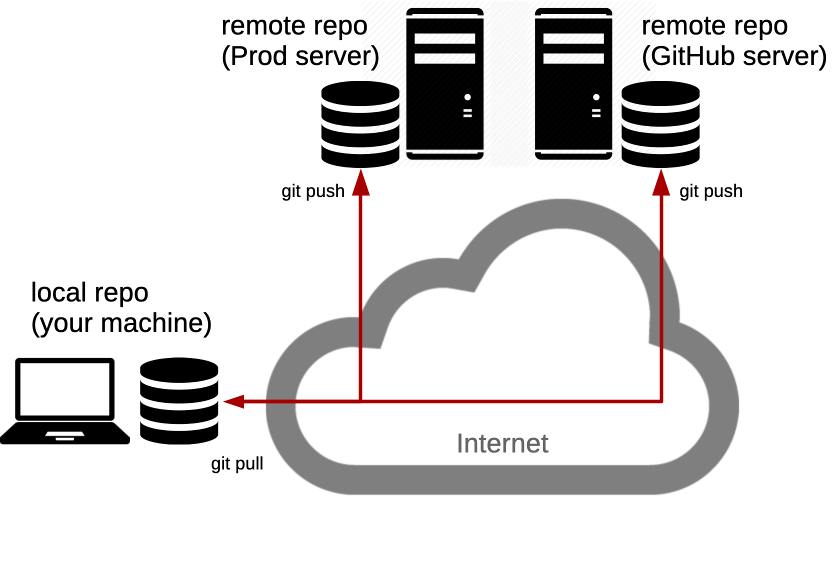

# {{ page.title }}

Architecture & Deployment <!-- .element: class="subtitle" -->

**Notes:**

Learn how to share your work with [Git][git], through remote repositories on
[GitHub][github], and what to do when someone else's work gets there first.

These slides go on from where [the Git slides]() end: in the calculator repository, on
`main`, with the merge commit. The team repository they push to belongs to the
course, so you cannot push to it yourself. You will do all of this with your
own group in [Guess It]().

**Recommended reading**

- [Version Control with Git]()
- [Collaborating with Git]()

---

## What is a remote?



**Notes:**

A **remote** is another copy of your repository, usually on a server. It holds
the whole commit graph, not only the latest version of your files. Every copy
holds everything: this is what makes Git a **distributed** version control
system. No copy is more important than another, except by agreement.

You can have **several remotes**. Collaborating with others means **pushing**
your commits to a remote, and **fetching** theirs from it, whenever you want to
share work. Nothing is shared until you do.

---

## GitHub

<!-- .element: class="hidden" -->


[GitHub][github] is a place to keep copies of your repositories.

**Notes:**

GitHub hosts Git repositories on its servers, so that you and others can push
to them and fetch from them. It adds features Git does not have, like access
control, issues and pull requests, but the repositories themselves are ordinary
Git repositories.

When you create a repository on GitHub to push an existing project to it,
create it **without** a README, a license or a `.gitignore` file. Any of them
makes a first commit on GitHub, and your first push is then refused, for the
reason you will see later in these slides.

---

### Where we left off

<simgit-story name='branching' start-chapter='delete-sub' end-chapter='delete-sub' sizing='auto-height' theme='light' commit-representation='below' duration='1200' defer-until-visible='true' replay-on-revisit='true' controls='false'></simgit-story>

**Notes:**

These slides go on from where the Git slides end: in the calculator repository,
on `main`, with the merge commit of `sub`. The repository has no remote: the Git
slides removed the one `git clone` had added.

---

### Add a remote

```bash
$> git remote add origin git@github.com:jdoe/git-calculator.git

$> git remote -v
origin  git@github.com:jdoe/git-calculator.git (fetch)
origin  git@github.com:jdoe/git-calculator.git (push)
```

**Notes:**

The repository just created on GitHub is **empty**. `git remote add` gives your
repository the name and the address of a remote: nothing is sent yet.

`origin` is only a **conventional name**, the one `git clone` gives the remote
it cloned from. The Git slides removed that remote with `git remote rm origin`
after cloning, so the name is free again.

The address is the SSH URL GitHub shows for the repository. Git connects to
GitHub with SSH, and authenticates you with your SSH key.

---

### Push

```bash
$> git push -u origin main
...
To github.com:jdoe/git-calculator.git
 * [new branch]      main -> main
branch 'main' set up to track 'origin/main'.
```

**Notes:**

`git push origin main` sends the commit your `main` points to, with every
commit behind it that the remote does not have yet, to the remote named
`origin`, and asks it to move its own `main` there. GitHub had no `main` yet, so
it creates one: `[new branch]`.

The commits are now on GitHub: its page for the repository shows the same
commits, with the same hashes.

`-u` (`--set-upstream`) makes `origin/main` the **upstream** of your `main`: the
branch `git status` compares it to, and the one `git push` and `git pull`
without arguments use. You only need it for the first push of a branch.

---

### After the push

<!-- .element: class="hidden" -->

<!-- .slide: class="full-diagram" -->

<simgit-story name='collaborating' start-chapter='origin-add' end-chapter='origin-push' through-chapter='origin-push' sizing='explicit' theme='light' commit-representation='below' duration='1200' defer-until-visible='true' replay-on-revisit='true'></simgit-story>

**Notes:**

The push copied your commits to GitHub, where `main` now points to the same
commit as yours. In your repository, `origin/main` records where it is.

---

### Remote-tracking branches

```bash
$> git graph
*   e0711c3 (HEAD -> main, origin/main) Merge branch 'sub'
|\
| * 7f2a5d0 Implement subtraction
* | a4160d7 Fix addition
|/
* 907e519 Add readme
* 24bb77c Add license
* 073570e Initial commit

$> git status
On branch main
Your branch is up to date with 'origin/main'.
```

**Notes:**

`origin/main` is a **remote-tracking branch**: your record of where `main` was
on `origin` the last time your Git talked to it. It is **not a live view**. If
someone else pushes to `origin`, your `origin/main` does not move until you
fetch.

You never commit on a remote-tracking branch yourself. Git moves it when you
push, fetch or pull.

So "up to date with 'origin/main'" only means that your `main` and your record
of `origin`'s `main` point to the same commit. It says nothing of what happened
on GitHub since.

---

### Your team's repository

Don't forget to share your work with [the
team](https://github.com/ArchiDep/git-calculator-team):

```bash
$> git remote add team \
   git@github.com:ArchiDep/git-calculator-team.git
```

**Notes:**

A repository can have as many remotes as you want, each under its own name. This
one is called `team`, and could be a company repository, for example.

---

### Differences in the team repository

<!-- .element: class="hidden" -->

<!-- .slide: class="full-diagram" -->

<simgit-story name='collaboratingTeamBeforeFetch' start-chapter='team-add' end-chapter='team-add' through-chapter='padding' sizing='explicit' theme='light' commit-representation='below' duration='1200' defer-until-visible='true' replay-on-revisit='true' controls='false'></simgit-story>

**Notes:**

The team's repository started from the same first three commits as yours. Since
then, a colleague has pushed a commit to it, `9dcba66`, which you do not have.
Your `main` has moved on too, with the subtraction and the addition fix.

---

### Push to the team

Same command, different remote: will it work?

```bash
$> git push team main
```

**Notes:**

This is the same command that just worked with `origin`, sent to the team's
repository instead.

---

### Push to the team

```bash
$> git push team main
To github.com:ArchiDep/git-calculator-team.git
 ! [rejected]        main -> main (fetch first)
error: failed to push some refs to
       'github.com:ArchiDep/git-calculator-team.git'
hint: Updates were rejected because the remote contains work
hint: that you do not have locally. This is usually caused by
hint: another repository pushing to the same ref. If you want
hint: to integrate the remote changes, use 'git pull' before
hint: pushing again.
```

**Notes:**

The push is **rejected**. Read the hint: the remote contains work that you do
not have locally.

The reason Git gives, `(fetch first)`, says that the team's `main` points to a
commit your repository does not know at all: the colleague's commit. Your Git
cannot even tell how it relates to your own commits. It has to get it first.

---

### Nothing moved

<!-- .element: class="hidden" -->

<!-- .slide: class="full-diagram" -->

<simgit-story name='collaboratingTeamBeforeFetch' start-chapter='team-rejected' end-chapter='team-rejected' through-chapter='padding' sizing='explicit' theme='light' commit-representation='below' duration='1200' defer-until-visible='true' replay-on-revisit='true' controls='false'></simgit-story>

**Notes:**

A rejected push changes **nothing**, on either side: not the team repository,
not your branches. Your repository does not even have a `team/main` yet, since
it has never fetched from `team`.

---

### Fetch

```bash
$> git fetch team
...
From github.com:ArchiDep/git-calculator-team
 * [new branch]      main       -> team/main
```

**Notes:**

`git fetch` downloads the commits of a remote that you do not have, and updates
your remote-tracking branches: here it creates `team/main`, pointing to the
colleague's commit.

The fetch changed **neither your `main` nor any of your files**. It only shows
you what the others have done.

---

### After the fetch

<!-- .element: class="hidden" -->

<!-- .slide: class="full-diagram" -->

<simgit-story name='collaboratingTeamFetched' start-chapter='team-rejected' end-chapter='team-fetch' through-chapter='padding' sizing='explicit' theme='light' commit-representation='below' duration='1200' defer-until-visible='true' replay-on-revisit='true'></simgit-story>

**Notes:**

The fetch brought the colleague's commit into your repository, and `team/main`
points to it. Your `main` has not moved.

Your history and the team's now start from the same commit, `907e519`, and each
adds different work to it. This is a **divergent history**, exactly like `sub`
and `fix-add` in the Git slides. `team/main` is a branch like the others, which
you can look at, compare to, and merge.

---

### The divergent history

```bash
$> git graph
*   e0711c3 (HEAD -> main, origin/main) Merge branch 'sub'
|\
| * 7f2a5d0 Implement subtraction
* | a4160d7 Fix addition
|/
| * 9dcba66 (team/main) Finish the calculator
|/
* 907e519 Add readme
* 24bb77c Add license
* 073570e Initial commit
```

**Notes:**

`git graph` shows the same thing as the diagram. Use `git log team/main` to
read the colleague's commit, and `git diff main team/main` to see everything
that differs between your `main` and theirs, before you merge anything.

---

### Push after fetching

Your Git knows the colleague's commit now. Will it work?

```bash
$> git push team main
```

**Notes:**

The fetch got the commit the first push was missing. Try again.

---

### Push after fetching

```bash
$> git push team main
To github.com:ArchiDep/git-calculator-team.git
 ! [rejected]        main -> main (non-fast-forward)
error: failed to push some refs to
       'github.com:ArchiDep/git-calculator-team.git'
hint: Updates were rejected because the tip of your current
hint: branch is behind its remote counterpart. If you want to
hint: integrate the remote changes, use 'git pull' before
hint: pushing again.
```

**Notes:**

Rejected again, for a different reason: `(non-fast-forward)`.

A remote only accepts a push that moves its branch **forward**, a
**fast-forward**. On the team's repository, `main` points to the colleague's
commit, `9dcba66`, which is not part of your `main`'s history: the two histories
have diverged. Moving the team's `main` to your commit would throw the
colleague's work away, so GitHub refuses.

Knowing about the colleague's commit is not enough: your `main` has to
**include** it. That is what a merge does.

---

### Merge

Can this one fast-forward?

```bash
$> git merge team/main
```

**Notes:**

No: the histories have diverged, so Git has to do a **three-way merge**, as it
did with `sub`.

---

### Before the merge

<!-- .element: class="hidden" -->

<!-- .slide: class="full-diagram" -->

<simgit-story name='collaboratingTeamFetched' start-chapter='team-fetch' end-chapter='team-fetch' through-chapter='padding' sizing='explicit' theme='light' commit-representation='below' duration='1200' defer-until-visible='true' replay-on-revisit='true' controls='false'></simgit-story>

**Notes:**

Moving your `main` to the colleague's commit, `9dcba66`, would lose your own
commits since `907e519`: the subtraction, the addition fix and their merge. A
fast-forward is not possible.

---

### Merge

```bash
$> git merge team/main
Auto-merging subtraction.js
CONFLICT (content): Merge conflict in subtraction.js
Automatic merge failed; fix conflicts and then commit the result.
```

**Notes:**

This time, Git cannot finish on its own. The colleague also implemented the
subtraction, on the same line of `subtraction.js` as you, but differently. Git
cannot choose between the two versions, so it stops in the middle of the merge
and leaves the choice to you. This is a **merge conflict**.

---

### A merge in progress

```bash
$> git status
On branch main
Your branch is up to date with 'origin/main'.

You have unmerged paths.
  (fix conflicts and run "git commit")
  (use "git merge --abort" to abort the merge)

Changes to be committed:
        modified:   index.html

Unmerged paths:
  (use "git add <file>..." to mark resolution)
        both modified:   subtraction.js
```

**Notes:**

`git status` shows where the merge stands:

- **`index.html` is already staged.** The colleague also changed the title of
  the page, a line you did not touch, so Git merged that change on its own.
- **`subtraction.js` is "both modified"**: you and the colleague changed the
  same line, and it is in conflict.

A conflict is about **lines**, not whole files: Git merges everything it can,
and only stops on the lines that both sides changed.

"Up to date with 'origin/main'" is about the other remote, `origin`, as far as
your last push to it knows. It has nothing to do with the merge in progress.

If you want to give up, `git merge --abort` puts everything back as it was
before the merge.

---

### Conflict markers

```js
/**
 * Takes two numbers, a and b, and returns their subtraction.
 */
function subtract(a, b) {
<<<<<<< HEAD
  return a - b;
=======
  return -b + a;
>>>>>>> team/main
}

calculate('subtraction', subtract);
```

**Notes:**

Git has written **both versions** of the conflicting lines into the file,
between **conflict markers**:

- Between `<<<<<<< HEAD` and `=======` is **your** version, the one of the
  branch you are on.
- Between `=======` and `>>>>>>> team/main` is **theirs**, the one of the
  branch you are merging.

Only the line both of you changed is in conflict. The rest of the file is
already merged.

**Choosing is your job**: keep one version, the other, or write a third that
combines them, then **remove the markers**. Git does not check that the result
makes sense. Test it before you go on.

---

### Resolve the conflict

```js
/**
 * Takes two numbers, a and b, and returns their subtraction.
 */
function subtract(a, b) {
  return a - b;
}

calculate('subtraction', subtract);
```

```bash
$> git add subtraction.js

$> git status
On branch main
Your branch is up to date with 'origin/main'.

All conflicts fixed but you are still merging.
  (use "git commit" to conclude merge)
```

**Notes:**

Both versions compute the same thing, so keeping yours is enough. Once the file
is as it should be, `git add` marks the conflict as **resolved**: it stages the
file as you want it in the merge commit.

---

### Finish the merge

```bash
$> git commit -m "Merge team's work"
[main a92ed4f] Merge team's work
```

**Notes:**

The commit concludes the merge. `--message` or `-m` sets the commit message,
instead of opening your editor.

As with `sub`, this is a **merge commit** with two parents: `e0711c3`, the commit
you were on, and `9dcba66`, the colleague's commit. Your `main` now contains both
your work and theirs.

---

### The merge commit

<!-- .element: class="hidden" -->

<!-- .slide: class="full-diagram" -->

<simgit-story name='collaboratingTeam' start-chapter='team-fetch' end-chapter='team-merge' through-chapter='team-push' sizing='explicit' theme='light' commit-representation='below' duration='1200' defer-until-visible='true' replay-on-revisit='true'></simgit-story>

**Notes:**

The merge commit has two parents: `e0711c3`, the commit you were on, and
`9dcba66`, the colleague's commit. Your `main` moved to it.

---

### Push the merge

Will it work now?

```bash
$> git push team main
```

**Notes:**

Your `main` now includes the colleague's commit.

---

### Push the merge

```bash
$> git push team main
...
To github.com:ArchiDep/git-calculator-team.git
   9dcba66..a92ed4f  main -> main
```

**Notes:**

Yes. Your merge commit has the colleague's commit as a parent, so moving the
team's `main` from `9dcba66` to `a92ed4f` only moves it forward: from the team
repository's point of view, it is a **fast-forward**.

`9dcba66..a92ed4f` is the move: from where the team's `main` was to where it is
now. The push also moved `team/main` in your repository.

---

### After pushing the merge

<!-- .element: class="hidden" -->

<!-- .slide: class="full-diagram" -->

<simgit-story name='collaboratingTeam' start-chapter='team-merge' end-chapter='team-push' sizing='explicit' theme='light' commit-representation='below' duration='1200' defer-until-visible='true' replay-on-revisit='true'></simgit-story>

**Notes:**

The team's `main` moved forward to your merge commit, and so did `team/main` in
your repository.

---

### Remotes do not sync

```bash
$> git status
On branch main
Your branch is ahead of 'origin/main' by 2 commits.
  (use "git push" to publish your local commits)
```

**Notes:**

Your repository on GitHub, `origin`, knows nothing about what happened with
`team`. It is still where your first push left it. Your `main` is 2 commits
ahead of it: the colleague's commit, and your merge commit.

**Git never synchronizes anything by itself.** Each repository only changes
when someone pushes to it, or fetches or pulls into it. Here, a `git push`
would bring `origin` up to date.

---

### Your repository on GitHub is behind

<!-- .element: class="hidden" -->

<!-- .slide: class="full-diagram" -->

<simgit-story name='collaborating' start-chapter='origin-behind' end-chapter='origin-behind' through-chapter='origin-padding' sizing='explicit' theme='light' commit-representation='below' duration='1200' defer-until-visible='true' replay-on-revisit='true' controls='false'></simgit-story>

**Notes:**

`origin/main`, and `main` on GitHub, are still where your first push left
them.

---

### `git pull`

```bash
$> git pull team main
```

is the same as:

```bash
$> git fetch team
$> git merge team/main
```

**Notes:**

`git pull` fetches, then merges what it fetched into the current branch. That is
exactly what you just did in two steps. Doing it in two steps lets you look at
what the others did before you merge it; `git pull` is the shortcut once you
know what to expect.

On a branch with an upstream, like `main` after `git push -u origin main`,
`git pull` without arguments fetches from and merges the upstream.

[git]: https://git-scm.com
[github]: https://github.com
