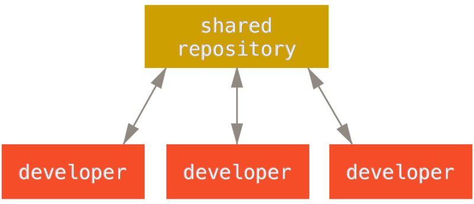
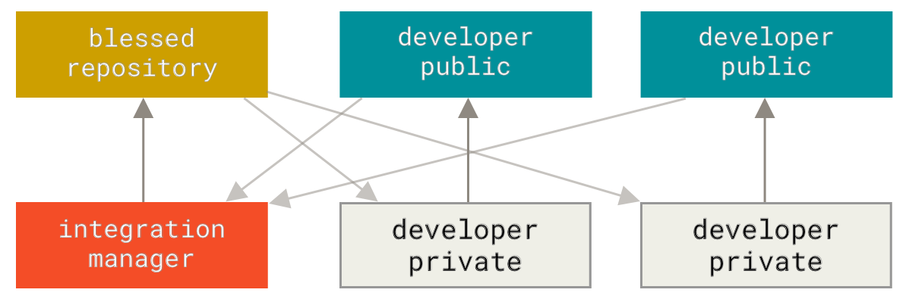
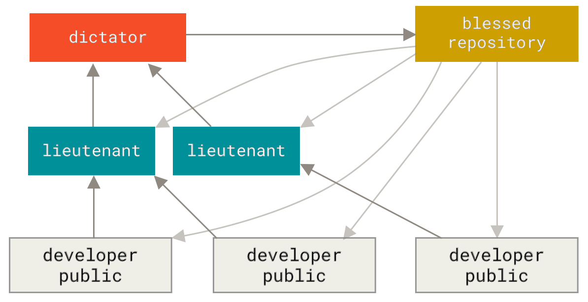

Share your work with [Git][git] through remote repositories, such as those on
[GitHub][github], and resolve the conflicts that come up when two people change
the same thing. This is a condensed version of the [Git Basics - Working with
Remotes][pro-git-remotes] and [Distributed Git][distributed-workflows] chapters of
the [Git Book][pro-git].

**You will need**

- [Git][git]
- A free [GitHub][github] account, with your SSH key
- A Unix CLI

**Recommended reading**

- [Version Control with Git]()

## Remotes

A **remote** is another copy of your repository, usually on a server. It holds
the whole commit graph, not only the latest version of your files. Every copy
holds everything: this is what makes Git a **distributed** version control
system. No copy is more important than another, except by agreement.

Collaborating means **pushing** your commits to a remote, and **fetching** the
commits others have pushed there. Git never does either by itself: nothing is
shared until you ask for it, and two remotes of the same repository know nothing
about each other.

[GitHub][github] is a service that hosts Git repositories, so that you and
others can push to them and fetch from them. It adds features Git does not have,
such as access control, issues and pull requests, but the repositories
themselves are ordinary Git repositories.

### `git remote`: name your remotes

A remote is known to your repository by a **name** and a **URL**:

```bash
$> git remote add origin git@github.com:jdoe/git-calculator.git  # add a remote
$> git remote -v                    # list the remotes and their URLs
$> git remote rename origin github  # rename a remote
$> git remote rm github             # remove a remote
```

`git clone` adds a remote named `origin`, pointing to the repository it cloned.
`origin` is only a **conventional name**: a repository can have as many remotes
as you want, each under a name of your choice.

Use the SSH URL GitHub shows for a repository, `git@github.com:<owner>/<repo>`.
Git connects to GitHub with SSH, and authenticates you with your SSH key.



When you create a repository on GitHub to push an existing project to it, create
it **without** a README, a license or a `.gitignore` file. Any of them makes a
first commit on GitHub, which your project does not have, and your first push is
then refused, as [described below](#a-rejected-push).



### `git push`: send your commits

`git push <remote> <branch>` sends the commit your branch points to, with every
commit behind it that the remote does not have yet, and asks the remote to move
its own branch there:

```bash
$> git push -u origin main
...
To github.com:jdoe/git-calculator.git
 * [new branch]      main -> main
branch 'main' set up to track 'origin/main'.
```

`-u` (`--set-upstream`) makes `origin/main` the **upstream** of your `main`: the
branch `git status` compares yours to, and the one `git push` and `git pull`
use when you give them no arguments. You only need it for the first push of a
branch.

#### A rejected push

A remote only accepts a push that moves its branch **forward**, a
**fast-forward**. If someone else has pushed commits you do not have, moving the
remote's branch to your commit would throw their work away, so the remote
refuses:

```bash
$> git push team main
To github.com:ArchiDep/git-calculator-team.git
 ! [rejected]        main -> main (fetch first)
error: failed to push some refs to 'github.com:ArchiDep/git-calculator-team.git'
hint: Updates were rejected because the remote contains work that you do not
hint: have locally. ...
```

The reason Git gives says why:

- **`(fetch first)`**: the remote's branch points to a commit your repository
  does not know at all. Fetch it.
- **`(non-fast-forward)`**: your repository knows that commit, but your branch
  does not include it, because the histories have diverged. Merge it.

A rejected push changes nothing, on either side. Fetch the others' commits and
merge them into your branch: your branch then contains their work, and pushing
it is a fast-forward again.

### Remote-tracking branches

Each time your Git talks to a remote, it records where the remote's branches
were, as **remote-tracking branches** named after the remote: `origin/main` is
your record of where `main` is on `origin`. `git graph` shows them next to your
own branches:

```bash
$> git graph
*   e0711c3 (HEAD -> main, origin/main) Merge branch 'sub'
...
```

A remote-tracking branch is **not a live view** of the remote. It only moves
when you push, fetch or pull. When `git status` says that your branch is "up to
date with 'origin/main'", it compares your branch to that record, not to what is
on the server now. You never commit on a remote-tracking branch yourself.

### `git fetch`: get the others' commits

`git fetch <remote>` downloads the commits of a remote that you do not have, and
moves your remote-tracking branches to where the remote's branches are:

```bash
$> git fetch team
...
From github.com:ArchiDep/git-calculator-team
 * [new branch]      main       -> team/main
```

A fetch changes **neither your branches nor your files**. It only lets you see
what the others have done, with `git graph`, `git log team/main` or
`git diff main team/main`, before you decide to merge it:

```bash
$> git merge team/main
```

Merging a remote-tracking branch works exactly like merging any other branch: a
fast-forward if your branch has no commits of its own, a three-way merge if the
histories have diverged.

### `git pull`: fetch and merge

`git pull` fetches, then merges what it fetched into the current branch.
`git pull team main` is the same as `git fetch team` followed by
`git merge team/main`. On a branch with an upstream, `git pull` without
arguments fetches from the upstream's remote and merges the upstream.

When the histories have diverged, Git needs to know how you want `git pull` to
reconcile them, and refuses to pull until you tell it. Merging, as `git merge`
does, is what this course uses: see [configure `git pull`](#everyone-configure-git-pull) in the Guess It
exercise.

Fetching and merging in two steps lets you look at what the others did before
you merge it. `git pull` is the shortcut once you know what to expect.

## Merge conflicts

A three-way merge combines the changes of both branches since their common
ancestor. When both branches changed the **same lines** of the same file
differently, Git cannot choose between the two versions, and stops in the middle
of the merge. This is a **merge conflict**:

```bash
$> git merge team/main
Auto-merging subtraction.js
CONFLICT (content): Merge conflict in subtraction.js
Automatic merge failed; fix conflicts and then commit the result.
```

A conflict is about lines, not whole files. Git merges everything it can, and
`git status` lists what is left: the files it merged on its own are already
staged, and the files in conflict are **unmerged**:

```bash
$> git status
On branch main
You have unmerged paths.
  (fix conflicts and run "git commit")
  (use "git merge --abort" to abort the merge)

Changes to be committed:
        modified:   index.html

Unmerged paths:
  (use "git add <file>..." to mark resolution)
        both modified:   subtraction.js
```

### Resolving a conflict

In each file in conflict, Git has written both versions of the conflicting
lines, between **conflict markers**:

```js
/**
 * Takes two numbers, a and b, and returns their subtraction.
 */
function subtract(a, b) {
<<<<<<< HEAD
  return a - b;
=======
  return -b + a;
>>>>>>> team/main
}
```

- Between `<<<<<<< HEAD` and `=======` is **your** version, the one of the
  branch you are on.
- Between `=======` and `>>>>>>> team/main` is **theirs**, the one of the branch
  you are merging.

To resolve the conflict:

1. **Edit the file** until it is what it should be: keep one version, the
   other, or write a third that combines them, and **remove the markers**. Git
   does not check that the result makes sense, so test it.
2. **Stage it** with `git add`, which marks the conflict as resolved.
3. When `git status` says that all conflicts are fixed, **commit**. The commit
   concludes the merge, with the two commits as parents. `git commit --no-edit`
   keeps the message Git generated.

At any point before that commit, `git merge --abort` gives up on the merge and
puts everything back as it was before it.

Conflicts are normal when several people work on the same code, and small ones
are easy to resolve. Pulling often, and committing small changes, keeps them
small.

## Distributed workflows

There are [many ways][distributed-workflows] to organize a team's work with Git.
They differ in who pushes to which repository, and who merges what.

_The figures of this section come from [Pro Git][pro-git], by Scott Chacon and
Ben Straub ([CC BY-NC-SA 3.0][cc-by-nc-sa-3])._

### Centralized workflow

Many teams use a simple **centralized workflow**:



- A **shared central repository** is hosted on a server such as GitHub.
- Each developer has a **repository on their own computer**, with the shared
  repository as a remote.
- Everyone pushes to the shared repository, and fetches or pulls the others'
  work from it.

This is the workflow of the [Guess It]() exercise.

### Integration manager workflow

The classic workflow of many open source projects:



- The **project maintainer pushes to their public repository**.
- **Contributors clone that repository**, make changes, **push to their own
  public copy** (a **fork** on GitHub), and ask the maintainer to merge their
  changes with a **pull request** on GitHub (or by email).
- The **maintainer merges the changes**, on GitHub or locally before pushing
  them to the main repository.

One of the main advantages of this approach is that you can continue to work,
and **the maintainer of the main repository can pull in your changes at any
time**. Contributors do not have to wait for the project to incorporate their
changes: each party can work at their own pace.

### Benevolent dictator workflow

A workflow for very large projects:



- Regular **developers work on their topic branch** and rebase their work on
  top of `main` in the reference repository.
- **Lieutenants merge the developers' topic branches** into their `main` branch.
- The **dictator merges the lieutenants' `main` branches** into the dictator's
  `main` branch.
- Finally, the **dictator pushes that `main` branch to the reference
  repository**, so that the other developers can rebase on it.

This kind of workflow is not common, but it can be useful in **very big
projects**, or in highly hierarchical environments. It allows the project
leader (the dictator) to delegate much of the work and collect large subsets of
code at multiple points before integrating them. The Linux kernel is developed
this way.

[cc-by-nc-sa-3]: https://creativecommons.org/licenses/by-nc-sa/3.0/
[distributed-workflows]: https://git-scm.com/book/en/v2/Distributed-Git-Distributed-Workflows
[git]: https://git-scm.com
[github]: https://github.com
[pro-git]: https://git-scm.com/book/en/v2
[pro-git-remotes]: https://git-scm.com/book/en/v2/Git-Basics-Working-with-Remotes
