# Cloud Computing

Architecture & Deployment <!-- .element: class="subtitle" -->

**Notes:**

Learn what cloud computing is and about the common service models available today.

**References:**

- [Advantages and Disadvantages of Virtual Server](https://www.esds.co.in/kb/advantages-and-disadvantages-of-virtual-server/)
- [Microservices in Practice][microservices-in-practice]

---

## Server-side

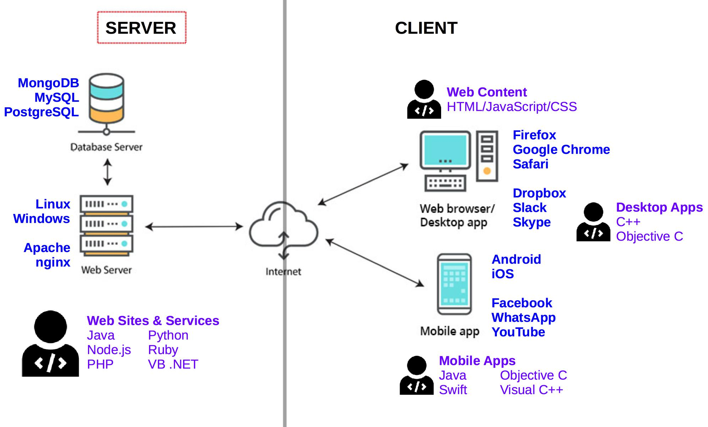

**Notes:**

In this course, we will focus on the **server-side** of the client-server model:
setting it up, deploying applications on it, and managing it. The server is the
computer that **provides content or services** to the client, which is the
computer that **requests content or services** from the server.

---

### Internet hosting

<!-- .element: class="hidden" -->

**Notes:**

Not every individual and organization has access to vast computer resources.
Some companies provide [Internet hosting][internet-hosting]: servers that can be
owned or leased by customers.

One common example is [web hosting][web-hosting], where server space is provided
to make websites accessible over the Internet.

---

#### Shared hosting

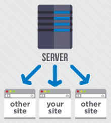

**Notes:**

With [**shared hosting**][shared-hosting], multiple websites (from a few to a
few hundred) are placed on the same server and **share a common pool of
resources** (e.g. CPU, RAM). This is the least expensive and least flexible
model.

---

#### Dedicated hosting

**Notes:**

With [**dedicated hosting**][dedicated-hosting], customers get full control over
their own **physical server(s)**. They are responsible for the security and
maintenance of the server(s). This offers the most flexibility and best
performance.

---

#### Virtual hosting & virtualization

  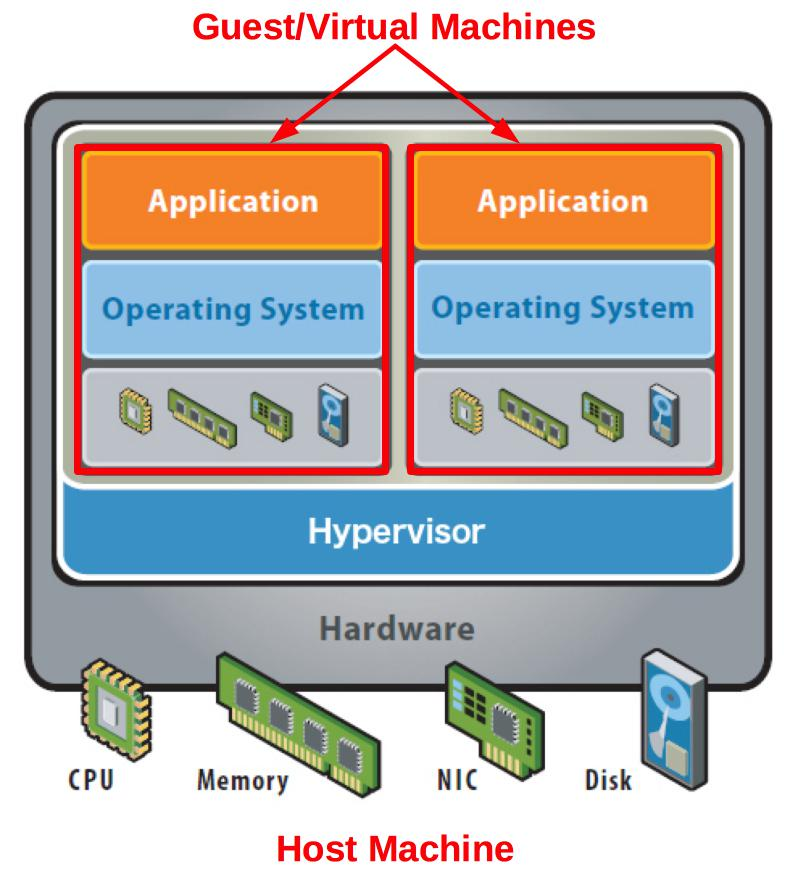
  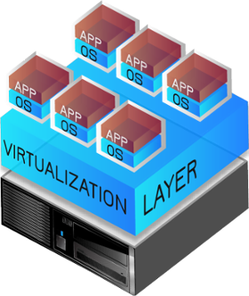

**Notes:**

With [**virtual hosting**][virtual-hosting], using
[virtualization][virtualization], physical server resources can be divided into
**virtual servers**. Customers gain full access to their own virtual space.

**Hardware [virtualization][virtualization]** refers to the creation of a
**virtual machine** that acts like a real computer with an operating system.

A [**hypervisor**][hypervisor] is installed on the **host machine**. It
virtualizes CPU, memory, network and storage.

A virtual machine, also called the **guest machine**, runs another operating
system **isolated** from the host machine.

For example, a computer running Microsoft Windows may host a virtual machine
running an Ubuntu Linux operating system. Ubuntu-based software can be run in
the virtual machine.

> Popular virtualization solutions: [KVM][kvm], [Parallels][parallels],
> [VirtualBox][virtualbox], [VMWare][vmware].

---

#### Virtualized server architecture

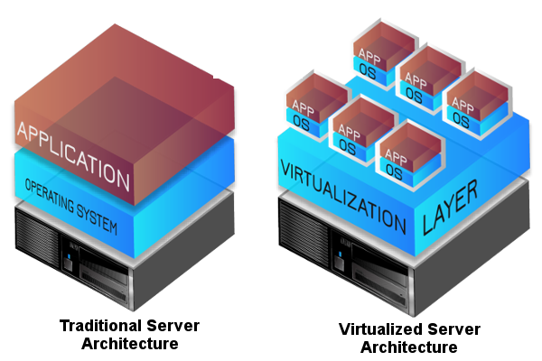

**Notes:**

Using virtual machines provides several advantages: applications can each run in
an **isolated environment** custom-tailored to their needs (operating system,
libraries, etc), **new virtual servers can be created in minutes**, and
**resource utilization is maximized** instead of hardware running idle.

On the other hand, virtual machines require **additional management effort** and
their **performance is not as good** as dedicated servers.

But for many use cases **the benefits outweight the costs**, which is why
virtualization is heavily used in cloud computing.

---

## Cloud computing

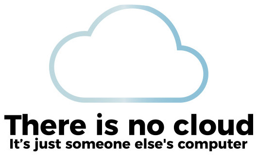

---

### What is cloud computing?

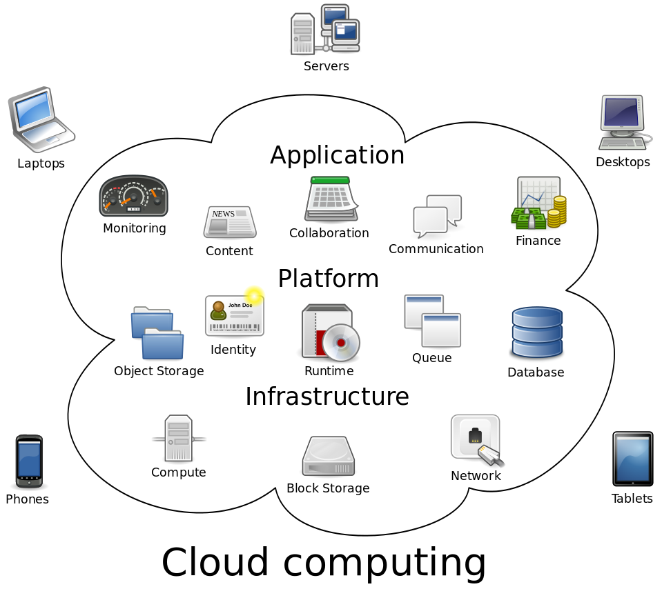

**Notes:**

[Cloud computing][cloud] is nothing new. It's simply a **pool of configurable
computer system resources**.

These resources may be **servers**, or **infrastructure** for those servers
(e.g. network, storage), or **applications** running on those servers (e.g. web
applications).

---

### Why use cloud computing?

  

    
    <ul class="text-3xl">
      <li>Focus on core business</li>
      <li>Minimize up-front computer infrastructure costs</li>
      <li>Rapidly adjust to fluctuating and unpredictable computing demands</li>
    </ul>
  

  

    
    <ul class="text-3xl">
      <li>Customization options are limited</li>
      <li>Security and privacy can be a concern</li>
    </ul>
  

**Notes:**

Cloud computing resources can be **rapidly provisioned** with **minimal
management** effort, allowing great **economies of scale**.

Companies using cloud computing can **focus on their core business** instead of
expending resources on computer infrastructure and maintenance.

---

### Public clouds

**Notes:**

Most public **cloud computing providers** such as Amazon, Google and Microsoft
**own and operate the infrastructure** at their data center(s), and **provide
cloud resources via the Internet**.

For example, the [Amazon Web Services][aws] cloud was [initially developed
internally][aws-history] to support Amazon's retail trade. As their computing
needs grew, they felt the need to build a computing infrastructure that was
**completely standardized and automated**, and that would **rely extensively on
web services** for storage and other computing needs.

As that infrastructure grew, Amazon started **selling access to some of their
services**, initially virtual servers, as well as a storage and a message
queuing service. Today Amazon is one of the largest and most popular cloud
services provider.

The [appendix of this subject][appendix-deployment-models] describes public
clouds alongside the other deployment models: private, hybrid and distributed
clouds.

---

## Service models

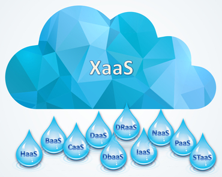

---

### On premise data center

<!-- .element: class="hidden" -->

  

    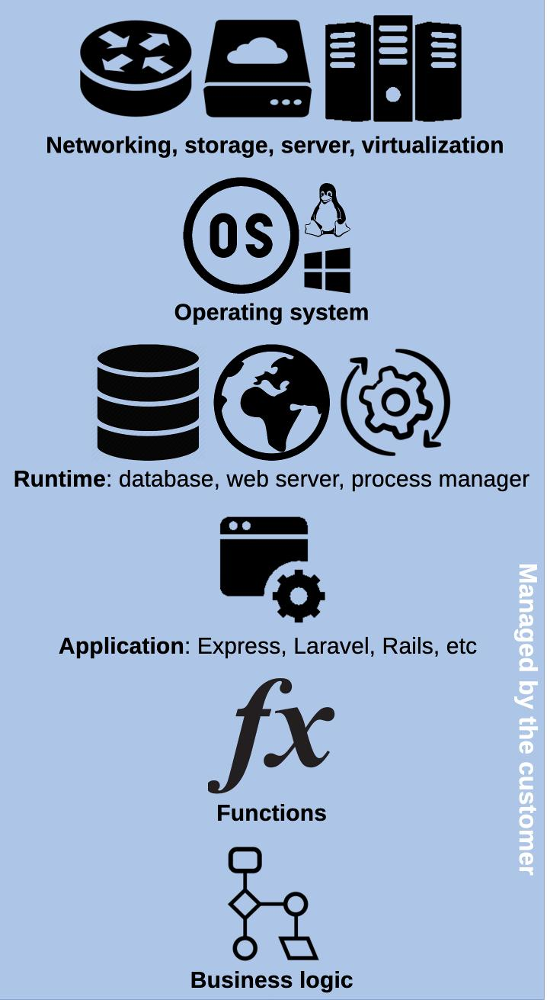
  

  

    
<strong>On premise data center</strong>

    
Do everything yourself (in your basement)

  

**Notes:**

As an introduction to cloud service models, this is a representation of the
various technological layers you need to put in place to deploy web applications
in a modern cloud infrastructure.

If you have your own data center, you need to install and configure all of these
layers yourself.

As you will see, the various **cloud service models abstract away part or all**
of these layers, so that you don't have to worry about them.

---

### Infrastructure as a Service (IaaS)

<!-- .element: class="hidden" -->

  

    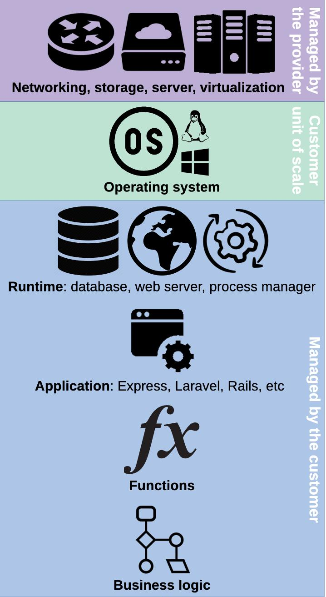
  

  

    
<strong>Infrastructure as a service</strong>

    
Pay per machine

    <ul class='text-2xl'>
      <li>
        $6/mo for a 2-<a
        href='https://www.techtarget.com/whatis/definition/virtual-CPU-vCPU'>vCPU</a>
        VM with 1 GB of RAM at <a
        href='https://aws.amazon.com/ec2/pricing/on-demand/'>AWS EC2</a>
      </li>
      <li>
        €17/mo for a dedicated server with a 2.2 GHz CPU and 32 GB of RAM at <a
        href='https://eco.ovhcloud.com'>OVH</a>
      </li>
    </ul>
  

**Notes:**

[**IaaS**][iaas] provides IT infrastructure like **storage, networks and virtual
machines** from the provider's data center(s).

The customer provides an **operating system image** like [Ubuntu][ubuntu], which
is run on a physical or [virtual machine (VM)][vm] by the provider. The machine
is the **unit of scale**: you pay per machine (usually hourly).

The customer does not manage the physical infrastructure but has **complete
control over the operating system** and can run arbitrary software, assuming the
role of a system administrator.

**Setting up the runtime** environment (databases, web servers, monitoring, etc)
for applications **is up to the customer**.

---

### Platform as a Service (PaaS)

<!-- .element: class="hidden" -->

  

    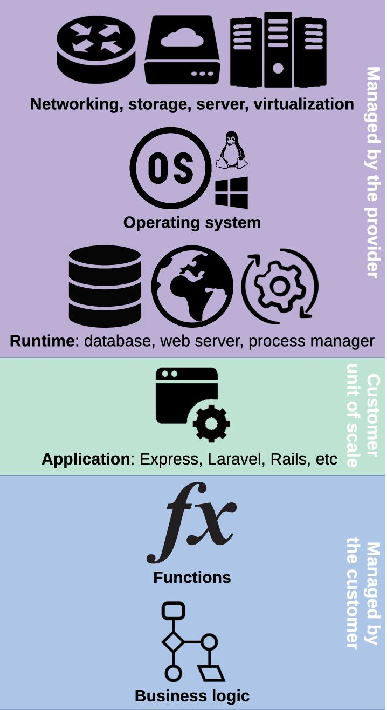
  

  

    
<strong>Platform as a service</strong>

    
Pay per application

    <ul class='text-2xl'>
      <li>
        $25/mo for a fully managed production environment with 1 GB or RAM at
        <a href='https://www.heroku.com/pricing'>Heroku</a>
      </li>
    </ul>
  

**Notes:**

[**PaaS**][paas] provides a **managed runtime environment** where customers can
run their applications without having to maintain the associated infrastructure.

All you have to do is provide the **application**, typically via Git. The
platform will detect the type of application and run it with the necessary
components (e.g. database). You pay per application, often hourly.

This is **quicker** because applications can be deployed with minimal
configuration, without the complexity of setting up the runtime. More time can
be spent on developing the application.

However PaaS is **less flexible** since control of the runtime is limited. It
also tends to be more expensive at larger scales.

> $25/mo for a fully managed production environment with 1 GB or RAM at
> [Heroku][heroku-pricing].

---

### Function as a Service (FaaS)

<!-- .element: class="hidden" -->

  

    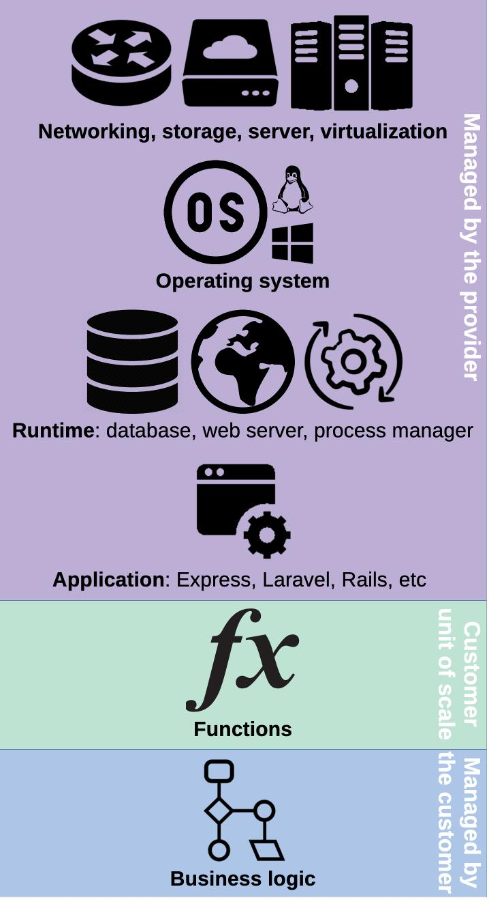
  

  

    
<strong>Function as a service</strong>

    
Pay per execution time

    <ul class='text-2xl'>
      <li>
        $0.0000000021/ms when a function consumes 128 MB of RAM at <a
        href='https://aws.amazon.com/lambda/'>AWS Lambda</a>
      </li>
    </ul>
  

**Notes:**

[**FaaS**][faas] stores **individual functions** and runs them in response to
events. Customers write simple functions that access resources such as a
database, then define when they are run in response to client requests.

This model completely abstracts away the complexity of managing the
infrastructure, setting up the runtime and structuring an application. The
customer has little to no control over these layers. There is no direct need to
manage resources.

In contrast with IaaS and PaaS, nothing is kept running if nothing happens.
Functions are loaded and run as events occur. **Pricing is based on execution
time** (often per millisecond) rather than application uptime.

---

### Software as a Service (SaaS)

<!-- .element: class="hidden" -->

  

    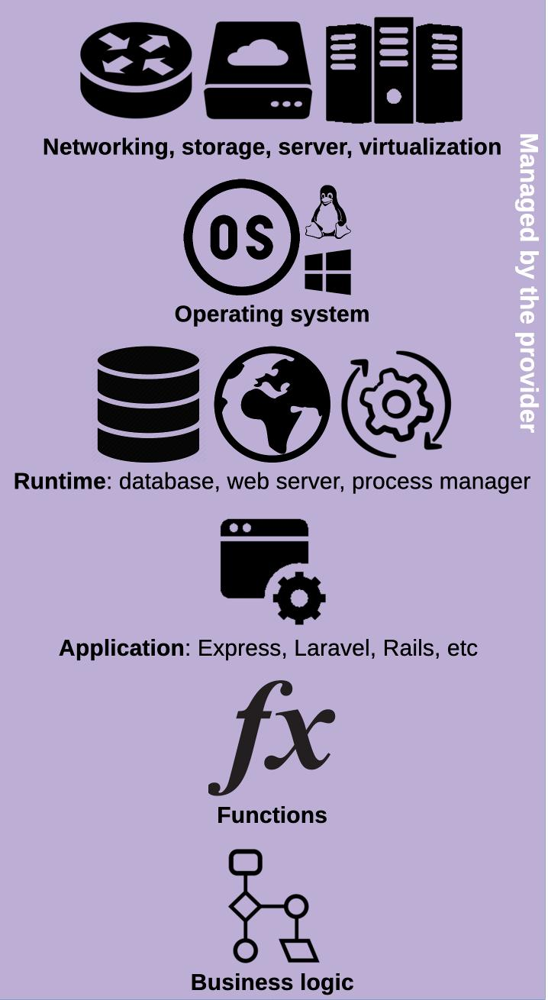
  

  

    
<strong>Software as a service</strong>

    
Pay a monthly subscription

    <ul class='text-2xl'>
      <li>
        $4/mo for a <a href='https://github.com/pricing'>pro GitHub account</a>
      </li>
      <li>
        $10/mo for a <a
        href='https://www.dropbox.com/official-teams-page'>personal Dropbox
        account</a>
      </li>
      <li>
        $14/mo for a <a href='https://www.youtube.com/premium'>premium YouTube
        account</a>
      </li>
    </ul>
  

**Notes:**

[**SaaS**][saas] provides **on-demand** software over the Internet.

The software is **fully developed, managed and run by the provider**, so the
customer has nothing to do except pay and use it. Pricing is often per user and
monthly.

This model offers the **least flexibility**, as the customer has no control over
the operation or deployment of the software, and limited control over its
configuration.

---

### Level of abstraction

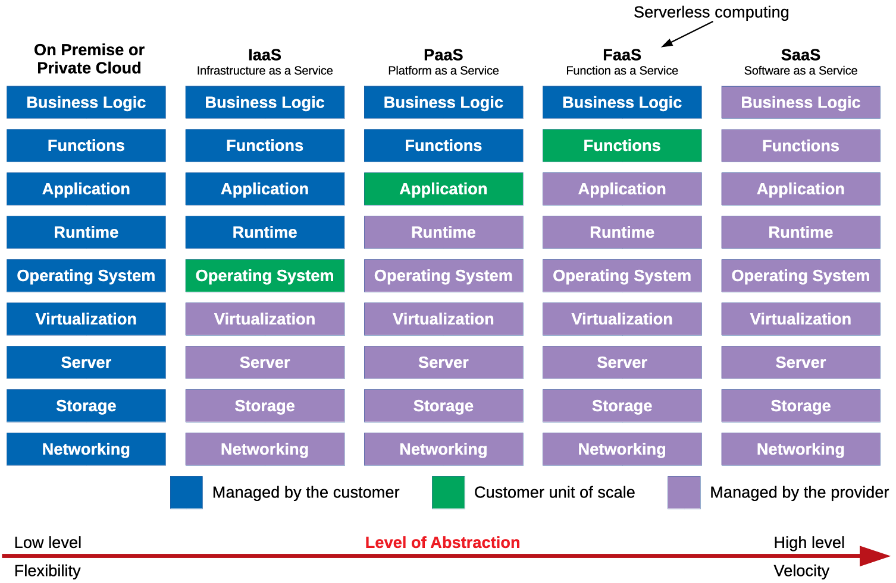

**Notes:**

These models can be ordered by increasing level of abstraction, from IaaS being
the lowest level and most flexible service model, to SaaS being the highest
level and fastest-to-use service model.

---

## What is Linux?

**Notes:**

[Linux][linux] is a family of free and open source software operating systems
built around the [Linux kernel][linux-kernel], an [operating system
kernel][kernel] first released in 1991, by [Linus Torvalds][linus].

---

### Unix history

<!-- .element: class="hidden" -->

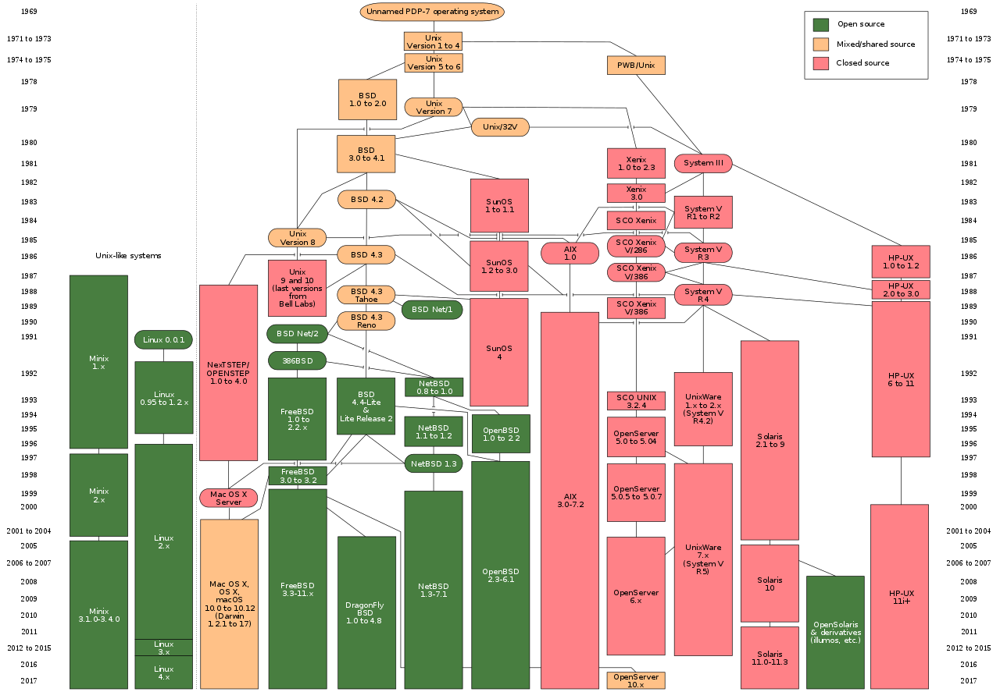

**Notes:**

It is based on [Unix][unix], an operating system released in 1971 at AT&T's
[Bell Laboratories][bell-labs] in the United States. As it was [proprietary
software][proprietary], Linus Torvalds decided to release his own [open
source][oss] kernel.

---

### Why use Linux?

- Free and open source
- Stable and lightweight
- Runs more than 75% of servers and most supercomputers
- Fits in 2.1MB on embedded devices

**Notes:**

There are many [reasons to use it][linux-pros]: its open source philosophy, low
or no upfront cost, better system stability, and lightweight distributions with
lower CPU and memory usage and a smaller size.

Linux is king in two places:

- [Embedded systems][embedded]: [BusyBox][busybox] fits in 2.1MB.
- [Servers][linux-servers]: more than 75% of servers, most cloud workloads and
  most supercomputers run Linux.

Note that no system is perfect. Linux also has [barriers to
adoption][linux-cons], mostly the facts that it rarely comes pre-installed and
that it requires users to know more about managing their operating system.

---

### Linux distribution timeline

<a href='../images/linux-distribution-timeline.svg'>
  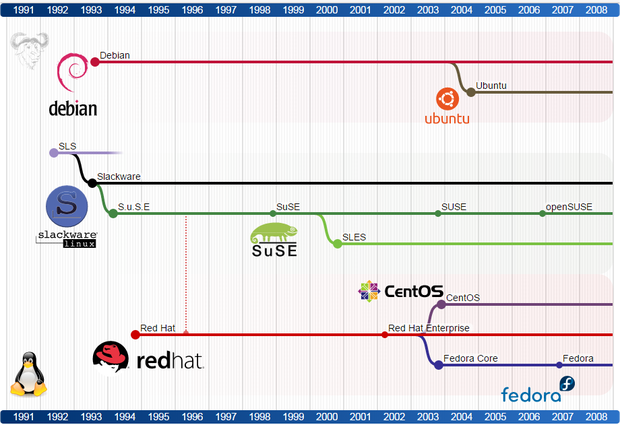
</a>

**Notes:**

Linux is not just one operating system, it is a family of systems called [Linux
distributions][linux-distros]. For example, on desktop or server, the most
popular is [Ubuntu][ubuntu].

[appendix-deployment-models]: #appendix-cloud-deployment-models
[aws]: https://aws.amazon.com
[aws-history]: https://en.wikipedia.org/wiki/Amazon_Web_Services#History
[bell-labs]: https://en.wikipedia.org/wiki/Bell_Labs
[busybox]: https://en.wikipedia.org/wiki/BusyBox
[cloud]: https://en.wikipedia.org/wiki/Cloud_computing
[dedicated-hosting]: https://en.wikipedia.org/wiki/Dedicated_hosting_service
[embedded]: https://en.wikipedia.org/wiki/Embedded_system
[faas]: https://en.wikipedia.org/wiki/Function_as_a_service
[heroku-pricing]: https://www.heroku.com/pricing/
[hypervisor]: https://en.wikipedia.org/wiki/Hypervisor
[iaas]: https://en.wikipedia.org/wiki/Infrastructure_as_a_service
[internet-hosting]: https://en.wikipedia.org/wiki/Internet_hosting_service
[kernel]: https://en.wikipedia.org/wiki/Kernel_(operating_system)
[kvm]: https://www.linux-kvm.org
[linus]: https://en.wikipedia.org/wiki/Linus_Torvalds
[linux]: https://en.wikipedia.org/wiki/Linux
[linux-cons]: https://en.wikipedia.org/wiki/Linux_adoption#Barriers_to_adoption
[linux-distros]: https://en.wikipedia.org/wiki/Linux_distribution
[linux-kernel]: https://en.wikipedia.org/wiki/Linux_kernel
[linux-pros]: https://en.wikipedia.org/wiki/Linux_adoption#Reasons_for_adoption
[linux-servers]: https://en.wikipedia.org/wiki/Linux#Servers,_mainframes_and_supercomputers
[microservices-in-practice]: https://medium.com/microservices-in-practice/microservices-in-practice-7a3e85b6624c
[oss]: https://en.wikipedia.org/wiki/Open-source_software
[paas]: https://en.wikipedia.org/wiki/Platform_as_a_service
[parallels]: https://www.parallels.com
[proprietary]: https://en.wikipedia.org/wiki/Proprietary_software
[saas]: https://en.wikipedia.org/wiki/Software_as_a_service
[shared-hosting]: https://en.wikipedia.org/wiki/Shared_web_hosting_service
[ubuntu]: https://www.ubuntu.com
[unix]: https://en.wikipedia.org/wiki/Unix
[virtual-hosting]: https://en.wikipedia.org/wiki/Virtual_private_server
[virtualbox]: https://www.virtualbox.org
[virtualization]: https://en.wikipedia.org/wiki/Virtualization
[vm]: https://en.wikipedia.org/wiki/Virtual_machine
[vmware]: https://www.vmware.com
[web-hosting]: https://en.wikipedia.org/wiki/Web_hosting_service
