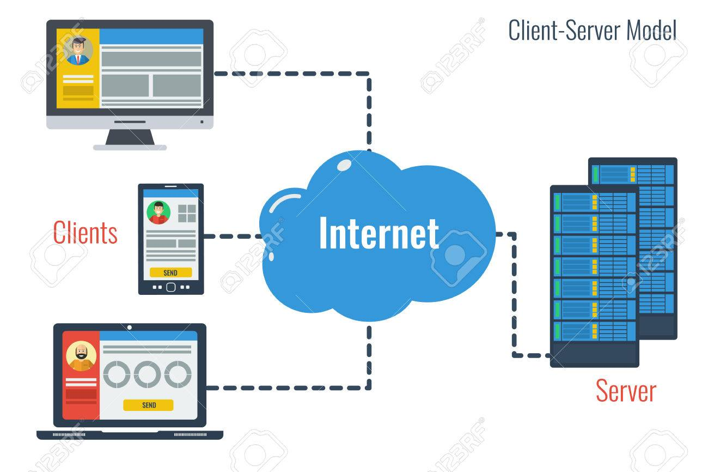
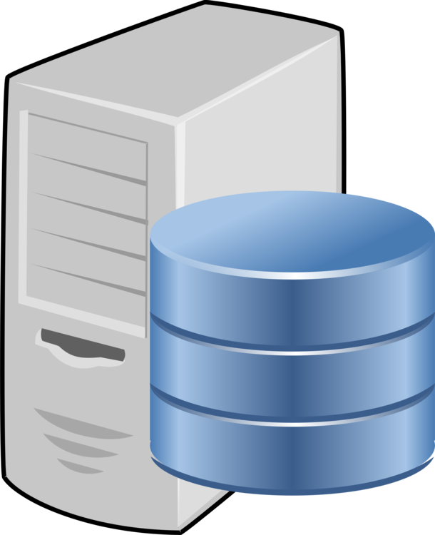
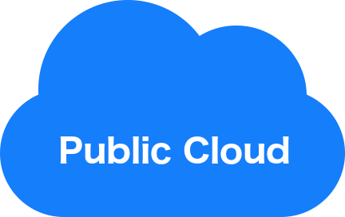
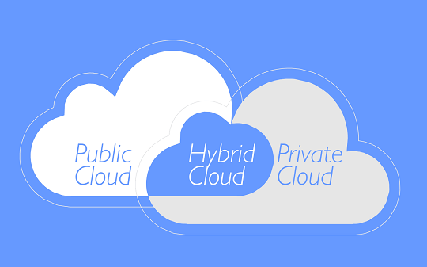
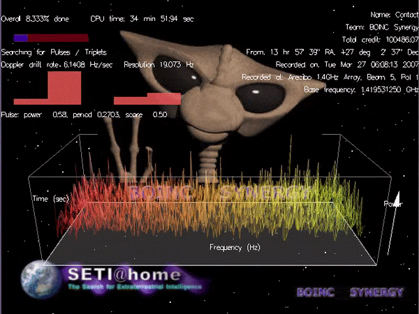

Learn what cloud computing is, the common service models available today, and
where the Linux operating system your cloud server runs comes from.

## The client-server model

The [client-server model][client-server-model] is one of the main ways
distributed and networked computer systems are organized today. In this model,
**servers** share their resources with **clients**, who **request a server's
content or services**.

The communication is not only one way. In modern web applications, servers may
also **push data to their clients**.

### Servers, servers everywhere...



<!-- col -->

<!-- col -->



A server can provide many different kinds of content or services:

- A [**file server**][file-server] provides shared disk access accessible over
  the network (using protocols such as [FTP][ftp] or [AFP][afp]), to store files
  such as text, image, sound or video.
- A [**database server**][db-server] houses an application that provides
  database services to other computer programs.
- A [**web server**][web-server] can serve contents over the Internet (using
  [HTTP][http]).

These are just a few examples. There are many [types of servers][server-types]
depending on the scenario and the resources you want to provide. One computer
may fulfill one or several of these roles.

## Service models

Cloud providers offer their resources at different levels of abstraction. These
are some of the most common service models:

| Model                       | Acronym | What is provided                                            | Examples                                                                                         |
| :-------------------------- | :------ | :---------------------------------------------------------- | :----------------------------------------------------------------------------------------------- |
| Infrastructure as a Service | `IaaS`  | Virtual machines, servers, storage, load balancers, network | [Amazon Web Services][aws], [Google Cloud][google-cloud], [Microsoft Azure][azure]               |
| Platform as a Service       | `PaaS`  | Execution runtime, database, web server, development tools  | [Cloud Foundry][cloud-foundry], [Heroku][heroku], [OpenShift][openshift], [Render][render]       |
| Function as a Service       | `FaaS`  | Event-based hosting of individual functions                 | [AWS Lambda][aws-lambda], [Azure Functions][azure-functions], [Cloud Functions][cloud-functions] |
| Software as a Service       | `SaaS`  | Web applications such as CMS, email, games                  | [Dropbox][dropbox], [Gmail][gmail], [Slack][slack], [WordPress][wordpress]                       |

## Appendix: cloud deployment models

This appendix describes who a cloud is operated for, and by whom.

### Private and public clouds

  

    
    
Cloud infrastructure operated solely for a single organization

  

  

    
    
Cloud services open for public use, provided over the Internet

  

A **private cloud** is cloud infrastructure operated solely **for a single
organization**, managed and hosted internally or by a third party. These clouds
are very capital-intensive (they require physical space, hardware, etc) but are
usually more customizable and secure.

**Providers:** Microsoft, IBM, Dell, VMWare, HP, Cisco, Red Hat

A **public cloud** provides cloud services **open for public use**, over the
Internet.

Infrastructure is often shared through virtualization. Security guarantees are
not as strong. However, costs are low and the solution is highly flexible.

**Platforms:** [Amazon Web Services][aws], [Google Cloud
Platform][google-cloud], [Microsoft Azure][azure]

### Hybrid clouds

There are also **hybrid clouds** composed of two or more clouds bound together
to benefit from the advantages of multiple deployment models. For example, a
platform may store sensitive data on a private cloud, but connect to other
applications on a public cloud for greater flexibility.

### Distributed clouds

There also are a few [other deployment models][other-deployment-models], for
example **distributed clouds** where computing power can be provided by
volunteers donating the idle processing resources of their computers.

For example, [SETI@home][seti] uses volunteers' computers to analyze radio
signals with the aim of searching for signs of extraterrestrial intelligence.
Also see [Science United][science-united] for more recent projects.

[afp]: https://en.wikipedia.org/wiki/Apple_Filing_Protocol
[aws]: https://aws.amazon.com
[aws-lambda]: https://aws.amazon.com/lambda/
[azure]: https://azure.microsoft.com
[azure-functions]: https://azure.microsoft.com/en-us/services/functions/
[client-server-model]: https://en.wikipedia.org/wiki/Client%E2%80%93server_model
[cloud-foundry]: https://www.cloudfoundry.org
[cloud-functions]: https://cloud.google.com/functions/
[db-server]: https://en.wikipedia.org/wiki/Database_server
[dropbox]: https://www.dropbox.com
[file-server]: https://en.wikipedia.org/wiki/File_server
[ftp]: https://en.wikipedia.org/wiki/File_Transfer_Protocol
[gmail]: https://www.google.com/gmail/
[google-cloud]: https://cloud.google.com
[heroku]: https://www.heroku.com
[http]: https://en.wikipedia.org/wiki/HTTP
[openshift]: https://www.openshift.com
[other-deployment-models]: https://en.wikipedia.org/wiki/Cloud_computing#Others
[render]: https://render.com
[science-united]: https://scienceunited.org
[server-types]: https://en.wikipedia.org/wiki/Server_(computing)#Purpose
[seti]: https://en.wikipedia.org/wiki/SETI@home
[slack]: https://slack.com
[web-server]: https://en.wikipedia.org/wiki/Web_server
[wordpress]: https://wordpress.com
