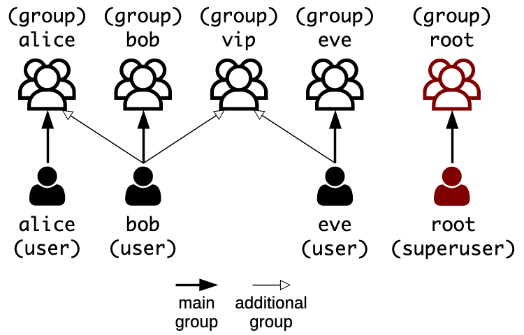

# Unix Basics

Architecture & Deployment <!-- .element: class="subtitle" -->

**Notes:**

Learn the basics of Unix and Unix-like operating systems like Linux: their file
system, their users, and the permissions that control who can do what.

---

## One tree

```
/
├── etc
├── home
│   └── jde
├── mnt
│   └── network-drive   ← another disk, mounted here
└── tmp
```

- **One root**, `/`
- Other disks are **mounted** into the tree

**Notes:**

A Unix file system is **rooted**: there is always one root, denoted by the path
`/`. Separate volumes such as disk partitions, removable media and network
shares belong to the same file hierarchy. A volume is **mounted** on a
directory, and its files then appear as that directory in the larger tree.

This is unlike Windows, where each drive has a letter that is the root of its
own file system tree, e.g. the `C:` and `D:` drives.

The volumes mounted when the system boots are defined in the `/etc/fstab` file
(**f**ile **s**ystems **tab**le).

---

### Case matters

<div class="grid grid-cols-2 gap-8">
  <div>
    <p><strong>macOS & Windows</strong></p>
    <p><code>a-file.txt</code><br /><code>A-FILE.txt</code></p>
    <p>The same file</p>
  </div>
  <div>
    <p><strong>Linux</strong></p>
    <p><code>a-file.txt</code><br /><code>A-FILE.txt</code></p>
    <p>Two different files</p>
  </div>
</div>

**Notes:**

The file systems of macOS and Windows (APFS, HFS and NTFS) are usually
**case-insensitive**: `a-file.txt` and `A-FILE.txt` are the same file, and you
cannot create both in the same directory.

The file systems of Linux (the ext family) are **case-sensitive**: the two names
are two different files.

Keep this in mind when you move files from your computer to a server. A file
your code refers to as `Server.js` is found on your Mac even if it is named
`server.js`, and not found on your Linux server.

---

## Users and groups



- A user is a **person** or a **service**: `alice`, `bob`, `sshd`
- Each user has a **main group**, and can join others

**Notes:**

Unix systems are multi-user systems. A **user** is any entity that uses the
system: a person, like Alice or Bob, or a system service, like a database or an
SSH server. Each user account has a name and a numerical user ID (UID).

A **group** also has a name and a numerical group ID (GID). Each user belongs to
a main group, usually with the same name as the user, and can be added to other
groups, which grants that user all the privileges of each group.

---

## Root and `sudo`

- `root` can do **anything**: do not log in as `root`
- `sudo <command>` runs one command as `root`
- Who may use `sudo` is defined in `/etc/sudoers`

**Notes:**

The **superuser**, named `root`, has complete access to the system and its
configuration. Logging in as `root` is dangerous: one wrong move can delete a
system-critical file or lock you out of your own server.

With the `sudo` command (**s**uper**u**ser **do**), a trusted user runs a single
command as if by the `root` user, after typing **their own password**.

The `/etc/sudoers` file defines which users are trusted to use `sudo`. On most
systems, it trusts every member of the `sudo` group. Never edit it by hand: use
the `visudo` command, which will not let you save a file with a syntax error.

---

### Who can list `/root`?

```bash
$> ls /root

$> sudo ls /root
```

> On a Linux system, `/root` is the home directory of the `root` user. It is not
> under `/home` like the home directories of other users.

**Notes:**

`/root` is the home directory of the `root` user. Only `root` may list it:

```bash
$> ls /root
ls: cannot open directory '/root': Permission denied

$> sudo ls /root
[sudo] password for jde:
...
```

The first command runs as you and is refused. The second runs as `root`, after
`sudo` has checked your own password.

---

## Permissions

| Permission | For a file      | For a directory                |
| :--------- | :-------------- | :----------------------------- |
| `r`        | **Read** it     | **List** its contents          |
| `w`        | **Write** to it | **Create** or **delete** files |
| `x`        | **Execute** it  | **Traverse** it                |

For the **owner**, the **group** and **others**

**Notes:**

Each file and directory has three permissions, each of them either granted or
not. They mean something slightly different for directories: `x` on a directory
means you can traverse it, to reach the files and subdirectories inside it.

Each of the three permissions is set for three categories of users:

- The **owner**: the user who owns the file.
- The **group**: any user in the group that owns the file.
- **Others**: any other user of the system.

---

### Reading `ls -l`

```
-rw-r----- 1 bob vip 321 Jan 18 some-file
```

<table>
  <tbody>
    <tr><td><code>-</code></td><td>Type: a file (<code>d</code> for a directory)</td></tr>
    <tr><td><code>rw-</code></td><td>The owner, <code>bob</code>, can read and write</td></tr>
    <tr><td><code>r--</code></td><td>The group, <code>vip</code>, can read</td></tr>
    <tr><td><code>---</code></td><td>Others can do nothing</td></tr>
  </tbody>
</table>

**Notes:**

The `-l` option (**l**ong format) of the `ls` command shows each file's type and
permissions in its first column, and the file's owner and group in its third and
fourth columns.

The first column is ten characters: one for the type of the file, then three
groups of three for the permissions of the owner, of the group, and of others.
A `-` in place of a letter means that the permission is not granted.

---

### Changing ownership: `chown`

```bash
$> chown alice:vip notes.txt  # change owner and group
$> chown alice notes.txt      # change owner only
$> chown :vip notes.txt       # change group only
```

**Notes:**

The `chown` command (**ch**ange **own**er) changes the owner and/or group of a
file or directory. You can change both at once, or just one of them. Changing
the owner of a file you do not own needs `sudo`.

---

### Changing permissions: `chmod`

```bash
$> chmod u+x script.sh
$> chmod g-w,o-rwx notes.txt
$> chmod a=r readonly.txt
```

- **Who**: `u`ser (owner), `g`roup, `o`thers, `a`ll
- **Change**: `+` add, `-` remove, `=` set exactly
- **What**: `r`, `w`, `x`

**Notes:**

The `chmod` command (**ch**ange **mod**e) changes the permissions of a file or
directory. In its **symbolic mode**, you name the categories of users, the
change, and the permissions:

- `chmod u+x script.sh` lets the owner execute the script.
- `chmod g-w,o-rwx notes.txt` removes the group's write permission and all of
  the permissions of others.
- `chmod a=r readonly.txt` sets the permissions of everyone to read only.

Changing the permissions of a file you do not own needs `sudo`.

---

### Are you allowed?

```bash
$> mkdir mydir
$> echo "Hello" > mydir/mine.txt
$> ls -l mydir
$> chmod u-r mydir/mine.txt
$> cat mydir/mine.txt

$> chmod u+r mydir/mine.txt
$> chmod u-r mydir
$> ls -l mydir
$> cat mydir/mine.txt

$> chmod u-x mydir
$> cat mydir/mine.txt
```

**Notes:**

You own `mydir/mine.txt`, but once you have removed your own read permission,
you cannot read it:

```bash
$> cat mydir/mine.txt
cat: mine.txt: Permission denied
```

Being the owner of a file does not exempt you from its permissions. As its
owner, you can give yourself the permission back with `chmod u+r
mydir/mine.txt`.

Without the `r` permission on a directory, you cannot list its contents:

```bash
$> ls mydir
ls: cannot open directory 'mydir': Permission denied
```

But you can still read a file in it if you know its name, and have the `r`
permission on the file itself, because you still have the `x` permission on the
directory, i.e. the right to traverse it:

```bash
$> cat mydir/mine.txt
Hello
```

After removing your own `x` permission on the directory, you cannot traverse it
anymore, and cannot read the file in it:

```bash
$> chmod u-x mydir
$> cat mydir/mine.txt
cat: mydir/mine.txt: Permission denied
```

---

### Octal mode

These two commands are equivalent:

```bash
$> chmod 755 script.sh
$> chmod u=rwx,g=rx,o=rx notes.txt
```

---

### Base 10: decimal notation

| Decimal digit  | 4              | 9              | 3              |
| :------------- | :------------- | :------------- | :------------- |
| Position       | 2              | 1              | 0              |
| Position value | 10<sup>2</sup> | 10<sup>1</sup> | 10<sup>0</sup> |
| Value          | 4 × 100        | 9 × 10         | 3 × 1          |

**Notes:**

There are ten digits, 0 to 9. Each position is worth ten times the position to
its right.

---

### Base 2: binary notation

| Binary digit   | 1                                     | 1                                     | 1                                    | 1                                    | 0                                    | 1                                   | 1                                   | 0                                   | 1                                   |
| :------------- | :------------------------------------ | :------------------------------------ | :----------------------------------- | :----------------------------------- | :----------------------------------- | :---------------------------------- | :---------------------------------- | :---------------------------------- | :---------------------------------- |
| Position       | 8                                     | 7                                     | 6                                    | 5                                    | 4                                    | 3                                   | 2                                   | 1                                   | 0                                   |
| Position value | 2<sup>8</sup>                         | 2<sup>7</sup>                         | 2<sup>6</sup>                        | 2<sup>5</sup>                        | 2<sup>4</sup>                        | 2<sup>3</sup>                       | 2<sup>2</sup>                       | 2<sup>1</sup>                       | 2<sup>0</sup>                       |
| Value          | <span class="text-2xl">1 × 256</span> | <span class="text-2xl">1 × 128</span> | <span class="text-2xl">1 × 64</span> | <span class="text-2xl">1 × 32</span> | <span class="text-2xl">0 × 16</span> | <span class="text-2xl">1 × 8</span> | <span class="text-2xl">1 × 4</span> | <span class="text-2xl">0 × 2</span> | <span class="text-2xl">1 × 1</span> |

**Notes:**

There are two digits, 0 and 1. Each position is worth twice the position to its
right.

---

### Base 8: octal notation

| Octal digit    | 7             | 5             | 5             |
| :------------- | :------------ | :------------ | :------------ |
| Position       | 2             | 1             | 0             |
| Position value | 8<sup>2</sup> | 8<sup>1</sup> | 8<sup>0</sup> |
| Value          | 7 × 64        | 5 × 8         | 5 × 1         |

**Notes:**

There are eight digits, 0 to 7. Each position is worth eight times the position
to its right.

---

### One number, several representations

493<sub>10</sub>

111101101<sub>2</sub>

755<sub>8</sub>

CDXCIII

**Notes:**

A base is only a way of writing a number. In base 10, which we use every day,
there are ten digits, and each position is worth ten times the position to its
right. In base 2 (binary), there are two digits, and each position is worth
twice the position to its right. In base 8 (octal), there are eight digits, and
each position is worth eight times the position to its right.

Three binary digits count from `000` to `111`, which is 0 to 7: exactly the
digits of base 8. So one octal digit always stands for three binary digits, or
**bits**.

---

### Permissions as bits

<table class="text-3xl">
  <thead>
    <tr>
      <th>Permissions</th>
      <th>Text</th>
      <th>Bits</th>
      <th>Octal</th>
    </tr>
  </thead>
  <tbody>
    <tr>
      <td>read, write, execute</td>
      <td class="text-center!"><code>rwx</code></td>
      <td class="text-center!">111</td>
      <td class="text-center!">7</td>
    </tr>
    <tr>
      <td>read, write</td>
      <td class="text-center!"><code>rw-</code></td>
      <td class="text-center!">110</td>
      <td class="text-center!">6</td>
    </tr>
    <tr>
      <td>read, execute</td>
      <td class="text-center!"><code>r-x</code></td>
      <td class="text-center!">101</td>
      <td class="text-center!">5</td>
    </tr>
    <tr>
      <td>read only</td>
      <td class="text-center!"><code>r--</code></td>
      <td class="text-center!">100</td>
      <td class="text-center!">4</td>
    </tr>
    <tr>
      <td>write, execute</td>
      <td class="text-center!"><code>-wx</code></td>
      <td class="text-center!">011</td>
      <td class="text-center!">3</td>
    </tr>
    <tr>
      <td>write only</td>
      <td class="text-center!"><code>-w-</code></td>
      <td class="text-center!">010</td>
      <td class="text-center!">2</td>
    </tr>
    <tr>
      <td>execute only</td>
      <td class="text-center!"><code>--x</code></td>
      <td class="text-center!">001</td>
      <td class="text-center!">1</td>
    </tr>
    <tr>
      <td>no permissions</td>
      <td class="text-center!"><code>---</code></td>
      <td class="text-center!">000</td>
      <td class="text-center!">0</td>
    </tr>
  </tbody>
</table>

**Notes:**

Each permission is either granted or not, which can be represented by a bit: 1
for granted, 0 for not granted. Three permissions make three bits, which is one
octal digit. Reading the bits as 4, 2 and 1, `r` is worth 4, `w` is worth 2 and
`x` is worth 1. Adding them up gives the digit: `rwx` is 7, `r-x` is 5, and
`---` is 0.

---

### Octal mode

| Permissions | `rwx` | `r-x` | `r-x` |
| :---------- | :---: | :---: | :---: |
| Bits        |  111  |  101  |  101  |
| Octal       |   7   |   5   |   5   |

```bash
$> chmod 755 script.sh    # rwxr-xr-x
```

**Notes:**

Each category of users has three permissions. In its **octal mode**, `chmod`
sets all of a file's permissions at once, with one digit for the owner, one for
the group and one for others. `chmod 755 script.sh` gives the script the
permissions `rwxr-xr-x`.

`chmod` reads `755` as a number in base 8, not as seven hundred and fifty five.
You never need to convert it to base 10: what matters is that each digit stands
for one category of users.
