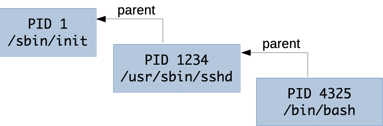
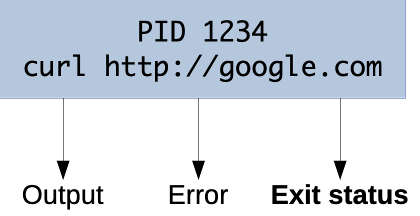
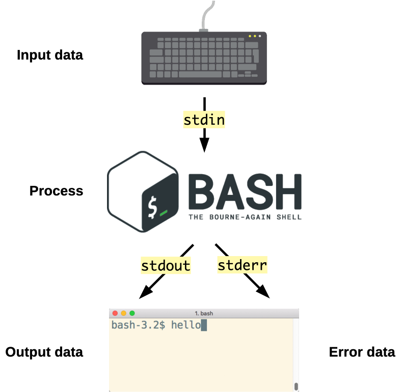
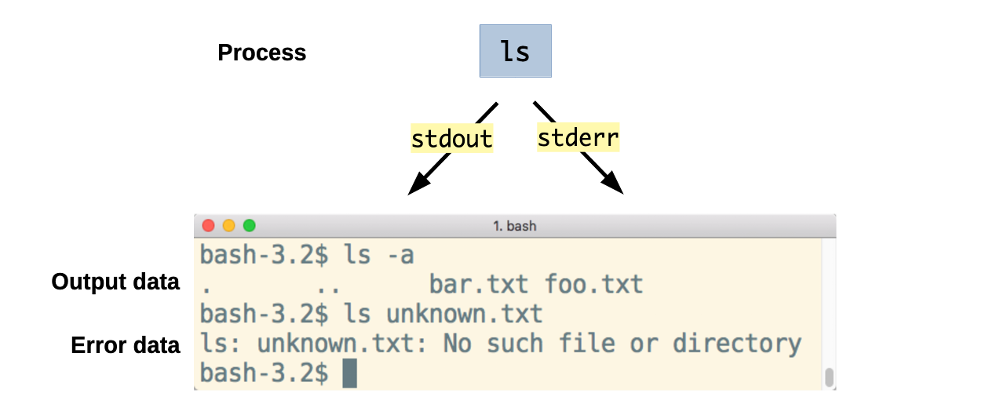
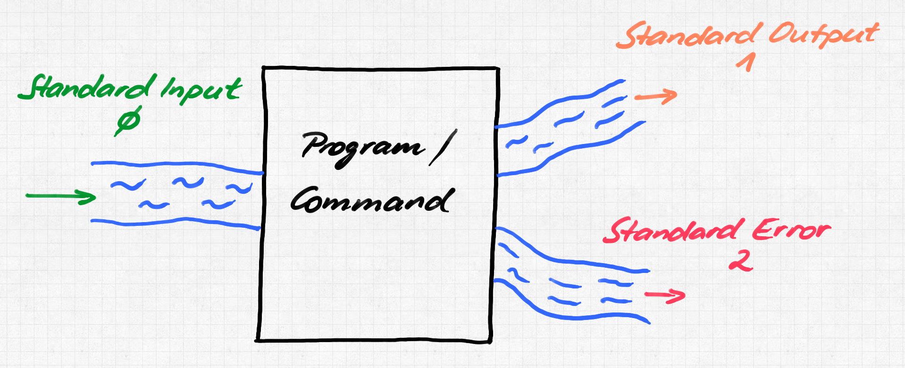
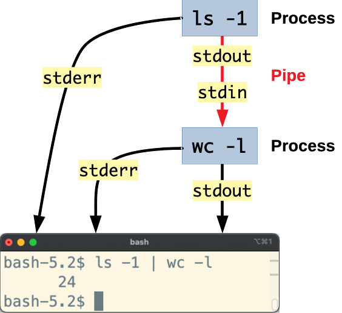

# Unix Processes

Architecture & Deployment <!-- .element: class="subtitle" -->

**Notes:**

Learn how the programs you run on a Unix system receive their input and send
their output, how the shell can redirect that input and output to files, and
how it can chain programs together into pipelines.

---

## Processes



- A **process** is a running program
- Each process has a number, its **PID**
- A process started from the shell **holds the terminal** until it ends

**Notes:**

A **process** is a program that is being executed. A program is a file of
instructions stored on disk; every time you run it, the system creates a new
process to execute it.

The system gives each process a number that identifies it while it runs, its
**p**rocess **ID** (PID). The `ps` command (**p**rocess **s**tatus) lists
running processes with their PIDs.

A program you run from the shell runs in the **foreground**: it holds your
terminal, and you get the prompt back only when it ends. A short command like
`ls` ends at once; a server waiting for connections may never end on its own.

---

## Exit status



- A process ends with a number, its **exit status**
- `0` means **success**, anything else means **failure**
- The shell keeps the last one in `$?`

**Notes:**

When a process ends, it gives a small number, from 0 to 255, called its **exit
status**. By convention, `0` means that the program succeeded, and any other
number means that something went wrong. What each other number means is up to
each program, and is usually described in its manual.

The exit status is separate from the output. A program can print a lot and
still fail, or print nothing and succeed. The shell keeps the exit status of the
last command in the special variable `$?`, which you can display with `echo
$?`.

---

## Standard streams

<div class="flex gap-4 justify-center items-center">
  

  <ul class="text-4xl">
    <li><strong>Standard input</strong> (<code>stdin</code>)<br/>data going in</li>
    <li><strong>Standard output</strong> (<code>stdout</code>)<br/>data coming out</li>
    <li><strong>Standard error</strong> (<code>stderr</code>)<br/>errors and diagnostics</li>
  </ul>
</div>

**Notes:**

Every Unix process gets three communication channels when it starts, its
**standard streams**. A stream is an ordered sequence of bytes, text or binary,
that a program can read from or write to without knowing how much data there
will be.

By default, all three are connected to your terminal: the standard input to
your keyboard, and the standard output and standard error to your screen. A
program started from the shell writes to the same terminal as the shell.

A program does not need to know what is at the other end of its streams. It
reads from its standard input and writes to its standard output, whatever they
are connected to. This is why the output of an application you run on a server
appears in your SSH session: its standard output is your terminal, on the other
side of the SSH connection.

---

## Two outputs



- **Data** goes to the standard output
- **Errors** go to the standard error
- Both show up in your terminal by default

**Notes:**

A program has two output streams so that its data and its errors can be kept
apart. Both are displayed in your terminal by default, so you usually see no
difference between them.

The difference matters as soon as the data goes somewhere else, such as a file
or another program: the data goes there, and the errors still reach you,
instead of being mixed into the data. A program may write to both streams in
the same run.

---

## Redirection



<table class="text-3xl">
  <thead>
    <tr>
      <th>Operator</th>
      <th>Shortcut</th>
      <th>Effect</th>
    </tr>
  </thead>
  <tbody>
    <tr>
      <td><code>0&lt;</code></td>
      <td><code>&lt;</code></td>
      <td>Standard input from a file</td>
    </tr>
    <tr>
      <td><code>1&gt;</code></td>
      <td><code>&gt;</code></td>
      <td>Standard output to a file (overwrites it)</td>
    </tr>
    <tr>
      <td><code>2&gt;</code></td>
      <td><code>2&gt;</code></td>
      <td>Standard error to a file</td>
    </tr>
    <tr>
      <td><code>&amp;&gt;</code></td>
      <td><code>&amp;&gt;</code></td>
      <td>Both streams to a file</td>
    </tr>
  </tbody>
</table>

**Notes:**

The shell can connect a process's streams to something other than the
terminal: this is **redirection**. The shell sets it up before the program
starts, and the program does not know: it writes to its standard output as
usual, and the data ends up in a file.

Each stream has a number, its **file descriptor**: `0` for the standard input,
`1` for the standard output and `2` for the standard error. `1>`, or just `>`,
redirects the standard output, which is file descriptor `1`. `2>` redirects the
standard error. `&>` redirects both streams at once.

`>` replaces the contents of the file, while `>>` adds to the end of it. Both
create the file if it does not exist. You can use it with either standard output
or standard error (`1>>` or `2>>`), or with both at once (`&>>`).

---

## The pipe


**Notes:**

Since every process has a standard input and a standard output, the standard
output of one process can be connected to the standard input of another. The
`|` operator of the shell, a vertical **pipe**, does this:

```bash
$> ls | wc -l
```

The `ls` command lists files, and `wc -l` (**w**ord **c**ount, with the `-l`
option for **l**ines) counts the lines it reads. Together, they count the files
in the current directory.

Processes can be chained into a **pipeline**, each one transforming the data
and passing it on to the next, like a production chain where the parts go from
one worker to the next until the product is finished.

---

### Chaining programs

```bash
$> ls -1 | wc -l   # counts entries in the current directory
```



**Notes:**

`ls -1 | wc -l` counts entries in the current directory: `wc` counts the
lines `ls` writes, one per file. With the `-1` option or when its standard
output is not a terminal, `ls` writes one file per line.

The standard error of each process is not part of the pipeline: it still goes to
your terminal.

---

## The Unix philosophy

- Write programs that **do one thing and do it well**
- Write programs to **work together**
- Write programs to **handle text streams**, because that is a universal
  interface

**Notes:**

Because Unix programs can easily be chained together, they tend to be small and
simple. A complex task is done by combining many small programs, rather than by
writing one large program that does everything.

This is, in a few words, the [Unix
philosophy](https://en.wikipedia.org/wiki/Unix_philosophy), as summarized by
Doug McIlroy, who came up with the Unix pipe.
