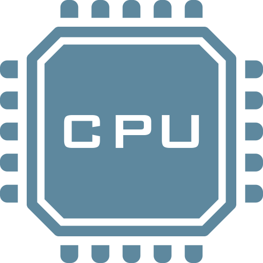
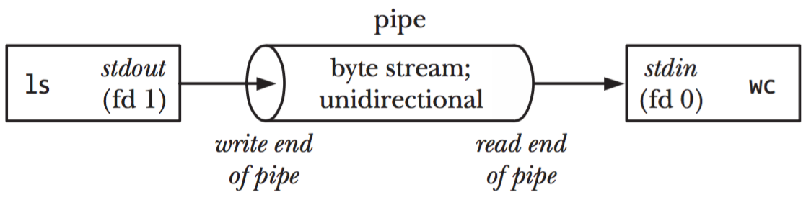

Learn about processes in Unix operating systems: how they are identified, how
they report success or failure, how they receive their input and send their
output, and how they can be chained together.

**You will need**

- A Unix CLI
- An Ubuntu server to connect to

**Recommended reading**

- [Command Line Introduction]()
- [Secure Shell (SSH)]()
- [Unix Basics]()

## What is a process?

A [process][process] is an **instance of a computer program that is being
executed**.



This is a C **program**. A program is a passive collection of **instructions
stored on disk**:

```c
 #include <stdio.h>

int main()
{
   printf("Hello, World!");
   return 0;
}
```

<!-- col -->

A **process** is the actual **execution of a program** that has been loaded into
memory:

<div class='flex items-center gap-4'>
  
  
</div>



**Every time you run an executable** file or an application, **a process is
created**. Simple programs only need one process. More complex applications may
launch other child processes for greater performance. For example, most modern
browsers will run at least one child process per tab.

### Unix processes

Processes work differently depending on the operating system. We will focus on
processes in Unix systems, and these features in particular:

| Feature                     | Description                                                                                                        |
| :-------------------------- | :----------------------------------------------------------------------------------------------------------------- |
| [Process ID (PID)][pid]     | A number uniquely identifying a process at a given time                                                            |
| [Exit status][exit-status]  | A number given when a process exits, indicating whether it was successful                                          |
| [Standard streams][streams] | Preconnected input and output communication channels between a process and its environment                         |
| [Pipelines][pipes]          | A way to chain processes in sequence by their standard streams, a form of [inter-process communication (IPC)][ipc] |



These features have been standardized for Unix systems as the [Portable
Operating System Interface (POSIX)][posix].





Later, we will also talk about [signals][signals], a way for processes to send
each other notifications.



## Process ID

Let's talk about how running processes are identified.

### What is a process identifier?

Any process that is created in a Unix system is assigned an **identifier (or
PID)**. Each new process gets the next available PID. This ID can be used to
reference the process.

PIDs are sometimes reused as processes die and are created again,
but **at any given time, a PID uniquely identifies a specific process**.



By default, the maximum PID on Linux systems is 32,768 on 32-bit systems, and
4,194,304 (~4 million) on 64-bit systems.



### Parent processes

The process with PID 0 is the [**system process**][pid-0], also originally known
as the **swapper** or **scheduler**. This is the most low-level process managed
directly by the kernel.

One of the first thing it does is run the **[init process][init]**, which
naturally gets PID 1 (the next available PID). The init process is responsible
for initializing the system. Most other processes are either launched by the
init process directly, or by one of its children.

All processes retain a reference to the **parent process** that launched it.
The ID of the parent process is commonly called **PPID (parent process ID)**.

<div class="w-full p-4 rounded-2xl flex justify-center dark:bg-radial dark:from-gray-500 dark:from-40% dark:to-transparent">
  
</div>

### The `ps` command

The `ps` (**p**rocess **s**tatus) command displays currently-running processes:

```bash
$> ps
  PID TTY          TIME CMD
14926 pts/0    00:00:00 bash
14939 pts/0    00:00:00 ps
```



By default, it only lists your user's processes that have a controlling terminal
(`TTY`).



You can obtain more information with the `-f` (**f**ull format) option:

```bash
$> ps -f
UID       PID  PPID  C STIME TTY          TIME CMD
jde     15237 15158  1 17:48 pts/0    00:00:00 -bash
jde     15251 15237  0 17:48 pts/0    00:00:00 ps -f
```



We are mostly interested in the **P**rocess **ID** (`PID`), the **p**arent
**P**rocess **ID** (`PPID`) and of course the **c**o**m**man**d** (`CMD`) that
is being run. But [the others](https://kb.iu.edu/d/afnv) also provide useful
information.



#### Listing all processes

Of course, there are more than 2 processes running on your computer. Add the
`-e` (**e**very) option to see all running processes. The list will be much
longer. This is an abbreviated example:

```bash
$> ps -ef
UID       PID  PPID  C STIME TTY          TIME CMD
root        1     0  0 09:38 ?        00:00:30 /sbin/init
root        2     0  0 09:38 ?        00:00:30 [kthread]
...
root      402     1  0 09:39 ?        00:00:00 /lib/systemd/systemd-journald
syslog    912     1  0 09:39 ?        00:00:00 /usr/sbin/rsyslogd -n
root     1006     1  0 09:39 ?        00:00:00 /usr/sbin/cron -f
...
root     1700     1  0 Sep11 ?        00:00:00 /usr/sbin/sshd -D
jde      3350  1700  0 17:52 ?        00:00:00 sshd: jde@pts/0
jde      3378  3350  0 15:32 pts/0    00:00:00 -bash
jde      3567  3378  0 15:51 pts/0    00:00:00 ps -ef
```



Note that the command you just ran, `ps -ef`, is in the process list (at the
bottom in this example). This is because it was running while it was listing the
other processes.



#### Process tree

On some Linux distributions like Ubuntu, the `ps` command also accepts a
`--forest` option which visually shows the relationship between processes and
their parent:

```bash
$> ps -ef --forest
UID       PID  PPID  C STIME TTY          TIME CMD
...
root     1700     1  0 Sep11 ?        00:00:00 /usr/sbin/sshd -D
jde      3350  1700  0 17:52 ?        00:00:00  \_ sshd: jde@pts/0
jde      3378  3350  0 17:52 pts/0    00:00:00      \_ -bash
jde      3567  3378  0 17:54 pts/0    00:00:00          \_ ps -ef --forest
```

You can clearly see that:

- Process 1700, the SSH server (the `d` in `sshd` is for [daemon][daemon]), was
  launched by the init process (PID 1) and is run by `root`.
- Process 3350 was launched by the SSH server when you connected. It is your SSH
  session and manages your terminal device, named `pts/0` here.
- Process 3378 is a Bash login shell that was launched when you connected (as
  configured in `/etc/passwd`) and is attached to terminal `pts/0`.
- Process 3567 is the `ps` command you launched from the shell.

### Running more processes

Let's run some other processes and see if we can list them.

Open a new terminal on your local machine and connect to the same server.

If you go back to the first terminal and run the `ps` command again, you should
see both virtual terminal processes corresponding to your two terminals, as well
as the two bash shells running within them:

```bash
$> ps -ef --forest
...
root     1700     1  0 Sep11 ?        00:00:00 /usr/sbin/sshd -D
jde      3350  1700  0 17:52 ?        00:00:00  \_ sshd: jde@pts/0
jde      3378  3350  0 17:52 pts/0    00:00:00  |   \_ -bash
jde      3801  3378  0 18:22 pts/0    00:00:00  |       \_ ps -ef --forest
jde      3789  1700  0 18:21 ?        00:00:00  \_ sshd: jde@pts/1
jde      3791  3789  0 18:21 pts/1    00:00:00      \_ -bash
```

#### Sleeping process

Run a [`sleep` command][sleep] in the second terminal:

```bash
$> sleep 1000
```

It launches a process that does nothing for 1000 seconds, but keeps running.

It will block your terminal during that time, so go back to the other terminal
and run the following `ps` command, with an additional `-u jde` option to filter
only processes belonging to your **u**ser:

```bash
$> ps -f -u jde --forest
UID       PID  PPID  C STIME TTY          TIME CMD
...
jde      3350  1700  0 17:52 ?        00:00:00 sshd: jde@pts/0
jde      3378  3350  0 17:52 pts/0    00:00:00  \_ -bash
jde      3823  3378  0 18:24 pts/0    00:00:00      \_ ps -f -u jde --forest
jde      3789  1700  0 18:21 ?        00:00:00 sshd: jde@pts/1
jde      3791  3789  0 18:21 pts/1    00:00:00  \_ -bash
jde      3812  3791  0 18:23 pts/1    00:00:00      \_ sleep 1000
```

You can indeed see the running process started with the `sleep` command. It ends
on its own once its 1000 seconds have passed, or you can stop it with `Ctrl+C`
in the second terminal.

### Other monitoring commands

Here are other ways to inspect processes and have more information on their resource consumption:

- The [`htop` command][htop] (a better version of the older [`top`
  command][top], meaning **t**able **o**f **p**rocesses, named after its
  creator, **H**isham's **top**), shows processes along with CPU and memory
  consumption. It's an interactive command you can exit with `q` (**q**uit).
- The [`free` command][free] is not directly related to processes,
  but it helps you know how much memory is remaining on your system.

```bash
$> free -m
              total        used        free      shared  buff/cache   available
Mem:            985          90         534           0         359         751
Swap:             0           0           0
```



The `-m` option of the `free` command displays memory size in
[mebibytes][mebibyte], a more human-readable quantity, instead of bytes.



## Exit status

How children indicate success to their parent.

<div class="w-full p-4 rounded-2xl flex justify-center dark:bg-radial dark:from-gray-500 dark:from-40% dark:to-transparent">
  
</div>

### What is an exit status?

The **exit status** of a process is a small number (typically from 0 to 255)
passed from a child process to its parent process when it has finished
executing.

It is meant to allow the child process to indicate how or why it exited.

It's common practice for the exit status of Unix/Linux programs to be **0 to
indicate success**, and **greater than 0 to indicate an error** (it is sometimes
also called an _error level_).

### Retrieving the exit status in a shell

In a typical shell like [Bash][bash], you can retrieve the exit status of last
executed command from the special variable `$?`:

```bash
$> ls /
...

$> echo $?
0

$> ls file-that-does-not-exist
ls: cannot access 'file-that-does-not-exist': No such file or directory

$> echo $?
2
```

### Retrieving the exit status in code

Exit codes are not a feature that is limited to command line use. When running a
program from an application, you can also obtain the exit status.

For example:

- By using the `&$return_var` reference when calling PHP's [`exec`
  function][php-exec]
- By calling the [`Process#exitValue()` method][java-process-exit-value] after
  calling `Runtime#exec(String command)` in Java
- By listening to the `close` event when calling Node.js's [`spawn`
  function][node-spawn]

### Meaning of exit statuses

The meaning of exit statuses is unique to the program you are running. For
example, the manual of the `ls` command documents the following values:

```bash
Exit status:
  0      if OK,
  1      if minor problems (e.g., cannot access subdirectory),
  2      if serious trouble (e.g., cannot access command-line argument).
```

But this will be different for other programs or applications.

The only thing you can rely on for the majority of programs is that **0 is good,
anything else is probably bad**.

## Standard streams

**Standard streams** are preconnected input and output communication channels
between a process and its environment.


### The good old days

In **pre-Unix** (before 1970) systems, programs had to **explicitly connect to
input and output devices**. This was done differently for each device (e.g.
magnetic tape drive, disk drive, printer, etc) and operating system.

### Unix streams

Unix introduced **abstract devices** and the concept of a **data stream**: an
ordered sequence of data bytes which can be read until the **e**nd **o**f
**f**ile (EOF).

A program may also write bytes as desired and need not declare how many there
will be or how to group them. The data going through a stream may be **text**
(with any encoding) **or binary data**.

This was groundbreaking at the time because a program no longer had to know or
care what kind of device it is communicating with, as had been the case until
then.

#### stdin, stdout & stderr

Any new Unix process is **automatically connected** to the following streams by
default:

| Stream                      | Shorthand | Description                                                                                                                                                                                                            |
| :-------------------------- | :-------- | :--------------------------------------------------------------------------------------------------------------------------------------------------------------------------------------------------------------------- |
| **St**an**d**ard **in**put  | `stdin`   | Stream **data** (often text) **going into a program**                                                                                                                                                                  |
| **St**an**d**ard **out**put | `stdout`  | Stream where a program writes its **output data**                                                                                                                                                                      |
| **St**an**d**ard **err**or  | `stderr`  | Another output stream programs can use to output **error messages or diagnostics** (separate from standard output, allowing output and errors to be distinguished, solving the [semipredicate problem][semipredicate]) |

#### Streams, the keyboard, and the terminal



Another Unix breakthrough was to **automatically associate**:

- The **input stream** with your **terminal keyboard**;
- The **output and error streams** with your **terminal display**.

This is done by default unless a program chooses to do otherwise.

<!-- col -->

<div class="w-full p-4 rounded-2xl flex justify-center dark:bg-radial dark:from-gray-500 dark:from-40% dark:to-transparent">
  
</div>



For example, when your favorite shell, e.g. [Bash][bash], is running, it
automatically receives keyboard input, and its output data and errors are
automatically displayed in the terminal.

#### Stream inheritance

A child will **automatically inherit the standard streams of its parent process**
(unless redirected, more on that later).

For example, when you run an `ls` command, you do not have to specify that the
resulting list of files should be displayed in the terminal. The standard output
of the parent process, in this case your shell (e.g. Bash) is inherited by the
`ls` process.

Similarly, when you run the `ssh` command to communicate with another machine,
you do not have to explicitly connect your keyboard input to this new process.
As the SSH client is a child process of the shell, it inherits the same standard
input.



#### Optional input stream

A process is not obligated to use its input or output streams. For example,
**the `ls` command** produces output (or an error) but **takes no input** (it
has arguments, but that does not come from the input data stream).

<div class="w-full p-4 rounded-2xl flex justify-center dark:bg-radial dark:from-gray-500 dark:from-40% dark:to-transparent">
  
</div>

#### Optional output stream

Similarly, a process is not obligated to use its output streams. For example,
when you `cat` a file, it outputs the content of the file to the standard output
stream, but it does not use the standard error stream:

```bash
$> cat data.txt
Hello World
```

Unless the file does not exist, in which case it will output an error message to
the standard error stream, and nothing to the standard output stream.

```bash
$> cat unknown-file
cat: unknown-file: No such file or directory
```

### Stream redirection

The standard streams can be **redirected**.

Redirection means capturing output from a file or command,
and sending it as input to another file or command.

Any Unix process has a number of [file descriptors][fd]. They are an abstract
indicator used to access a file or other input/output resource such as a
[pipe][pipes] (we'll talk about these later) or [socket][unix-sockets].

The first three file descriptors correspond to the standard streams by default:

| File descriptor | Stream                                 |
| :-------------- | :------------------------------------- |
| `0`             | **St**an**d**ard **in**put (`stdin`)   |
| `1`             | **St**an**d**ard **out**put (`stdout`) |
| `2`             | **St**an**d**ard **err**or (`stderr`)  |

### Redirect standard output stream

The `>` shell operator **redirects an output stream**.

For example, the following line runs the `ls` command, but instead of displaying
the result in the terminal, the **standard output stream (file descriptor `1`)
is redirected** to the file `data.txt`:

```bash
$> ls -a 1> data.txt

$> ls
data.txt  directory1  file1

$> cat data.txt
.
..
data.txt
directory1
file1
```



`data.txt` is in its own list: the shell creates the file before it starts
`ls`, so that it can connect the standard output of `ls` to it.



#### How to use standard output redirection

You can do the same with any command that produces output:

```bash
$> echo Hello 1> data.txt

$> cat data.txt
Hello
```

Note that the `>` operator **overwrites the file**. Use `>>` instead to **append
to the end of the file**:

```bash
$> echo World 1>> data.txt

$> cat data.txt
Hello
World
```

If you specify no file descriptor, **standard output (`1`) is redirected by
default**:

```bash
$> echo Hello > data.txt
$> echo Again >> data.txt
$> cat data.txt
Hello
Again
```

### Redirect standard error stream

Note that error messages are not redirected using the redirect operator (`>`)
like in the previous example. Errors are still displayed in the terminal and the
file remains empty:

```bash
$> ls unknown-file > error.txt
ls: unknown-file: No such file or directory

$> cat error.txt
```

This is because **most commands send errors to the standard error stream (file
descriptor `2`)** instead of the standard output stream.

If you want to redirect the error message to a file, you must **redirect the
standard error stream instead**:

```bash
$> ls unknown-file 2> error.txt

$> cat error.txt
ls: unknown-file: No such file or directory
```

### Both standard output and error streams

Some commands will **send data to both output streams** (standard output and
standard error) in the same run. As we've seen, both are displayed in the
terminal by default.

For example, the `grep` command prints the lines of a file that contain a word,
and with the `-r` (**r**ecursive) option, it searches all the files of a
directory. The following command searches the SSH configuration files for the
word `PasswordAuthentication`. Run as a regular user, it prints the lines it
finds to the standard output stream, and an error to the standard error stream
for each file it is not allowed to read, such as the server's private SSH keys,
which only `root` may read:

```bash
$> grep -r PasswordAuthentication /etc/ssh
grep: /etc/ssh/ssh_host_ecdsa_key: Permission denied
/etc/ssh/ssh_config:#   PasswordAuthentication yes
/etc/ssh/sshd_config:#PasswordAuthentication yes
/etc/ssh/sshd_config:# PasswordAuthentication.  Depending on your PAM configuration,
/etc/ssh/sshd_config:# PAM authentication, then enable this but set PasswordAuthentication
grep: /etc/ssh/ssh_host_rsa_key: Permission denied
grep: /etc/ssh/ssh_host_ed25519_key: Permission denied
```

Here, the lines starting with `/etc/ssh/` are the output data, while the lines
starting with `grep:` are error messages on the standard error stream.

#### Redirect standard output stream (grep)

This example demonstrates how the **standard output and error streams** can be
**redirected separately**.

The following version redirects standard output to the file `found.txt`:

```bash
$> grep -r PasswordAuthentication /etc/ssh > found.txt
grep: /etc/ssh/ssh_host_ecdsa_key: Permission denied
grep: /etc/ssh/ssh_host_rsa_key: Permission denied
grep: /etc/ssh/ssh_host_ed25519_key: Permission denied

$> cat found.txt
/etc/ssh/ssh_config:#   PasswordAuthentication yes
/etc/ssh/sshd_config:#PasswordAuthentication yes
/etc/ssh/sshd_config:# PasswordAuthentication.  Depending on your PAM configuration,
/etc/ssh/sshd_config:# PAM authentication, then enable this but set PasswordAuthentication
```

As you can see, the lines that were found are no longer displayed since they
have been redirected to the file, but the error messages printed on the
standard error stream are still displayed.

#### Redirect standard error stream (grep)

The following version redirects standard error to the file `errors.txt`:

```bash
$> grep -r PasswordAuthentication /etc/ssh 2> errors.txt
/etc/ssh/ssh_config:#   PasswordAuthentication yes
/etc/ssh/sshd_config:#PasswordAuthentication yes
/etc/ssh/sshd_config:# PasswordAuthentication.  Depending on your PAM configuration,
/etc/ssh/sshd_config:# PAM authentication, then enable this but set PasswordAuthentication

$> cat errors.txt
grep: /etc/ssh/ssh_host_ecdsa_key: Permission denied
grep: /etc/ssh/ssh_host_rsa_key: Permission denied
grep: /etc/ssh/ssh_host_ed25519_key: Permission denied
```

This time, the lines that were found are displayed in the terminal as with the
initial command, but the error messages have been redirected to the file.

#### Redirect both standard output and error streams (grep)

You can **perform both redirections at once** in one command:

```bash
$> grep -r PasswordAuthentication /etc/ssh 1> found.txt 2> errors.txt

$> cat errors.txt
grep: /etc/ssh/ssh_host_ecdsa_key: Permission denied
grep: /etc/ssh/ssh_host_rsa_key: Permission denied
grep: /etc/ssh/ssh_host_ed25519_key: Permission denied

$> cat found.txt
/etc/ssh/ssh_config:#   PasswordAuthentication yes
/etc/ssh/sshd_config:#PasswordAuthentication yes
/etc/ssh/sshd_config:# PasswordAuthentication.  Depending on your PAM configuration,
/etc/ssh/sshd_config:# PAM authentication, then enable this but set PasswordAuthentication
```

#### Combine standard output and error streams (grep)

In some situations, you might want to **redirect all of a command's output**
(both the standard output stream and error stream) to the same file.

You can do that with the `&>` operator:

```bash
$> grep -r PasswordAuthentication /etc/ssh &> all.txt

$> cat all.txt
grep: /etc/ssh/ssh_host_ecdsa_key: Permission denied
grep: /etc/ssh/ssh_host_rsa_key: Permission denied
grep: /etc/ssh/ssh_host_ed25519_key: Permission denied
/etc/ssh/ssh_config:#   PasswordAuthentication yes
/etc/ssh/sshd_config:#PasswordAuthentication yes
/etc/ssh/sshd_config:# PasswordAuthentication.  Depending on your PAM configuration,
/etc/ssh/sshd_config:# PAM authentication, then enable this but set PasswordAuthentication
```



`&> file.txt` is equivalent to using both `1> file.txt` and `2> file.txt`.





The lines are not in the same order as in the terminal. When its standard output
is a file, `grep` collects the lines it finds and writes them in one go, while
it writes each error as soon as it happens.



### Redirect standard input stream

Just as a command's output can be redirected to a file, its **input can be
redirected from a file**.

Let's create a file for this example:

```bash
$> echo foo > bar.txt
```

The `gzip` command **reads data from its standard input stream**, and with the
`--stdout` option outputs the result to its standard output stream:

```bash
gzip --stdout < bar.txt > bar.txt.gz
```



The above command combines two redirections to compress the contents of the
`bar.txt` file and save the result into `bar.txt.gz`.



## Pipelines

The [**Unix philosophy**][unix-philosophy]: the power of a system comes more
from the relationships among programs than from the programs themselves.



### What is a pipeline?

Remember that all Unix systems standardize the following:

- All processes have a standard input stream.
- All processes have a standard output stream.
- Data streams transport text or binary data.

Therefore, the **standard output stream** of process A can be **connected to the
standard input stream** of another process B.

<div class="w-full p-4 rounded-2xl flex justify-center dark:bg-radial dark:from-gray-500 dark:from-40% dark:to-transparent">
  
</div>

Processes can be **chained into a pipeline, each process transforming data and
passing it to the next process**.



Imagine a production chain, where the parts (data) go from one person
(process) to the next until the final product is assembled.

<!-- col -->




### A simple pipeline

The `|` operator (a vertical pipe) is used to connect two processes together.
Let's use two commands, one that prints text as output and one that reads text
as input:

- The `ls` (**l**i**s**t) command produces a list of files, one by line with the
  `-1` option.
- The `wc` (**w**ord **c**ount) command can count words, **l**ines (with the
  `-l` option), characters or bytes in its input.



You can pipe them together like this:

```bash
$> ls -1 | wc -l
```

This **redirects (pipes) the output of the `ls` command into the input of the
`wc` command**, which will tell us how many files there are in the listed
directory.

<!-- col -->

<div class="w-full p-4 rounded-2xl flex justify-center dark:bg-radial dark:from-gray-500 dark:from-40% dark:to-transparent">
  
</div>



A pipeline is also a way to find what you are looking for in a long output. The
`ps -ef` command lists every process running on the system, and the `grep`
command keeps only the lines of its input that contain a word. Together, they
find the processes of the SSH server:

```bash
$> ps -ef | grep sshd
root        3824       1  0 11:07 ?        00:00:00 sshd: /usr/sbin/sshd [listener] 0 of 10-100 startups
root        3840    3824  0 11:07 ?        00:00:00 sshd: jde [priv]
jde         3851    3840  0 11:07 ?        00:00:00 sshd: jde@pts/0
jde         3854    3852  0 11:07 pts/0    00:00:00 grep --color=auto sshd
```



The last line is `grep` itself. Both commands of a pipeline run at the same
time, so `grep` was running while `ps` listed the processes, with `sshd` in its
command line.



### The Unix philosophy

Pipelines are one of the core features of Unix systems.

Because **Unix programs** can be easily chained together, they **tend to be
simpler and smaller**. Complex tasks can be achieved by chaining many small
programs together.

This is, in a few words, the [Unix philosophy][unix-philosophy]:

- Write programs that **do one thing and do it well**
- Write programs to **work together**
- Write programs to **handle text streams**, because that is a universal
  interface



Although many programs handle text streams, others also handle binary streams.
For example, the [ImageMagick][imagemagick] library can process images and the
[FFmpeg][ffmpeg] library can process videos.



### A more complex pipeline

This command pipeline combines five different commands, processing the text data
at each step and passing it along to the next command to arrive at the final
result. **Each of these commands only knows how to do one job**:



```bash
$> find . -type f | \
   sed 's/.*\///' | \
   grep -E ".+\.[^\.]+$" | \
   sed 's/.*\.//' | \
   sort | \
   uniq -c

  147 jpg
10925 js
 2158 json
   15 less
   45 map
 1515 md
```

The final result is a list of file extensions and the number of files with that
extension.

<!-- col -->

- `find` is used to recursively list all files in the current directory.
- `sed` (**s**tream **ed**itor) is used to obtain the files' basenames.
- `grep -E` (**g**lobal **r**egular **e**xpression search and **p**rint, with
  **E**xtended regular expressions) is used to filter out names that do not have
  an extension.
- `sed` is used again to transform basenames into just their extension.
- `sort` is used to sort the resulting list alphabetically.
- `uniq` is used to group identical adjacent lines and count them.



## References

- [The Linux Process Journey - PID 0 (swapper) - Shlomi Boutnaru](https://medium.com/@boutnaru/the-linux-process-journey-pid-0-swapper-7868d1131316)
- [The Linux Process Journey - PID 1 (init) - Shlomi Boutnaru](https://medium.com/@boutnaru/the-linux-process-journey-pid-1-init-60765a069f17)
- [The Linux Process Journey - PID 2 (kthreadd) - Shlomi Boutnaru](https://medium.com/@boutnaru/the-linux-process-journey-pid-2-kthreadd-38657c2f0fa2)
- [What is the main purpose of the swapper process in Unix? - superuser][pid-0]
- [I/O Redirection (The Linux Documentation Project)](https://www.tldp.org/LDP/abs/html/io-redirection.html)
- [Here Documents (The Linux Documentation Project)][here-document]
- [Unix/Linux - Shell Input/Output Redirections](https://www.tutorialspoint.com/unix/unix-io-redirections.htm)

## Appendix: Discard an output stream

Sometimes you might not be interested in one of the output streams.

For example, you may only want the error messages of the `grep` command from
[the previous examples](#both-standard-output-and-error-streams), to see which
files it could not read, and **don't care about the lines it found**. You don't
want to have to delete a useless file either.

### The `/dev/null` device

The file `/dev/null` is available on all Unix systems and is a [**null
device**][null-device] (sometimes also called a _black hole_). It's a [Unix
device file][device-file] that you can write anything to, but that will discard
all received data.

It never contains anything:

```bash
$> cat /dev/null
```

Even after you write to it:

```bash
$> echo Hello World > /dev/null

$> cat /dev/null
```

### Redirect a stream to the null device

When you don't care about an output stream, you can simply **redirect it to the
null device**:

```bash
$> grep -r PasswordAuthentication /etc/ssh > /dev/null
grep: /etc/ssh/ssh_host_ecdsa_key: Permission denied
grep: /etc/ssh/ssh_host_rsa_key: Permission denied
grep: /etc/ssh/ssh_host_ed25519_key: Permission denied
```

In this example, the standard output stream is redirected to the null device,
and therefore discarded, while the standard error stream is displayed normally.

### Other redirections to the null device

You can also redirect the standard error stream to the null device, to see only
the lines that were found:

```bash
$> grep -r PasswordAuthentication /etc/ssh 2> /dev/null
/etc/ssh/ssh_config:#   PasswordAuthentication yes
/etc/ssh/sshd_config:#PasswordAuthentication yes
/etc/ssh/sshd_config:# PasswordAuthentication.  Depending on your PAM configuration,
/etc/ssh/sshd_config:# PAM authentication, then enable this but set PasswordAuthentication
```

Or you can redirect both output streams. In this case, all output and error
messages will be discarded:

```bash
$> grep -r PasswordAuthentication /etc/ssh &> /dev/null
```



Please send complaints to `/dev/null`.



## Appendix: Redirect one output stream to another

You can also redirect one output stream into another output stream.



<!-- col md:col-span-2 -->

For example, the `echo` command prints its data to the standard output stream by
default:

<!-- col md:col-span-3 -->

```bash
$> echo Hello World
Hello World

$> echo Hello World > /dev/null

$> echo Hello World 2> /dev/null
Hello World
```



The `i>&j` operator redirects file descriptor `i` to file descriptor `j`.



<!-- col md:col-span-2 -->

This `echo` command has its data redirected to the standard error stream:

<!-- col md:col-span-3 -->

```bash
$> echo Hello World 1>&2
Hello World

$> echo Hello World > /dev/null 1>&2
Hello World

$> echo Hello World 2> /dev/null 1>&2
```





This can be useful if you're writing a shell script and want to print error
messages to the standard error stream.



## Appendix: Here documents

The `<<` operator also performs **standard input stream redirection** but is a
bit different. It's called a [**here document**][here-document] and can be used
to send multiline input to a command or script, preserving line breaks and other
whitespace. For example, you could use it to send a list of names or a set of
commands to be executed to a script.

Typing the following `cat` command starts a here document delimited by the
string `EOF`:

```bash
$> cat << EOF
> Hello
> World
> EOF
Hello
World
```



After you type the first line, you won't get your usual prompt back, only the
`>` prompt of a line still being typed. The here document remains open and you
can type more text. Typing `EOF` again and pressing `Enter`
closes the document.



As you can see, the text you typed is printed by `cat`, with line breaks
preserved.

## Appendix: Welcome to the future

Some of the previously-mentioned commands are older than you, although they are
regularly updated. But new command line tools are also being developed today:

- The [`procs` command][procs] is a modern interactive alternative to the `ps`
  command for listing processes, written in [Rust][rust], a modern systems
  programming language.
- The [`btm` command][bottom] is a modern alternative to `htop` and `top` with
  more features, also written in [Rust][rust].

[bash]: https://en.wikipedia.org/wiki/Bash_(Unix_shell)
[bottom]: https://github.com/ClementTsang/bottom
[daemon]: https://en.wikipedia.org/wiki/Daemon_(computing)
[device-file]: https://en.wikipedia.org/wiki/Device_file
[exit-status]: https://en.wikipedia.org/wiki/Exit_status
[fd]: https://en.wikipedia.org/wiki/File_descriptor
[ffmpeg]: https://en.wikipedia.org/wiki/FFmpeg
[free]: https://www.howtoforge.com/linux-free-command/
[here-document]: http://tldp.org/LDP/abs/html/here-docs.html
[htop]: https://hisham.hm/htop/
[imagemagick]: https://en.wikipedia.org/wiki/ImageMagick
[init]: https://en.wikipedia.org/wiki/Init
[ipc]: https://en.wikipedia.org/wiki/Inter-process_communication
[java-process-exit-value]: https://docs.oracle.com/javase/7/docs/api/java/lang/Process.html#exitValue()
[mebibyte]: https://simple.wikipedia.org/wiki/Mebibyte
[node-spawn]: https://nodejs.org/api/child_process.html#child_process_child_process_spawn_command_args_options
[null-device]: https://en.wikipedia.org/wiki/Null_device
[php-exec]: http://php.net/manual/en/function.exec.php
[pid]: https://en.wikipedia.org/wiki/Process_identifier
[pid-0]: https://superuser.com/a/377675
[pipes]: https://en.wikipedia.org/wiki/Pipeline_(Unix)
[posix]: https://en.wikipedia.org/wiki/POSIX
[process]: https://en.wikipedia.org/wiki/Process_(computing)
[procs]: https://github.com/dalance/procs
[rust]: https://www.rust-lang.org
[semipredicate]: https://en.wikipedia.org/wiki/Semipredicate_problem
[signals]: https://en.wikipedia.org/wiki/Signal_(IPC)
[sleep]: https://linux.die.net/man/1/sleep
[streams]: https://en.wikipedia.org/wiki/Standard_streams
[top]: https://linux.die.net/man/1/top
[unix-philosophy]: https://en.wikipedia.org/wiki/Unix_philosophy
[unix-sockets]: https://en.wikipedia.org/wiki/Unix_domain_socket
