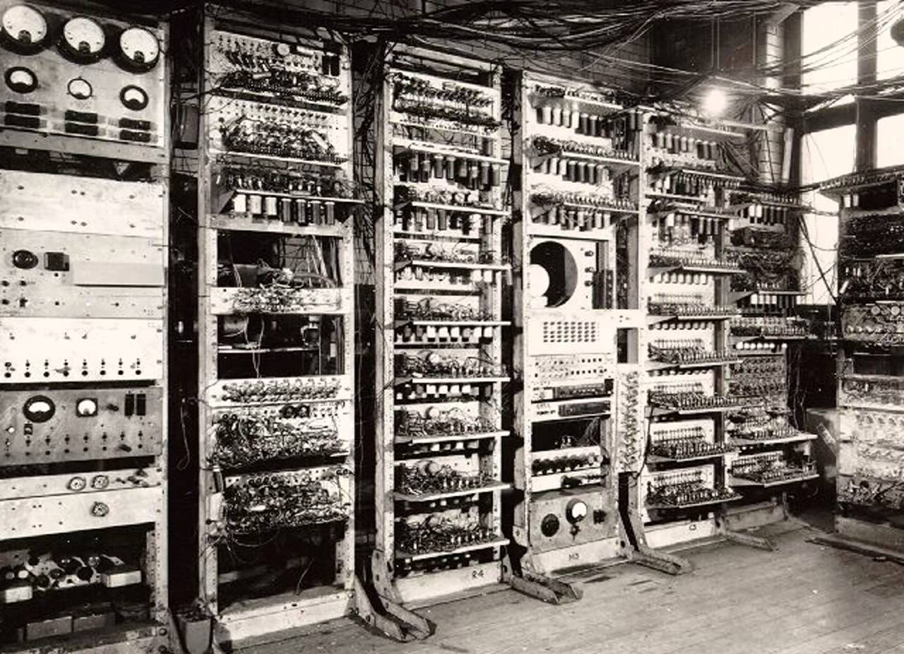
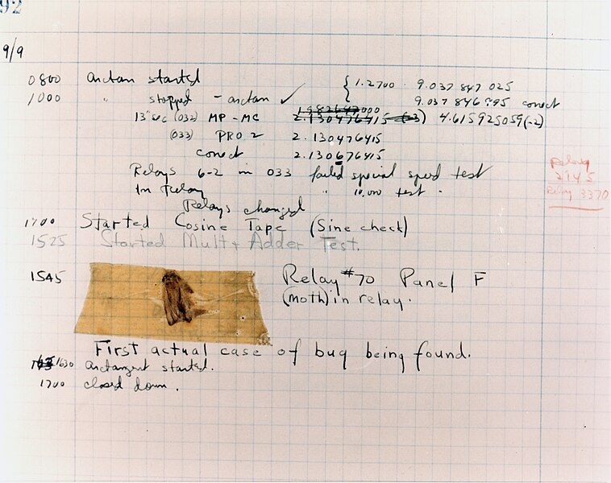
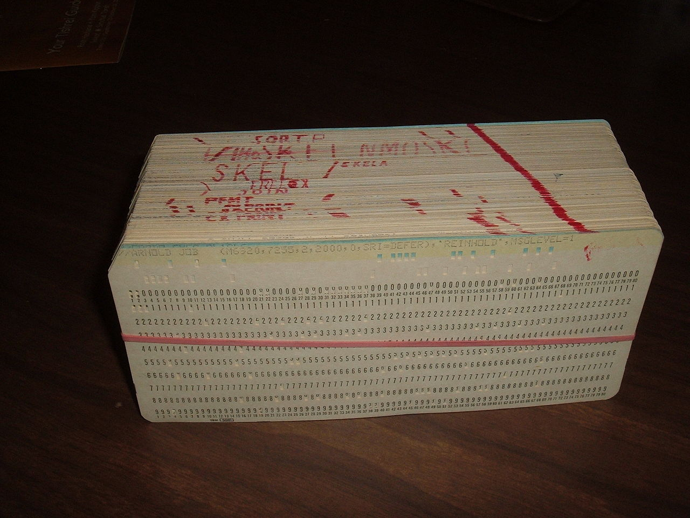
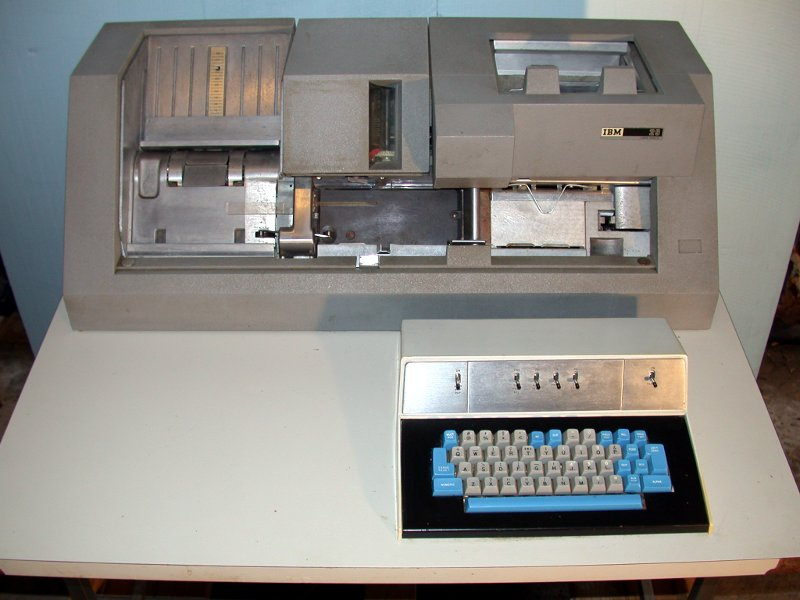
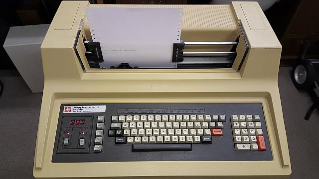
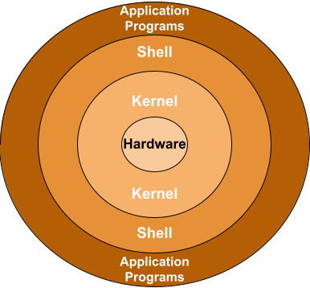
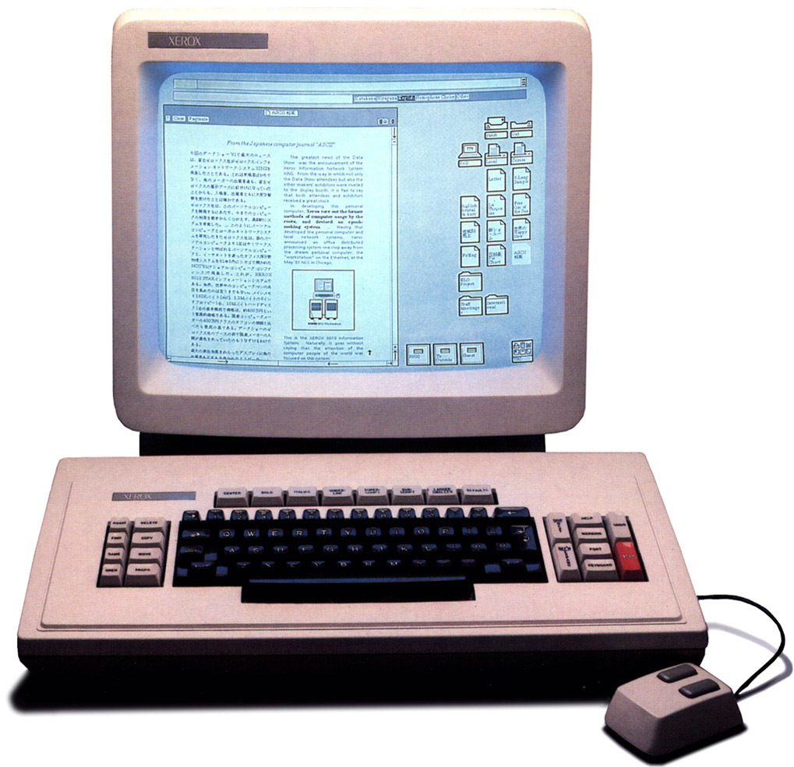

## Command Line

---

## A short history of computers & computer interfaces

<!-- slide-front-matter class: center, middle -->

For old time's sake.

---

### In the beginning (1830s)

  
&nbsp;

  

    
    Charles Babbage
  

  
&nbsp;

  

    
    Ada Lovelace
  

**Notes:**

[**Charles Babbage**][charles-babbage] originated the concept of a
[digital][digital] [programmable][programmable], [general-purpose
computer][general-purpose-computer].

[**Ada Lovelace**][ada-lovelace] published the first [algorithm][algorithm] to
be carried out by such a machine.

[ada-lovelace]: https://en.wikipedia.org/wiki/Ada_Lovelace
[algorithm]: https://en.wikipedia.org/wiki/Algorithm
[charles-babbage]: https://en.wikipedia.org/wiki/Charles_Babbage
[digital]: https://en.wikipedia.org/wiki/Digital_data
[general-purpose-computer]: https://en.wikipedia.org/wiki/Computer
[programmable]: https://en.wikipedia.org/wiki/Computer_program

---

### Analytical engine (1837)

  

    
  

  

Charles Babbage proposes a [general-purpose
computer](https://en.wikipedia.org/wiki/Computer).

In 1842, Ada Lovelace writes the [first
program](https://en.wikipedia.org/wiki/Note_G) for such a machine.

  

**Notes:**

The [Analytical Engine][analytical-engine] was a proposed mechanical
[general-purpose computer][general-purpose-computer] designed by English
mathematician and computer pioneer [Charles Babbage][charles-babbage].

In 1842, [Ada Lovelace][ada-lovelace] translated into English and extensively
annotated a description of the engine, including a way to calculate [Bernoulli
numbers][bernoulli-numbers] using the machine (widely considered to be the
[first complete computer program][note-g]). She has been described as the first
computer programmer.

[analytical-engine]: https://en.wikipedia.org/wiki/Analytical_Engine
[general-purpose-computer]: https://en.wikipedia.org/wiki/Computer
[note-g]: https://en.wikipedia.org/wiki/Note_G

---

### A century later (1940s)

<!-- slide-front-matter class: center -->

[**Alan Turing**][alan-turing]

Formalized the concepts of [algorithm][algorithm] and [computation][computation]
with the [Turing machine][turing-machine]. He is widely considered to be the
father of theoretical [computer science][computer-science] and [artificial
intelligence][artificial-intelligence].

> Did you see [The Imitation Game][the-imitation-game]?

---

### ENIAC (1946)

At that time, there was no such thing as a stored computer program.
Programs were **physically hard-coded**.
On the [ENIAC][eniac], this was done using function tables with **hundreds of ten-way switches**, which took weeks.

---

### The first computer bug (1947)

Computers like these are [electro-mechanical
computers][electro-mechanical-computers] because they were based on switches and
relays, as opposed to the [transistors][transistor] our current electronic
computers are based on.

When you had a bug in one of these computers, _debugging_ meant getting your
hands dirty and finding the [actual bug][bug] in the physical machine.

---

### Automated Computing Engine (1950s)

The [Automatic Computing Engine (ACE)][ace] was a British early electronic
serial [stored-program computer][stored-program-computer] designed by [Alan
Turing][alan-turing]. It used [mercury delay lines for its main
memory][delay-line-memory].

---

### Punched cards for computers (1950s)

<!-- slide-column -->

Many early general-purpose digital computers used [punched cards][punched-card]
for data input, output and storage.

Someone had to use a [keypunch][keypunch] machine to write your cards, then feed them to the computer.

This is what a **program** looked like:

<!-- slide-column 40 -->

> Punched cards are much older than computers.
> They were first invented around 1725.

---

### TeleTYpewriter (1960s)

Teletypewriters (TTYs) became the most popular **computer terminals** in the 1960s.
They were basically electromechanical typewriters adapted as a user interface for early [mainframe computers][mainframe].

This is when the first **command line interfaces (CLI)** were created.
As you typed commands, a program running on the computer would interpret that input,
and the output would be printed on physical paper.

---

### Video terminals (1970s)

<!-- slide-column -->

As available memory increased, **video terminals** such as the [VT100][vt100] replaced TTYs in the 1970s.

Initially they only displayed text.
Hence they were fundamentally the same as TTYs: textual input/output devices.

<!-- slide-column 65 -->

---

#### Unix & shells

It's also in this period that the [Unix][unix] operating system was developed.
Compared to earlier systems, Unix was the first **portable operating system**
because it was written in the [C programming language][c], allowing it to be installed on multiple platforms.

Unix is the ancestor of [Linux][linux].
[FreeBSD][freebsd], a Unix-like system, is also used as the basis for [macOS][macos] (since Mac OS X).

<!-- slide-column -->

In Unix-like systems, the program serving as the **command line interpreter**
(handling input/output from the terminal) is called a [**shell**][unix-shell].

> It is called this way because it is the outermost layer around the operating
> system; it wraps and hides the lower-level kernel interface.

<!-- slide-column 40 -->

---

### Graphical User Interfaces (1980s)

<!-- slide-column -->

Eventually, [graphical user interfaces (GUIs)][gui] were introduced
in reaction to the perceived steep learning curve of command line interfaces.

They are one of the most common end user computer interface today.

> Note that the GUI of a computer is also a shell. It's simply a different way
> to interact with the kernel.

<!-- slide-column 60 -->

---

### More user interfaces

Today:

- [Touch user interface][tui]
- [Voice user interface][vui]
- [Motion sensing][motion-sensing]
- [Augmented][augmented-reality] and [virtual][virtual-reality] reality

Tomorrow:

- [Brain-computer interface?][brain-interface]

[ace]: https://en.wikipedia.org/wiki/Automatic_Computing_Engine
[ada-lovelace]: https://en.wikipedia.org/wiki/Ada_Lovelace
[alan-turing]: https://en.wikipedia.org/wiki/Alan_Turing
[algorithm]: https://en.wikipedia.org/wiki/Algorithm
[analytical-engine]: https://en.wikipedia.org/wiki/Analytical_Engine
[artificial-intelligence]: https://en.wikipedia.org/wiki/Artificial_intelligence
[augmented-reality]: https://en.wikipedia.org/wiki/Augmented_reality
[bash]: https://en.wikipedia.org/wiki/Bash_(Unix_shell)
[bernoulli-numbers]: https://en.wikipedia.org/wiki/Bernoulli_number
[brain-interface]: https://en.wikipedia.org/wiki/Brain–computer_interface
[bug]: https://en.wikipedia.org/wiki/Bug_(engineering)#History
[building-the-future-of-the-command-line]: https://github.com/readme/featured/future-of-the-command-line
[c]: https://en.wikipedia.org/wiki/C_(programming_language)
[cat]: https://en.wikipedia.org/wiki/Cat_(Unix)
[charles-babbage]: https://en.wikipedia.org/wiki/Charles_Babbage
[cli]: https://en.wikipedia.org/wiki/Command-line_interface
[computation]: https://en.wikipedia.org/wiki/Computation
[computer-science]: https://en.wikipedia.org/wiki/Computer_science
[delay-line-memory]: https://en.wikipedia.org/wiki/Delay-line_memory
[digital]: https://en.wikipedia.org/wiki/Digital_data
[electro-mechanical-computers]: https://en.wikipedia.org/wiki/Mechanical_computer#Electro-mechanical_computers
[eniac]: https://en.wikipedia.org/wiki/ENIAC
[freebsd]: https://en.wikipedia.org/wiki/FreeBSD
[general-purpose-computer]: https://en.wikipedia.org/wiki/Computer
[gitbash]: https://gitforwindows.org
[gui]: https://en.wikipedia.org/wiki/Graphical_user_interface
[keypunch]: https://en.wikipedia.org/wiki/Keypunch
[lfm]: https://en.wikipedia.org/wiki/Luigi_Federico_Menabrea
[linux]: https://en.wikipedia.org/wiki/Linux
[macos]: https://en.wikipedia.org/wiki/MacOS
[mainframe]: https://en.wikipedia.org/wiki/Mainframe_computer
[motion-sensing]: https://en.wikipedia.org/wiki/Motion_detection
[nano]: https://en.wikipedia.org/wiki/GNU_nano
[node]: https://nodejs.org
[note-g]: https://en.wikipedia.org/wiki/Note_G
[oh-my-zsh]: https://ohmyz.sh
[oh-my-zsh-plugins]: https://github.com/ohmyzsh/ohmyzsh/wiki/Plugins
[oh-my-zsh-windows]: http://kevinprogramming.com/using-zsh-in-windows-terminal/
[powershell]: https://en.wikipedia.org/wiki/PowerShell
[programmable]: https://en.wikipedia.org/wiki/Computer_program
[punched-card]: https://en.wikipedia.org/wiki/Punched_card
[redirection]: https://en.wikipedia.org/wiki/Redirection_(computing)
[slide-git]: ../git
[stored-program-computer]: https://en.wikipedia.org/wiki/Stored-program_computer
[tar]: https://en.wikipedia.org/wiki/Tar_(computing)
[the-imitation-game]: https://en.wikipedia.org/wiki/The_Imitation_Game
[tldr-pages]: https://tldr.sh
[transistor]: https://en.wikipedia.org/wiki/Transistor
[tty]: https://en.wikipedia.org/wiki/Teleprinter
[tui]: https://en.wikipedia.org/wiki/Touch_user_interface
[turing-machine]: https://en.wikipedia.org/wiki/Turing_machine
[unix]: https://en.wikipedia.org/wiki/Unix
[unix-shell]: https://en.wikipedia.org/wiki/Unix_shell
[vi]: https://en.wikipedia.org/wiki/Vi_(text_editor)
[vim]: https://en.wikipedia.org/wiki/Vim_(text_editor)
[virtual-reality]: https://en.wikipedia.org/wiki/Virtual_reality
[vt100]: https://en.wikipedia.org/wiki/VT100
[vui]: https://en.wikipedia.org/wiki/Voice_user_interface
[windows-subsystem-for-linux]: https://docs.microsoft.com/en-us/windows/wsl/about
[wsl]: https://learn.microsoft.com/en-us/windows/wsl/install
[zsh]: https://en.wikipedia.org/wiki/Z_shell
[zsh-site]: http://zsh.sourceforge.net/
