# Secure Shell (SSH)

Architecture & Deployment <!-- .element: class="subtitle" -->

---

## What is SSH?

SSH is a **cryptographic network protocol** for operating network services
**securely over an unsecured network**.

---

### What is it used for?

<div class="flex flex-col gap-4">
  <div class="flex justify-center items-center gap-2">
    <iconify-icon icon="fluent:window-text-24-regular"></iconify-icon> Command line login
  </div>
  <div class="flex justify-center items-center gap-2">
    <iconify-icon icon="cib:git"></iconify-icon> Git
  </div>
  <div class="flex justify-center items-center gap-2">
    <iconify-icon icon="fluent:folder-arrow-up-24-regular"></iconify-icon> FTP
  </div>
</div>

---

### How does it work?

SSH is a **client-server** protocol.

<pre class="mermaid">
architecture-beta
    service sshcl1(fluent:window-text-24-regular)[SSH Client]
    service sshcl2(fluent:window-text-24-regular)[SSH Client]
    service sshcl3(fluent:window-text-24-regular)[SSH Client]
    service sshsrv(fluent:server-24-regular)[SSH Server]

    sshcl1:R --> L:sshsrv
    sshcl2:L --> R:sshsrv
    sshcl3:R --> T:sshsrv
</pre>

**Notes:**

Using an SSH client, a user (or application) on machine A can connect to an SSH
server running on machine B, either to log in (with a command line shell) or to
execute programs.

---

### How is it secure?

<!-- slide-column -->

**Step 1:** SSH establishes a **secure channel** using various **cryptographic
techniques**. This is handled automatically by the SSH client and server.

<!-- slide-column 50 -->

<p class='center'></p>

<!-- slide-container -->

<!-- slide-column -->

**Step 2:** The user or service that wants to connect to the SSH server must
**authenticate** to gain access, for example with a password.

<p class='center'></p>

**Step 3:** The logged-in user or service can do stuff on the server.

> Note that steps 1 and 2 are **separate and unrelated processes**.

---

## Secure channel

SSH establishes a **secure channel** between two computers **over an insecure
network** (e.g. a local network or the Internet).

<p class='center'></p>

Establishing and using this secure channel requires a combination of:

- [**Symmetric encryption**][symmetric-encryption]
- [**Asymmetric cryptography**][pubkey]
  - A **key exchange** method
  - **Digital signatures**
- [**Hash-based Message Authentication Codes (HMAC)**][hmac]

---

### Symmetric encryption

[Symmetric-key algorithms][symmetric-encryption] can be used to encrypt
communications between two or more parties using a **shared secret**. [AES][aes]
is one such algorithm.

<p class='center'>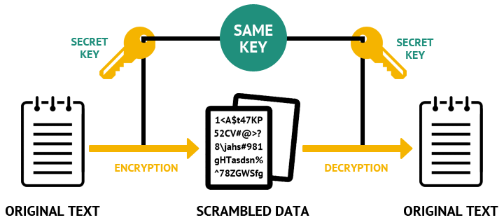</p>

**Assuming all parties possess the secret key**, they can encrypt data, send it
over an insecure network, and decrypt it on the other side. An attacker who
intercepts the data **cannot decrypt it without the key** (unless a weakness is
found in the algorithm or [its implementation][enigma-operating-shortcomings]).

---

#### Example: symmetric encryption with AES

> **Windows users using Git Bash** may want to open a new shell with the command
> `winpty bash` before attempting to reproduce these examples. This is because
> of a [bug in Git Bash](https://github.com/mintty/mintty/issues/540) which
> causes problems with some interactive commands.

Create a [**plaintext**][plaintext] file containing the words "too many secrets":

```bash
$> cd /path/to/projects

$> mkdir aes-example

$> cd aes-example

$> echo 'too many secrets' > plaintext.txt
```

You may encrypt that file with the [OpenSSL library][openssl] (installed on most
computers). Executing the following command pipeline will prompt you for an
encryption key:

```bash
$> cat plaintext.txt | openssl aes-256-cbc > ciphertext.aes
enter aes-256-cbc encryption password:
Verifying - enter aes-256-cbc encryption password:
```

---

#### Example: symmetric encryption with AES (decryption)

The resulting [**ciphertext**][ciphertext] stored in the `ciphertext.aes` file
cannot be decrypted without the key. Executing the following command pipeline
and entering the same key as before when prompted will decrypt it:

```bash
$> cat ciphertext.aes | openssl aes-256-cbc -d
enter aes-256-cbc decryption password:
too many secrets
```

> The `-d` option makes the command **d**ecrypt the provided contents instead of
> encrypting it.

---

#### Symmetric encryption over an insecure network

Both parties must already possess the shared encryption key to perform symmetric
cryptography. It used to be **physically transferred**, for example in the form
of the codebooks used to operate the German [Enigma machine][enigma] during
World War II. But that is **impractical for modern computer networks**. And
**sending the key over the insecure network risks it being compromised** by a
[Man-in-the-Middle attack][mitm].

<p class='center'>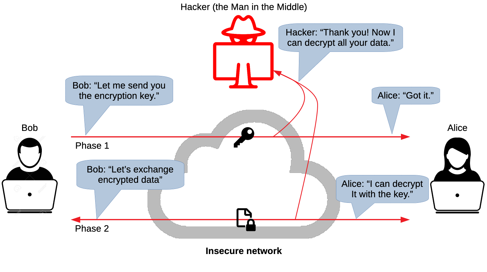</p>

---

### Asymmetric cryptography

[Public-key or asymmetric cryptography][pubkey] is any cryptographic system that
uses pairs of keys: **public keys** which may be disseminated widely, while
**private keys** which are known only to the owner. It has several use cases:

<!-- slide-column -->

**Encryption**

Encrypt and decrypt data.


<!-- slide-column -->

**Key exchange**

Securely exchange shared secret keys.

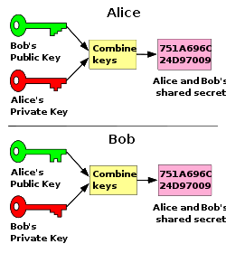

<!-- slide-column -->

**Digital Signatures**

Verify identity and protect against tampering.

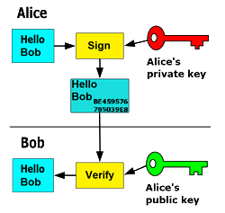

---

#### How does asymmetric cryptography work?

There is a mathematical relationship between a public and private key, based on
problems that currently admit no efficient solution such as [integer
factorization][integer-factorization], [discrete logarithm][discrete-logarithm]
and [elliptic curve][elliptic-curve] relationships.

Here's a [mathematical example][pubkey-math] based on integer factorization.

Basically, these problems allow a private-public key pair to have the following
properties:

- It is easy and **computationally economical to generate a key pair**.
- It is too **computationally expensive to find the private key** from its
  paired public key.
- Possession of the the private key allows you to solve complex mathematical
  problems based on the public key, thus **proving that you own that public
  key**.

Effective security only requires keeping the private key private; **the public
key can be openly distributed without compromising security**.

---

### Asymmetric encryption

<p class='center'>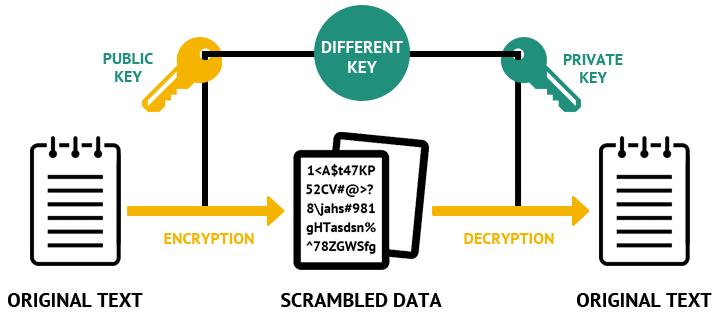</p>

One use case of asymmetric cryptography is **asymmetric encryption**, where the
**sender encrypts a message with the recipient's public key**. The message can
only be **decrypted by the recipient using the matching private key**.

---

#### Example: asymmetric encryption with RSA (key pair)

Let's try encryption with [RSA][rsa] this time, an asymmetric algorithm. To do
that, we need to generate a **key pair, i.e. a private and public key**. The
following commands will generate first a private key in a file named
`private.pem`, then a corresponding public key in a file named `public.pem`:

```bash
$> cd /path/to/projects

$> mkdir rsa-example

$> cd rsa-example

$> openssl genrsa -out private.pem 2048
Generating RSA private key, 2048 bit long modulus
.............++++++
.................................++++++
e is 65537 (0x10001)

$> openssl rsa -in private.pem -out public.pem -outform PEM -pubout
writing RSA key

$> ls
private.pem public.pem
```

> By convention, we use the `.pem` extension after the [Privacy-Enhanced Mail
> (PEM) format][pem], a de facto standard format to store cryptographic data.

---

#### Example: asymmetric encryption with RSA (encryption)

Create a file containing your **plaintext**:

```bash
$> echo 'too many secrets' > plaintext.txt
```

**Encrypt it with the public key** using the OpenSSL library:

```bash
$> openssl pkeyutl -encrypt -in plaintext.txt \
   -inkey public.pem -pubin -out ciphertext.rsa
```

> This command will read the plaintext file `plaintext.txt` specified with the
> `-in` (**in**put) option. It will also read the public key in the `public.pem`
> file with the `-inkey` (**in**put **key**) and `-pubin` (**pub**lic **in**)
> options.
>
> It will then write the encrypted ciphertext to the `ciphertext.rsa` file with
> the `-out` (**out**put) option.

In addition to your key pair, you should have two additional files containing
the plaintext and ciphertext:

```bash
$> ls
ciphertext.rsa plaintext.txt private.pem public.pem
```

---

#### Example: asymmetric encryption with RSA (decryption)

The ciphertext can now be **decrypted with the corresponding private key**:

```bash
$> openssl pkeyutl -decrypt -inkey private.pem -in ciphertext.rsa
too many secrets
```

Note that you **cannot decrypt the ciphertext using the public key**:

```bash
$> openssl pkeyutl -decrypt -inkey public.pem -in ciphertext.rsa
unable to load Private Key [...]
```

Of course, a hacker using **another private key cannot decrypt it either**:

```bash
$> openssl genrsa -out hacker-private.pem 1024
Generating RSA private key, 1024 bit long modulus [...]

$> openssl pkeyutl -decrypt -inkey hacker-private.pem -in ciphertext.rsa
RSA operation error [...]
```

Hence, you can encrypt data and send it to another party provided that you have
their public key. **No single shared key needs to be exchanged** (the private
key remains a secret known only to the recipient).

---

#### Asymmetric encryption and forward secrecy

Asymmetric encryption protects data sent over an insecure network from
attackers, but **only as long as the private keys remain private**. It does not
provide **forward secrecy**, meaning that if the private keys are compromised in
the future, all data encrypted in the past is also compromised.

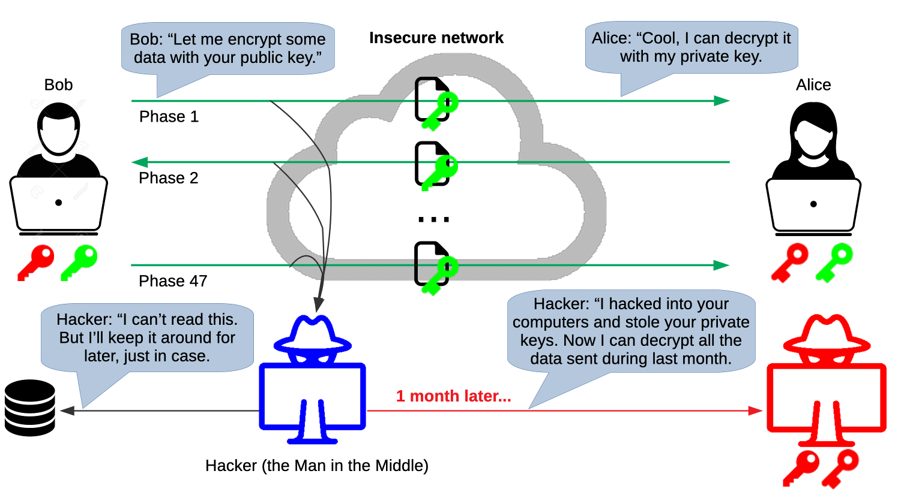

---

### Asymmetric key exchange

So far we learned that:

- Symmetric encryption works but provides no solution to the problem of securely
  transmitting the shared secret key.
- Asymmetric encryption works even better as it does not require a shared secret
  key, but it does not provide forward secrecy.

Additionally, it's important to note that **symmetric encryption is much faster
than asymmetric encryption**. It's also less complex and can easily be
implemented as hardware (most modern processors support hardware-accelerated AES
encryption).

<!-- slide-column -->

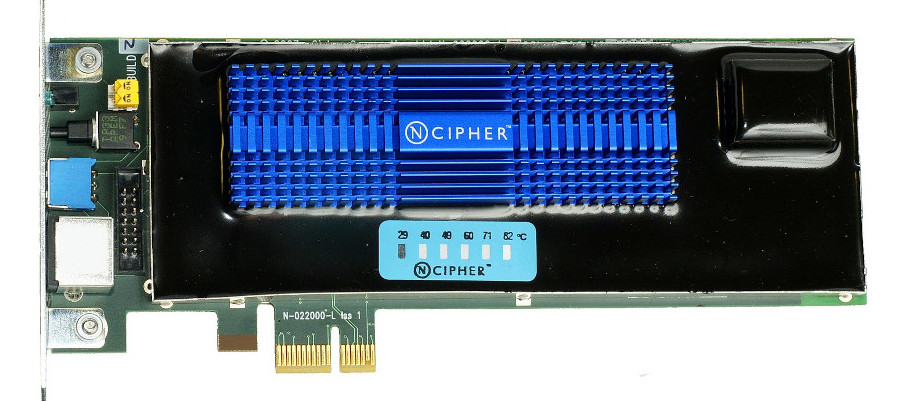

<!-- slide-column 60 -->

> This is a [hardware security module][hsm], a physical computing device that
> safeguards and manages secrets, performs encryption and decryption functions
> for digital signatures, strong authentication and other cryptographic
> functions

---

#### What can we do to improve upon asymmetric encryption?

<!-- slide-column -->

Ideally, we would want to be able to share a fast symmetric encryption key
without transmitting it physically or over the network. This is where asymmetric
cryptography comes to the rescue again. Encryption is not all it can do; it can
also do **key exchange**.

The [Diffie-Hellman Key Exchange][dh], invented in 1976 by Whitfield Diffie and
Martin Hellman, was one of the first public key exchange protocols allowing
users to **securely exchange secret keys** even if an attacker is monitoring the
communication channel.

<!-- slide-column 40 -->


---

#### Diffie-Hellman key exchange

<!-- slide-column -->

This conceptual diagram illustrates the general idea behind the protocol:

- Alice and Bob choose a **random, public starting color** (yellow) together.
- Then they each separately choose a **secret color known only to themselves**
  (orange and blue-green).
- Then they **mix their own secret color with the mutually shared color**
  (resulting in orange-tan and light-blue) and **publicly exchange** the two
  mixed colors.
- Finally, Alice and Bob **mix the color he or she received** from each other
  **with his or her own private color** (yellow-brown).

<!-- slide-column 35 -->


<!-- slide-container -->

The result is a final color mixture that is **identical to the partner's final
color mixture**, and which was never shared publicly. When using large numbers
rather than colors, it would be computationally difficult for a third party to
determine the secret numbers.

---

### Man-in-the-Middle attack on Diffie-Hellman

The Diffie-Hellman key exchange solves the problem of transmitting the shared
secret key over the network by computing it using asymmetric cryptography. It is
therefore never transmitted.

However, **a Man-in-the-Middle attack is still possible** if the attacker can
position himself between the two parties to **intercept and relay all
communications**.

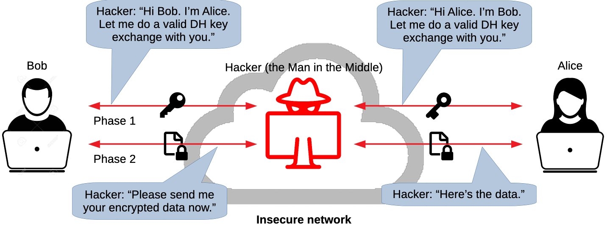

---

### Asymmetric digital signature

One of the other main uses of asymmetric cryptography is performing **digital
signatures**. A signature proves that the message came from a particular sender.

<!-- slide-column -->

- Assuming **Alice wants to send a message to Bob**, she can **use her private
  key to create a digital signature based on the message**, and send both the
  message and the signature to Bob.
- Anyone with **Alice's public key can prove that Alice sent that message**
  (only the corresponding private key could have generated a valid signature for
  that message).
- **The message cannot be tampered with without detection**, as the digital
  signature will no longer be valid (since it based on both the private key and
  the message).

<!-- slide-column 30 -->


<!-- slide-container -->

> Note that a digital signature **does not provide confidentiality**. Although
> the message is protected from tampering, it is **not encrypted**.

---

#### Example: digital signature with RSA (signing)

In the same directory as the previous example (asymmetric encryption with RSA),
create a `message.txt` file with the message that we want to digitally sign:

```bash
$> echo "Hello Bob, I like you" > message.txt
```

The following OpenSSL command will use the private key file `private.pem` (from
the previous example) and generate a digital signature based on the message file
`message.txt`. The signature will be stored in the file `signature.rsa`.

```bash
$> openssl dgst -sha256 -sign private.pem -out signature.rsa message.txt
```

If you open the file, you can see that it's simply binary data. You can see it
base64-encoded with the following command:

```bash
$> openssl base64 -in signature.rsa
```

---

#### Example: digital signature with RSA (verifying)

The following command uses the public key to check that the signature is valid
for the message:

```bash
$> openssl dgst -sha256 -verify public.pem -signature signature.rsa message.txt
Verified OK
```

If you modify the message file and run the command again, it will detect that
the digital signature no longer matches the message:

```bash
$> openssl dgst -sha256 -verify public.pem -signature signature.rsa message.txt
Verification Failure
```

---

### Cryptographic hash functions

<!-- slide-column -->

A [cryptographic hash function][hash] is a [hash function][hash-non-crypto] that
has the following properties:

- The same message always results in the same hash (deterministic).
- Computing the hash value of any message is quick.
- It is infeasible to generate a message from its hash value except by trying
  all possible messages (one-way).

<!-- slide-column 45 -->

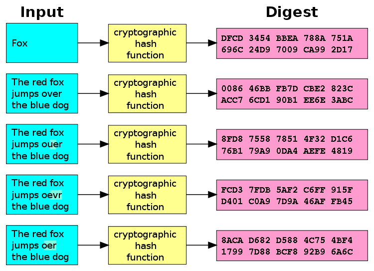

<!-- slide-container -->

- A small change to a message should change the hash value so extensively that
  the new hash value appears uncorrelated with the old hash value.
- It is infeasible to find two different messages with the same hash value
  (collisions).

SSH uses [Message Authentication Codes (MAC)][mac], which are based on
cryptographic hash functions, to protect both the data integrity and
authenticity of all messages sent through the secure channel.

---

### Combining it all together in SSH

SSH uses most of the previous cryptographic techniques together to achieve as
secure a channel as possible:


---

#### Man-in-the-Middle attack on SSH

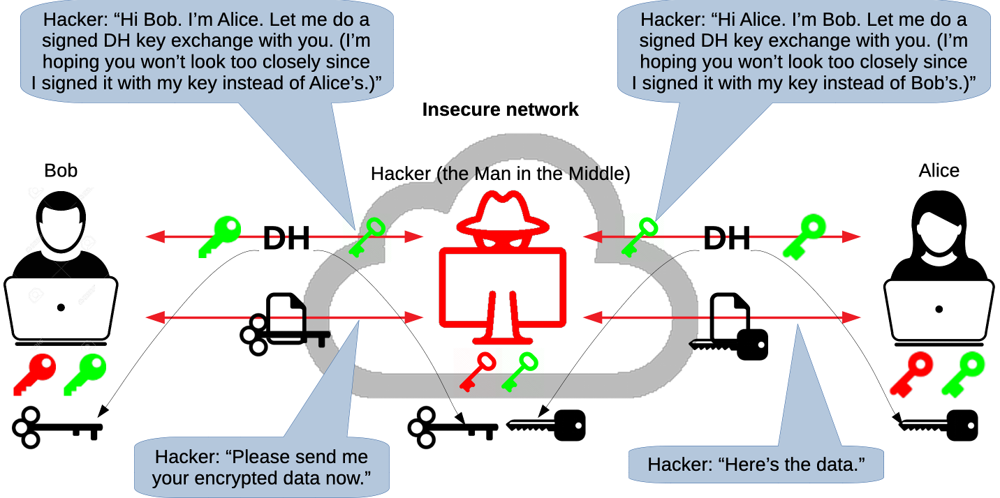

---

#### Threats countered

SSH counters the following threats:

- **Eavesdropping:** an attacker can intercept but not decrypt communications
  going through SSH's secure channel.
- **Connection hijacking:** an active attacker can hijack TCP connections due to
  a weakness in TCP. SSH's integrity checking detects this and shuts down the
  connection without using the corrupted data.
- **DNS and IP spoofing:** an attacker may hack your naming service to direct
  you to the wrong machine.
- **Man-in-the-Middle attack:** an attacker may intercept all traffic between
  you and the real target machine.

The last two are countered by the asymmetric digital signature performed by the
server on the DH key exchange, **as long as the client actually checks the
server-supplied public key**. Otherwise, there is no guarantee that the server
is genuine.

---

#### Threats not countered

SSH does not counter the following threats:

<!-- slide-column -->

- **Password cracking:** if password authentication is enabled, a weak password
  might be easily brute-forced or obtained through [side-channel
  attacks][side-channel]. Consider using public key authentication instead to
  mitigate some of these risks.

<!-- slide-column -->

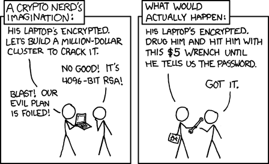

<!-- slide-container -->

- **IP/TCP denial of service:** since SSH operates on top of TCP, it is
  vulnerable to attacks against weaknesses in TCP and IP, such as [SYN
  flood][syn-flood].
- **Traffic analysis:** although the encrypted traffic cannot be read, an
  attacker can still glean a great deal of information by simply analyzing the
  amount of data, the source and target addresses, and the timing.
- **Carelessness and coffee spills:** SSH doesn't protect you if you write your
  password on a post-it note and paste it on your computer screen.
- **Genius mathematicians:** did you see [Sneakers][sneakers]?
