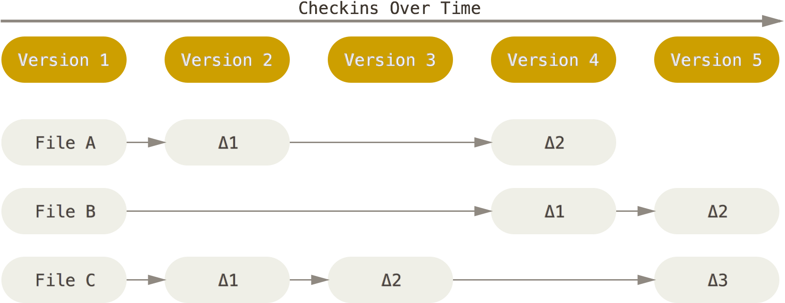

# {{ page.title }}

Architecture & Deployment <!-- .element: class="subtitle" -->

---

## What is Git?

[Git][git] is a [**version control system (VCS)**][vcs] originally developed by
Linus Torvalds to work on Linux.


**Notes:**

Linus Torvals is the creator of Linux. He created Git to manage the source code
of the Linux kernel, because the alternatives were proprietary and did not
support the kind of workflow he wanted to develop Linux with.

---

### Design goals

- **Speed**
- **Simple** design
- Strong support for **non-linear development**
- Fully **distributed**
- Able to handle **large projects**

**Notes:**

The Linux is a large and complex piece of code, and it has thousands of
contributors. A version control system was needed that could handle thousands of
parallel branches and handle a project of that size with speed and efficiency
(data size).

---

### What is a version control system?

> A system that **records changes** to a file or set of files over time so that
> you can **recall specific versions later**.


---

### What can I do with it?

- **Revert** files back to a previous state
- **Compare** changes over time
- See **who last modified something**
- **Recover** if you screw things up
- **Collaborate** as a distributed team

---

## A short history

---

### **Local** version control systems (1980s)

<div class="grid grid-cols-5 gap-4">
  <div class="col-span-3">

- Easy to <strong class="text-error">accidentally edit the wrong files</strong>
- <strong class="text-error">Hard to collaborate</strong> on different versions with other people

  </div>
  <div class="col-span-2">
    
  </div>
</div>

**Notes:**

Basically, you **manually** copy your files into other directories to keep old
versions.

[**R**evision **C**ontrol **S**ystem (RCS)][rcs], first released in 1982,
automates this process.

---

### **Centralized** version control systems (1990s)

<div class="grid grid-cols-5 gap-4">
  <div class="col-span-3 text-3xl">

- <strong class="text-success">Fine-grained administrator control</strong>
- <strong class="text-error">Slow</strong> (many network operations)
- <strong class="text-error">Single point of failure</strong>
- History <strong class="text-error">can be lost</strong> without backups

  </div>
  <div class="col-span-2">
    
  </div>
</div>

**Notes:**

Centralized version control systems are based on a **single central server**
that keeps all the versioned files.

[**C**oncurrent **V**ersion **S**ystems (CVS)][cvs] and [**S**ub**v**ersio**n**
(SVN)][svn] are such systems that were first released in 1990 and 2000,
respectively.

You could also consider storing your files in a shared Dropbox, Google Drive,
etc. to be a kind of centralized version control system. However, it doesn't
have as many tools for **consulting and manipulating the history** of your
project, or to **collaborate on source code**.

---

### **Distributed** version control systems (2000+)

<div class="grid grid-cols-5 gap-4">
  <div class="col-span-3 text-4xl">

- Each client has a <strong class="text-success">full copy</strong> of the
  project, so operations are local and <strong
  class="text-success">fast</strong>.
- Basically any <strong class="text-success">collaborative workflow</strong> is
  possible.
- <strong class="text-success">Administrators still have control</strong> over
their servers (but not collaborators' machines).

  </div>
  <div class="col-span-2">
    
  </div>
</div>

**Notes:**

Systems such as [Git][git] and [Mercurial][mercurial] are **distributed**. This
enables [various types of collaborative workflows][distributed-workflows], since
the team can organize itself however it wants.

Clients **fully mirror** the repository, not just the latest snapshot. Because
Git stores all versions of all files **locally**, most Git operations are almost
instantaneous and do not require a connection to a server:

- Browsing the history
- Checking a file's changes from a month ago
- Committing

Git and Mercurial were first released in 2005.

---

## Git basics

---

### Snapshots, not differences

<div class="grid grid-cols-2 gap-4">
  <div>
    
    Subversion
  </div>
  <div>
    
    Git
  </div>
</div>

**Notes:**

Unlike other version control systems, Git stores its data as **snapshots**
instead of file-based changes. Git thinks of its data like a set of
**snapshots** of a miniature filesystem.

Every time you save the state of your project in Git, it basically takes a
picture of what all your files look like at that moment and stores a reference
to that snapshot. To be efficient, **if files have not changed, Git doesn't
store the file again**, just a link to the previous identical file it has
already stored. Git thinks about its data more like a stream of snapshots.

---

### Git has integrity

All Git objects are identified by a [SHA-1][sha1] digest:

```
24b9da6552252987aa493b52f8696cd6d3b00373
```

You will see them all over the place in Git.
Often you will only see a prefix (the first 6-7 characters):

```
24b9da6
```

**Notes:**

SHA-1 is a [hash function][cryptographic-hashfunction] and provides integrity.
Because all content is [hashed][hash], it's virtually impossible for files to be
lost or corrupted without Git knowing about it. This functionality is built into
Git at the lowest levels and is integral to its philosophy.

---

### What's in a Git project?

```bash [|2-5,7-8|1,9-12|6]
my-project:       # the working directory
┣━━ .git:         # the git directory
┃   ┣━━ HEAD
┃   ┣━━ config
┃   ┣━━ hooks
┃   ┣━━ index     # the staging area
┃   ┣━━ objects
┃   ┗━━ ...
┣━━ file1.txt
┣━━ file2.txt
┗━━ dir:
    ┗━━ file3.txt
```

**Notes:**

A Git project has three main parts:

- The **Git directory**: this is where Git stores all the **snapshots** of the
  different **versions** of your files. This is the most important part of Git,
  and it is what is copied when you clone a repository from another computer or
  a server.

  You should never modify any of the files in this directory yourself; you could
  easily corrupt the Git repository. It is hidden by default, but you can see it
  on the command line.

- The **working directory**: it contains the **files you are currently working
  on**; that is, **one specific version** of your project. These files are
  pulled out of the compressed database in the Git directory and placed in your
  project's directory for you to use or modify:
- The **staging area** (also called the **index**), that stores information
  about **what will go into the next commit (or version)**.

  Before file snapshots are **committed** in the Git directory, they must go
  through the _staging area_.

---

### The basic Git workflow


**Notes:**

This is one of the **most important things to remember about Git**:

- You **check out** (or **switch to**) a specific version of your files into the
  _working directory_.
- You **modify** files (or add new files) in your _working directory_.
- You **stage** the files, adding snapshots of them to your _staging area_.
- You make a **commit**, which takes the files as they are in the _staging area_
  and stores these snapshots permanently to your _Git directory_.

---

### Using the staging area


**Notes:**

New snapshots of files **MUST go through the staging area** to be **committed**
into the Git directory.

[cryptographic-hash-function]: https://en.wikipedia.org/wiki/Cryptographic_hash_function
[cvs]: https://en.wikipedia.org/wiki/Concurrent_Versions_System
[distributed-workflows]: https://git-scm.com/book/en/v2/Distributed-Git-Distributed-Workflows
[dsstore]: https://en.wikipedia.org/wiki/.DS_Store
[git]: https://git-scm.com
[git-log]: https://git-scm.com/book/en/v2/Git-Basics-Viewing-the-Commit-History
[git-log-pretty-formats]: https://git-scm.com/docs/git-log#_pretty_formats
[hash]: https://en.wikipedia.org/wiki/Hash_function
[install-git]: https://git-scm.com/book/en/v2/Getting-Started-Installing-Git
[mercurial]: https://www.mercurial-scm.org/
[rcs]: https://en.wikipedia.org/wiki/Revision_Control_System
[sha1]: https://en.wikipedia.org/wiki/SHA-1
[svn]: https://subversion.apache.org/
[vcs]: https://en.wikipedia.org/wiki/Version_control
