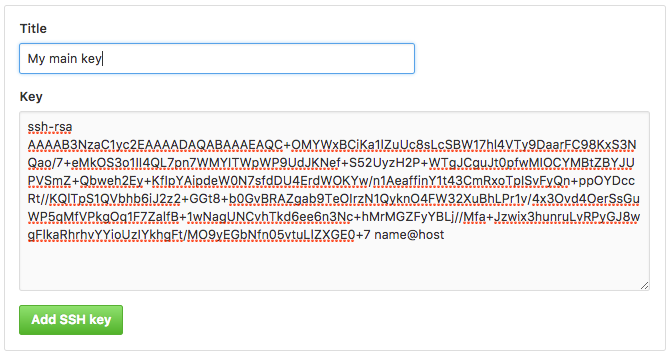
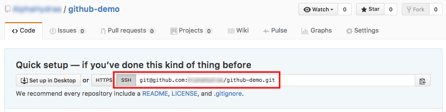

Learn how to collaborate on [GitHub][github] with [Git][git].

This tutorial is meant to be performed by a group of two. Throughout the rest of
the document, the members of the group will be referred to as **Bob** and
**Alice**.

The tutorial follows the [previous Git branching tutorial][git-tutorial]. If you
have done this demonstration on your computer, you can continue from there,
otherwise we will provide a repository with the correct starting state.

<!-- more -->

**You will need**

- [Git][git]
- A free [GitHub][github] account
- A Unix CLI

**Recommended reading**

- [Version control with Git]()
- [Git branching]()
- [Collaborating with Git]()

**Going further**

- [Git Branching - Remote Branches](https://git-scm.com/book/en/v2/Git-Branching-Remote-Branches)
- [Distributed Git](https://git-scm.com/book/en/v2/Distributed-Git-Distributed-Workflows)

## :exclamation: Create a free GitHub account

Both group members should register on [GitHub][github]:


### :question: Check your SSH key

To push code to GitHub, you will need to **authenticate** yourself. There are
two methods of authentication: HTTPS username/password or SSH keys. We will use
an **SSH key** in this course. You can check if you have one already with this
command:

```bash
$> ls ~/.ssh
id_ed25519  id_ed25519.pub
```

If you see these files, then you already have an SSH key pair (`id_ed25519` is
the **private** key, `id_ed25519.pub` is the **public** key, or it might be
`id_rsa` and `id_rsa.pub` for older SSH clients).



Using an SSH key arguably simplifies authentication. If you don't have a
password on your private SSH key, you won't have to enter one when you use Git
over SSH either. If you have a password, you should already have learned to use
an SSH agent to avoid having to enter your password every time. Git will also
use the agent to authenticate.



### :question: Create an SSH key

If you don't have a key yet (or see a _"No such file or directory"_ error), use
the `ssh-keygen` command to generate a new key pair (press Enter at every prompt
to keep the defaults):

```bash
$> ssh-keygen
Generating public/private rsa key pair.
Enter file in which to save the key (/home/.ssh/id_ed25519):
Enter passphrase (empty for no passphrase):
Enter same passphrase again:
Your identification has been saved in /home/.ssh/id_ed25519.
Your public key has been saved in /home/.ssh/id_ed25519.pub.
The key fingerprint is:
SHA256:ULmjUQDN4Snkh0s9u093mcva4cI94cDk name@host
```



Read [SSH Key Protection](#key-protection)
again as a reminder on whether or not to set a passphrase.



### :exclamation: Copy the SSH key

To authenticate using your SSH key on GitHub, you will need to copy your
**public key**. You can display it on the CLI with this command:

```bash
$> cat ~/.ssh/id_ed25519.pub
ssh-ed25519 AAAAC3NzaC1lZDI1NTE5AAAAIB1TC4yqQYmOARxMMks71fUduU1Og+i name@host
```



The file might be `~/.ssh/id_rsa.pub` with older SSH clients that still use RSA
as the default algorithm. **DO NOT** copy the private key (the
`~/.ssh/id_ed25519` or `~/.ssh/id_rsa` file).



### :exclamation: Add the SSH key to your GitHub account

On GitHub, find the **SSH and GPG keys** section of your account settings.




<!-- col md:col-span-4 -->

Paste your **public SSH key** there:



(The title of the key is not important. It's useful when you have multiple keys,
to remember which is which.)



## :exclamation: Share changes

Let's start sharing stuff by pushing, cloning and pulling.

### :question: Bob: clone the starting state

If **Bob** has performed the [calculator exercise](), he should continue from that
repository. Otherwise, he should clone the [Hello GitHub exercise
repository](https://github.com/ArchiDep/hello-github-ex) as a clean starting
state:

```bash
$> git clone https://github.com/ArchiDep/hello-github-ex.git
```

Then move into the repository and delete the remote:

```bash
$> cd hello-github-ex
$> git remote rm origin
```

### :exclamation: Bob: create a repository on GitHub

**Bob** should create a repository from the GitHub menu:




<!-- col md:col-span-4 -->




### :exclamation: Bob: add Alice as a collaborator

For this tutorial, both team members will need push access to the repository.
**Bob** should go to the repository's **collaborator settings**, and add the
GitHub username of **Alice** as a collaborator:


**Alice** must then **_accept the invitation sent by e-mail_** for the change to
be effective.

### :exclamation: Bob: copy the remote SSH URL

**Bob** should copy the SSH URL of the GitHub repository:





Be sure to select the **SSH** URL, not the **HTTPS** URL (which might be
selected by default).



### :exclamation: Bob: add the remote to your local repository

**Bob** should move into his local repository and add the GitHub repository as a
remote:

```bash
$> cd /path/to/projects/git-branching-or-hello-github-ex

$> git remote add origin git@github.com:bob/github-demo.git
```



It's a convention to name the default remote **origin**.



You can check what remotes are available with `git remote`:

```bash
$> git remote -v
origin  git@github.com:bob/github-demo.git (fetch)
origin  git@github.com:bob/github-demo.git (push)
```



The `-v` (**v**erbose) option makes the `git remote` command display more
information. Without it, the URLs are not shown.



### :exclamation: Bob: push your commits to the shared repository

It's time for **Bob** to put the code in the shared GitHub repository. This is
done using the `git push` command:

```bash
$> git push -u origin main
Counting objects: 35, done.
Delta compression using up to 8 threads.
Compressing objects: 100% (33/33), done.
Writing objects: 100% (35/35), 4.16 KiB | 0 bytes/s, done.
Total 35 (delta 14), reused 11 (delta 2)
remote: Resolving deltas: 100% (14/14), done.
To github.com:bob/github-demo.git
 * [new branch]      main -> main
```

The command `git push <remote> <branch>` tells Git to push the commit pointed to
by `<branch>` to the remote named `<remote>`.

The `-u` option (or `--set-upstream`) tells Git to remember that you have linked
this branch to that remote.

### :exclamation: Bob: remote branches

The commit objects and file snapshots have been **pushed** (or uploaded) to the
GitHub repository. This includes not only the commit pointed to by main, but
also the **entire history** of the repository up to that commit.

<git-memoir name='github' chapter='bob-push' svg-height='350px' style='--memoir-min-height: 350px'></git-memoir>

Note the **origin/main** branch that has appeared in your local repository. This
is a **remote-tracking branch**. It tells you where the **main** branch points
to on the **origin** remote (the GitHub repository in this case).

### :exclamation: Alice: get the remote repository's SSH URL

**Alice** can now go to the repository's page on GitHub (under **Bob**'s
account) and copy the SSH URL:




Again, be sure to select the **SSH** URL, not the **HTTPS** URL (which might be
selected by default).



### :exclamation: Alice: clone the shared repository

**Alice** can now get a copy of the shared GitHub repository on her machine.
This is done using the `git clone` command:

```bash
$> git clone git@github.com:bob/github-demo.git
Cloning into 'github-demo'...
remote: Counting objects: 35, done.
remote: Compressing objects: 100% (21/21), done.
remote: Total 35 (delta 14), reused 35 (delta 14), pack-reused 0
Receiving objects: 100% (35/35), 4.16 KiB | 0 bytes/s, done.
Resolving deltas: 100% (14/14), done.

$> cd github-demo
```

The `git clone [url]` command copies the **remote** repository to your machine.

### :exclamation: Alice: remote branches

The entire history of the project is **pulled** (or downloaded) from the GitHub
repository. Git will also automatically switch to the **main** branch in the
working directory so you have something to work from.

<git-memoir name='github' chapter='alice-pull' svg-height='525px' style='--memoir-min-height: 525px'></git-memoir>

Again, Git has created a **remote-tracking branch** in Alice's repository,
so that you can know what the current state of the remote is.

### :exclamation: Alice: make local changes

**Alice** thinks that the project's file names are too long. Let's fix that:

```bash
$> mv addition.js add.js
$> mv subtraction.js sub.js
$> git add .
$> git commit -m "Shorter file names"
```

### :exclamation: Alice: check the state of branches

This is now the state of the shared repository and **Alice**'s local repository.

<git-memoir name='github' chapter='alice-commit' svg-height='350px' style='--memoir-min-height: 350px'></git-memoir>

There is a new commit in **Alice**'s repository that is not in the shared GitHub
repository.

### :exclamation: Alice: push to the shared repository

Push to update the shared repository:

```bash
$> git push origin main
```

<git-memoir name='github' chapter='alice-push' svg-height='525px' style='--memoir-min-height: 525px'></git-memoir>

### :exclamation: Bob: check the state of branches

This is now the state from **Bob**'s perspective.

Note that the new commit is in the shared repository (on GitHub) but that the
remote-tracking branch origin/main **is not up-to-date** in **Bob**'s
repository.

<git-memoir name='github' chapter='bob-look' controls='false' svg-height='350px' style='--memoir-min-height: 350px'></git-memoir>

Git does not automatically synchronize repositories. **As far as Bob knows**
looking at information from his local repository, the main branch still points
to `4f94ba` in the shared repository.

### :exclamation: Bob: fetch changes from the shared repository

**Bob** should now get the changes from the shared repository:

```bash
$> git fetch origin
remote: Counting objects: 2, done.
remote: Compressing objects: 100% (1/1), done.
remote: Total 2 (delta 1), reused 2 (delta 1), pack-reused 0
Unpacking objects: 100% (2/2), done.
From github.com:bob/github-demo
   4f94ba..92fb8c  main     -> origin/main
```

The new commit is now here and the remote-tracking branch has been updated.

<git-memoir name='github' chapter='bob-fetch' svg-height='525px' style='--memoir-min-height: 525px'></git-memoir>

However, the local main branch **has not moved** and the working directory has
**not been updated**.

### :exclamation: Bob: merge fetched changes

Now you can use `git merge` like in the previous tutorial to bring the changes
of origin/main into main:

```bash
$> git merge origin/main
Updating 4f94ga..92fb8c
Fast-forward
 addition.js => add.js | 0
 1 file changed, 0 insertions(+), 0 deletions(-)
 rename addition.js => add.js (100%)
```

As expected, main has been fast-forwarded to the commit pointed to by
origin/main and the working directory has been updated.

<git-memoir name='github' chapter='bob-merge' svg-height='525px' style='--memoir-min-height: 525px'></git-memoir>

**Bob**'s repository is now up-to-date.



You can also use `git pull [remote] [branch]` to save time.

The following command:

```bash
$> git pull origin main
```

Is equivalent to running the two commands we just used:

```bash
$> git fetch origin
$> git merge origin/main
```



## :exclamation: Managing conflicting commit histories

Let's create and fix a conflict.

### :exclamation: Bob: fix the bug

**Bob** now notices that the last change breaks the calculator. This is because
the files were renamed, but the `<script>` tags in `index.html` were not
updated. Fix that bug, then commit and push the change:

```bash
(Make the fix...)
$> git add index.html
$> git commit -m "Fix bad <script> tags"
$> git push origin main
```

<git-memoir name='github' chapter='bob-fix' svg-height='525px' style='--memoir-min-height: 525px'></git-memoir>

### :exclamation: Alice: make other changes

**Alice**, not having noticed the bug, proceeds to make 2 changes on
`index.html`:

- Add an `<h2>` title before each computation.
- Add the `defer` attribute to the three `<script>` tags at the bottom to speed
  up page loading.

```html
<h2>Addition</h2>
<p id="addition">...</p>

<h2>Subtraction</h2>
<p id="subtraction">...</p>

<script src="calculations.js" defer></script>
<script src="addition.js" defer></script>
<script src="subtraction.js" defer></script>
```

### :exclamation: Alice: push the other changes

Commit and then push the changes:

```bash
$> git add index.html
$> git commit -m "Improve layout"
```

<git-memoir name='github' chapter='alice-fix' svg-height='525px' style='--memoir-min-height: 525px'></git-memoir>

```bash
$> git push origin main
```

### :exclamation: Rejected pushes

The push was **rejected** by the remote repository. Why?

```bash
To github.com:bob/github-demo.git
 ! [rejected]        main -> main (fetch first)
error: failed to push some refs to 'git@github.com:bob/github-demo.git'
hint: Updates were rejected because the remote contains work that you do
hint: not have locally. This is usually caused by another repository pushing
hint: to the same ref. You may want to first integrate the remote changes
hint: (e.g., 'git pull ...') before pushing again.
hint: See the 'Note about fast-forwards' in 'git push --help' for details.
```

This is the state of **Alice**'s repository right now, compared to the state of
shared repository:

<git-memoir name='github' chapter='alice-fix-check' controls='false' svg-height='350px' style='--memoir-min-height: 350px'></git-memoir>

#### :exclamation: Alice: fetch the changes

Since Git tells Alice that the local copy of the remote repository is out of
date, try fetching those changes:

```bash
$> git fetch origin
```

<git-memoir name='github' chapter='alice-fetch-changes' svg-height='600px' style='--memoir-min-height: 600px'></git-memoir>

#### :exclamation: Alice: try to push again

The push is **rejected again**! **Why?**

```bash
$> git push origin main
To github.com:bob/github-demo.git
 ! [rejected]        main -> main (non-fast forward)
error: failed to push some refs to 'git@github.com:bob/github-demo.git'
hint: Updates were rejected because the tip of your current branch is behind
hint: its remote counterpart. Integrate the remote changes (e.g.
hint: 'git pull ...') before pushing again.
hint: See the 'Note about fast-forwards' in 'git push --help' for details.
```

This is the state of **Alice**'s and the shared repository right now:

<git-memoir name='github' chapter='alice-fetch-changes-check' controls='false' svg-height='425px' style='--memoir-min-height: 425px'></git-memoir>

### :exclamation: Divergent history

The conflict occurred for the same reason as in the previous tutorial: **Bob**
and **Alice**'s work have diverged from a common ancestor (`92fb8c` in this
example).

<git-memoir name='github' chapter='alice-fetch-changes-check-both' controls='false' svg-height='600px' style='--memoir-min-height: 600px'></git-memoir>

A remote repository will **only accept fast-forward pushes** by default.

### :exclamation: Alice: pull changes from the shared repository

**Alice** wants to fetch **and** merge the changes made by **Bob**.
Let's use the `git pull` command:

```bash
$> git pull origin main
remote: Counting objects: 3, done.
remote: Compressing objects: 100% (2/2), done.
remote: Total 3 (delta 1), reused 3 (delta 1), pack-reused 0
Unpacking objects: 100% (3/3), done.
From github.com:bob/github-demo
 * branch            main     -> FETCH_HEAD
   92fb8c..3ff531    main     -> origin/main
Auto-merging index.html
CONFLICT (content): Merge conflict in index.html
Automatic merge failed; fix conflicts and then commit the result.
```



If the `git pull` command fails with a warning about reconciling divergent
branches, see the [troubleshooting tip about configure Git's merge
behavior](#boom-alices-git-pull-command-fails-with-a-warning).



The fetch succeeded, but the merge failed because of a **conflict** on
`index.html`.



As we've seen before, a `pull` is equivalent to a `fetch` followed by a `merge`.



### :exclamation: Alice: check the conflict markers

**Alice** should take a look at `index.html`:

```txt
<<<<<<< HEAD
    <script src="calculations.js" defer></script>
    <script src="addition.js" defer></script>
    <script src="subtraction.js" defer></script>
=======
    <script src="calculations.js"></script>
    <script src="add.js"></script>
    <script src="sub.js"></script>
>>>>>>> 3ff5311406e73c7d2cc1691f9535214c2543937f
```

Let's combine the fix of renaming the files and the `defer` change, and remove
the conflict markers:

```txt
    <script src="calculations.js" defer></script>
    <script src="add.js" defer></script>
    <script src="sub.js" defer></script>
```

Mark the conflict as resolved and finish the merge:

```bash
$> git add index.html
$> git commit -m "Merge origin/main"
```

### :exclamation: Alice: check the state of branches

Now the state of **Alice**'s local repository is consistent with the state of
the shared repository: the commit pointed to by `main` is ahead of the commit
pointed to by `origin/main`.

<git-memoir name='github' chapter='alice-pull-changes' svg-height='600px' style='--memoir-min-height: 600px'></git-memoir>

### :exclamation: Alice: push the changes

The push will be accepted now:

```bash
$> git push origin main
```

<git-memoir name='github' chapter='alice-push-merge' svg-height='600px' style='--memoir-min-height: 600px'></git-memoir>

### :exclamation: Bob: pull the changes

**Bob** can now pull those latest changes to keep up-to-date:

```bash
$> git pull origin main
```

<git-memoir name='github' chapter='bob-pull-merge' svg-height='675px' style='--memoir-min-height: 675px'></git-memoir>

## :checkered_flag: What have I done?

During this exercise, you have learned how to collaborate using Git and GitHub.
You've practiced creating repositories, making commits, pushing and pulling
changes. You've also explored how to contribute to projects, review changes, and
resolve merge conflicts, gaining hands-on experience with essential tools for
team-based software development.

## :boom: Troubleshooting

Here's a few tips about some problems you may encounter during this exercise.

### :boom: Alice's `git pull` command fails with a warning

If you see a warning that looks like this the first time you try to use `git
pull`:

```bash
$> git pull origin main
hint: You have divergent branches and need to specify how to reconcile them.
hint: You can do so by running one of the following commands sometime before
hint: your next pull:
hint:
hint:   git config pull.rebase false  # merge
hint:   git config pull.rebase true   # rebase
hint:   git config pull.ff only       # fast-forward only
hint:
hint: You can replace "git config" with "git config --global" to set a default
hint: preference for all repositories. You can also pass --rebase, --no-rebase,
hint: or --ff-only on the command line to override the configured default per
hint: invocation.
fatal: ...
```

It's because Git used to define some behaviors by default, like whether to
create a merge commit when merging divergent branches, but you now have to
specify which behavior you prefer.

You can solve this issue by running the following command once on your machine:

```bash
git config --global pull.rebase false
```

This will configure Git to always create a merge commit when merging divergent
branches, which used to be the default and is what most people do.



With the `--global` option, this setting will be saved in your global
`~/.gitconfig` file, and you won't have to do the same thing for other
repositories on your machine.



You can then re-run your pull command, which should work this time.

[git]: https://git-scm.com

[git-tutorial]: 
[github]: https://github.com
