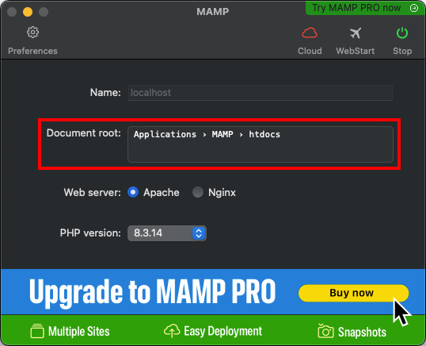
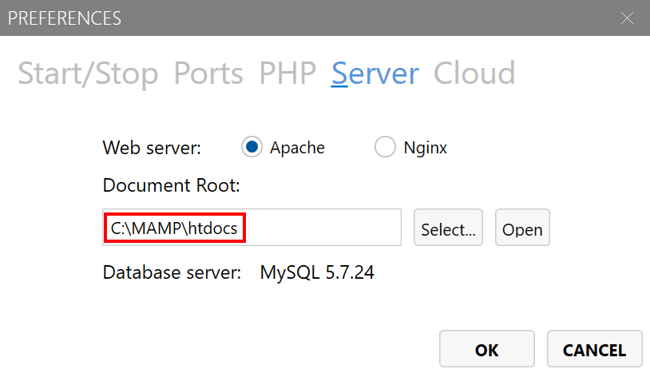
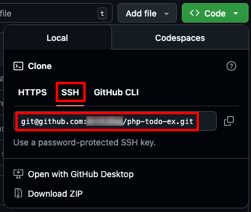
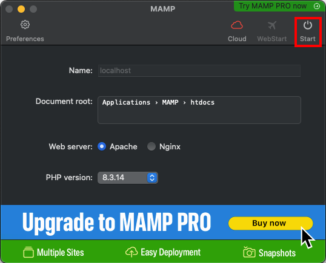
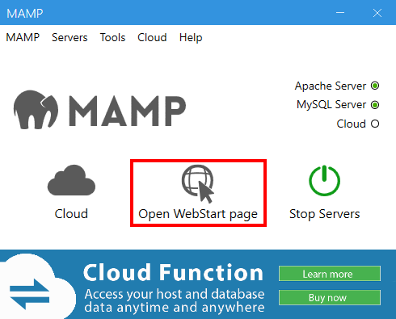
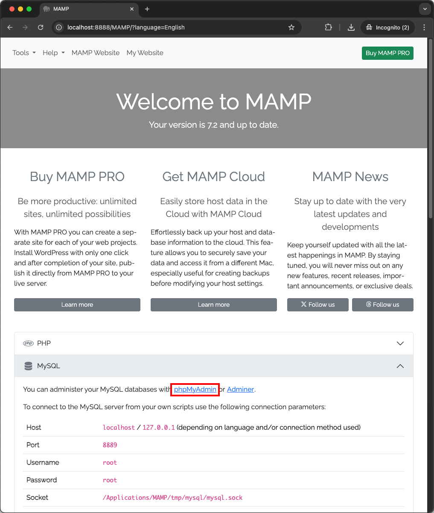
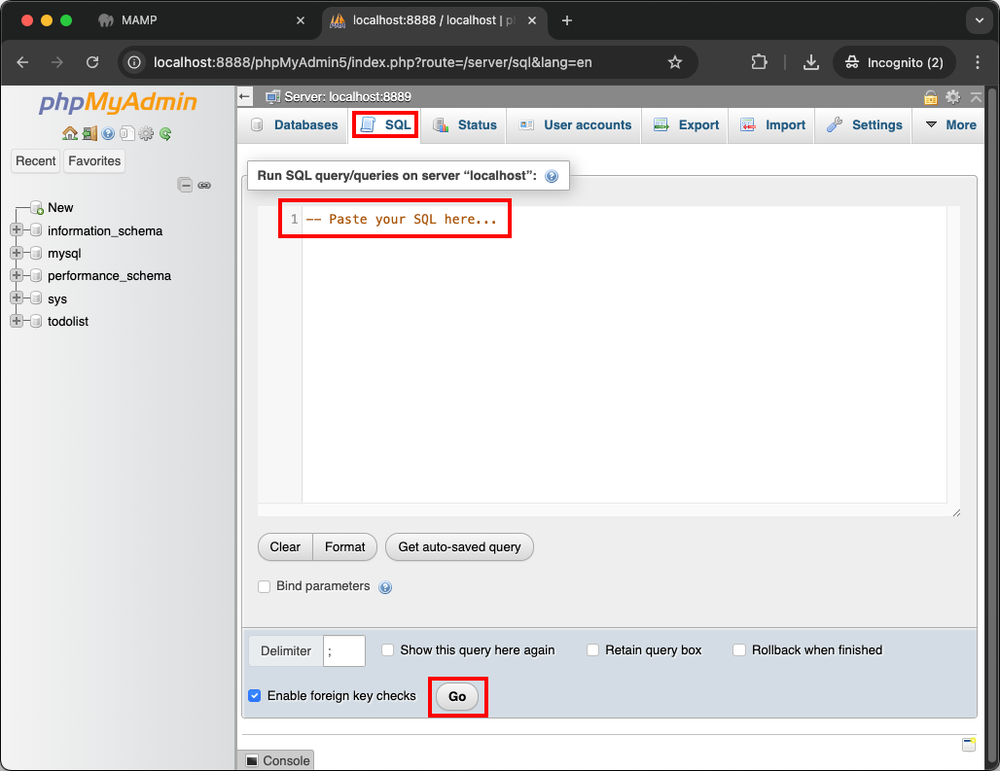
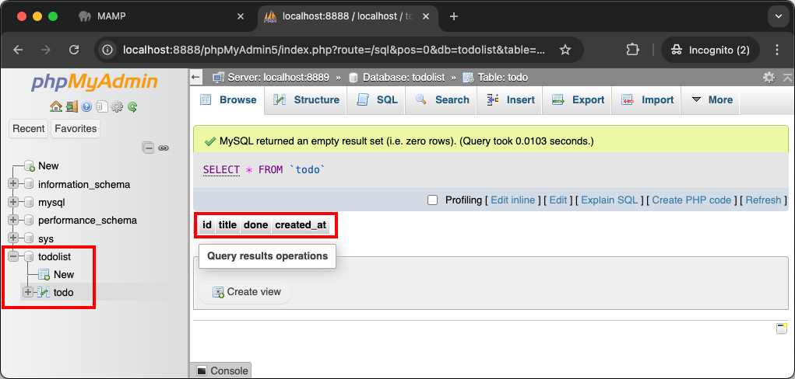
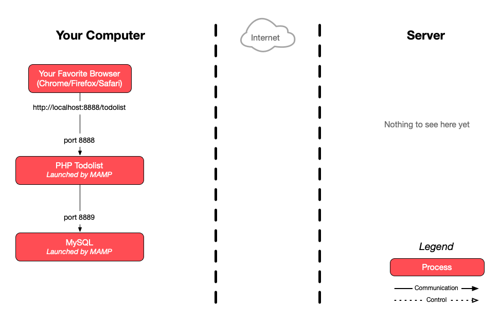

The goal of this exercise is to collaborate on a simple project on GitHub as a
team of 2 or 3.

You will use [a partially implemented todo list which is available on
GitHub][ex-repo] as a starting point. It is implemented in PHP, HTML and CSS,
and connects to a MySQL database. All the code is in [the `index.php`
file][ex-index].

Some SQL queries are missing from this source code. The incomplete lines are
marked with the following comment: `// IMPLEMENT ME`.

<!-- more -->

## :exclamation: Form your group

During the rest of this exercise, the first two team members will be referred to
as **Alice** and **Bob**. The possible third member will be referred to as
**Chuck**.

Form a group and decide who is **Alice**, **Bob** (and **Chuck** if your group
has three people).



This is a graded exercise that **must** be done as a group. You cannot deliver
it alone, since the whole point is to make you work with Git as a team. Let the
teachers know immediately if there is a problem.



## :exclamation: Alice: fork and clone the repository

Open the [`ArchiDep/php-todo-ex` repository][ex-repo] in your browser and click
the **`Fork`** button in the top-right corner of the page (you must be logged in
to GitHub).




This will create a copy of the repository on GitHub that belongs to you (under
your GitHub username instead of `ArchiDep`).



## :exclamation: Alice: add Bob and Chuck as collaborators

In the settings of the forked repository, add **Bob** (and **Chuck**) to the
list of **Collaborators** (this will give them push access).



Only the creator of a repository has push access to that repository. For others
to push into your repository, you must add them as collaborators.



## :exclamation: All team members: install MAMP

We recommend that you use [MAMP][mamp] to run the application on your local
machine. Download the installer and then run the free MAMP (not MAMP PRO)
application.



MAMP is a free application which pre-packages a local server environment with
[Apache][apache]/[Nginx][nginx], [PHP][php], and [MySQL][mysql], to easily
develop PHP applications.





You may also use an equivalent solution like [WAMP][wamp] or your own PHP/MySQL
setup if you already have one



## :exclamation: All team members: clone Alice's repository

Open MAMP to see where its document root is.



On macOS, the document root is shown in the main window:



To reach it in the macOS Terminal, execute the following command:

```bash
$> cd /Applications/MAMP/htdocs
```

<!-- col -->

On Windows, the document root is shown in the preferences:



To reach it in the WSL, execute the following command (adapt the path if you
chose another installation directory):

```bash
$> cd /mnt/c/MAMP/htdocs
```



Clone Alice's forked repository on your local machine under MAMP's document
root. You should use the SSH (not the HTTPS) URL:



```bash
$> git clone git@github.com:Alice/php-todo-ex.git
```



Make sure to clone Alice's forked repository, and **not** the original course
repository under the `ArchiDep` organization, or you won't be able to push your
commits later.





If you prefer, an alternative is also to clone the repository wherever you want,
typically in your projects directory for this course, and to temporarily update
MAMP's settings to point its document root directly to this directory:

```bash
$> cd /path/to/projects
$> git clone git@github.com:Alice/php-todo-ex.git

# Set MAMP's document root to /path/to/projects/php-todo-ex
```



## :exclamation: All team members: set up the database

Open the MAMP web page.



On macOS, it should open automatically after clicking the **Start** button:



The opened page should be
[http://localhost:8888/MAMP/](http://localhost:8888/MAMP/) (with the default
settings).

<!-- col -->

On Windows, click the **Open WebStart Page** button:



The opened page should be [http://localhost/MAMP/](http://localhost/MAMP/) (with
the default settings).



You should then be able to reach
the phpMyAdmin MySQL administration console from there:



The exercise repository you have cloned to your machine contains a
`todolist.sql` file you can use to create the database for this project. You
should **change the password** in the SQL before running it. It will probably be
simpler if all team members agree on the same password to use for this exercise.



Need help choosing a good password? [Don't use something that is hard to
remember](https://xkcd.com/936/). You're better off [using a
passphrase](https://www.useapassphrase.com) (here's a [French
version](https://passwordcreator.org/fr.html#good)).



Run the SQL queries in the `todolist.sql` file in the **SQL** tab of
phpMyAdmin's interface.



If it worked, you should see the `todolist` database appear in the left sidebar.
You should be able to see the `todo` table in this database, and see the table
structure that has been created:



## :exclamation: All team members: run the application

Open your `php-todo-ex` directory with your favorite editor (you are not allowed
to have Notepad or Notepad++ as your favorite editor), and update the [constants
at the top of `index.php`][ex-constants] to match your local installation:

- Update the password if you changed it.
- If necessary, update the port to use MAMP's MySQL database port. The port is
  8889 on macOS and 3306 on Windows with the default settings. You can see and
  change this port in MAMP's preferences.
- Update the base URL to match the name of the todo list's directory.

You should then be able to access the todo list in your browser at
[https://localhost:8888/php-todo-ex/](https://localhost:8888/php-todo-ex/) on
macOS or [http://localhost/php-todo-ex/](http://localhost/php-todo-ex/) on
Windows with the default settings. Adapt the port and/or path if necessary.

The todolist will most likely not work yet since you haven't finished the
exercise. But you should at least see an error page.



The value of `BASE_URL` must match the path of URL at which the application is
available. For example, if you've put the cloned `php-todo-ex` repository in
MAMP's `htdocs` directory, the application will be accessible at
[http://localhost:8888/php-todo-ex/](http://localhost:8888/php-todo-ex/) on
macOS or [http://localhost/php-todo-ex/](http://localhost/php-todo-ex/) on
Windows (with the default document root and ports). In this situation, the value
of `BASE_URL` should be `/php-todo-ex/`.

If you have changed MAMP's document root to point directly to the `php-todo-ex`
repository, it will be accessible directly under
[http://localhost:8888](http://localhost:8888) on macOS or
[http://localhost/](http://localhost/) on Windows (with the default ports). In
this case, the value of `BASE_URL` should simply be `/`.



## :exclamation: All team member: do the work

Each team member should choose at least one of the `// IMPLEMENT ME` comments,
add the missing SQL query to the code, then commit and push their changes to
Alice's repository on GitHub.



Make sure that each team member contributes something to the repository. These
are the requirements that we will evaluate:

- The work must be delivered in the forked repository on GitHub.
- The todo list must work:
  - Tasks can be added, toggled and deleted.
  - Tasks must be listed from newest to oldest (i.e. by descending creation
    date).
- Each team member must contribute at least one useful commit:
  - A "useful" commit is one that adds or fixes a feature of the todo list.
  - The commits must be made on each team member's machine using their local Git
    installation, not through GitHub's web interface.
  - The author name and email address of each team member's commits must be
    correctly configured.
- Commit messages must be relevant (i.e. describe the change that was made).



## :question: End result

As a reference, the fully implemented application should look and behave like
this: [https://todolist.archidep.ch][todolist]

## :exclamation: Delivery

Send one email per team to both teachers (Simon O. & Simon P.) with:

- The link to the team's repository on GitHub.
- The list of team members (and their GitHub username if it is not obvious).

## :classical_building: Architecture

This is a simplified architecture of the main running processes and
communication flow at the end of the exercise (assuming you've used MAMP with
Apache running on port 8888 and MySQL on port 8889).



<div class="flex items-center gap-2">
  <a href="./images/architecture.pdf" download="PHP Todolist Architecture" class="tooltip" data-tip="Download PDF">
    
  </a>
  <a href="./images/architecture.png" download="PHP Todolist Architecture" class="tooltip" data-tip="Download PNG">
    
  </a>
</div>

## :boom: Troubleshooting

Here's a few tips about some problems you may encounter during this exercise.

### :boom: Nothing works but I don't see any errors

When there is a problem with your PHP application, PHP errors may appear only in
the PHP error log, and not in your browser. To see all PHP errors, look in
MAMP's `logs` directory (generally found next to the `htdocs` directory) for a
`php_error.log` file.



Whether PHP errors appear in the browser depends on parameters in your `php.ini`
configuration file, such as
[`error_reporting`](https://www.php.net/manual/en/errorfunc.configuration.php#ini.error-reporting).



### :boom: `Uncaught PDOException [...] Access denied`

If you see an error that looks like this displayed in your browser or in the PHP
error log:

```
PHP Fatal error:
  Uncaught PDOException: SQLSTATE[HY000] [1045]
  Access denied for user 'todolist'@'localhost' (using password: YES)
```

It means that you are not using the correct database connection parameters. Make
sure that the following parameters are configured correctly:

- The `DB_PASS` parameter must be the password you used when you created the
  `todolist` user with the SQL in the `todolist.sql` file.
- The `DB_PORT` parameter must be the port on which you MySQL server is
  listening. The default MySQL port is 3306, but it may be different depending
  on your installation method. For example, MAMP uses port 8888 by default.



You may also have made a mistake when creating the MySQL user. If you are not
sure, you can delete the user by running the query `DROP USER
'todolist'@'localhost';`, then re-run the `CREATE USER ...` and `GRANT ALL
PRIVILEGES ...` queries of the `todolist.sql` file.



### :boom: `Invalid argument supplied for foreach()`

If you see an error that looks like this displayed in your browser or in the PHP
error log:

```
PHP Warning: Invalid argument supplied for foreach()
```

It is simply because you have not yet implemented the `SELECT` query in the
`$selectQuery` variable. This makes the `$items` variable empty, which produces
an error in the `foreach` loop that attempts to iterate over it to display the
todo items.

### :boom: Adding a todo item redirects to another URL

You have not configured the `BASE_URL` parameter correctly. This value is used
in the [form's `action`
attribute](https://www.w3schools.com/tags/att_form_action.asp) when creating a
todo item.

The correct value is the base path under which the application is exposed. For
example, if you are accessing the application at
`http://localhost:8888/php-todo-ex/`, then `BASE_URL` should be `/php-todo-ex/`.
If you are accessing the application at `http://localhost:8888`, then `BASE_URL`
should be `/`.

### :boom: The application displays correctly but modifications are not taken into account

You may have configured your `BASE_URL` without a trailing slash (e.g.
`/php-todo-ex` instead of `/php-todo-ex/`).

The Apache web server (in MAMP or equivalent) will not treat requests to those
two paths in the same way:

- The first path `/php-todo-ex` will probably be redirected to `/php-todo-ex/`
  with a standard Apache configuration. Any form data submitted in the request
  will be lost in the redirection.
- The second path `/php-todo-ex/` refers to the directory by the same name. In
  that case, a standard Apache configuration will probably execute the
  `index.php` page in that directory.

Without the trailing slash, your application may display correctly, but form
submission may be broken.

[apache]: https://httpd.apache.org
[ex-constants]: https://github.com/ArchiDep/php-todo-ex/blob/0e9abce9458e2758977f6a8a613c9651284ab615/index.php#L3-L15
[ex-index]: https://github.com/ArchiDep/php-todo-ex/blob/main/index.php
[ex-repo]: https://github.com/ArchiDep/php-todo-ex
[mamp]: https://www.mamp.info
[mysql]: https://www.mysql.com
[nginx]: https://nginx.org
[php]: https://www.php.net
[todolist]: https://todolist.archidep.ch
[wamp]: http://www.wampserver.com/
