This guide describes how to run a virtual server appropriate for the Media
Engineering Architecture & Deployment course on the [Microsoft
Azure][microsoft-azure] cloud platform.

## :exclamation: Apply to Azure for Students

Apply to [Azure for Students][azure-for-students]
**with your `@hes-so.ch` email address**, which will provide you with free
Azure resources as a student.

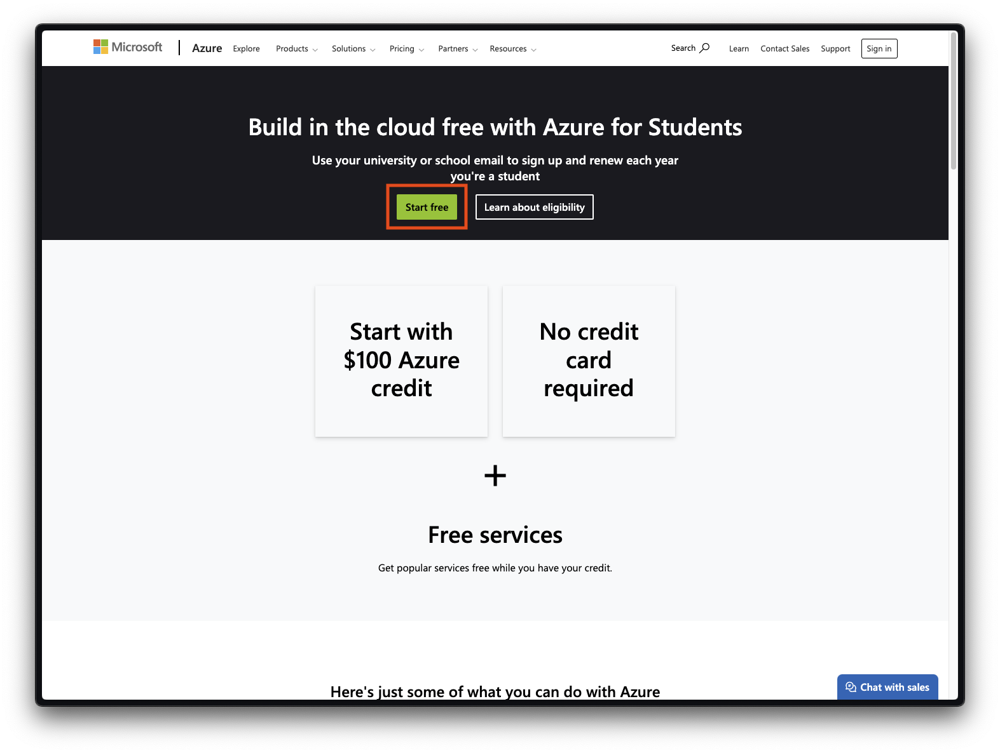

## :exclamation: Get your public SSH key

You can display your public SSH key in your terminal with the following command:

```bash
$> cat ~/.ssh/id_e25519.pub
```



If you have an older SSH client, you may want to try displaying the contents of
`~/.ssh/id_rsa.pub` instead.



## :exclamation: Launch a virtual server

Once you have your Azure account, you can launch the virtual server you will be
using for the rest of the course.

Access the [Azure portal][azure-portal] and go to the **Virtual machines**
section:


Create a new virtual machine, i.e. a new virtual server in the Microsoft Azure
infrastructure:

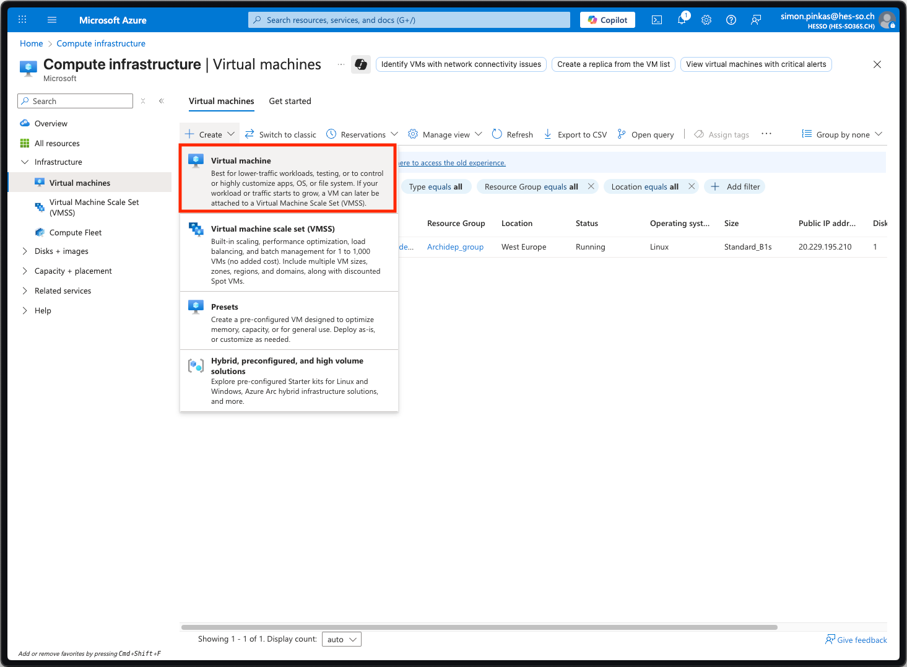

In the **Basics** settings, configure the **virtual machine details** (the
machine's name, region, image and size):

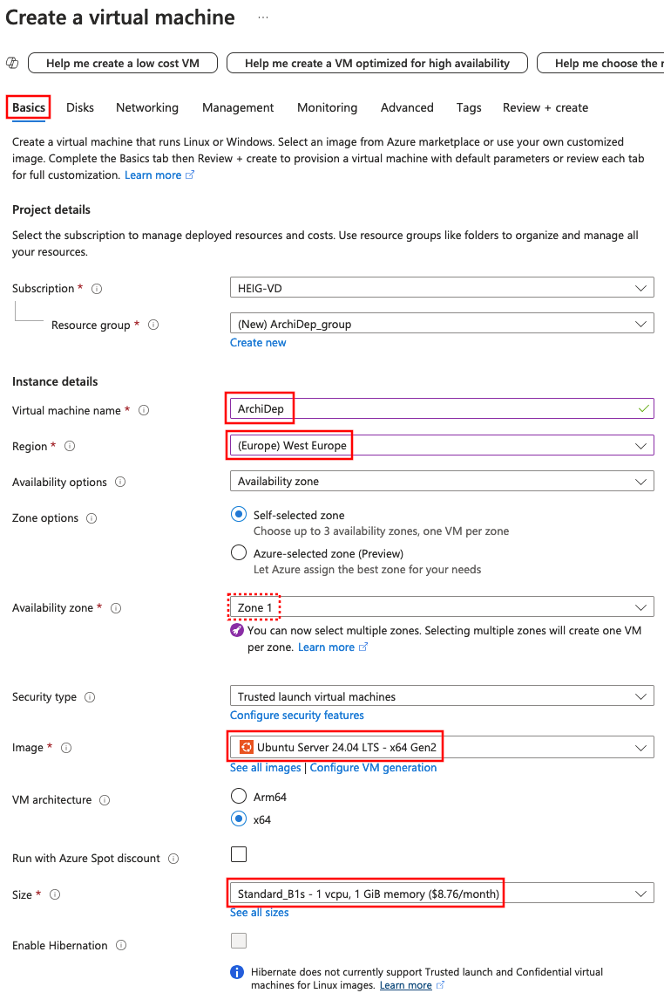



**Make sure to select the `Ubuntu 24.04` image and the `B1s` size.** If you
select a VM size that is too expensive, **YOU WILL RUN OUT OF FREE CREDITS
BEFORE THE END OF THE COURSE** You will then have pay 💸 for a new VM and will
have to reinstall your VM from scratch (including all deployment exercises you
may already have completed).





If the correct size is not selected, you can select it from the complete list of
VM sizes. If you cannot select the `B1s` size, try selecting another
availability zone (or another region that is not too expensive).

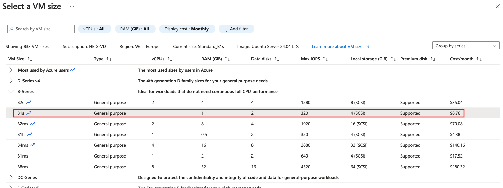





Any region will do. Closer to where you are (or where your customers are) will
reduce latency, and the North/West European regions are among the cheapest.



Under the **Administrator account** settings, configure your username. Replace
`jde` in this screenshot with the username you have selected for the course:

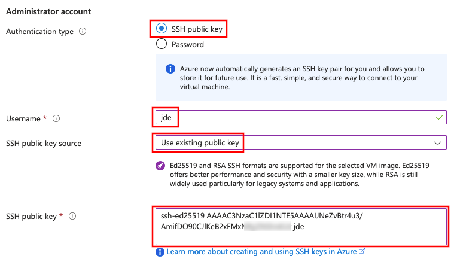

Select **SSH public key** authentication, set the source to Use existing public
key, and paste your public SSH key (the one you copied earlier) in the text
area.



**Your Unix username MUST NOT** contain spaces, accented characters (e.g. é),
hyphens (-) or dots (.). If you use the same name later in the course as a
subdomain, it **MUST NOT** contain any underscores (\_). We suggest you choose a
name that starts with a letter (a-z) and contains only alphanumeric characters
(a-z and 0-9).





Choose a username that is simple to type because you will need to type it often.
If necessary, you can [change it later][sysadmin-cheatsheet-change-username].



Under inbound port rules, make sure the SSH (22) port is allowed:

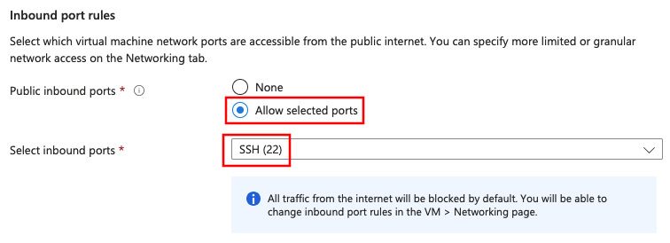

Next, go to the **Disks** settings (**DO NOT** create the machine just yet):


Keep the default **Disks** settings and go to the **Networking** settings:


In the **Networking** settings, select the **Advanced** security group option,
and create a new security group:

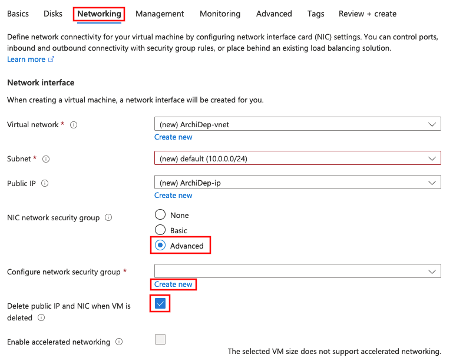

Add two inbound rules, one for **HTTP** and one for **HTTPS**:

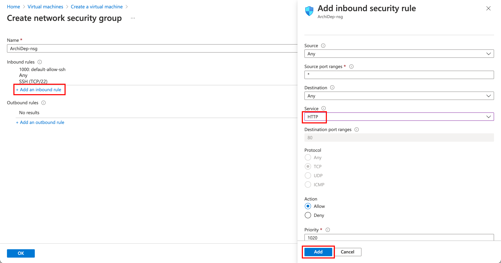

Add two other inbound rules, one for **port 3000** and one for **port 3001**:

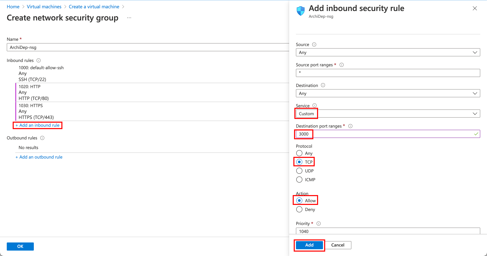

The final security group settings should look something like this:

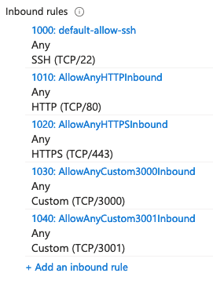



What you are doing here is configuring the Azure firewall to allow incoming
traffic to your virtual server on specific ports. If you do not do this, it will
not be reachable from outside the Azure network.

For example, for a web application running on your virtual server to be
reachable, ports 80 (HTTP) and 443 (HTTPS) must accept incoming requests. Port
22 is for SSH connections. Ports 3000 and 3001 will be used in various
exercises.



Keep the default **Management, Monitoring, Advanced** and **Tags** settings.

Review your estimated monthly cost:

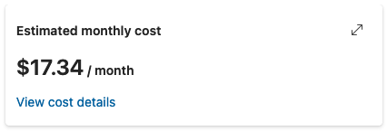

You might not see the estimated monthly cost, but you should always see the
hourly cost:

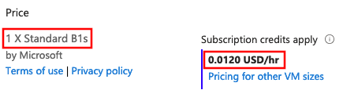



Your estimated monthly cost **MUST BE UNDER $20/month OR UNDER $0.025/hour.** If
it is higher, you have probably selected the wrong region, or a VM size that is
not the recommended one and that is too expensive for the credits you have at
your disposal for this course.



Double-check that you are launching one virtual machine of size `B1s` (**1 X
Standard B1s**).

🎉 Create your virtual machine!

Once your deployment is complete, go to the virtual machine source:

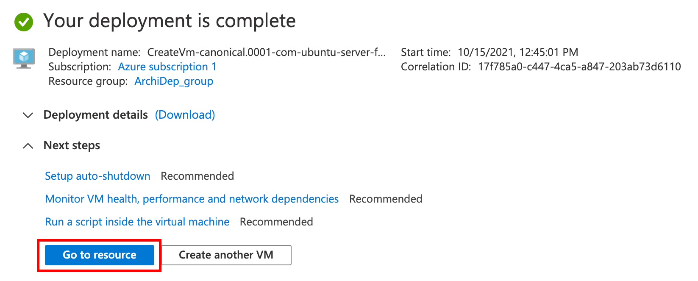

Find your machine's public IP address in the virtual machine's information:

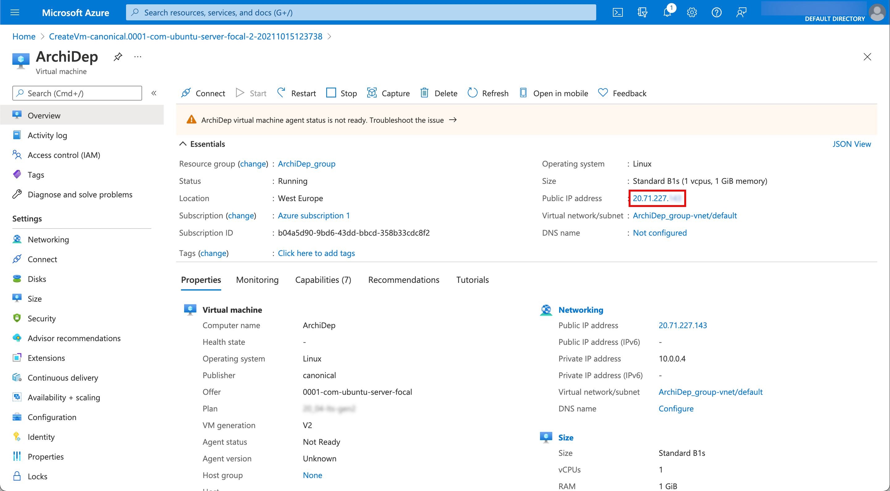

## :question: (Optionally) get your machine's public SSH key

When you connect to your virtual machine over SSH for the first time, you will
get the usual warning that its authenticity cannot be verified:

```
The authenticity of host '20.71.227.143 (20.71.227.143)' can't be established.
ECDSA key fingerprint is SHA256:0TORCgUgzrPGeDHzV5fGAarkpGpc5Nbkhb7q2dbG0OA.
Are you sure you want to continue connecting (yes/no/[fingerprint])?
```

To protect yourself from [man-in-the-middle attacks][man-in-the-middle-attacks],
you can obtain the SSH host key fingerprints from your virtual machine before
attempting to connect. That way, you will be able to see if the key fingerprint
in the warning matches one of your virtual machine's keys.

To do this, you need to install the [Azure CLI][azure-cli]. Once you
have it installed and have logged in, you can run the following command (adapt
the resource group and name options to your configuration if necessary):

```bash
$> az vm run-command invoke \
     --resource-group ArchiDep_group \
     --name ArchiDep \
     --command-id RunShellScript \
     --scripts "find /etc/ssh -name '*.pub' -exec ssh-keygen -l -f {} \;"
```

After a while, it should print the response:

```
{
  "value": [
    {
      "code": "ProvisioningState/succeeded",
      "displayStatus": "Provisioning succeeded",
      "level": "Info",
      "message": "Enable succeeded: \n[stdout]\n256 SHA256:IKNmtqj1OKCP4gyErlaQkBbn26gB0ofV3fLkw14yokg root@ArchiDep (ED25519)\n1024 SHA256:mUJQmHnMkGeqbxrRjRrBCJYzxyFYIlwKx/R54eLi4ds root@ArchiDep (DSA)\n3072 SHA256:RGxd9jZfWrUUynsVNGmngD78AaZGcQNT4iHjwX6cK2c root@ArchiDep (RSA)\n256 SHA256:0TORCgUgzrPGeDHzV5fGAarkpGpc5Nbkhb7q2dbG0OA root@ArchiDep (ECDSA)\n\n[stderr]\n",
      "time": null
    }
  ]
}
```

Your machine's public key fingerprints are in the `message` property, separated
by encoded new lines (`\n`).



You can skip this step if you consider the risk and impact of an attack low
enough. Understand that if you simply answer "yes" when the SSH client warns
you, you are exposing yourself to a potential man-in-the-middle attack. In all
likelihood, no one is trying to hack your Azure virtual machine for this course,
but the possibility exists.

Since you are using public key authentication and not password authentication,
your credentials should not be compromised (you will not send a password and
your private key will not leave your computer). However, anything you do on
that server could potentially be read and modified by an attacker if he
manages to intercept the initial connection.



## :exclamation: Configure your virtual server

You will now connect to your Azure virtual machine and configure some things for
purposes of the course.

### :exclamation: Connect to your new virtual machine over SSH

Assuming the virtual machine's public IP address is `W.X.Y.Z` (replace with the
IP address you copied from your virtual machine's information), and the
administrator account you created is `jde`, you can connect with this command:

```bash
$> ssh jde@W.X.Y.Z
```



You should be able to connect without a password. This works because
you gave your public SSH key to Azure when creating your virtual server. It
was automatically put in your user's `~/.ssh/authorized_keys` file when the
server was launched, which allows you to authenticate using your private SSH
key.



### :exclamation: Give the teacher access to your virtual machine

Once you are connected, run the following command to give the teacher access to
your virtual machine (**be sure to copy the whole line and to replace `jde` with
your username**):

```bash
$> echo "ssh-ed25519 AAAAC3NzaC1lZDI1NTE5AAAAIB1TC4ygWjzpRemdOyrtqQYmOARxMMks71fUduU1Og+i archidep" | sudo tee --append /home/jde/.ssh/authorized_keys
```



This adds the teacher's public SSH key to your user's `~/.ssh/authorized_keys`,
allowing the teacher to also authenticate to your virtual server with his
private SSH key to help debug issues.



### :exclamation: Change the hostname of your virtual machine

Configure the hostname for your virtual machine, a subdomain of `archidep.ch`.
Use the username you have chosen for the course and the domain for the course.
For example, if your usename is `jde`, your hostname should be
`jde.archidep.ch`. Make sure not to pick the same subdomain as someone else in
the class.



:warning: You should not use underscores (`_`) in a hostname, use hyphens (`-`)
instead.



```bash
$> sudo hostname jde.archidep.ch
```

Also save your new hostname to the `/etc/hostname` file so that it will persist
when you reboot the server:

```bash
$> echo "jde.archidep.ch" | sudo tee /etc/hostname
```



The hostname is the name of your virtual server. It can be any URL. It often
identifies a machine in an organization with the format
`<machine-name>.<organization>.<tld>` (e.g. `unix-box.google.com`).

For the purposes of this course, we will be using the `archidep.ch` domain, so
it makes sense to use a subdomain corresponding to yourself (`jde.archidep.ch`)
as the hostname.



### :exclamation: Reboot the server

```bash
$> sudo reboot
```

**Once the server has restarted** (it might take a couple of minutes), check
that you can still connect and that your hostname is correct:

```bash
$> ssh jde@W.X.Y.Z
Welcome to Ubuntu 24.04 LTS
...

$> hostname
jde.archidep.ch
```

### :exclamation: Add swap space to your virtual server



The cloud servers used in this course do not have enough memory (RAM) to
run/compile many things at once. But you can easily add **swap space** to solve
this issue.

Swap space in Linux is used when there is no more available physical memory
(RAM). If the system needs more memory resources and the RAM is full, inactive
pages in memory are moved to the swap space (on disk).



Adding 2 gigabytes of swap space should be enough for our purposes.

Run the following commands to make sure you disable any previous swap file you
might have created during the exercises:

```bash
# (It's okay if this command produces an error.)
$> sudo swapoff /swapfile
$> sudo rm -f /swapfile
```

Use the following commands to create and mount a 2-gigabyte swap file:

```bash
$> sudo fallocate -l 2G /swapfile
$> sudo chmod 600 /swapfile
$> sudo mkswap /swapfile
Setting up swapspace version 1, size = 2 GiB (2147479552 bytes)
no label, UUID=3c263053-41cc-4757-0000-13de0644cf97
$> sudo swapon /swapfile
```

You can verify that the swap space is correctly mounted by displaying available
memory with the `free -h` command. You should see the `Swap` line indicating the
amount of swap space you have added:

```bash
$> free -h
              total        used        free      shared  buff/cache   available
Mem:          914Mi       404Mi       316Mi        31Mi       193Mi       331Mi
Swap:         2.0Gi       200Mi       1.8Gi
```

This swap space is temporary by default and will only last until your reboot
your server. To make it permanent, you must tell your server to mount it on
boot.

You can see the currently configured mounts with this command (the output may
not be exactly the same):

```bash
$> cat /etc/fstab
# CLOUD_IMG: This file was created/modified by the Cloud Image build process
UUID=b1983cef-43a3-46ac-0000-b5e06a61c9fd       /        ext4   defaults,discard        0 1
UUID=0BC7-0000  /boot/efi       vfat    umask=0077      0 1
/dev/disk/cloud/azure_resource-part1    /mnt    auto    defaults,nofail,x-systemd.requires=cloud-init.service,comment=cloudconfig       0       2
```



**BE VERY CAREFUL TO EXECUTE THE FOLLOWING COMMAND EXACTLY AS IS.** Corrupting
your `/etc/fstab` file can prevent your server from rebooting.



To make the swap space permanent, execute the following command to add the
appropriate line to your server's `/etc/fstab` file:

```bash
$> echo "/swapfile none swap sw 0 0" | sudo tee -a /etc/fstab
```

This line tells your server to mount the swap file you have created as swap
space on boot. You should see the new line at the end of the `/etc/fstab` file
if you display its contents again:

```bash
$> cat /etc/fstab
# CLOUD_IMG: This file was created/modified by the Cloud Image build process
UUID=b1983cef-43a3-46ac-0000-b5e06a61c9fd       /        ext4   defaults,discard        0 1
UUID=0BC7-08EF  /boot/efi       vfat    umask=0077      0 1
/dev/disk/cloud/azure_resource-part1    /mnt    auto    defaults,nofail,x-systemd.requires=cloud-init.service,comment=cloudconfig       0       2
/swapfile none swap sw 0 0
```

You can run the following command to check that you did not make any mistakes.
It's okay if you have a couple of warnings about the swap file. These are
expected since you've just added it and have not rebooted yet.

```bash
$> sudo findmnt --verify --verbose
/
   [ ] target exists
   [ ] FS options: discard,commit=30,errors=remount-ro
   [ ] UUID=bf171e20-4158-4861-0000-1443ece8c413 translated to /dev/sda1
   [ ] source /dev/sda1 exists
   [ ] FS type is ext4
...
none
   [W] non-bind mount source /swapfile is a directory or regular file
   [ ] FS type is swap
   [W] your fstab has been modified, but systemd still uses the old version;
       use 'systemctl daemon-reload' to reload

0 parse errors, 0 errors, 2 warnings
```

**IF everything looks ok**, reboot your server:

```bash
$> sudo reboot
```

Reconnect to your server over SSH and run the `free -h` command again. The swap
space should still be enabled after reboot:

```bash
$> free -h
              total        used        free      shared  buff/cache   available
Mem:          914Mi       404Mi       316Mi        31Mi       193Mi       331Mi
Swap:         2.0Gi       200Mi       1.8Gi
```



You can also see the currently available swap space and how much is used with
the `htop` command which shows it as the `Swp` bar at the top (you can quit it
with `q` once it is open). For more information, see the [fstab Linux
manpage][fstab-linux-manpage].



## :exclamation: Register your Azure VM with us

Just one more step. Copy your virtual machine's public IP address (the same you
used to connect to it with the `ssh` command), and [go back to the dashboard to
register you virtual machine](/app?server=ready).

## :checkered_flag: What have I done?

You have used a popular Infrastructure-as-a-Service (IaaS) cloud service
(Microsoft Azure) to set up a virtual machine for your own use. You are renting
this virtual machine for a monthly fee (using your free education credits).

You have used what you have learned about the command line and SSH to connect to
this virtual machine and perform some basic setup steps in preparation for
future deployment exercises.

## :boom: Troubleshooting

Azure requires that [SSH keys of type RSA have at least 2048
bits][azure-ssh-key-formats]. If your existing key is not accepted by Azure when
pasting it in the administrator account settings of your virtual server later,
you may need to generate a new one with enough bits:

    ssh-keygen -m PEM -t rsa -b 4096



**ATTENTION!** If you already have an RSA key, this command will ask you if you
want to overwrite it with the new one. If you do, the old key will be
**PERMANENTLY LOST**. (You will need to put your public key on GitHub again and
everywhere else you may have used it.)



[Azure-cli]: https://docs.microsoft.com/en-us/cli/azure/install-azure-cli
[azure-for-students]: https://azure.microsoft.com/en-us/free/students/
[azure-portal]: https://portal.azure.com
[azure-ssh-key-formats]: https://docs.microsoft.com/en-us/azure/virtual-machines/linux/mac-create-ssh-keys#supported-ssh-key-formats
[fstab-linux-manpage]: https://man7.org/linux/man-pages/man5/fstab.5.html
[man-in-the-middle-attacks]: https://en.wikipedia.org/wiki/Man-in-the-middle_attack
[microsoft-azure]: https://azure.microsoft.com
[sysadmin-cheatsheet]: ../701-sysadmin-cheatsheet/
[sysadmin-cheatsheet-change-username]: ../701-sysadmin-cheatsheet/#how-do-i-change-my-username-usermod
