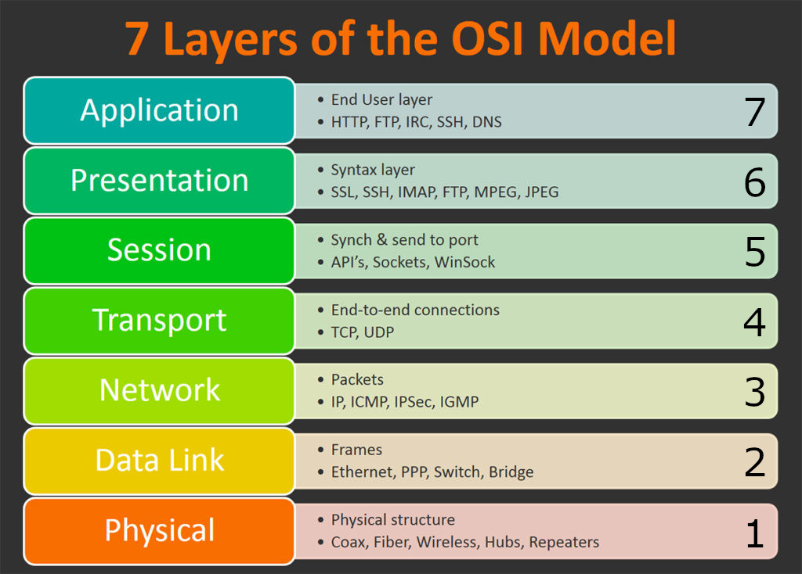
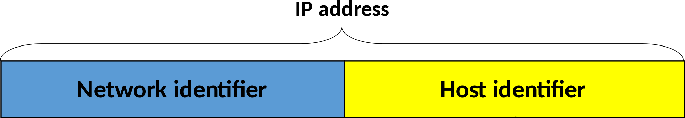
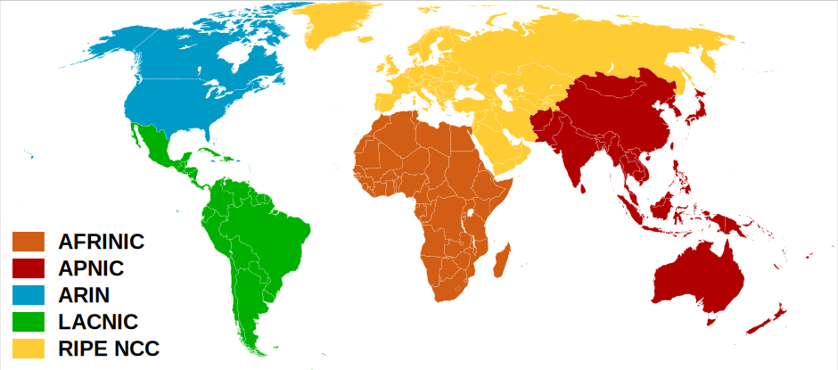
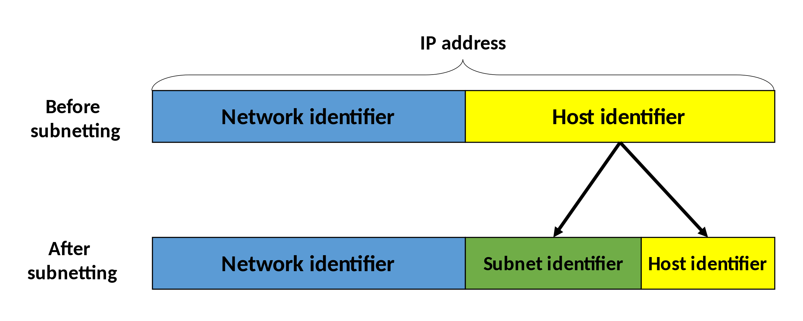
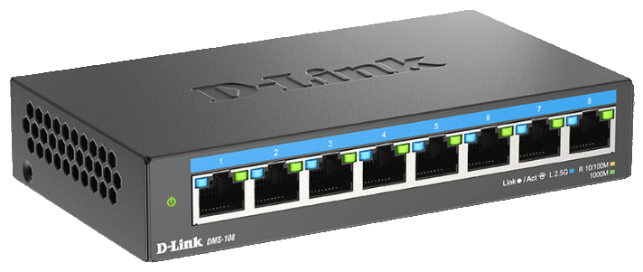
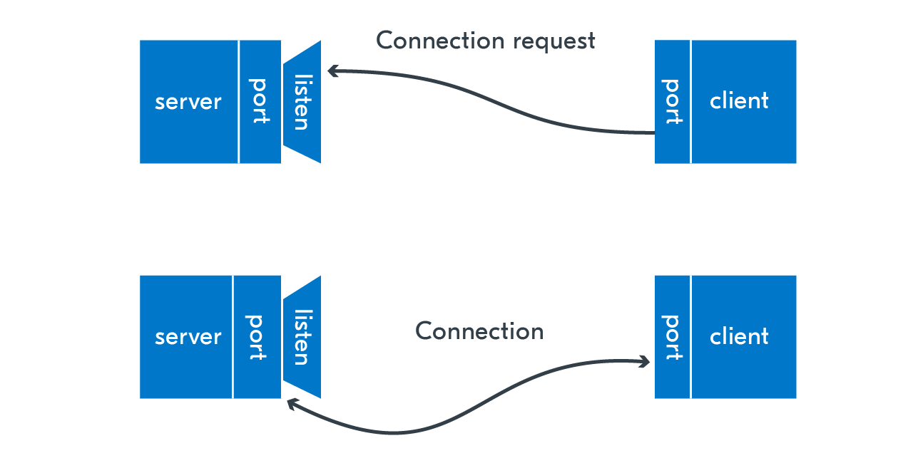

# Unix Networking

Architecture & Deployment <!-- .element: class="subtitle" -->

**Notes:**

Learn the basics of Unix networking and how to make TCP connections.

**You will need**

- A Unix CLI
- An Ubuntu server with a public IP address to connect to

**Recommended reading**

- [Unix Basics & Administration](../unix-admin/)
- [Unix Processes](../unix-processes/)

---

## Meanwhile in 1977


**Notes:**

This is a diagram of the first internetworked TCP connection made between sites
in the US, the UK and Norway in 1977.

---

## OSI model

<!-- .element: class="hidden" -->



**Notes:**

The [**O**pen **S**ystems **I**nterconnection (OSI) model][osi] standardizes
communications between computing systems, allowing interoperability with
standard protocols.

A layer serves the layer above it and is served by the layer below it.

---

### OSI vs. TCP/IP model


**Notes:**

The [Internet protocol suite][tcp-ip] is the conceptual model used on the
Internet and on similar computer networks. It is commonly known as TCP/IP since
the **T**ransmission **C**ontrol **P**rotocol (TCP) and the **I**nternet
**P**rotocol (IP) are its foundational protocols.

It was originally developed for [ARPANET][arpanet].

The OSI and TCP/IP models describe the same technologies, but categorize them a
little differently. The OSI model is used more as a theoretical construct to
reason about networking systems, while the TCP/IP model is more in line with how
Internet protocols are designed and used in practice.

---

## ARPANET circa 1977

<!-- .element: class="hidden" -->


---

## The Internet Protocol (IP)

- Deliver packets from source to destination
- **Network layer** protocol (OSI layer 3)

**Notes:**

The [**I**nternet **P**rotocol (IP)][ip] is the principal communications
protocol of the Internet. It allows delivering packets from a source host to a
destination host based solely on IP addresses. It is a **network layer**
protocol (OSI layer 3).

---

### IPv4

<!-- .element: class="!normal-case" -->

- In use since 1983
- 32-bit address space (~4 billion addresses)
- Decimal notation for humans

<table class="!mt-8 font-mono">
  <tbody>
    <tr>
      <td class="!px-2 !text-center">172</td>
      <td class="!p-0 !text-center">.</td>
      <td class="!px-2 !text-center">16</td>
      <td class="!p-0 !text-center">.</td>
      <td class="!px-2 !text-center">254</td>
      <td class="!p-0 !text-center">.</td>
      <td class="!px-2 !text-center">1</td>
    </tr>
    <tr class="opacity-50">
      <td class="!px-2 !text-center">10101100</td>
      <td class="!p-0 opacity-0">.</td>
      <td class="!px-2 !text-center">00010000</td>
      <td class="!p-0 opacity-0">.</td>
      <td class="!px-2 !text-center">11111110</td>
      <td class="!p-0 opacity-0">.</td>
      <td class="!px-2 !text-center">00000001</td>
    </tr>
  </tbody>
</table>

**Notes:**

**V**ersion **4** of the protocol ([**IPv4**][ipv4]), in use since 1983, uses a
32-bit address space, meaning that there are 2<sup>32</sup> or about 4.3 billion
possible addresses.

Of course 32 bits are a little hard to remember or even write down, so an IPv4
address is typically represented in 4 dotted decimal notation, with each octet
(8 bits) containing a value between 0 and 255 (i.e. 2<sup>8</sup>
possibilities).

---

### IPv6

<!-- .element: class="!normal-case" -->

- In use since 2017
- 128-bit address space (a lot)
- Hexadecimal notation for humans

<table class="!mt-8 font-mono text-2xl">
  <tbody>
    <tr>
      <td class="!px-2 !text-center">2001</td>
      <td class="!p-0 !text-center">.</td>
      <td class="!px-2 !text-center">0db8</td>
      <td class="!p-0 !text-center">.</td>
      <td class="!px-2 !text-center">85a3</td>
      <td class="!p-0 !text-center">.</td>
      <td class="!px-2 !text-center">0000</td>
      <td class="!p-0 !text-center">.</td>
      <td class="!px-2 !text-center">0000</td>
      <td class="!p-0 !text-center">.</td>
      <td class="!px-2 !text-center">8a2e</td>
      <td class="!p-0 !text-center">.</td>
      <td class="!px-2 !text-center">0370</td>
      <td class="!p-0 !text-center">.</td>
      <td class="!px-2 !text-center">7334</td>
    </tr>
    <tr class="opacity-50 text-lg">
      <td class="!px-2 !text-center">
        00100000
        <br />
        00000001
      </td>
      <td class="!p-0 opacity-0">.</td>
      <td class="!px-2 !text-center">
        00001101
        <br />
        10111000
      </td>
      <td class="!p-0 opacity-0">.</td>
      <td class="!px-2 !text-center">
        10000101
        <br />
        10100011
      </td>
      <td class="!p-0 opacity-0">.</td>
      <td class="!px-2 !text-center">
        00000000
        <br />
        00000000
      </td>
      <td class="!p-0 opacity-0">.</td>
      <td class="!px-2 !text-center">
        00000000
        <br />
        00000000
      </td>
      <td class="!p-0 opacity-0">.</td>
      <td class="!px-2 !text-center">
        10001010
        <br />
        00101110
      </td>
      <td class="!p-0 opacity-0">.</td>
      <td class="!px-2 !text-center">
        00000011
        <br />
        01110000
      </td>
      <td class="!p-0 opacity-0">.</td>
      <td class="!px-2 !text-center">
        01110011
        <br />
        00110100
      </td>
    </tr>
  </tbody>
</table>

**Notes:**

**V**ersion **6** of the protocol ([**IPv6**][ipv6]) was developed more recently
because the world is running out of IPv4 addresses (~4 billion IPv4 addresses is
not enough in the [Internet of Things (IoT)][iot] world). It's an [Internet
standard][internet-standard] since 2017.

IPv6 adresses are typically represented as 8 groups of 4 [hexadecimal][hex]
digits. Here's the same address in hexadecimal format:
`0123:4567:89ab:cdef:0123:4567:89ab:cdef`

2<sup>128</sup> possibilities is about 340
[undecillion](https://en.wikipedia.org/wiki/Undecillion) (yes, that's a word)
addresses, or 3.4 with 38 zeros. At least we won't have a [year 2038
bug](https://en.wikipedia.org/wiki/Year_2038_problem).

---

### IP networks



<table class="font-mono">
  <tbody>
    <tr>
      <td class="!px-2 !text-center text-blue-500">172</td>
      <td class="!p-0 !text-center">.</td>
      <td class="!px-2 !text-center text-blue-500">16</td>
      <td class="!p-0 !text-center">.</td>
      <td class="!px-2 !text-center text-yellow-500">254</td>
      <td class="!p-0 !text-center">.</td>
      <td class="!px-2 !text-center text-yellow-500">1</td>
    </tr>
  </tbody>
</table>

**Notes:**

Each computer that is publicly accessible on the Internet has a **public IP
address**. To facilite routing, IP addresses are logically divided into
networks.

For example, assuming we use the address `10101100000100001111111000000001`, or
`172.16.254.1` in dotted decimal notation, and a prefix of 16 bits:

- The **network identifier or prefix** would be the first 16 bits:
  `1010110000010000`, or in decimal notation `172.16`
- The **host identifier** would be the last 16 bits: `1111111000000001` or in
  decimal notation `254.1`

This allows the physical routing devices that are part of the Internet to direct
traffic to the correct geographical area and machine(s).

---

### IP global networks

[**R**egional **I**nternet **R**egistries (RIR)][rir]: [IPv4
Registry][iana-ipv4], [IPv6 Registry][iana-ipv6], managed by [**I**nternet
**A**ssigned **N**umbers **A**uthority (IANA)][iana]



**Notes:**

The [**I**nternet **A**ssigned **N**umbers **A**uthority (IANA)][iana] is the
organization responsible for dividing the Internet itself into global networks,
each administered by regional organizations.

The [**R**egional **I**nternet **R**egistries (RIR)][rir], in turn, follow their
regional policies to delegate resources to their customers, which include
[**I**nternet **S**ervice **P**roviders (ISP)][isp] (e.g. Swisscom).

You can find the list of registered networks in the [IPv4 Address Space
Registry][iana-ipv4] and [IPv6 Address Space Registry][iana-ipv6].

---

### IP local networks



<table class="font-mono">
  <tbody>
    <tr>
      <td class="!px-2 !text-center text-blue-500">172</td>
      <td class="!p-0 !text-center">.</td>
      <td class="!px-2 !text-center text-blue-500">16</td>
      <td class="!p-0 !text-center">.</td>
      <td class="!px-2 !text-center text-green-500">254</td>
      <td class="!p-0 !text-center">.</td>
      <td class="!px-2 !text-center text-yellow-500">1</td>
    </tr>
  </tbody>
</table>

**Notes:**

[Subnetting][subnet] can be used to further improve efficiency in the
utilization of the relatively small address space available.

Instead of having thousands of computers in the same network all able to
directly contact each other, subnetting allows organizations to create smaller,
isolated networks with fewer computers.

This can be used to define **complex network structures** within an organization
or to **improve security**.

---

### Netmasks and CIDRs

<table class="!mt-8 font-mono text-3xl">
  <tbody>
    <tr>
      <th>IP address</th>
      <td class="!px-2 !text-center bg-blue-500/10 text-blue-500">172</td>
      <td class="!p-0 !text-center bg-blue-500/10">.</td>
      <td class="!px-2 !text-center bg-blue-500/10 text-blue-500">16</td>
      <td class="!p-0 !text-center">.</td>
      <td class="!px-2 !text-center bg-yellow-500/10 text-yellow-500">254</td>
      <td class="!p-0 !text-center bg-yellow-500/10">.</td>
      <td class="!px-2 !text-center bg-yellow-500/10 text-yellow-500">1</td>
    </tr>
    <tr>
      <th></th>
      <td class="!px-2 !text-center bg-blue-500/10 text-blue-500">10101100</td>
      <td class="!p-0 bg-blue-500/10"><span class="opacity-0">.</span></td>
      <td class="!px-2 !text-center bg-blue-500/10 text-blue-500">00010000</td>
      <td class="!p-0 opacity-0">.</td>
      <td class="!px-2 !text-center bg-yellow-500/10 text-yellow-500">11111110</td>
      <td class="!p-0 bg-yellow-500/10"><span class="opacity-0">.</span></td>
      <td class="!px-2 !text-center bg-yellow-500/10 text-yellow-500">00000001</td>
    </tr>
    <tr>
      <th>Netmask</th>
      <td class="!px-2 !text-center bg-blue-500/10 text-blue-500">255</td>
      <td class="!p-0 bg-blue-500/10">.</td>
      <td class="!px-2 !text-center bg-blue-500/10 text-blue-500">255</td>
      <td class="!p-0">.</td>
      <td class="!px-2 !text-center bg-yellow-500/10 text-yellow-500">0</td>
      <td class="!p-0 bg-yellow-500/10">.</td>
      <td class="!px-2 !text-center bg-yellow-500/10 text-yellow-500">0</td>
    </tr>
    <tr>
      <th></th>
      <td class="!px-2 !text-center bg-blue-500/10 text-blue-500">11111111</td>
      <td class="!p-0 bg-blue-500/10"><span class="opacity-0">.</span></td>
      <td class="!px-2 !text-center bg-blue-500/10 text-blue-500">11111111</td>
      <td class="!p-0"><span class="opacity-0">.</span></td>
      <td class="!px-2 !text-center bg-yellow-500/10 text-yellow-500">00000000</td>
      <td class="!p-0 bg-yellow-500/10"><span class="opacity-0">.</span></td>
      <td class="!px-2 !text-center bg-yellow-500/10 text-yellow-500">00000000</td>
    </tr>
    <tr>
      <th>CIDR</th>
      <td class="bg-blue-500/10 text-blue-500" colspan="3">/16</td>
    </tr>
  </tbody>
</table>

**Notes:**

A [netmask][subnet] is a notation to define an IPv4 network. Let's take the
example of a random address `172.16.254.1` in the third private address range
with the netmask `255.255.0.0`.

Look at the netmask in binary form. The leading `1`s indicate the bits used for
the network prefix and the trailing `0`s indicate the bits used for the host
identifier. A netmask is always a sequence of `1`s followed by a sequence of
`0`s.

[CIDR][cidr] is another more compact notation that expresses the same thing.
Writing `172.16.254.1/16` means that the first 16 bits of the address are used
as the network prefix. It is therefore equivalent to `172.16.254.1` with the
netmask of `255.255.0.0`. Similarly, `10.0.0.0/8` is equivalent to `10.0.0.0`
with a netmask of `255.0.0.0` (i.e. the first 8 bits are the network prefix).

---

### More netmasks and CIDRs

<table class="!mt-8 font-mono text-3xl">
  <tbody>
    <tr>
      <th>IP address</th>
      <td class="!px-2 !text-center bg-blue-500/10 text-blue-500">172</td>
      <td class="!p-0 !text-center">.</td>
      <td class="!px-2 !text-center bg-yellow-500/10 text-yellow-500">16</td>
      <td class="!p-0 !text-center bg-yellow-500/10">.</td>
      <td class="!px-2 !text-center bg-yellow-500/10 text-yellow-500">254</td>
      <td class="!p-0 !text-center bg-yellow-500/10">.</td>
      <td class="!px-2 !text-center bg-yellow-500/10 text-yellow-500">1</td>
    </tr>
    <tr>
      <th></th>
      <td class="!px-2 !text-center bg-blue-500/10 text-blue-500">10101100</td>
      <td class="!p-0 opacity-0">.</td>
      <td class="!px-2 !text-center bg-yellow-500/10 text-yellow-500">00010000</td>
      <td class="!p-0 bg-yellow-500/10"><span class="opacity-0">.</span></td>
      <td class="!px-2 !text-center bg-yellow-500/10 text-yellow-500">11111110</td>
      <td class="!p-0 bg-yellow-500/10"><span class="opacity-0">.</span></td>
      <td class="!px-2 !text-center bg-yellow-500/10 text-yellow-500">00000001</td>
    </tr>
    <tr>
      <th>Netmask</th>
      <td class="!px-2 !text-center bg-blue-500/10 text-blue-500">255</td>
      <td class="!p-0">.</td>
      <td class="!px-2 !text-center bg-yellow-500/10 text-yellow-500">0</td>
      <td class="!p-0 bg-yellow-500/10">.</td>
      <td class="!px-2 !text-center bg-yellow-500/10 text-yellow-500">0</td>
      <td class="!p-0 bg-yellow-500/10">.</td>
      <td class="!px-2 !text-center bg-yellow-500/10 text-yellow-500">0</td>
    </tr>
    <tr>
      <th></th>
      <td class="!px-2 !text-center bg-blue-500/10 text-blue-500">11111111</td>
      <td class="!p-0 opacity-0">.</td>
      <td class="!px-2 !text-center bg-yellow-500/10 text-yellow-500">00000000</td>
      <td class="!p-0 bg-yellow-500/10"><span class="opacity-0">.</span></td>
      <td class="!px-2 !text-center bg-yellow-500/10 text-yellow-500">00000000</td>
      <td class="!p-0 bg-yellow-500/10"><span class="opacity-0">.</span></td>
      <td class="!px-2 !text-center bg-yellow-500/10 text-yellow-500">00000000</td>
    </tr>
    <tr>
      <th>CIDR</th>
      <td class="bg-blue-500/10 text-blue-500">/8</td>
    </tr>
  </tbody>
</table>

---

### Reserved addresses for private networks

<table class="text-2xl">
  <thead>
    <tr>
      <th>First address</th>
      <th>Last address</th>
      <th>Netmask</th>
      <th>CIDR</th>
      <th>Addresses</th>
    </tr>
  </thead>
  <tbody>
    <tr>
      <td class="font-mono">10.0.0.0</td>
      <td class="font-mono">10.255.255.255</td>
      <td class="font-mono">255.0.0.0</td>
      <td class="font-mono">/8</td>
      <td>2<sup>24</sup><br />~16 million</td>
    </tr>
    <tr>
      <td class="font-mono">172.16.0.0</td>
      <td class="font-mono">172.31.255.255</td>
      <td class="font-mono">255.240.0.0</td>
      <td class="font-mono">/12</td>
      <td>2<sup>20</sup><br />~1 million</td>
    </tr>
    <tr>
      <td class="font-mono">192.168.0.0</td>
      <td class="font-mono">192.168.255.255</td>
      <td class="font-mono">255.255.0.0</td>
      <td class="font-mono">/16</td>
      <td>2<sup>16</sup><br />65,536</td>
    </tr>
  </tbody>
</table>

**Notes:**

There are a few [reserved IP address ranges][reserved-ip-addresses]. Some are
**reserved for private networks**. In these ranges you **cannot communicate with
public machines** without a NAT [gateway][gateway] or [proxy][proxy].

There are three reserved private ranges in the IPv4 address space.

---

### Reserved range for loopback addresses

<table class="text-2xl">
  <thead>
    <tr>
      <th>First address</th>
      <th>Last address</th>
      <th>Netmask</th>
      <th>CIDR</th>
      <th>Addresses</th>
    </tr>
  </thead>
  <tbody>
    <tr>
      <td class="font-mono">127.0.0.0</td>
      <td class="font-mono">127.255.255.255</td>
      <td class="font-mono">255.0.0.0</td>
      <td class="font-mono">/8</td>
      <td>2<sup>24</sup><br />~16 million</td>
    </tr>
  </tbody>
</table>

**Notes:**

Additionally, the following range is **reserved for a virtual network
interface**, allowing networking applications running on the same machine to
communicate with one another.

---

### There's no place like 127.0.0.1

These addresses all resolve to the current computer, bypassing network hardware.

<table class="!mt-8">
  <tbody>
    <tr>
      <th>Hostname</th>
      <td class="!text-center font-mono" colspan="1000">localhost</td>
    </tr>
    <tr>
      <th>IPv4 address</th>
      <td class="!text-center font-mono">127.0.0.1</td>
    </tr>
    <tr>
      <th>IPv6 address</th>
      <td class="!text-center font-mono" colspan="1000">::1</td>
    </tr>
  </tbody>
</table>

**Notes:**

`localhost` is a hostname that refers to the current computer used to access it.
It normally resolves to the IPv4 [loopback][loopback] address `127.0.0.1`, and
to the IPv6 loopback address `::1`.

When you or a program makes a request to `localhost` or `127.0.0.1`, you are
contacting your own computer, bypassing network hardware but otherwise behaving
the same way as any other network call.

---

### Not an IP address

<table class="!mt-8">
  <tbody>
    <tr>
      <td class="!text-center font-mono">0.0.0.0</td>
    </tr>
  </tbody>
</table>

This generally means "any IP address".

**Notes:**

You will sometimes encounter [`0.0.0.0`][0000]. This is not an actual IP
address.

One computer can have several IP addresses. Processes that listen for incoming
requests (e.g. a database or a web server) generally allow you to **restrict
which IP address they can be reached on**. You may only want to accept requests
to one specific address.

When you want to allow anyone to reach the process on any IP address the
computer may have, you can sometimes use **`0.0.0.0`** as a special notation
that means "**all IP addresses on the local machine**". The IPv6 equivalent is
`::`.

---

### Network address translation (NAT)


**Notes:**

[**N**etwork **A**ddress **T**ranslation (NAT)][nat] is a method of **remapping
one IP address space into another** as traffic goes through a routing device.

It is very commonly used for **IP masquerading**, a technique that hides an
entire IP address range (such as private IP addresses) behind a single public IP
address. The router typically translates the private IP addresses of computers
in an organization's network into a single public IP address assigned to the
organization and vice-versa.

Other computers on the Internet see the traffic as originating from the routing
device with the public IP address instead of the hidden computer in the private
network. This technique helps conserve IPv4 address space.

---

### Ports



---

### Network ports



---

### What's a network port?

- 16-bit number: from 0 to 65,535
- Associated to an IP address when communicating
- **Transport layer** protocols (OSI layer 4):
  - [**T**ransmission **C**ontrol **P**rotocol (TCP)][tcp]
  - [**U**ser **D**atagram **P**rotocol (UDP)][udp]

**Notes:**

In computer networking, a port is an **endpoint of communication** associated
with an IP address and protocol type. The most commonly used protocols that use
ports are the [**T**ransmission **C**ontrol **P**rotocol (TCP)][tcp] and the
[**U**ser **D**atagram **P**rotocol (UDP)][udp], which are **transport layer**
protocols (OSI layer 4).

A port is represented as an unsigned 16-bit number, from 0 to 65,535
(2<sup>16</sup> - 1).

A port number is always associated with an IP address and the type of transport
protocol used for communication. For example, when a browser displays a web
page, it is making a TCP (or UDP) connection to an IP address on port 80 (HTTP)
or 443 (HTTPS).

You can see this information if you access a web page with a command-line HTTP
client like [cURL][curl]:

```bash
$> curl -v https://google.com
...
** Connected to google.com (142.250.203.110) port 443
...
```

---

### Multiplexing

One IP address, many ports


**Notes:**

A typical computer can be reached at one IP address.

However, one client can **open many connections at the same time to a given IP
address and server port** (up to 65535, one for each source port). A client can
also open multiple connections to **different ports** at the same time. Ports
allow [multiplexing][multiplexing] at one network address.

For example, a client may open 4 simultaneous TCP connections to a server:

- On port 22 to connect with an SSH client
- On port 25 to retrieve mails with the SMTP protocol
- On port 443 to request a web page with a browser using the HTTPS protocol
- On port 443 (again) to simultaneously retrieve a JavaScript file using the
  HTTPS protocol

---

### Registered port numbers

[IANA][iana] maintains a list of [official of port numbers][iana-ports]

<table>
  <thead>
    <tr>
      <th>Port</th>
      <th>Use</th>
    </tr>
  </thead>
  <tbody>
    <tr>
      <td>22</th>
      <td>
        <a href='https://en.wikipedia.org/wiki/Secure_Shell' target='_blank'>
          <strong>S</strong>ecure <strong>Sh</strong>ell (SSH)
        </a>
      </td>
    </tr>
    <tr>
      <td>80</th>
      <td><strong>H</strong>yper<strong>t</strong>ext <strong>T</strong>ransfer <strong>P</strong>rotocol (HTTP)</th>
    </tr>
    <tr>
      <td>443</th>
      <td><strong>H</strong>yper<strong>t</strong>ext <strong>T</strong>ransfer <strong>P</strong>rotocol (<strong>S</strong>ecure) (HTTPS)</th>
    </tr>
    <tr>
      <td>5432</th>
      <td>PostgreSQL</th>
    </tr>
  </tbody>
</table>

**Notes:**

The [**I**nternet **A**ssigned **N**umbers **A**uthority (IANA)][iana] maintains
a list of the [official assignments of port numbers][iana-ports] for specific
uses, although this is not always respected in practice.

See the [full list][registered-ports].

---

### Well-known ports

- Ports 0 to 1023
- **Well-known** or **system ports**
- Widely used network services (SSH, HTTP)
- **Superuser privileges** required


**Notes:**

The port numbers in the range from 0 to 1023 are the **well-known ports** or
**system ports**. They are used by system processes that provide widely used
types of network services, such as SSH or DNS.

On Unix operating systems, a process must execute with **superuser privileges**
to be able to bind a network socket on a well-known port.

> The port numbers in the range from 49152 to 65535 are **dynamic or private
> ports** that cannot be registered with IANA. This range is used for private or
> customized services, for temporary purposes, and for automatic allocation of
> [ephemeral ports][ephemeral-ports].

[0000]: https://en.wikipedia.org/wiki/0.0.0.0
[arpanet]: https://en.wikipedia.org/wiki/ARPANET
[cidr]: https://en.wikipedia.org/wiki/Classless_Inter-Domain_Routing
[curl]: https://curl.haxx.se
[dns]: https://en.wikipedia.org/wiki/Domain_Name_System
[ephemeral-ports]: https://en.wikipedia.org/wiki/Ephemeral_port
[ftp]: https://en.wikipedia.org/wiki/File_Transfer_Protocol
[gateway]: https://en.wikipedia.org/wiki/Gateway_(telecommunications)
[godaddy]: https://www.godaddy.com
[gtld]: https://en.wikipedia.org/wiki/Generic_top-level_domain
[hex]: https://en.wikipedia.org/wiki/Hexadecimal
[http]: https://en.wikipedia.org/wiki/HTTP
[http-200]: https://httpstatuses.com/200
[http-301]: https://httpstatuses.com/301
[http-content-type]: https://developer.mozilla.org/en-US/docs/Web/HTTP/Headers/Content-Type
[http-headers]: https://en.wikipedia.org/wiki/List_of_HTTP_header_fields
[http-methods]: https://developer.mozilla.org/en-US/docs/Web/HTTP/Methods
[http-req]: https://developer.mozilla.org/en-US/docs/Web/HTTP/Messages#HTTP_Requests
[http-res]: https://developer.mozilla.org/en-US/docs/Web/HTTP/Messages#HTTP_Responses
[https]: https://en.wikipedia.org/wiki/HTTPS
[iana]: https://www.iana.org
[iana-ipv4]: https://www.iana.org/assignments/ipv4-address-space/ipv4-address-space.xhtml
[iana-ipv6]: https://www.iana.org/assignments/ipv6-address-space/ipv6-address-space.xhtml
[iana-ports]: https://www.iana.org/assignments/service-names-port-numbers/service-names-port-numbers.xhtml
[icann]: https://en.wikipedia.org/wiki/ICANN
[icmp]: https://en.wikipedia.org/wiki/Internet_Control_Message_Protocol
[infomaniak]: https://www.infomaniak.com
[internet-standard]: https://en.wikipedia.org/wiki/Internet_Standard
[iot]: https://en.wikipedia.org/wiki/Internet_of_things
[ip]: https://en.wikipedia.org/wiki/Internet_Protocol
[ip-command]: https://man7.org/linux/man-pages/man8/ip.8.html
[ipv4]: https://en.wikipedia.org/wiki/IPv4
[ipv6]: https://en.wikipedia.org/wiki/IPv6
[isp]: https://en.wikipedia.org/wiki/Internet_service_provider
[loopback]: https://en.wikipedia.org/wiki/Loopback#Virtual_loopback_interface
[mongodb]: https://www.mongodb.com
[mtr]: https://en.wikipedia.org/wiki/MTR_(software)
[multiplexing]: https://en.wikipedia.org/wiki/Multiplexing
[mysql]: https://www.mysql.com
[nat]: https://en.wikipedia.org/wiki/Network_address_translation
[nc]: https://en.wikipedia.org/wiki/Netcat
[osi]: https://en.wikipedia.org/wiki/OSI_model
[ping]: https://en.wikipedia.org/wiki/Ping_(networking_utility)
[ping-sonar]: https://en.wikipedia.org/wiki/Sonar#Active_sonar
[port]: https://en.wikipedia.org/wiki/Port_(computer_networking)
[postgresql]: https://www.postgresql.org
[proxy]: https://en.wikipedia.org/wiki/Proxy_server
[registered-ports]: https://en.wikipedia.org/wiki/List_of_TCP_and_UDP_port_numbers
[registrar]: https://en.wikipedia.org/wiki/Domain_name_registrar
[reserved-ip-addresses]: https://en.wikipedia.org/wiki/Reserved_IP_addresses
[rir]: https://en.wikipedia.org/wiki/Regional_Internet_registry
[socket]: https://en.wikipedia.org/wiki/Network_socket
[ss]: http://man7.org/linux/man-pages/man8/ss.8.html
[ssh]: https://en.wikipedia.org/wiki/Secure_Shell
[smtp]: https://en.wikipedia.org/wiki/Simple_Mail_Transfer_Protocol
[subnet]: https://en.wikipedia.org/wiki/Subnetwork
[tcp]: https://en.wikipedia.org/wiki/Transmission_Control_Protocol
[tcp-ip]: https://en.wikipedia.org/wiki/Internet_protocol_suite
[tld]: https://en.wikipedia.org/wiki/Top-level_domain
[traceroute]: https://en.wikipedia.org/wiki/Traceroute
[udp]: https://en.wikipedia.org/wiki/User_Datagram_Protocol
