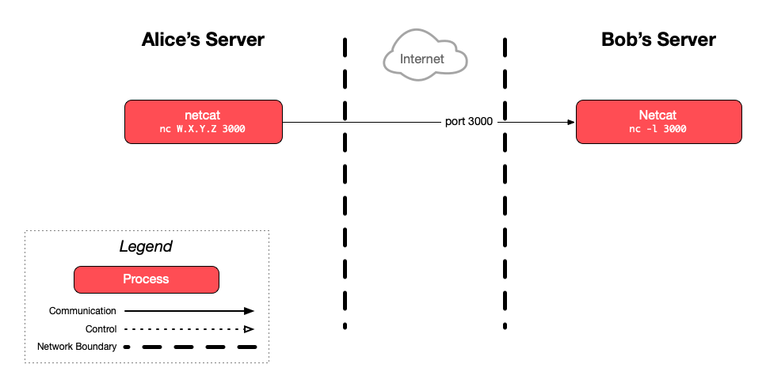

This exercise guides you through establishing a raw TCP connection between two servers and manually sending an HTTP request to a web server, illustrating how network protocols work in practice.

## :exclamation: **Bob:** listen for TCP clients


You need to find a partner for this part of the exercise, since the goal is to establish a TCP connection between two of the servers you have set up for the course.

Let's call you **Bob** and your partner **Alice**.

Alice will need to know the public IP address of Bob's server. We will refer to it as `W.X.Y.Z`.


Bob should run the `nc` command on his server to listen for TCP connections on port 3000:

```bash
$> nc -l 3000
```


At this point, `nc` will start **l**istening on port 3000 and take over the console, waiting for a TCP client to connect.


## :exclamation: **Alice:** connect to Bob's server

Alice should run the `nc` command on her server to connect to TCP port 3000 on Bob's server:

```bash
$> nc W.X.Y.Z 3000
```


Here, `nc` is acting as a client, connecting to the listening `nc` process on Bob's server.


## :exclamation: Communicate!

Bob should type "Hello" and press `Enter` to send this text:

```bash
$> nc -l 3000
Hello
```

It should be immediately displayed in Alice's terminal:

```bash
$> nc W.X.Y.Z 3000
Hello
```

Similarly, if Alice types "World" after that and presses `Enter`:

```bash
$> nc W.X.Y.Z 3000
Hello
World
```

It should appear in Bob's terminal:

```bash
$> nc -l 3000
Hello
World
```

You have a two-way raw TCP connection running.

Once you're done, you can close the connection with `Ctrl-C`.

## :exclamation: Talk ~~dirty~~ HTTP to Google

Let's do something that your browser does every day: an HTTP request.

Find out Google's IP address (`O.P.Q.R` in this example) using the [`ping` command][ping]:

```bash
$> ping -c 1 google.com
PING google.com (`O.P.Q.R`) 56(84) bytes of data.
64 bytes from google.com (O.P.Q.R): icmp_seq=1 ttl=53 time=0.890 ms
...
```

Open a TCP connection to the Google IP address you found:

```bash
$> nc O.P.Q.R 80
```

Now, talk to this Google server, but not in English or French, in the [HTTP protocol][http]:

```bash
GET / HTTP/1.1
Host: www.google.com
```


Be sure to type **exactly** the text above. Your request must be a valid HTTP request or Google's server will not be able to interpret it correctly. If you have made a mistake, exit with `Ctrl-C` and start over.



By sending this text over the TCP connection, you are communicating in the HTTP protocol, a text protocol: you are sending an HTTP request to retrieve (`GET`) the resource at path `/` of host `www.google.com` (the
landing page of the Google website), using version `1.1` of the HTTP protocol.


Press `Enter` twice and you should receive the HTML for Google's home page.

Once you're done, you can close the connection with `Ctrl-C`.

If you open your browser, visit `http://www.google.com` and display the source code of the page, you should see the same result.

## :boom: Troubleshooting

- If you get a `400 Bad Request` response, it means that your HTTP request is invalid. You probably did not type exactly the text above.
- If you don’t get a response, it may be because you took too long to type the text, and the request has timed out. Try again a little faster.

## :checkered_flag: What have I done?

Contratulations!

Like the pioneers of the 1970s who developed the TCP/IP suite, you have established a TCP connection between two machines and exchanged some (hopefully nice) words with your classmate.

You have also spoken HTTP directly to Google's web server on a TCP connection, demonstrating the layering of the OSI model:

- You have hand-written an HTTP request, a level 7 application protocol. As you've seen, this is simply text written in the correct format.
- You have sent this request through a TCP connection, a level 4 transport protocol.
- To reach the correct host, you have used an address of the **I**nternet **P**rotocol (IP), a level-3 network protocol.


There are other protocols in other layers at work, but these are the ones that interest us in the context of this course.


You can also now fully appreciate what your browser does for you every day.

### :classical_building: Architecture

This is a simplified architecture of the main running processes and communication flow during this exercise:



[http]: https://en.wikipedia.org/wiki/HTTP
[nc]: https://en.wikipedia.org/wiki/Netcat
[ping]: https://en.wikipedia.org/wiki/Ping_(networking_utility)
