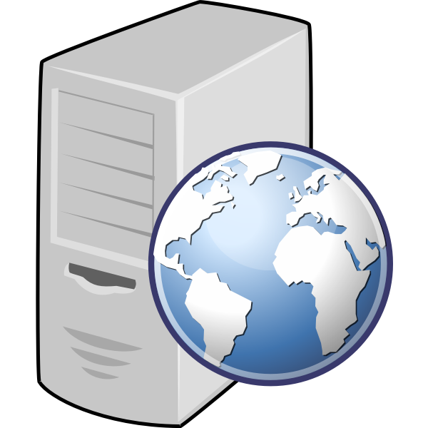
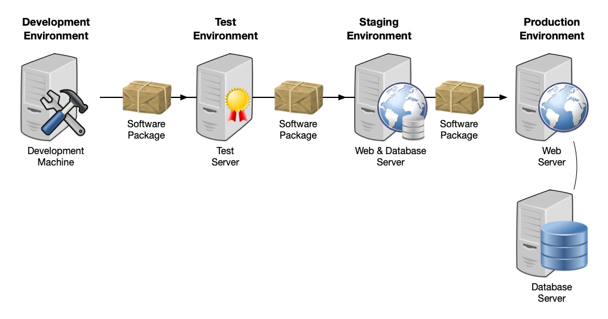

# Unix Environment Variables

Architecture & Deployment <!-- .element: class="subtitle" -->

**Notes:**

Learn about environment variables, a powerful way to configure applications and
processes in Unix-like operating systems.

**You will need**

- A Unix CLI

**Recommended reading**

- [Unix Processes]()

---

## Environment

---

### What is an environment?

A computer system or set of systems in which a program or component is
**deployed and executed**.

  

    
    

      Local <strong>development</strong> environment
    

  

  

    
    

      Server <strong>production</strong> environment
    

  

---

### Industrial deployment

Environments vary to suit different needs.

**Notes:**

In industrial use, the **development environment** (where changes are originally
made) and **production environment** (what end users use) are separated, often
with several stages in between.

The configuration of each environment may vary to suit the requirements of
development, testing, production, etc.

---

### Continuous delivery/deployment (CD)

**Notes:**

When using [agile software development][agile], teams are seeing much higher
quantities of software releases.

[Continuous delivery][cd] and [DevOps][devops] are processes where a program is
packaged and "moved" from one environment to the other (i.e. deployed) until it
reaches the production stage.

Modern software development teams use automation to speed up this process.

[agile]: https://en.wikipedia.org/wiki/Agile_software_development
[bash]: https://en.wikipedia.org/wiki/Bash_(Unix_shell)
[cd]: https://en.wikipedia.org/wiki/Continuous_delivery
[devops]: https://en.wikipedia.org/wiki/DevOps
[env]: https://en.wikipedia.org/wiki/Deployment_environment
[env-var]: https://en.wikipedia.org/wiki/Environment_variable
[path]: https://en.wikipedia.org/wiki/Path_(computing)
