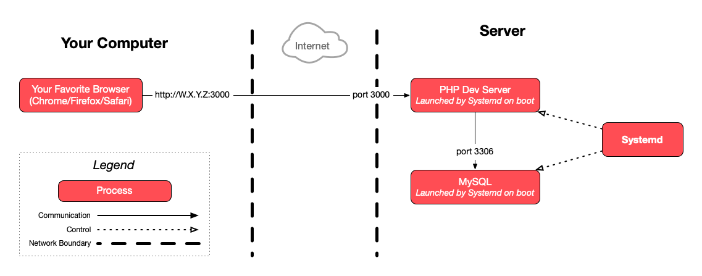

This guide describes how to create a [systemd][systemd] service to run the PHP
todolist application.

<!-- more -->

## :exclamation: Requirements

Make sure you have completed the [previous exercise]() first.

Stop your `php -S` command if it is still running.



You can use `Ctrl-C` to stop any command currently running in your terminal.



## :question: What you have done so far to run your application

If we try to summarize what you have done so far to run the PHP todolist
application on your server, it basically consists of these steps:

- Connect to the server with SSH as your user, e.g. `jde`:

  ```bash
  $> ssh jde@W.X.Y.Z
  ```

- _The first time,_ install MySQL and check that it is running:

  ```bash
  $> sudo apt install mysql-server
  $> sudo systemctl status mysql
  ```

- Move into the application directory:

  ```bash
  $> cd todolist-repo
  ```

- Run the application with the appropriate environment variables:

  ```bash
  $> TODOLIST_DB_PASS=changeme php -S 0.0.0.0:3000
  ```

## :exclamation: Create a systemd unit configuration file

Now you want systemd to run the application automatically for you. You need to
tell systemd how to do it. But you cannot simply tell systemd to execute the
commands above, because it does not understand Bash commands or Bash syntax. It
uses configuration files in a certain format.

You must write a **systemd unit file** which describes how and when to run the
application (the "unit" in systemd terminology). You can see examples of
existing unit file by looking at the ones for the MySQL or SSH servers running
on your server:

```bash
$> cat /lib/systemd/system/mysql.service
$> cat /lib/systemd/system/ssh.service
```

You will not use exactly the same options, but it shows you what a complete unit
file can look like.

Create your own unit file for the PHP todolist at
`/etc/systemd/system/todolist.service`. You will have to use nano (or Vim) to
create and edit this file directly on the server. You cannot use an SFTP client.



You can edit a file with nano by running the following command:

`sudo nano <path>`

If the file does not exist, it will be created by nano when you exit and save.
The `sudo` is necessary because the `/etc/systemd/system` directory is only
writable by `root`.

You cannot use FileZilla because you cannot connect with `root` over SFTP as
that is considered insecure and therefore not allowed by the default
configuration of the SSH server.



You may find the following documentation useful to write your unit file:

- [`[Unit]` section
  options](https://www.freedesktop.org/software/systemd/man/systemd.unit.html#%5BUnit%5D%20Section%20Options)
- [`[Service]` section
  options](https://www.freedesktop.org/software/systemd/man/systemd.service.html#Options)
  - [Environment](https://www.freedesktop.org/software/systemd/man/systemd.exec.html#Environment)
    (for the `Environment`, `User` and `WorkingDirectory` options)
- [`[Install]` section
  options](https://www.freedesktop.org/software/systemd/man/systemd.unit.html#%5BInstall%5D%20Section%20Options)

### :exclamation: The `[Unit]` section

You should briefly document what your service is with a `Description` option.

You may want to use an `After` option. What other service needs to already be
running for the PHP TodoList to work? If there is one, your application should
start after it.



You can use the `ls /lib/systemd/system` command to list other system services.



### :exclamation: The `[Service]` section

You should tell systemd what command to run your application with using the
`ExecStart` option.



You must use absolute command paths with `ExecStart`. For example, if you
want to execute the `php` command, you cannot simply write `php`, you have to
use the absolute path to the command instead.

You can find the path to any binary with the `which <command>` command.



You must tell systemd where to execute the command (in which directory) with
the `WorkingDirectory` option. This must be an absolute path.



Go in the application directory on the server and execute the `pwd`
(**p**rint **w**orking **d**irectory) command if you are not sure what the
absolute path is.



You should tell systemd which user must run the command with the `User`
option. Use your own username.



It's bad practice to run an application with the `root` user. An
application running as the `root` user that has any security flaw could
allow an attacker to gain superuser privileges, and thus obtain complete
control over your server.





To go further, you could create a system user specifically to run this
application. This would allow you to limit that user's privileges, also limiting
the damage an attacker could make if your application is compromised.



If your application requires one or multiple environment variables to be set,
you can set them by adding an `Environment` option. This option can be included
in the file multiple times to set multiple environment variables.

In case your application crashes due to a bug or a server issue, you should
configure the `Restart` option so that systemd automatically restarts it when
there is a problem.

### :exclamation: The `[Install]` section

You may want to set the `WantedBy` option to tell systemd to automatically start
your application when the server boots. You can use the value
`multi-user.target` for this option.



`multi-user.target` means that the operating system has reached the multi-user
[runlevel](https://en.wikipedia.org/wiki/Runlevel). In other words, it means
that user management and networking have been initialized. This is typically
when you want to start running other processes which depend on users and/or
networking, like web applications.



### :question: Recap

Here's another way to look at this information:

| Things you do to run the application                  | How to do it manually             | How to tell systemd to do it                                                    |
| :---------------------------------------------------- | :-------------------------------- | :------------------------------------------------------------------------------ |
| Run commands as user `jde`                            | Connect as `jde` with SSH         | `User=jde` in the `[Service]` section                                           |
| Make sure a service is started                        | `sudo systemctl status <service>` | `After=<service>` in the `[Unit]` section                                       |
| Move into a directory                                 | `cd <path>`                       | `WorkingDirectory=<path>` in the `[Service]` section                            |
| Set an environment variable                           | `KEY=value ...`                   | `Environment="KEY=value"` in the `[Service]` section                            |
| Execute a command                                     | `<command> <arg1> <arg2>`         | `ExecStart=<absolute-path-to-command> <arg1> <arg2>` in the `[Service]` section |
| Restart the application automatically when it crashes | _Cannot be done manually_         | `Restart=<policy>` in the `[Service]` section                                   |
| Have the application start automatically on boot      | _Cannot be done manually_         | `WantedBy=<target>` in the `[Install]` section                                  |



You should put comments in your unit file to explain what each option is for.
This can help you if you come back later and do not remember what you did or
why. Any line starting with `#` is considered a comment.



## :exclamation: Enable and start the todolist service

Enable and start your new service.



The systemd control command (`systemctl`) allows you to manipulate services:
`sudo systemctl <operation> <service-name>`.

The operations to enable and start are simply `enable` and `start`. The name of
the service is the name of your unit file without the ".unit" extension. For
example, if the unit file is "todolist.service", the name of your service is
"todolist".



Check that the service is running properly and that there were no errors.



You can also use the `systemctl` command to check the status of your service
with its `status` operation (instead of `enable` or `start`). It should also
show you the last few lines of its logs.

To see the complete logs, you can use the `sudo journalctl -u <service-name>`
command. Pay attention to the timestamps at the beginning of each line, which
will let you know _when_ each event occurred.



You (and everybody else) should be able to access the running todolist
application in your browser on your server's IP address and port 3000 (e.g.
`W.X.Y.Z:3000`).

## :exclamation: Reboot and try again

If you have configured your unit file correctly, your application should restart
automatically if the server is rebooted.

Try to reboot your server:

```bash
$> sudo reboot
```

The application should still be running.

## :checkered_flag: What have I done?

You have configured your operating system's process manager (systemd, which
comes bundled with Ubuntu) to manage your application's lifecycle for you. You
no longer have to worry about:

- Running the command to start the application.
- Restarting the application after rebooting the server.
- Restarting the application after it crashes due to a bug.

### :classical_building: Architecture

This is a simplified architecture of the main running processes and
communication flow at the end of this exercise.



<div class="flex items-center gap-2">
  <a href="./images/architecture.pdf" download="PHP Todolist Architecture" class="tooltip" data-tip="Download PDF">
    
  </a>
  <a href="./images/architecture.png" download="PHP Todolist Architecture" class="tooltip" data-tip="Download PNG">
    
  </a>
</div>

## :boom: Troubleshooting

Here's a few tips about some problems you may encounter during this exercise.

### :boom: My systemd service is not running

If `sudo systemctl status todolist` indicates a problem with your unit file, you
should fix the problem in your unit file. Then, be sure to run `sudo systemctl
daemon-reload` to take the changes into account. You may also need to run `sudo
systemctl restart todolist` to restart your application.

If the status command does not give you enough information, you can get more of
your service's logs with the `sudo journalctl -u todolist` command.

### :boom: `code=exited, status=200/CHDIR`

If you see an error like this when getting the status of your service:

```bash
$> sudo systemctl status todolist
× todolist.service - PHP TodoList
     Loaded: loaded (/etc/systemd/system/todolist.service; enabled; preset: enabled)
     Active: failed (Result: exit-code) since Mon 2024-11-04 19:25:12 UTC; 193ms ago
   Duration: 6ms
    Process: 303126 ExecStart=/usr/bin/php -S 0.0.0.0:3000 (code=exited, status=200/CHDIR)
   Main PID: 303126 (code=exited, status=200/CHDIR)
        CPU: 3ms

...
Nov 04 19:25:12 jde.archidep.ch systemd[1]: Failed to start todolist.service - PHP TodoList.
```

It means that systemd failed to move into the directory you specified with the
`WorkingDirectory` key. Make sure that you are using the correct directory. This
should be the same directory that you were moving into before executing the `php
-S 0.0.0.0:3000` command manually in previous exercises.

If you are not sure what the full path to that directory is, go into it and run
the `pwd` (**p**rint **w**orking **d**irectory) command.

### :boom: `code=exited, status=203/EXEC`

If you see an error like this when getting the status of your service:

```bash
$> sudo systemctl status todolist
× todolist.service - PHP TodoList
     Loaded: loaded (/etc/systemd/system/todolist.service; enabled; preset: enabled)
     Active: failed (Result: exit-code) since Mon 2024-11-04 19:17:24 UTC; 1s ago
   Duration: 6ms
    Process: 302966 ExecStart=php -S 0.0.0.0:3000 (code=exited, status=203/EXEC)
   Main PID: 302966 (code=exited, status=203/EXEC)
        CPU: 2ms

...
Nov 04 19:17:24 jde.archidep.ch systemd[1]: Failed to start todolist.service - PHP TodoList.
```

It means that systemd failed to run the command you specified with the
`ExecStart` key. Make sure you are using the correct command and that you are
using `ExecStart` with the correct syntax.

Look at the [documentation for `ExecStart`][systemd-exec-start], look at
[service examples in the documentation][systemd-service-examples], and look at
existing unit files (e.g. `/lib/systemd/system/mysql.service` or
`/lib/systemd/system/ssh.service`) to determine what you might have done wrong.

### :boom: Failed to resolve unit specifiers

If you have a `%` (percent character) in the password you provide with the
`TODOLIST_DB_PASS` variable, and systemd indicates an error about failing to
resolve specifiers, it is because the `%` character has special meaning to
systemd.

You must escape it by adding another `%` character, e.g.
`TODOLIST_DB_PASS=foo%%bar` instead of `TODOLIST_DB_PASS=foo%bar`.

[systemd]: https://en.wikipedia.org/wiki/Systemd
[systemd-exec-start]: https://www.freedesktop.org/software/systemd/man/latest/systemd.service.html#ExecStart=
[systemd-service-examples]: https://www.freedesktop.org/software/systemd/man/latest/systemd.service.html#Examples
