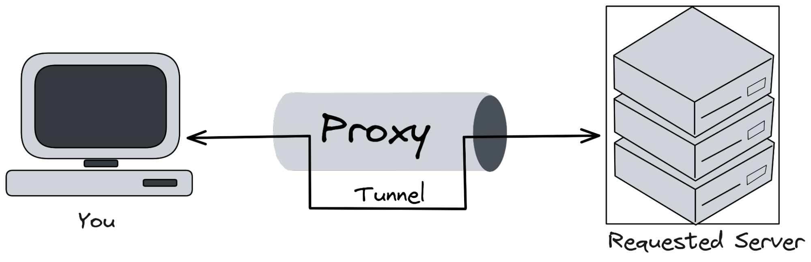
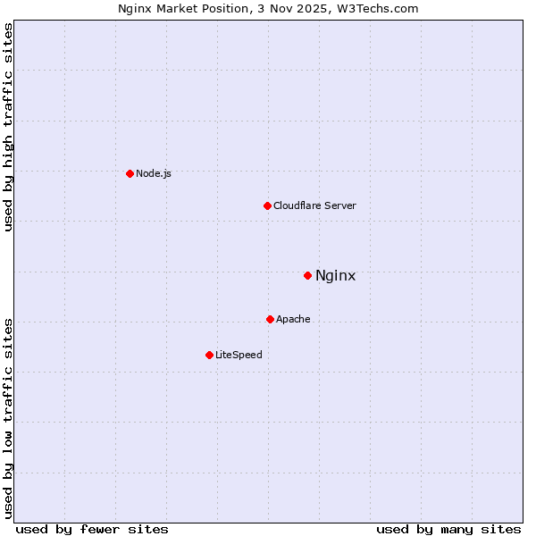

# Reverse Proxying

Architecture & Deployment <!-- .element: class="subtitle" -->

---

## What is a proxy?

A [**proxy server**][proxy] is a computer or application that acts as an
**intermediary** for requests from clients seeking resources from other servers.

---

## Types of proxy servers

There are 3 main kinds:

- [**Tunneling proxy**][tunneling-proxy] or [**gateway**][gateway]
- [**Forward proxy**][open-proxy]
- [**Reverse proxy**][reverse-proxy]

---

## Tunneling proxy

A [tunneling proxy][tunneling-proxy] can pass **unmodified requests and
responses** from one network to another.

**Notes:**

It can also be used to encapsulate a protocol into another, such as running IPv6
over IPv4. For example, an SSH connection may be relayed by a proxy server to a
different target server. The proxy server simply passes the packets through,
with no ability to compromise the security of the communication.

[**Virtual private networks (VPN)**][vpn] use tunneling protocols, usually with
an additional layer of encryption.

---

## Forward proxy

A **forward proxy** retrieves data from a server on behalf of a client. It is
said to be [**open**][open-proxy] if it is accessible by any Internet user.

---

### Anonymous forward proxy

Conceals the identity of the client.

**Notes:**

An **anonymous forward proxy** reveals its identity as a server but conceals
that of the client. Since the target server does not know who the original
client is, it can be used to protect privacy. [VPNs][vpn] are often used in
combination with this type of proxy server.

---

### Transparent forward proxy

Identifies both itself and the original client.

**Notes:**

A **transparent forward proxy** identifies both itself and the original client
through the use of HTTP headers. It can be used to cache websites. Schools often
use this kind of proxy to restrict access to particular websites (e.g.
Facebook).

When many clients go through the same forward proxy server, its IP address may
get banned, since the target server only sees one computer (the proxy) making
too many requests at the same time.

---

## Reverse proxy

A [**reverse proxy**][reverse-proxy] is an **internal-facing proxy** used to
control and protect access to servers in a **private network**.

**Notes:**

A reverse proxy **appears to clients to be an ordinary server**, but actually
**transmit their requests to** one or more **other servers in an internal
private network** which handle the requests.

---

### Hiding internal architecture

The client only sees the proxy server.

**Notes:**

The response from the private server is returned as if it was coming from the
proxy server itself, leaving the client with no knowledge of the structure of
the internal network.

---

## Why use a reverse proxy?

<!-- slide-front-matter class: center, middle -->

---

### Hiding internal architecture

Reverse proxies can **hide the existence and characteristics of an internal
network's private servers**.

**Notes:**

Since the client only sees the proxy server, it is unaware of the complexity of
the internal architecture and does not have to worry about it.

In a scenario where you have only a single public IP address available, a
reverse proxy allows you to make multiple private servers accessible on that IP
address through the proxy server.

---

### Hiding multi-component websites

**Notes:**

Modern websites can be complex applications, often with a **separate frontend
and backend** developed by different teams with different technologies. Putting
a reverse proxy in front can make it **appear as one single website** on a
single domain name, avoiding [CORS][cors] issues.

---

### SSL termination or authentication

A reverse proxy can be the **secure endpoint** with all the SSL certificates,
then **forwarding unencrypted requests** to other servers in the private
network.

**Notes:**

Managing SSL certificates to provide websites over HTTPS is rather complex. It
can be hard to configure some frameworks or tools to ensure they are only using
secure communications.

Similarly, a reverse proxy could also require **authentication** before letting
a client access an insecure application, adding security without having to
modify the application itself.

---

### Scalability

[Scalability][scalability] is the capability of a computer system to handle a
growing amount of work (e.g. client requests).

**Notes:**

There are [2 broad ways][horizontal-and-vertical-scaling] of adding more
resources for a particular application.

**Vertical scaling** consists in using a more powerful computer, with more CPU,
RAM, throughput, etc. The added power will allow the server to serve more
clients.

**Horizontal scaling** means adding more computers to handle the same work. For
example, 3 instances of a web application can probably handle 3 times as many
clients at the same time. Computers or applications can be combined in
[clusters][cluster] to improve performance.

---

#### Load balancing

A common function of reverse proxies is to perform [**load
balancing**][load-balancing], i.e. the distribution of workloads across multiple
servers to achieve **horizontal scaling**.

**Notes:**

As multiple clients arrive simultaneously, the reverse proxy will distribute
requests to different servers, spreading the load between them.

---

### Other uses

- [Web acceleration][web-acceleration]
- On-the-fly compression
- Spoon-feeding
- [Denial-of-service (DoS)][dos] protection
- [A/B testing][ab-testing]

**Notes:**

- [Web acceleration][web-acceleration] is the caching of static content and
  dynamic content to reduce load on internal servers.
- Optimize content by transparently compressing it to speed up loading times.
- _Spoon-feeding_ is a technique where the reverse proxy temporarily stores a
  dynamically generated page, then serves it to the client a little bit at a
  time. This avoids the internal server having to wait for slow clients such as
  mobile applications.
- And [more][reverse-proxy-uses]

---

## nginx

<!-- .element: class="hidden" -->

---

### What is nginx?

[nginx][nginx] is a concurrent of the well-known [Apache HTTP server][apache]
developed in 2004 to solve the [C10k problem][c10k].

**Notes:**

[nginx][nginx] is an HTTP and reverse proxy server used by more than 25% of the
busiest sites in December 2018. It was developed to solve the [C10k
problem][c10k], i.e. the capability of a computer system to handle ten thousand
concurrent connections, thanks to its [event-driven
architecture][nginx-performance]. It also has [many other
features][nginx-features] to serve modern web applications.

---

#### Apache vs. nginx

**Notes:**

Although Apache is still used to serve more websites, nginx leads the pack in
web performance, and is used more for the busiest websites.

[ab-testing]: https://en.wikipedia.org/wiki/A/B_testing
[apache]: https://httpd.apache.org/
[c10k]: https://en.wikipedia.org/wiki/C10k_problem
[cluster]: https://en.wikipedia.org/wiki/Computer_cluster
[cors]: https://en.wikipedia.org/wiki/Cross-origin_resource_sharing
[digital-ocean]: https://www.digitalocean.com/
[dos]: https://en.wikipedia.org/wiki/Denial-of-service_attack
[gateway]: https://en.wikipedia.org/wiki/Gateway_(telecommunications)
[horizontal-and-vertical-scaling]: https://en.wikipedia.org/wiki/Scalability#Horizontal_and_vertical_scaling
[load-balancing]: https://en.wikipedia.org/wiki/Load_balancing_(computing)
[nginx]: http://nginx.org/
[nginx-directive-index]: http://nginx.org/en/docs/http/ngx_http_index_module.html#index
[nginx-directive-listen]: http://nginx.org/en/docs/http/ngx_http_core_module.html#listen
[nginx-directive-location]: http://nginx.org/en/docs/http/ngx_http_core_module.html#location
[nginx-directive-root]: http://nginx.org/en/docs/http/ngx_http_core_module.html#root
[nginx-directives]: http://nginx.org/en/docs/dirindex.html
[nginx-docs]: http://nginx.org/en/docs/
[nginx-features]: http://nginx.org/en/#basic_http_features
[nginx-include]: http://nginx.org/en/docs/ngx_core_module.html#include
[nginx-performance]: https://www.nginx.com/blog/inside-nginx-how-we-designed-for-performance-scale/
[nginx-server-names]: http://nginx.org/en/docs/http/server_names.html
[nginx-signals]: http://nginx.org/en/docs/control.html
[nginx-upstream]: http://nginx.org/en/docs/http/ngx_http_upstream_module.html
[open-proxy]: https://en.wikipedia.org/wiki/Open_proxy
[proxy]: https://en.wikipedia.org/wiki/Proxy_server
[reverse-proxy]: https://en.wikipedia.org/wiki/Reverse_proxy
[reverse-proxy-uses]: https://en.wikipedia.org/wiki/Reverse_proxy#Uses_of_reverse_proxies
[scalability]: https://en.wikipedia.org/wiki/Scalability
[tunneling-proxy]: https://en.wikipedia.org/wiki/Tunneling_protocol
[vpn]: https://en.wikipedia.org/wiki/Virtual_private_network
[web-acceleration]: https://en.wikipedia.org/wiki/Web_accelerator
[weighted-round-robin]: https://en.wikipedia.org/wiki/Weighted_round_robin
