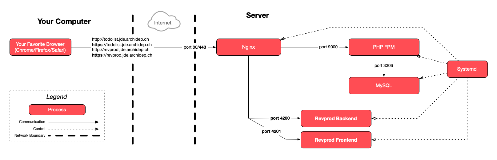

The goal of this exercise is to provision a [Let's Encrypt][letsencrypt] [SSL
certificate][certificate] for an application deployed in previous exercises
using [Certbot][certbot].

This exercise assumes that you have deployed at least one web site or
application during previous exercises, and that you have configured nginx to
serve it.



Connect to your cloud server with SSH for this exercise.



<!-- more -->

## :exclamation: Install Certbot

Install Certbot with the following command:

```bash
$> sudo apt install certbot python3-certbot-nginx
```

## :exclamation: Obtain a TLS certificate from Let's Encrypt

Follow the [instructions for nginx and Linux
(snap)](https://certbot.eff.org/instructions?ws=nginx&os=snap) **starting
at step 6**:



When the instructions ask you to "Choose how you'd like to run Certbot", you can
choose the simplest option which is to "get a certificate and have Certbot edit
your Nginx configuration automatically to serve it".



Once you are done, your web site or application should be accessible over HTTPS.

You should take a look at your nginx site configuration file(s) in the
`/etc/nginx/sites-available` directory, to see the changes Certbot has made.

## :checkered_flag: What have I done?

You have run Certbot to request a [TLS][tls] certificate from the Let's Encrypt
[certificate authority (CA)][ca].

Before issuing a certificate, Let's Encrypt (or any other certificate authority)
requires [domain validation][domain-validation], i.e. you must provide some
proof that you control the server reachable at the certificate's domain name.
Since you have run Certbot on your server, it has automatically provided that
proof by asking Let's Encrypt to perform an [HTTP challenge][http-challenge],
and then completing the challenge by providing the appropriate file through
nginx.

Certbot saved the certificate it obtained from Let's Encrypt somewhere into the
`/etc/letsencrypt` directory. It then modified your nginx site's configuration
file to use that certificate.



Certbot has been able to automatically do all these things for you because you
have run it with administrative privileges by prefixing it with `sudo`.



Because the modified nginx configuration for your site now listens on port 443
for HTTPS and provides a valid TLS certificate, your todolist is now accessible
with an `https://` instead of an `http://` URL, and the TLS protocol is used to
encrypt communications between your browser and the server.

### :classical_building: Architecture

This is a simplified architecture of the main running processes and
communication flow at the end of this exercise:



<div class="flex items-center gap-2">
  <a href="./images/architecture.pdf" download="Certbot Deployment Architecture" class="tooltip" data-tip="Download PDF">
    
  </a>
  <a href="./images/architecture.png" download="Certbot Deployment Architecture" class="tooltip" data-tip="Download PNG">
    
  </a>
</div>



This diagram shows the processes involved in all previous exercises, meaning
those related to the PHP todolist and the revprod applications.

The only thing that has changed in this exercise is that you are now accessing
your applications over an encrypted HTTPS/TLS connection instead of insecure
HTTP.



## :boom: Troubleshooting

Here's a few tips about some problems you may encounter during this exercise.

### :boom: No names were found in your configuration files

If Certbot tells you that "No names were found in your configuration files" but
you have nginx sites that are configured, this may be because you have an
underscore character (`_`) in your subdomains, e.g. `jde.archidep.ch`.

Although many tools support it, [underscore are technically not allowed in
domain
names](https://www.ssl.com/faqs/underscores-not-allowed-in-domain-names/). You
will have to change your subdomain for Certbot to recognize it as valid.

There are two things you need to do:

- Log back into [Gandi.net][gandi] and add a new A record for your Azure VM just
  like you did during the [Domain name configuration]() exercise.

  Use something short like `jde` and `*.jde` (as long as it does not conflict
  with anyone else's subdomain), with the same IP address as before (the public
  IP address of your Azure VM).

- Replace your old subdomain by the new one in all your nginx configuration
  files, for example:

  ```bash
  $> sudo nano /etc/nginx/sites-available/clock
  $> sudo nano /etc/nginx/sites-available/revprod
  $> sudo nano /etc/nginx/sites-available/todolist
  ```

  Then test and reload the nginx configuration with:

  ```bash
  $> sudo nginx -t
  $> sudo nginx -s reload
  ```

Make sure your sites work at their new address. If they do, the `certbot`
command should now also detect them.



It may take a few minutes for the new DNS entries to propagate. If you are sure
the new DNS entries are correct but it doesn't work, try again a little while
later.



[ca]: https://en.wikipedia.org/wiki/Certificate_authority
[certbot]: https://certbot.eff.org
[certificate]: https://en.wikipedia.org/wiki/Public_key_certificate
[domain-validation]: https://en.wikipedia.org/wiki/Domain-validated_certificate
[gandi]: https://www.gandi.net
[http-challenge]: https://letsencrypt.org/docs/challenge-types/#http-01-challenge
[letsencrypt]: https://letsencrypt.org
[tls]: https://en.wikipedia.org/wiki/Transport_Layer_Security
