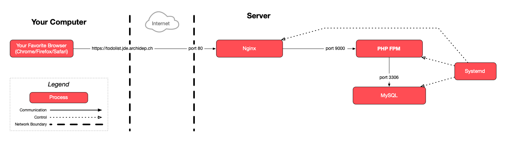

This guide describes how to automatically deploy a PHP application when pushing
commits to a server.

It assumes that you have performed the previous [nginx & PHP-FPM exercise].

<!-- more -->

## :exclamation: Set up directories



Connect to your cloud server with SSH for this part of the exercise.



Create two directories, `todolist-automated` and `todolist-automated-repo`, in your home directory:

```bash
$> cd
$> mkdir todolist-automated
$> mkdir todolist-automated-repo
```

The `todolist-automated-repo` directory will be the Git repository. Later you
will add it as a remote in your local Git repository, so that you can push
commits to it.

The `todolist-automated` directory will contain the currently deployed version
of the code. The goal is that every time you push commits to the repository,
this directory is automatically updated.

## :exclamation: Update the todolist nginx configuration

In previous exercises you configured nginx to serve the PHP application from the
`todolist-repo` directory. Edit that configuration:

```bash
$> sudo nano /etc/nginx/sites-available/todolist
```

Change `todolist-repo` to `todolist-automated` so that nginx looks for files in
the correct directory.

Tell nginx to reload its configuration:

```bash
$> sudo nginx -s reload
```

The site at http://todolist.jde.archidep.ch may not work anymore. You may get a
`404 Not Found` error from nginx since there are no files in the
`todolist-automated` directory yet.

## :exclamation: Create a bare Git repository on the server

Git will not let you push commits to a normal repository with a working tree,
so you need to use a bare repository instead, with only its Git directory:

```bash
$> cd ~/todolist-automated-repo
$> git init --bare
Initialized empty Git repository in /home/jde/todolist-automated-repo/
```



Remember that a Git repository has several parts: [the Git directory where the
project's history is stored, and the working tree which contains the current
version of the files you are working on](#/13).

A bare repository is a repository with only a Git directory and no working tree.
The project's files are not checked out. It's used mostly on servers for sharing
or automation. Read [What is a bare repository?][git-bare] for more information.



### :exclamation: Add a `post-receive` hook to the Git repository

Copy this script:

```
#!/usr/bin/env bash
set -e

echo Checking out latest version...
export GIT_DIR=/home/jde/todolist-automated-repo
export GIT_WORK_TREE=/home/jde/todolist-automated
git checkout -f main
cd "$GIT_WORK_TREE"

echo Deployment successful
```

This script will take the latest version of the code in the
`todolist-automated-repo` repository and checkout a working tree in the
`todolist-automated` directory (the one nginx is serving files out of).



If your repo has a `master` branch instead of a `main` branch, replace `main` by
`master` in the `git checkout -f main` command in your hook.





Normally, when you use the `git checkout` command in a Git repository, it will
use the `.git` directory of the repository as the Git directory, and the
repository itself as the working tree.

By setting the `GIT_DIR` environment variable, you are instructing Git to use a
different Git directory which could be anywhere (in this case, it is the bare
repository you created earlier).

By setting the `GIT_WORK_TREE` environment variable, you are instructing Git to
use a different directory as the working tree. The files will be checked out
there.



Open the `post-receive` file in the repository's `hooks` directory:

```bash
$> nano hooks/post-receive
```

Paste the contents of the script your copied above.



Replace `jde` with your username in the `GIT_DIR` and `GIT_WORK_TREE` variables.



Exit with `Ctrl-X` and save when prompted.

Make the hook executable:

```bash
$> chmod +x hooks/post-receive
```

Make sure the permissions of the hook are correct:

```bash
$> ls -l hooks/post-receive
-rwxrwxr-x 1 jde jde 239 Jan 10 20:55 hooks/post-receive
```



It should have the `x` (e**x**ecute) permission for owner, group and others.



## :exclamation: Add the server's Git repository as a remote



Disconnect from your cloud server or open another terminal. The following steps
happen on your local machine.



Go to the PHP todolist repository on your local machine:

```bash
$> cd /path/to/projects/php-todo-ex
```

As you have already seen with GitHub, Git can communicate over SSH. This is not
limited to GitHub: you can define a remote using an SSH URL that points to your
own server.

Add an [SSH remote][git-ssh-protocol] to the bare repository you created earlier
(replace `jde` with your username and `W.X.Y.Z` with your server's IP
address):

```bash
$> git remote add archidep jde@W.X.Y.Z:todolist-automated-repo
```



Replace `jde` with your username and `W.X.Y.Z` with your server's public IP
address.





The format of the remote URL is `<user>@<ip-address>:<relative-path>`.
Git can connect to your server over SSH using public key authentication just
like when you use the `ssh` command. It will then look for a repository at the
path you have specified, relative to your home directory.



## :exclamation: Trigger an automated deployment

From your local machine, push the latest version of the `main` branch to the remote on your server:

```bash
$> git push archidep main
Enumerating objects: 36, done.
Counting objects: 100% (36/36), done.
Delta compression using up to 8 threads
Compressing objects: 100% (19/19), done.
Writing objects: 100% (36/36), 15.09 KiB | 15.09 MiB/s, done.
Total 36 (delta 16), reused 36 (delta 16)

remote: Checking out latest version...
remote: Deployment successful

To W.X.Y.Z:todolist-automated-repo
 * [new branch]      main -> main
```



If your repo has a `master` branch instead of a `main` branch, replace `main` by
`master` in the `git push archidep main` command in your hook.





If you have set up your `post-receive` hook correctly, you will see the output
of its `echo` commands displayed when you run `git push`. In the above example,
they are the two lines starting with `remote:`.



The site at http://todolist.jde.archidep.ch should work again.

### :exclamation: Check that the automated deployment worked on the server



Reconnect to your cloud server or switch to a terminal where you are still
connected.



Additionally, the `todolist-automated` directory should contain the latest
version of the project's files, as checked out by the `post-receive` hook:

```bash
$> ls ~/todolist-automated
LICENSE.txt  README.md  images  index.php  todolist.sql  update.sh
```

## :exclamation: Commit a change to the project and deploy it



Back to your local machine again.



Using your favorite editor, make a visible change to the project's `index.php`
file.



For example, look for the `<strong>TodoList</strong>` tag in the `<header>` and
change the title.



Commit and push your changes to the `archidep` remote (i.e. your server):

```bash
$> git add .

$> git commit -m "Change title"

$> git push archidep main
...
remote: Checking out latest version...
remote: Deployment successful
To W.X.Y.Z:todolist-automated-repo
   4ea6994..2faf028  main -> main
```

Visit http://todolist.jde.archidep.ch again. Your changes should have
been deployed automatically!

## :checkered_flag: What have I done?

You have created a bare Git repository on your server and pushed the PHP
todolist to that repository. You have set up a Git hook: a shell script that is
automatically executed every time a new commit is pushed. This script deploys
the new version of the todolist by copying the new version to the correct
directory.

This allows you to deploy new versions by simply pushing to the repository
on your server. You could add any command you wanted to your deployment script.

### :classical_building: Architecture

This is a simplified architecture of the main running processes and
communication flow at the end of this exercise. Note that it has not changed
compared to [the previous exercises](#classical_building-architecture) since we have neither created any new
processes nor changed how they communicate:



<div class="flex items-center gap-2">
  <a href="./images/architecture.pdf" download="Git Automated Deployment Architecture" class="tooltip" data-tip="Download PDF">
    
  </a>
  <a href="./images/architecture.png" download="Git Automated Deployment Architecture" class="tooltip" data-tip="Download PNG">
    
  </a>
</div>

[git-bare]: https://www.saintsjd.com/2011/01/what-is-a-bare-git-repository/
[git-ssh-protocol]: https://git-scm.com/book/en/v2/Git-on-the-Server-The-Protocols#_the_ssh_protocol
[php-fpm-ex]: nginx-php-fpm-deployment.md
