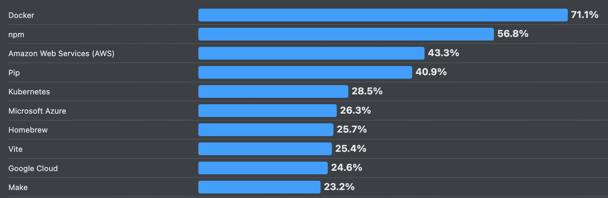
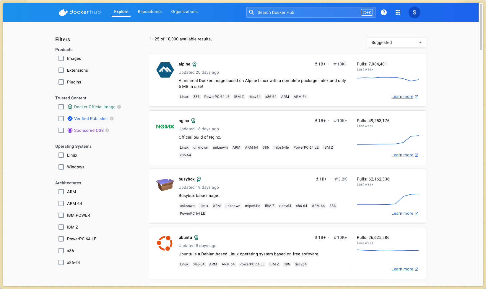

# Docker

Architecture & Deployment <!-- .element: class="subtitle" -->

---

## "It works on my machine."

[Docker][docker] was launched in 2013 to address the issue of **portability** in
software development and deployment.

**Notes:**

Have you ever had an application work on one operating system, such as macOS,
but not on another? Have you ever struggled to juggle different Node.js versions
for various web applications? Odds are, you have.

---

### Portability

The ability of software to be run on various environments with little to no
modifications

- Hardware Architectures
- Operating System Variations
- Dependency Management

**Notes:**

Portability in computing refers to the ability of software to be run on various
hardware or operating system environments with little or no modification. This
concept has been pivotal in software development for decades, facilitating the
adaptation of applications across diverse systems. Before containers and Docker,
portability was often achieved through careful coding practices, the use of
virtual machines, or cross-platform programming languages and libraries. Why is
portability such a challenge?

- Different hardware architectures can affect software performance and
  compatibility.
- Software that runs on one operating system might not run on another without
  significant changes.
- Ensuring all the necessary libraries and tools are present and compatible
  across systems is a major challenge.

---

### Virtual machines vs. containers

  
  

**Notes:**

**V**irtual **m**achines (VMs) solve the portability problem by providing
isolation and environment consistency. At its core, virtualization involves
creating virtual versions of physical resources, such as servers, storage
devices, and networks using a hypervisor.

**Hypervisor**: The central component of hardware virtualization is the
hypervisor, a software layer that enables multiple operating systems to share a
single hardware host.

Virtualization forms the foundation of cloud computing and is pivotal in data
center management.

While VMs are fantastic technology and incredibly useful in numerous scenarios,
it doesn't necessarily make sense to package an entire operating system just to
get a web application to work.

**Containers** are an alternative that addresses this drawback of virtual
machines. They tackle the challenges of portability by providing isolation and
environment consistency, all while sharing a host system's kernel and without
requiring a full operating system for each instance.

---

### What is Docker?

  

    Docker is an open source platform that automates the deployment, scaling,
    and management of applications inside lightweight, portable
    <strong>containers</strong>.
  

  

**Notes:**

Docker has revolutionized how developers build, ship, and run applications,
making it simpler to create and manage consistent environments.

In essence, Docker streamlines the development lifecycle by allowing developers
to work in standardized environments using local containers which provide your
applications and services. Docker has become a key component of many toolchains,
integrating smoothly with various tools and platforms.

---

### Who uses Docker?

[Stack Overflow 2025 Survey - Technology - Cloud
Development](https://survey.stackoverflow.co/2025/technology#1-cloud-development)

**Notes:**

Almost everyone.

In the [2025 Stack Overflow Developer
Survey](https://survey.stackoverflow.co/2025), 71.1% of professional developers
reported using Docker. In the fragmented world of software development, this is
a _significant_ number, likely second only to [Git][git] in terms of adoption.
This indicates that Docker is an essential tool to learn for aspiring developers
seeking employment.

---

### Why use Docker?

- Environment Consistency
- Portability
- Isolation
- Scaling
- DevOps

**Notes:**

- Apps run the same on your machine, your colleague's machine, and your boss's
  machine. No more "it works on my machine." It also means everyone executes the
  same commands to run the app, regardless of the computer. The operating system
  becomes irrelevant, which makes collaboration and deployment much easier.
- Docker containers can be moved across operating systems without needing to
  modify the codebase.
- Docker maintains a clear boundary between different applications and their
  dependencies. That means there are no more clashes between applications. This
  improves security and makes debugging simpler.
- You can deploy as many instances of the container as needed.
- Docker streamlines workflows between coding and deployment.

---

### Wait, why not just use good old VMs?

<table class="text-3xl">
  <thead>
    <tr>
      <th></th>
      <th>Virtual Machine</th>
      <th>Container</th>
    </tr>
  </thead>
  <tbody>
    <tr>
      <td>Architecture</td>
      <td>Full OS</td>
      <td>Application and dependencies</td>
    </tr>
    <tr>
      <td>Isolation</td>
      <td>Complete isolation</td>
      <td>Process-level isolation</td>
    </tr>
    <tr>
      <td>Performance</td>
      <td>Slower, but full access to hardware resources</td>
      <td>Faster, supports rapid scaling</td>
    </tr>
  </tbody>
</table>

**Notes:**

As usual, the choice depends on the use case. However, in the context of web
development, containers make a lot of sense. They offer the speed and agility
required in a dynamic web development environment, where rapid iteration and
deployment are key. With their process-level isolation, they provide a balanced
approach to security and resource efficiency. Their architecture, which includes
only the application and its dependencies, simplifies deployment across
different environments.

---

## Docker concepts

  

    
    
Images

  

  

    
    
Containers

  

---

### Docker concepts - Images

A Docker image is a **lightweight**, **standalone**, and **executable package**
that includes everything needed to run a piece of software.

**Notes:**

- Code
- Runtime
- Libraries
- System tools
- Operating system

Think of a Docker image as a recipe containing both the ingredients and the
instructions.

---

### Docker concepts - Containers

A Docker container is a **running instance** of a Docker image. It runs a
command using the environment contained within Docker image as a starting point.

**Notes:**

If the image is a recipe, then the container is the completed dish. Multiple
containers can be created from a single Docker image.

---

## Docker Workflow

**Notes:**

The Docker workflow encompasses several key components that work together to
manage the lifecycle of Docker containers: the **Client**, the **Daemon
(Host)**, and the **Registry**.

---

### Docker workflow - Client

The [Docker Client][docker-desktop] (CLI or GUI) provides a **user interface**
to issue commands to the **Docker host**.

**Notes:**

This interface can be used through the **command line** or with **Docker
Desktop** (pictured above), a GUI implementation of the client.

---

### Docker workflow - Daemon (Host)

The Docker daemon, or `dockerd`, is the **heart of the Docker platform**,
running on the host machine where containers are deployed. It **manages the
entire lifecycle of Docker containers** on the system.

**Notes:**

- `dockerd` listens for Docker API requests and **manages Docker objects such as
  images, containers, networks, and volumes**. It's the component that does the
  heavy lifting of building and running containers.
- It is responsible for **pulling images from Docker registries and building new
  images**. It stores these images locally, providing a cache to speed up future
  container launches.
- `dockerd` also handles **logging and monitoring** of container activity,
  providing insights into container performance and health.
- `dockerd` and the Docker Client together are often referred to as the **Docker
  Engine**.

---

### Docker workflow - Registry

A Docker registry is a **storage and content delivery system** that holds named
Docker images, available in different tagged versions.

**Notes:**

The most well-known registry is **[Docker Hub][docker-hub]**, which is a public,
cloud-based registry provided by Docker. Essentially, Docker Hub is to Docker
what GitHub is to Git.

Besides Docker Hub, there are other registries like the [GitHub container
registry](https://docs.github.com/en/packages/working-with-a-github-packages-registry/working-with-the-container-registry),
[Amazon ECR (**E**lastic **C**ontainer **R**egistry)][amazon-ecr], [Google
Artifact Registry][google-artifact-registry], and private, self-hosted options.

[amazon-ecr]: https://aws.amazon.com/ecr/
[docker]: https://www.docker.com/
[docker-commands-build]: https://docs.docker.com/engine/reference/commandline/build/
[docker-commands-exec]: https://docs.docker.com/engine/reference/commandline/exec/
[docker-commands-images]: https://docs.docker.com/engine/reference/commandline/images/
[docker-commands-logs]: https://docs.docker.com/engine/reference/commandline/logs/
[docker-commands-pull]: https://docs.docker.com/engine/reference/commandline/pull/
[docker-commands-ps]: https://docs.docker.com/engine/reference/commandline/ps/
[docker-commands-rm]: https://docs.docker.com/engine/reference/commandline/rm/
[docker-commands-run]: https://docs.docker.com/engine/reference/commandline/run/
[docker-commands-start]: https://docs.docker.com/engine/reference/commandline/start/
[docker-commands-stats]: https://docs.docker.com/engine/reference/commandline/stats/
[docker-commands-stop]: https://docs.docker.com/engine/reference/commandline/stop/
[docker-desktop]: https://www.docker.com/products/docker-desktop/
[docker-engine]: https://docs.docker.com/engine/
[docker-hub]: https://hub.docker.com/
[docker-images-node]: https://hub.docker.com/_/node
[docker-images-ubuntu]: https://hub.docker.com/_/ubuntu
[dockerfile-reference]: https://docs.docker.com/engine/reference/builder/
[git]: https://git-scm.com
[github]: https://github.com
[google-artifact-registry]: https://cloud.google.com/artifact-registry
[render]: https://render.com
[stack-overflow-survey]: https://survey.stackoverflow.co/2023/
