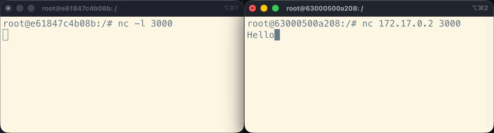
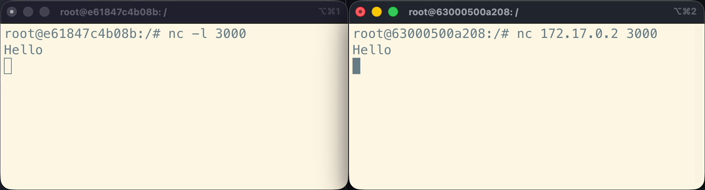
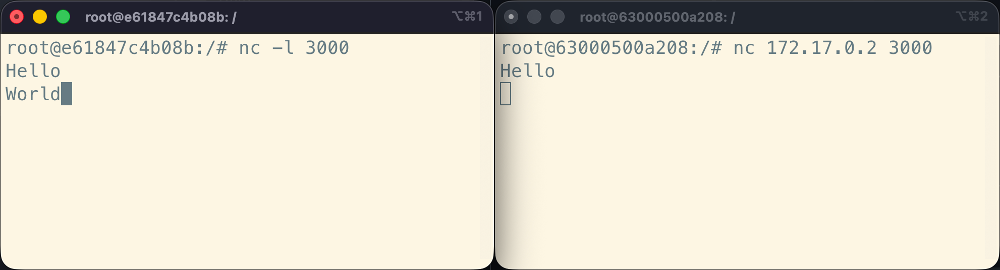
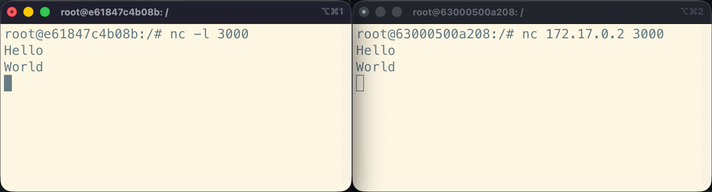
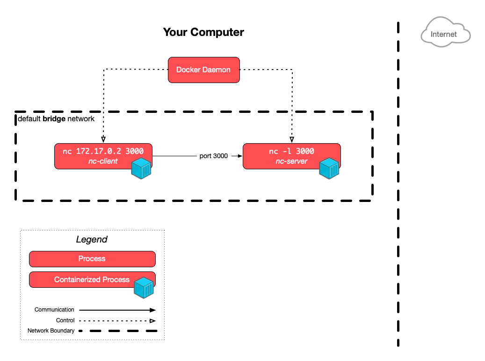
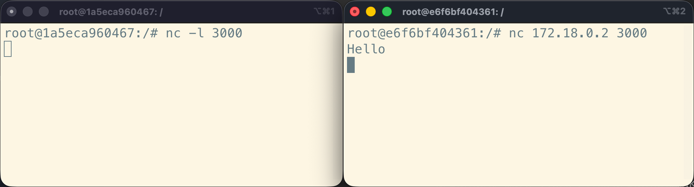
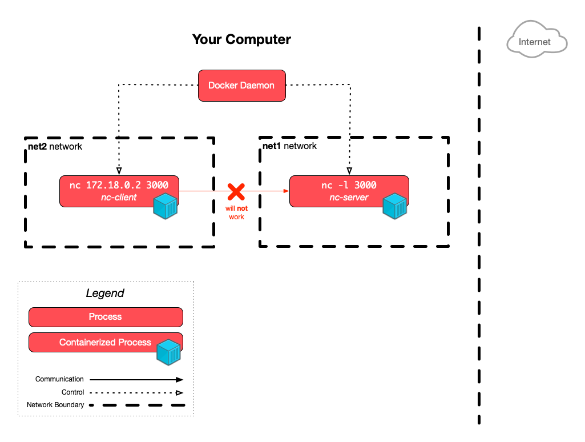

Learn about Docker container isolation mechanisms as it pertains to networking
and storage.

<!-- more -->

## Docker networks

[Docker networking][docker-networking] allows containers to communicate with
each other and with external services outside of Docker.

You can list the available Docker networks on your system using the command:

```bash
$> docker network ls
NETWORK ID     NAME      DRIVER    SCOPE
4fbcb80199ab   bridge    bridge    local
0dca506f97c0   host      host      local
d54b832d124f   none      null      local
```

There are 3 networks available out of the box in a fresh Docker installation:

- The [`bridge` network][docker-bridge-network] is the **default network for
  containers**. It provides network isolation between the host system and the
  containers, while allowing communication between containers on the same bridge
  network.
- The [`host` network][docker-host-network] removes network isolation between
  the container and the host system. Containers using the host network share the
  host's network stack and can directly access the host's network interfaces.
- The [`none` network][docker-none-network] disables all networking for the
  container.



There are other types of [Docker network drivers][docker-network-drivers], but
these are the most commonly used on a development machine. The others are
outside the scope of this course.



### The default bridge network

Let's demonstrate how the default bridge network works.

You may remember that before you started deployment exercises, you [established
a bi-directional TCP connection between servers using the `nc` (**n**et**c**at)
command](#exclamation-establish-a-bi-directional-tcp-connection). Let's do the same
between containers.

Run an container from the Ubuntu base image, naming it `nc-server`:

```bash
$> docker run --name nc-server --rm -it ubuntu:noble
```

Your prompt should have changed to reflect that you are now inside the
container.

Install netcat in this container:

```bash
$> apt update
$> apt install -y netcat-openbsd
```

You should now be able to run the `nc` command like you did in the TCP exercise
(but from inside the container):

```bash
$> nc -l 3000
```



This starts netcat in **l**istening mode (with the `-l` option) on TCP port
`3000`. It now waits for a TCP client to connect on that port.



Leave this running and open a new terminal window. In the new terminal, inspect
the `nc-server` container:

```bash
$> docker inspect nc-server
...
  "Networks": {
    "bridge": {
      "IPAMConfig": null,
      "Links": null,
      "Aliases": null,
      "MacAddress": "92:6b:1c:1c:18:13",
      "DriverOpts": null,
      "GwPriority": 0,
      "NetworkID": "58a6dc73cfa3ff37e7...",
      "EndpointID": "146ed4bb30b95ff2a...",
      "Gateway": "172.17.0.1",
      "IPAddress": "172.17.0.2",
      "IPPrefixLen": 16,
      "IPv6Gateway": "",
      "GlobalIPv6Address": "",
      "GlobalIPv6PrefixLen": 0,
      "DNSNames": null
    }
  },
...
```

The output is a JSON object with a lot of information about the container.
Somewhere in there, you should see the `Networks` property, indicating that the
container is connected to the `bridge` network. You should also see the
container's IP address on that network, in this example: `172.17.0.2` (it might
be another address on your machine). Copy this address.

Now run a second container from the same base image, naming it `nc-client`:

```bash
$> docker run --name nc-client --rm -it ubuntu:noble
```

Again, your prompt should have changed to reflect that you are now inside the
new container.

Install netcat in this container as well:

```bash
$> apt update
$> apt install -y netcat-openbsd
```

From this new container, use netcat to connect to the `nc-server` container
using its IP address on the bridge network:

```bash
$> nc 172.17.0.2 3000
```



Make sure to use the same IP address as shown in the output of the `docker
inspect nc-server` command you ran earlier.



You should now have a bi-directional TCP connection open between the two
containers. Type something in the `nc-client` container terminal:



You should see the message appear in the `nc-server` container terminal as soon
as you press Enter:



Similarly, if you type something in the `nc-server` container terminal:



You should see the message appear in the `nc-client` container terminal as soon
as you press Enter:



This demonstrates that **the two containers can communicate with each other over
the default bridge network**.

Indeed, if you inspect the `nc-client` container from a third terminal window,
you should see that it is also connected to the `bridge` network, with its own
IP address (`172.17.0.3` in this example):

```bash
$> docker inspect nc-client
...
  "Networks": {
    "bridge": {
      "IPAMConfig": null,
      "Links": null,
      "Aliases": null,
      "MacAddress": "0a:6c:41:11:c4:e9",
      "DriverOpts": null,
      "GwPriority": 0,
      "NetworkID": "58a6dc73cfa3ff37e7...",
      "EndpointID": "77d30c2e90d76910f...",
      "Gateway": "172.17.0.1",
      "IPAddress": "172.17.0.3",
      "IPPrefixLen": 16,
      "IPv6Gateway": "",
      "GlobalIPv6Address": "",
      "GlobalIPv6PrefixLen": 0,
      "DNSNames": null
    }
  }
...
```

This is the architecture of what you have just set up:



<div class="flex items-center gap-2">
  <a href="./images/nc-bridge-architecture.pdf" download="Docker Netcat Bridge Architecture" class="tooltip" data-tip="Download PDF">
    
  </a>
  <a href="./images/nc-bridge-architecture.png" download="Docker Netcat Bridge Architecture" class="tooltip" data-tip="Download PNG">
    
  </a>
</div>

Great! Now stop both netcat containers by pressing `Ctrl+C` and then running
`exit` in each terminal.

### Create isolated networks

You can create your own isolated Docker networks using the `docker network
create <name>` command. Let's create two networks named `net1` and `net2`:

```bash
$> docket network create net1
cff44c36cd81b29908cf1a06fd6011cf67d8ffe841af1eb550250e433cfc2fa3
$> docker network create net2
36677fbfb79571eab4ba1541758bf9cce8461dc7c9ec0f1e4e3f03bbbb39e328
```



The network IDs returned by the commands will be different on your machine.



Run `docker network ls` again to check that the new networks were created:

```bash
$> docker network ls
NETWORK ID     NAME      DRIVER    SCOPE
58a6dc73cfa3   bridge    bridge    local
0dca506f97c0   host      host      local
10e2717736fa   net1      bridge    local
36677fbfb795   net2      bridge    local
d54b832d124f   none      null      local
```

As you can see, Docker creates networks with the `bridge` driver by default. But
these are not the same network as the default `bridge` network: they are
**isolated** from it and from each other.

Let's demonstrate that. Run a new `nc-server` container again, but this time
attach it to the `net1` network using the `--network <name>` option instead of
leaving it on the default bridge network:

```bash
$> docker run --name nc-server --network net1 --rm -it ubuntu:noble
```

Install netcat in this container, and run it in listening mode on port 3000 as
before:

```bash
$> apt update
$> apt install -y netcat-openbsd
$> nc -l 3000
```

In another terminal, run a new `nc-client` container, this time attaching it to
the `net2` network:

```bash
$> docker run --name nc-client --network net2 --rm -it ubuntu:noble
```

Install netcat in this new container as well:

```bash
$> apt update
$> apt install -y netcat-openbsd
```

Now open a third terminal and inspect the `nc-server` container to get its IP
address on the `net1` network:

```bash
$> docker inspect nc-server
...
  "Networks": {
    "net1": {
      "IPAMConfig": null,
      "Links": null,
      "Aliases": null,
      "MacAddress": "52:e7:07:9b:1a:f5",
      "DriverOpts": null,
      "GwPriority": 0,
      "NetworkID": "10e2717736fa2d7a3a...",
      "EndpointID": "2cd905711f423d477...",
      "Gateway": "172.18.0.1",
      "IPAddress": "172.18.0.2",
      "IPPrefixLen": 16,
      "IPv6Gateway": "",
      "GlobalIPv6Address": "",
      "GlobalIPv6PrefixLen": 0,
      "DNSNames": [
        "nc-server",
        "1a5eca960467"
      ]
    }
  }
...
```

As you can see, Docker indicates that the container is connected to the `net1`
network instead of the `bridge` network. In this example, its IP address is
`172.18.0.2` (it might be different on your machine). Copy this address.

From the `nc-client` container terminal, try to connect to the `nc-server`
container using its IP address on the `net1` network:

```bash
$> nc 172.18.0.2 3000
```

You can try typing something in the `nc-client` container terminal and pressing
Enter, or the other way around, but it won't work this time—nothing will appear
in the other terminal:





By default, netcat will not fail or show any error message if it cannot connect
to the server. If you want to see an error, stop the `nc` command with `Ctrl-C`
in the `nc-client` container, and re-run the command with the additional `-w 3`
option to **w**ait at most 3 seconds for a connection before giving up:

```bash
$> nc -w 3 172.18.0.2 3000

# 3 seconds later...
$> echo $?
1
```

Netcat will exit with a non-zero status code to indicate that it could not
connect.



These two containers **cannot communicate with each other**. Indeed, if you
inspect the `nc-client` container from another terminal window, you should see
that it's connected to the `net2` network, with its own IP address (`172.19.0.2`
in this example):

```bash
$> docker inspect nc-client
...
  "Networks": {
    "net2": {
      "IPAMConfig": null,
      "Links": null,
      "Aliases": null,
      "MacAddress": "7a:df:a1:99:26:af",
      "DriverOpts": null,
      "GwPriority": 0,
      "NetworkID": "36677fbfb79571eab4...",
      "EndpointID": "3af04b372fc784400...",
      "Gateway": "172.19.0.1",
      "IPAddress": "172.19.0.2",
      "IPPrefixLen": 16,
      "IPv6Gateway": "",
      "GlobalIPv6Address": "",
      "GlobalIPv6PrefixLen": 0,
      "DNSNames": [
        "nc-client",
        "e6f6bf404361"
      ]
    }
  }
...
```

You learned about the concept of [IP subnets and netmasks](#/11) when we covered Unix networking.

Look at the `IPPrefixLen` property in the JSON description of both containers,
which defines the netmask: it is `16` in both examples above, meaning the first
16 bits of each IP address define the subnet. In other words: the first half of
each adress is the subnet, since IPv4 addresses have 32 bits. This means that:

| Container   | IP address   | Netmask | CIDR  | Subnet       |
| :---------- | :----------- | :------ | :---- | :----------- |
| `nc-server` | `172.18.0.2` | 16 bits | `/16` | `172.18.X.Y` |
| `nc-client` | `172.19.0.2` | 16 bits | `/16` | `172.19.X.Y` |

This is what the architecture now looks like:



<div class="flex items-center gap-2">
  <a href="./images/nc-isolated-architecture.pdf" download="Docker Netcat Isolated Architecture" class="tooltip" data-tip="Download PDF">
    
  </a>
  <a href="./images/nc-isolated-architecture.png" download="Docker Netcat Isolated Architecture" class="tooltip" data-tip="Download PNG">
    
  </a>
</div>

Both containers are in different, isolated subnets managed by Docker. The
`nc-client` container can only reach IP addresses in the `172.19.X.Y` subnet,
while the `nc-server` container can only reach IP addresses in the `172.18.X.Y`
subnet. This is why they cannot communicate with each other.

### Automating network creation

You will generally want to create isolated networks for your applications in
production for more isolation and thus increased security. You can do this
manually as shown above, but it's more common to automate this using Compose
files. We will see how to do this when we learn about [Docker Compose]() next.

[docker-bridge-network]: https://docs.docker.com/engine/network/drivers/bridge/
[docker-host-network]: https://docs.docker.com/engine/network/drivers/host/
[docker-network-drivers]: https://docs.docker.com/engine/network/drivers/
[docker-network-ls]: https://docs.docker.com/reference/cli/docker/network/ls/
[docker-networking]: https://docs.docker.com/engine/network/
[docker-none-network]: https://docs.docker.com/engine/network/drivers/none/
