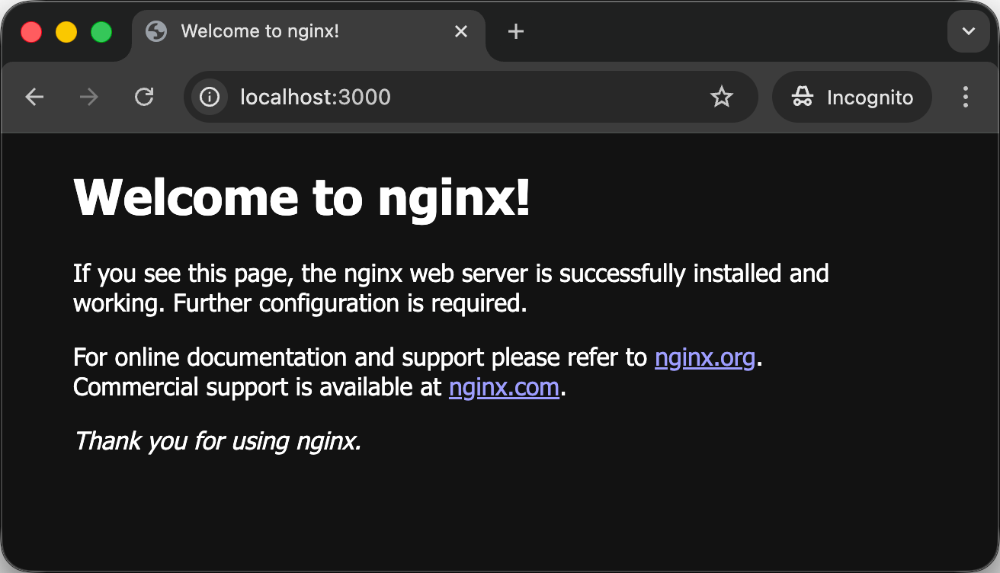
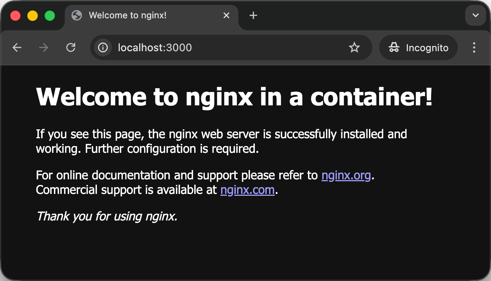
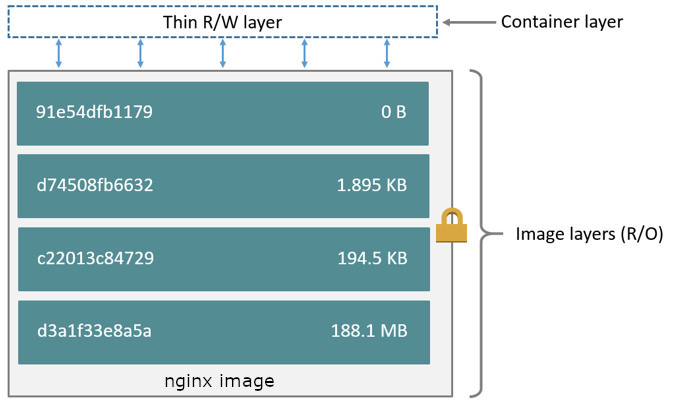
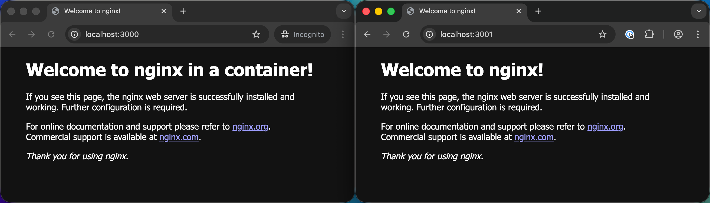
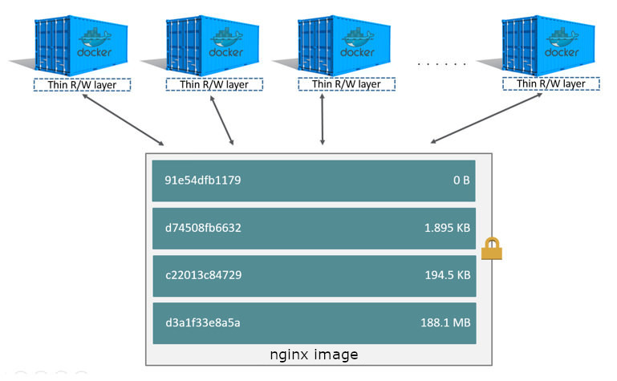
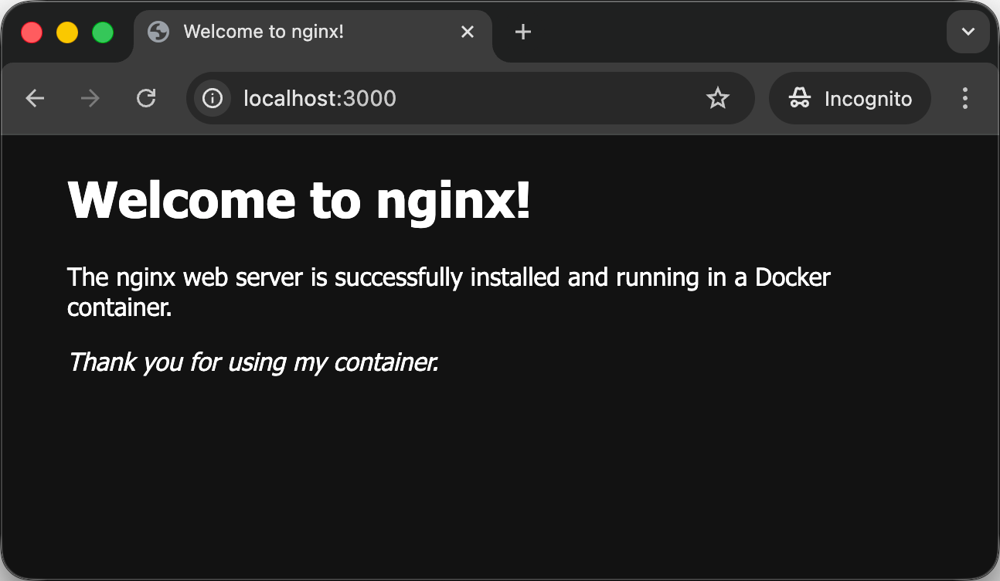

Learn about Docker container isolation mechanisms as it pertains to networking
and storage.

<!-- more -->

## Docker networks

[Docker networking][docker-networking] allows containers to communicate with
each other and with external services outside of Docker.

You can list the available Docker networks on your system using the command:

```bash
$> docker network ls
NETWORK ID     NAME      DRIVER    SCOPE
4fbcb80199ab   bridge    bridge    local
0dca506f97c0   host      host      local
d54b832d124f   none      null      local
```

There are 3 networks available out of the box in a fresh Docker installation:

- The [`bridge` network][docker-bridge-network] is the **default network for
  containers**. It provides network isolation between the host system and the
  containers, while allowing communication between containers on the same bridge
  network.
- The [`host` network][docker-host-network] removes network isolation between
  the container and the host system. Containers using the host network share the
  host's network stack and can directly access the host's network interfaces.
- The [`none` network][docker-none-network] disables all networking for the
  container.



There are other types of [Docker network drivers][docker-network-drivers], but
these are the most commonly used on a development machine. The others are
outside the scope of this course.



### The default bridge network

Let's demonstrate how the default bridge network works.

You may remember that before you started deployment exercises, you [established
a bi-directional TCP connection between servers using the `nc` (**n**et**c**at)
command](#exclamation-establish-a-bi-directional-tcp-connection). Let's do the same
between containers.

Run an container from the Ubuntu base image, naming it `nc-server`:

```bash
$> docker run --name nc-server --rm -it ubuntu:noble
```

Your prompt should have changed to reflect that you are now inside the
container.

Install netcat in this container:

```bash
$> apt update
$> apt install -y netcat-openbsd
```

You should now be able to run the `nc` command like you did in the TCP exercise
(but from inside the container):

```bash
$> nc -l 3000
```



This starts netcat in **l**istening mode (with the `-l` option) on TCP port
`3000`. It now waits for a TCP client to connect on that port.



Leave this running and open a new terminal window. In the new terminal, inspect
the `nc-server` container:

```bash
$> docker inspect nc-server
...
  "Networks": {
    "bridge": {
      "IPAMConfig": null,
      "Links": null,
      "Aliases": null,
      "MacAddress": "92:6b:1c:1c:18:13",
      "DriverOpts": null,
      "GwPriority": 0,
      "NetworkID": "58a6dc73cfa3ff37e7...",
      "EndpointID": "146ed4bb30b95ff2a...",
      "Gateway": "172.17.0.1",
      "IPAddress": "172.17.0.2",
      "IPPrefixLen": 16,
      "IPv6Gateway": "",
      "GlobalIPv6Address": "",
      "GlobalIPv6PrefixLen": 0,
      "DNSNames": null
    }
  },
...
```

The output is a JSON object with a lot of information about the container.
Somewhere in there, you should see the `Networks` property, indicating that the
container is connected to the `bridge` network. You should also see the
container's IP address on that network, in this example: `172.17.0.2` (it might
be another address on your machine). Copy this address.

Now run a second container from the same base image, naming it `nc-client`:

```bash
$> docker run --name nc-client --rm -it ubuntu:noble
```

Again, your prompt should have changed to reflect that you are now inside the
new container.

Install netcat in this container as well:

```bash
$> apt update
$> apt install -y netcat-openbsd
```

From this new container, use netcat to connect to the `nc-server` container
using its IP address on the bridge network:

```bash
$> nc 172.17.0.2 3000
```



Make sure to use the same IP address as shown in the output of the `docker
inspect nc-server` command you ran earlier.



You should now have a bi-directional TCP connection open between the two
containers. Type something in the `nc-client` container terminal:


You should see the message appear in the `nc-server` container terminal as soon
as you press Enter:


Similarly, if you type something in the `nc-server` container terminal:


You should see the message appear in the `nc-client` container terminal as soon
as you press Enter:


This demonstrates that **the two containers can communicate with each other over
the default bridge network**.

Indeed, if you inspect the `nc-client` container from a third terminal window,
you should see that it is also connected to the `bridge` network, with its own
IP address (`172.17.0.3` in this example):

```bash
$> docker inspect nc-client
...
  "Networks": {
    "bridge": {
      "IPAMConfig": null,
      "Links": null,
      "Aliases": null,
      "MacAddress": "0a:6c:41:11:c4:e9",
      "DriverOpts": null,
      "GwPriority": 0,
      "NetworkID": "58a6dc73cfa3ff37e7...",
      "EndpointID": "77d30c2e90d76910f...",
      "Gateway": "172.17.0.1",
      "IPAddress": "172.17.0.3",
      "IPPrefixLen": 16,
      "IPv6Gateway": "",
      "GlobalIPv6Address": "",
      "GlobalIPv6PrefixLen": 0,
      "DNSNames": null
    }
  }
...
```

This is the architecture of what you have just set up:


<div class="flex items-center gap-2">
  <a href="./images/nc-bridge-architecture.pdf" download="Docker Netcat Bridge Architecture" class="tooltip" data-tip="Download PDF">
    
  </a>
  <a href="./images/nc-bridge-architecture.png" download="Docker Netcat Bridge Architecture" class="tooltip" data-tip="Download PNG">
    
  </a>
</div>

Great! Now stop both netcat containers by pressing `Ctrl+C` and then running
`exit` in each terminal.

### Create isolated networks

You can create your own isolated Docker networks using the `docker network
create <name>` command. Let's create two networks named `net1` and `net2`:

```bash
$> docket network create net1
cff44c36cd81b29908cf1a06fd6011cf67d8ffe841af1eb550250e433cfc2fa3
$> docker network create net2
36677fbfb79571eab4ba1541758bf9cce8461dc7c9ec0f1e4e3f03bbbb39e328
```



The network IDs returned by the commands will be different on your machine.



Run `docker network ls` again to check that the new networks were created:

```bash
$> docker network ls
NETWORK ID     NAME      DRIVER    SCOPE
58a6dc73cfa3   bridge    bridge    local
0dca506f97c0   host      host      local
10e2717736fa   net1      bridge    local
36677fbfb795   net2      bridge    local
d54b832d124f   none      null      local
```

As you can see, Docker creates networks with the `bridge` driver by default. But
these are not the same network as the default `bridge` network: they are
**isolated** from it and from each other.

Let's demonstrate that. Run a new `nc-server` container again, but this time
attach it to the `net1` network using the `--network <name>` option instead of
leaving it on the default bridge network:

```bash
$> docker run --name nc-server --network net1 --rm -it ubuntu:noble
```

Install netcat in this container, and run it in listening mode on port 3000 as
before:

```bash
$> apt update
$> apt install -y netcat-openbsd
$> nc -l 3000
```

In another terminal, run a new `nc-client` container, this time attaching it to
the `net2` network:

```bash
$> docker run --name nc-client --network net2 --rm -it ubuntu:noble
```

Install netcat in this new container as well:

```bash
$> apt update
$> apt install -y netcat-openbsd
```

Now open a third terminal and inspect the `nc-server` container to get its IP
address on the `net1` network:

```bash
$> docker inspect nc-server
...
  "Networks": {
    "net1": {
      "IPAMConfig": null,
      "Links": null,
      "Aliases": null,
      "MacAddress": "52:e7:07:9b:1a:f5",
      "DriverOpts": null,
      "GwPriority": 0,
      "NetworkID": "10e2717736fa2d7a3a...",
      "EndpointID": "2cd905711f423d477...",
      "Gateway": "172.18.0.1",
      "IPAddress": "172.18.0.2",
      "IPPrefixLen": 16,
      "IPv6Gateway": "",
      "GlobalIPv6Address": "",
      "GlobalIPv6PrefixLen": 0,
      "DNSNames": [
        "nc-server",
        "1a5eca960467"
      ]
    }
  }
...
```

As you can see, Docker indicates that the container is connected to the `net1`
network instead of the `bridge` network. In this example, its IP address is
`172.18.0.2` (it might be different on your machine). Copy this address.

From the `nc-client` container terminal, try to connect to the `nc-server`
container using its IP address on the `net1` network:

```bash
$> nc 172.18.0.2 3000
```

You can try typing something in the `nc-client` container terminal and pressing
Enter, or the other way around, but it won't work this time—nothing will appear
in the other terminal:




By default, netcat will not fail or show any error message if it cannot connect
to the server. If you want to see an error, stop the `nc` command with `Ctrl-C`
in the `nc-client` container, and re-run the command with the additional `-w 3`
option to **w**ait at most 3 seconds for a connection before giving up:

```bash
$> nc -w 3 172.18.0.2 3000

# 3 seconds later...
$> echo $?
1
```

Netcat will exit with a non-zero status code to indicate that it could not
connect.



These two containers **cannot communicate with each other**. Indeed, if you
inspect the `nc-client` container from another terminal window, you should see
that it's connected to the `net2` network, with its own IP address (`172.19.0.2`
in this example):

```bash
$> docker inspect nc-client
...
  "Networks": {
    "net2": {
      "IPAMConfig": null,
      "Links": null,
      "Aliases": null,
      "MacAddress": "7a:df:a1:99:26:af",
      "DriverOpts": null,
      "GwPriority": 0,
      "NetworkID": "36677fbfb79571eab4...",
      "EndpointID": "3af04b372fc784400...",
      "Gateway": "172.19.0.1",
      "IPAddress": "172.19.0.2",
      "IPPrefixLen": 16,
      "IPv6Gateway": "",
      "GlobalIPv6Address": "",
      "GlobalIPv6PrefixLen": 0,
      "DNSNames": [
        "nc-client",
        "e6f6bf404361"
      ]
    }
  }
...
```

You learned about the concept of [IP subnets and netmasks](#/11) when we covered Unix networking.

Look at the `IPPrefixLen` property in the JSON description of both containers,
which defines the netmask: it is `16` in both examples above, meaning the first
16 bits of each IP address define the subnet. In other words: the first half of
each adress is the subnet, since IPv4 addresses have 32 bits. This means that:

| Container   | IP address   | Netmask | CIDR  | Subnet       |
| :---------- | :----------- | :------ | :---- | :----------- |
| `nc-server` | `172.18.0.2` | 16 bits | `/16` | `172.18.X.Y` |
| `nc-client` | `172.19.0.2` | 16 bits | `/16` | `172.19.X.Y` |

This is what the architecture now looks like:


<div class="flex items-center gap-2">
  <a href="./images/nc-isolated-architecture.pdf" download="Docker Netcat Isolated Architecture" class="tooltip" data-tip="Download PDF">
    
  </a>
  <a href="./images/nc-isolated-architecture.png" download="Docker Netcat Isolated Architecture" class="tooltip" data-tip="Download PNG">
    
  </a>
</div>

Both containers are in different, isolated subnets managed by Docker. The
`nc-client` container can only reach IP addresses in the `172.19.X.Y` subnet,
while the `nc-server` container can only reach IP addresses in the `172.18.X.Y`
subnet. This is why they cannot communicate with each other.

### Automating network creation

You will generally want to create isolated networks for your applications in
production for more isolation and thus increased security. You can do this
manually as shown above, but it's more common to automate this using Compose
files. We will see how to do this when we learn about [Docker Compose]() next.

## Persistent storage

There are two main ways to persist data in Docker:

- Using [bind mounts][docker-bind-mounts] to mount a directory from the host
  machine into the container.
- Using [volumes][docker-volumes], which are managed by Docker (stored in a
  specific location on the host machine by default).

We will first demonstrate that data created inside a container is lost when the
container is removed, and then we will see how to persist data using both bind
mounts and volumes.

### Container file system isolation

As you learned in the previous [Docker]() lesson, the file system of a container is a thin writable layer over its
image's read-only layers. This means that any data created or modified inside a
container is lost when the container is removed.

Let's demonstrate this. Run a new container from the official `nginx` image:

```bash
$> docker run --d --name web --p 3000:80 nginx:1.29
```



The `-d` (or `--detach`) option runs the container in the background. The
`--name` option gives the container a name for easier reference. The `-p` (or
`--publish`) option maps port `3000` on the host machine to port `80` in the
container.



You should see this container running with `docker ps`:

```bash
$> docker ps
CONTAINER ID   IMAGE        COMMAND                  CREATED         STATUS        PORTS                                     NAMES
b720d8b8d7d7   nginx:1.29   "/docker-entrypoint.…"   2 seconds ago   Up 1 second   0.0.0.0:3000->80/tcp, [::]:3000->80/tcp   web
```

Since you have published its main port, you should also be able to access this
nginx server in your browser at [http://localhost:3000](http://localhost:3000):



Great! You have nginx running in a container on your machine.

Let's make a small change. Start a shell session inside the running `web`
container:

```bash
$> docker exec -it web /bin/bash
```



The `docker exec` subcommand executes a command in a running container. The `-i`
(or `--interactive`) option keeps standard input open, and the `-t` (or `--tty`)
option allocates a pseudo-TTY (terminal). Both options are needed to run an
interactive shell session.



Your prompt should have changed to reflect that you are now inside the
container.

Let's investigate a bit. We know that the main nginx configuration file is
generally located at `/etc/nginx/nginx.conf`. Let's see what's in it:

```bash
root@b720d8b8d7d7:/# cat /etc/nginx/nginx.conf

user  nginx;
worker_processes  auto;

events {
    worker_connections  1024;
}

http {
    include       /etc/nginx/mime.types;
    default_type  application/octet-stream;

    log_format  main  '$remote_addr - $remote_user [$time_local] "$request" '
                      '$status $body_bytes_sent "$http_referer" '
                      '"$http_user_agent" "$http_x_forwarded_for"';

    access_log  /var/log/nginx/access.log  main;

    sendfile        on;
    #tcp_nopush     on;

    keepalive_timeout  65;

    #gzip  on;

    include /etc/nginx/conf.d/*.conf;
}
```

The line that interests us most is the [`include` directive][nginx-include] at
the end:

```
    include /etc/nginx/conf.d/*.conf;
```

This tells nginx to include any configuration files located in the
`/etc/nginx/conf.d/` directory.



Note that this is a simpler nginx configuration than what you find when you
install nginx on a regular server [like you did when you learned about reverse
proxying](#includes).

There are no `sites-available` or `sites-enabled` directories here, for example;
only `conf.d`. Containers are intended to be minimal, so they often have simpler
configurations than a full-fledged installation.

Additionally, containers are also supposed to be ephemeral: you are not supposed
to modify running containers directly in production, so the rationale for the
`sites-available` and `sites-enabled` directories, i.e. to be able to quickly
disable/enable sites, does not apply here. The Docker way would be to build a
new image with the desired configuration changes instead, or to use a reverse
proxy that is aware of Docker and able to re-configure itself automatically,
like [Traefik][traefik] or [Caddy][caddy].



So let's see what's in this `conf.d` directory:

```bash
root@b720d8b8d7d7:/# ls /etc/nginx/conf.d
default.conf
```

Just one site configuration file: `default.conf`. Let's see what's in it:

```bash
root@b720d8b8d7d7:/# cat /etc/nginx/conf.d/default.conf
server {
    listen       80;
    listen  [::]:80;
    server_name  localhost;

    #access_log  /var/log/nginx/host.access.log  main;

    location / {
        root   /usr/share/nginx/html;
        index  index.html index.htm;
    }

    #error_page  404              /404.html;

    # redirect server error pages to the static page /50x.html
    #
    error_page   500 502 503 504  /50x.html;
    location = /50x.html {
        root   /usr/share/nginx/html;
    }

    ...
}
```

This is a simple site configuration that serves static files, similar to [the
one you created during the nginx static site deployment exercise]():

- The [`root` directive][nginx-root] specifies the directory where the static
  files are located: the `/usr/share/nginx/html` directory inside the container.
- The [`index` directive][nginx-index] specifies the default files to serve when
  a directory is requested: `index.html` or `index.htm`.

So let's look at that `index.html` file:

```bash
root@b720d8b8d7d7:/# cat /usr/share/nginx/html/index.html
<!DOCTYPE html>
<html>
<head>
<title>Welcome to nginx!</title>
<style>
html { color-scheme: light dark; }
body { width: 35em; margin: 0 auto;
font-family: Tahoma, Verdana, Arial, sans-serif; }
</style>
</head>
<body>
<h1>Welcome to nginx!</h1>
<p>If you see this page, the nginx web server is successfully installed and
working. Further configuration is required.</p>

<p>For online documentation and support please refer to
<a href="http://nginx.org/">nginx.org</a>.<br/>
Commercial support is available at
<a href="http://nginx.com/">nginx.com</a>.</p>

<p><em>Thank you for using nginx.</em></p>
</body>
</html>
```

Great! You've found the HTML for the default nginx welcome page that you see in
your browser:


Now let's modify this file to see what happens. Of course, Docker images are
minimal, so you don't even have a text editor installed by default. Install your
favorite command line editor:

```bash
root@b720d8b8d7d7:/# apt update
root@b720d8b8d7d7:/# apt install -y nano  # or vim
```

Now open the `index.html` file:

```bash
root@b720d8b8d7d7:/# nano /usr/share/nginx/html/index.html  # or vim
```

Modify this line:

```html
<h1>Welcome to nginx!</h1>
```

To this:

```html
<h1>Welcome to nginx in a container!</h1>
```



Save with `Ctrl-X`, then `Y`, then `Enter` if you are using nano. Save with
`Esc`, then `:wq`, then `Enter` if you are using Vim.



Now exit the container shell:

```bash
root@b720d8b8d7d7:/# exit
```

Reload the page in your browser at
[http://localhost:3000](http://localhost:3000). You should see the updated
welcome message:



Amazing! You have successfully modified a file inside a running container.

Going back to what we discussed about layers in the previous lesson, you have
modified the thin writable layer of the container at the top of the Union File
System:



Now stop the `web` container:

```bash
$> docker stop web
web
```

Confirm the container is no longer running:

```bash
$> docker ps
CONTAINER ID   IMAGE     COMMAND   CREATED   STATUS    PORTS     NAMES
```

Stopping the container has stopped the nginx server that was running in it, so
you should no longer be able to access it in your browser:


Start the container again:

```bash
$> docker start web
web
```

Visit [http://localhost:3000](http://localhost:3000) again in your browser:


Yay! The modified welcome message is still there. This is because the thin
writable layer of the container is preserved when the container is stopped, so
your changes are still there.

Run a second container named `web2` based on the same official `nginx` image:

```bash
$> docker run --d --name web2 --p 3001:80 nginx:1.29
```

You should have two containers running, one exposed on port 3000 and the other
on port 3001:

```bash
$> docker ps
CONTAINER ID   IMAGE        COMMAND                  CREATED          STATUS         PORTS                                     NAMES
d85ff1b3ecf4   nginx:1.29   "/docker-entrypoint.…"   2 minutes ago    Up 2 minutes   0.0.0.0:3001->80/tcp, [::]:3001->80/tcp   web2
b720d8b8d7d7   nginx:1.29   "/docker-entrypoint.…"   49 minutes ago   Up 3 minutes   0.0.0.0:3000->80/tcp, [::]:3000->80/tcp   web
```

Now visit both [http://localhost:3000](http://localhost:3000) and
[http://localhost:3001](http://localhost:3001) in your browser. You should see
the modified welcome message on port 3000, since it's served by the `web`
container that you modified earlier; and the original welcome message on port
3001, since it's served by the fresh `web2` container that you just created and
never modified:



This shows you that **each container has its own isolated file system**. Changes
made in one container do not affect other containers, even if they are based on
the same image.

At a lower level, each container has its own thin writable layer on top of the
same read-only image layers:





If you want to take this demonstration a step further, start a shell session
into the new `web2` container and make a different change to the welcome page,
then see the effect in your browser. You will see that the changes you make in
the `web` container do not affect the `web2` container, and vice versa.



Stop and remove both containers:

```bash
$> docker stop web web2
web
web2

$> docker rm web web2
web
web2
```

Now you haven't just stopped the containers, you have also removed them. Re-run
the `web` container with the same command as before:

```bash
$> docker run --d --name web --p 3000:80 nginx:1.29
```

Visit [http://localhost:3000](http://localhost:3000) in your browser again:


You are seeing the original welcome message again. This is because when you
removed the `web` container, its thin writable layer was permanently deleted by
the Docker daemon. It only existed as long as the container existed.

When you just re-ran the container, a new and **empty** thin writable layer was
created on top of the same read-only image layers, so any changes you had
previously made were lost.

Stop and remove the `web` container again:

```bash
$> docker rm -f web
web
```



The `-f` (or `--force`) option of the `docker rm` subcommand forces the removal
of a running container by stopping it first.



One way to persist data beyond the lifetime of a container, as we've already
seen in the previous lesson, is to [create an image from the modified container
using `docker commit`](#commit-a-containers-state-to-an-image-manually). This persists the thin
writable layer of the container as a new read-only image layer. You can then run
new containers from that image, where the changes will be present.

This works, and is the basis of how Docker images are built with Dockerfiles as
you've previously seen. It is a good way to persist:

- The code of an application that you intend to containerize (e.g. the code of
  the FibScale application you copied with a `COPY` instruction in the
  Dockerfile).
- Dependencies required by that application (e.g. the Ruby gems that you
  installed for the FibScale application with the `bundle install` command).
- System packages and libraries required by that application (e.g. the base
  Ubuntu image and any additional packages you might install with `apt`).

All of these are things that you want to bake into Docker images so that new
containers can be started from those images with the basics already in place.
**However, this is not the recommended way to persist data** in Docker,
especially these types of data:

- Application data, such as database files.
- User-generated content, such as uploaded files.
- Configuration files that may change frequently (and may contain sensitive
  data).

For these types of data, it's better to use bind mounts or volumes, which we
will see next.

### Using bind mounts

Bind mounts allow you to mount a directory from the host machine into a
container. This way, any data created or modified in that directory inside the
container is actually stored on the host machine, and thus persists beyond the
lifetime of the container.

Let's create a directory for this demonstration:

```bash
$> cd /path/to/projects
$> mkdir docker-bind-mount-demo
$> cd docker-bind-mount-demo
```

Use your favorite editor to create an `index.html` file in this directory with
the following content:

```html
<!DOCTYPE html>
<html>
  <head>
    <title>Welcome to nginx!</title>
    <style>
      html {
        color-scheme: light dark;
      }
      body {
        width: 35em;
        margin: 0 auto;
        font-family: Tahoma, Verdana, Arial, sans-serif;
      }
    </style>
  </head>
  <body>
    <h1>Welcome to nginx!</h1>
    <p>
      The nginx web server is successfully installed and running in a Docker
      container.
    </p>
    <p><em>Thank you for using my container.</em></p>
  </body>
</html>
```

You should now have a directory with an `index.html` file in it:

```bash
$> ls
index.html
```

Now run a new `web` container
Now run a new container from the official `nginx` image, this time using the
`-v` (or `--volume`) option to create a bind mount that mounts the current
directory from the host machine into the container at the path
`/usr/share/nginx/html`, where nginx serves its static files from:

```bash
$> docker run --d --name web -p 3000:80 -v "$PWD:/usr/share/nginx/html" nginx:1.29
```

The new `-v` (or `--volume`) option creates a **bind mount** from the current
directory on the host machine to the `/usr/share/nginx/html` directory inside
the container (expressed as `<host-path>:<container-path>`).



The `$PWD` environment variable, meaning **p**rint **w**orking **d**irectory,
contains the absolute path of the current directory on a Unix system.



Visit [http://localhost:3000](http://localhost:3000) in your browser and you
should see the welcome page you just created:



Note that this welcome page is different from the default one you saw earlier.
This is because nginx is now serving the `index.html` file from the bind mount
you created, which is located on your host machine.

Run a shell session inside the running `web` container:

```bash
$> docker exec -it web /bin/bash
```

Your prompt should have changed to reflect that you are now inside the
container. Install your favorite command line editor again (remember, this is a
brand new container):

```bash
root@556448e19250:/# apt update
root@556448e19250:/# apt install -y nano  # or vim
```

Edit the `index.html` file in the container:

```bash
root@556448e19250:/# nano /usr/share/nginx/html/index.html  # or vim
```

Modify this line:

```html
<h1>Welcome to nginx!</h1>
```

To this:

```html
<h1>Welcome to nginx modified!</h1>
```

Visit [http://localhost:3000](http://localhost:3000) in your browser again. You
should see the updated welcome message:


Great! You have successfully modified a file inside the container that is part of
a bind mount. Now exit the container:

```bash
root@556448e19250:/# exit
```

Now check the `index.html` file on your host machine in the current directory:

```bash
$> cat index.html
```

You should see the modified title:

```html
<h1>Welcome to nginx modified!</h1>
```

Amazing! This shows you what a bind mount is: the `/usr/share/nginx/html`
directory inside the container is currently mapped by the Docker daemon to the
current directory on the host machine. Any changes made to files in this
directory inside the container will actually be made to the files on the host
machine, and vice versa.

Modify the `index.html` file again, but this time do so on your machine (not
inside the container), using your favorite editor (command line or not).

Modify this line:

```html
<h1>Welcome to nginx modified!</h1>
```

To this:

```html
<h1>Welcome to nginx modified again!</h1>
```

Visit [http://localhost:3000](http://localhost:3000) in your browser again. You
should see the updated welcome message:


This demonstrates that changes made to files in the bind mount directory on the
host machine are immediately reflected inside the container.

Indeed, you can display the contents of the `index.html` file from inside the
container again to confirm that the changes you made on the host machine are
also visible from inside the container:

```bash
$> docker exec web cat /usr/share/nginx/html/index.html
```

You should see the modified title:

```html
<h1>Welcome to nginx modified again!</h1>
```



Note that a bind mount is not a copy. Instead, the directory on the host machine
is directly mounted into the container as a traditional Unix mount, much like an
external hard drive or network drive would be mounted. You are actually seeing
the same directory from both the host machine and the container. This is
magically handled for you by the Docker daemon using the `-v/--volume` option.

You can confirm this using the [`df` command you previously used to inspect disk
usage when learning about Unix basics](#inspecting-volumes). If you run this
command inside the container, you should see that the `/usr/share/nginx/html`
directory is a separate mount:

```bash
$> docker exec web df -h
Filesystem            Size  Used Avail Use% Mounted on
overlay               911G  6.7G  858G   1% /
tmpfs                  64M     0   64M   0% /dev
shm                    64M     0   64M   0% /dev/shm
/dev/vda1             911G  6.7G  858G   1% /etc/hosts
/run/host_mark/Users  927G  684G  244G  74% /usr/share/nginx/html
tmpfs                 3.9G     0  3.9G   0% /proc/scsi
tmpfs                 3.9G     0  3.9G   0% /sys/firmware
```

Additionally, the indicated `Size`, `Used` and `Avail` values for the
`/usr/share/nginx/html` mount should match those of your own host machine (at
least on Unix systems).



Now stop and remove the `web` container:

```bash
$> docker rm -f web
web
```

Confirm that the container is no longer running:

```bash
$> docker ps
CONTAINER ID   IMAGE     COMMAND   CREATED   STATUS    PORTS     NAMES
```

Confirm that the container has been completely removed by listing all
containers (including stopped ones):

```bash
$> docker ps -a
CONTAINER ID   IMAGE     COMMAND   CREATED   STATUS    PORTS     NAMES
...
```



You might see container from previous Docker experiments in the list, but the
`web` container you just removed should no longer be there.



Visit [http://localhost:3000](http://localhost:3000) in your browser again. You
should no longer be able to access the nginx server, since the container has
been removed:


Re-run the `web` container with the same command as before, including the bind
mount:

```bash
$> docker run --d --name web -p 3000:80 -v "$PWD:/usr/share/nginx/html" nginx:1.29
```

Visit [http://localhost:3000](http://localhost:3000) in your browser again. You
should still see the modified welcome message:


Great! You've learned a way to persist data beyond the lifetime of a container
using bind mounts.

When you remove a container that has a bind mount, the thin writable layer of
the container is deleted, as before, but the bind mount is separate from that
layer. The data in the bind mount directory on the host machine remains intact.

This means that when you run a fresh new container with an empty thin writable
layer, but with the same bind mount, the data in the bind mount directory is
still there and accessible from the new container, since it exists on your host
machine, independent of the container's lifecycle.

[caddy]: https://caddyserver.com
[docker-bind-mounts]: https://docs.docker.com/engine/storage/bind-mounts/
[docker-bridge-network]: https://docs.docker.com/engine/network/drivers/bridge/
[docker-host-network]: https://docs.docker.com/engine/network/drivers/host/
[docker-network-drivers]: https://docs.docker.com/engine/network/drivers/
[docker-network-ls]: https://docs.docker.com/reference/cli/docker/network/ls/
[docker-networking]: https://docs.docker.com/engine/network/
[docker-none-network]: https://docs.docker.com/engine/network/drivers/none/
[docker-volumes]: https://docs.docker.com/engine/storage/volumes/
[nginx-include]: https://nginx.org/en/docs/ngx_core_module.html#include
[nginx-index]: https://nginx.org/en/docs/http/ngx_http_index_module.html
[nginx-root]: https://nginx.org/en/docs/http/ngx_http_core_module.html#root
[traefik]: https://traefik.io
