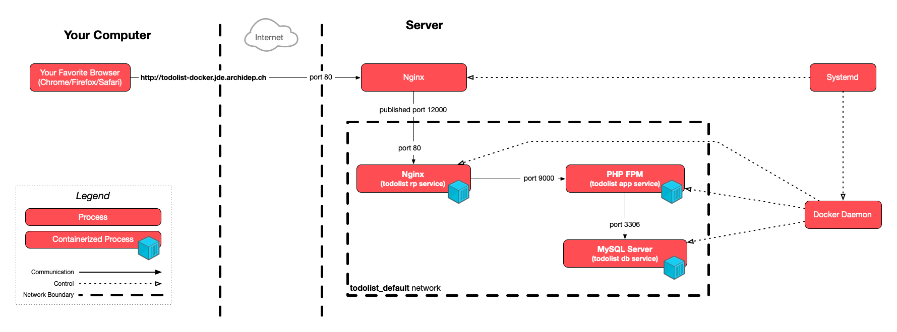

The goal of this exercise is to learn to deploy a multi-container web
application with Docker Compose. You will create a portable Compose file that
can be used to deploy the same containers on both your local machine and your
cloud server.

Your inescapable references for this exercise are the following documents:

- The [Dockerfile reference][dockerfile-reference], which describes the commands
  you can use in a Dockerfile.
- The [Compose file reference][compose-file-reference], which describes the
  Compose file format.

<!-- more -->

## :exclamation: Make sure you have everything you need



This exercise begins on your local machine.



You need to have [Docker Desktop][docker-desktop] installed, which you should if
you have performed the [previous Docker exercise]().

You need an up-to-date PHP todolist. Move to your PHP todolist repository **on
your local machine**:

```bash
$> cd /path/to/projects/todolist
```

**If you performed the [Render deployment exercise]()**, switch back to the `main`
branch:

```bash
$> git switch main
```



In the Render deployment exercise, a Dockerfile was provided for
you. In this exercise, you will write one yourself, step by step.



Make sure your `index.php` file supports configuration through environment
variables. If you performed the [relevant exercise]() earlier in the course,
the definition of the base URL and database connection parameters at the top
should look something like this:

```php
define('BASE_URL', getenv('TODOLIST_BASE_URL') ?: '/');

// Database connection parameters.
define('DB_USER', getenv('TODOLIST_DB_USER') ?: 'todolist');
define('DB_PASS', getenv('TODOLIST_DB_PASS'));
define('DB_NAME', getenv('TODOLIST_DB_NAME') ?: 'todolist');
define('DB_HOST', getenv('TODOLIST_DB_HOST') ?: '127.0.0.1');
define('DB_PORT', getenv('TODOLIST_DB_PORT') ?: '3306');
```

If that's not the case, adapt the `index.php` file, then commit and push your
changes.

## :exclamation: Create a compose file to deploy the PHP todolist application

Take a look at the [architecture of the PHP todolist deployment with nginx and
the FastCGI process manager](#classical_building-architecture):


Aside from systemd, your server-side deployment is composed of 3 processes:

- Nginx, the **reverse proxy**.
- The PHP todolist, the **application** itself.
- A MySQL **database** server.

In a Compose deployment, you want to isolate them as separate services as per
the Docker philosophy. Therefore, your goal is to write a Compose file defining
3 services.

Start by naming these services. Choose a naming convention:

- Some people prefer to name each service after the tool that will be running in
  the container, for example: `nginx`, `php`, `mysql`.
- Other prefer a more semantic naming convention: `reverse-proxy`, `application`
  and `database` (or `rp`, `app` and `db` if you are feeling terse).



You will sometimes use these names on the command line when running Compose
commands, e.g. `docker compose up app`, so [choose
wisely](https://martinfowler.com/bliki/TwoHardThings.html). The rest of the
instructions in this exercise will assume the second choice.



The basic structure of your Compose file will be something like:

```yml
name: todolist

services:
  rp:
    # define the reverse proxy service
  app:
    # define the application service
  db:
    # define the database service
```

### :exclamation: Define the database service

Let's start from the bottom up: the first service you will define and the first
container you will run is the **database**.

Create a `compose.yml` file in the PHP todolist repository with the following
(incomplete) contents for now:

```yml
name: todolist

services:
  db:
```

If you remember the very first [PHP todolist SFTP deployment exercise](), you had to do a few things to set
up the database:

1. Install the MySQL database server with `sudo apt install mysql-server`
1. Perform the base configuration with `sudo mysql_secure_installation`, including:
   - Setting the MySQL root password
   - Various other security-related settings
1. Intialize the todolist database by running the PHP todolist's SQL script with
   `sudo mysql < todolist.sql`

You will now learn to do the same in a Docker container with Docker Compose.

#### :question: Use the correct Docker image

There is an [official MySQL Docker image][mysql-docker-image] which provides you
with a fully functional and configurable MySQL database server container. That
takes care of step 1 and most of step 2.

#### :question: Find out how to configure the service appropriately

Look at the ["Environment Variables" section of the image's
documentation][mysql-docker-image-env]. It describes a few variables you will
find useful. As part of step 2, you manually configured the MySQL root password
in the original deployment exercise. With this Docker image, you will do that
simply by setting the `$MYSQL_ROOT_PASSWORD` environment variable in the
container. The root password will then be automatically set for you when the
container starts.



When running a container manually, you set environment variables with the `-e
VAR=VALUE` or `--env VAR=VALUE` options, e.g. `docker run -e
MYSQL_ROOT_PASSWORD=changeme mysql:9.5.0`. But you will not be doing that in
this exercise. You will describe the configuration of the database service in
the Compose file, and Docker Compose will run the container for you.



During step 3 of the original deployment exercise, you then executed the PHP
todolist's `todolist.sql` script. For the purposes of this exercise, this script
can be divided into two sections:

- The [database creation, user creation & privileges
  configuration](https://github.com/ArchiDep/php-todo-ex/blob/e073e769c7c6eb0d8bf3c1fa7a55f174b5a262e4/todolist.sql#L1-L7):

  ```sql
  CREATE DATABASE IF NOT EXISTS todolist;
  CREATE USER IF NOT EXISTS 'todolist'@'localhost' IDENTIFIED BY 'change-me-now';
  GRANT ALL PRIVILEGES ON todolist.* TO 'todolist'@'localhost';
  ```

- The [creation of the database
  structure](https://github.com/ArchiDep/php-todo-ex/blob/e073e769c7c6eb0d8bf3c1fa7a55f174b5a262e4/todolist.sql#L9-L17):

  ```sql
  USE todolist;

  CREATE TABLE IF NOT EXISTS `todo` (
    `id` bigint(20) NOT NULL AUTO_INCREMENT,
    `title` varchar(2048) NOT NULL,
    `done` tinyint(1) NOT NULL DEFAULT '0',
    `created_at` timestamp NOT NULL DEFAULT CURRENT_TIMESTAMP,
    PRIMARY KEY (`id`)
  );
  ```

If you read the ["Environment Variables" section of the MySQL Docker image's
documentation][mysql-docker-image-env] again, you will notice that there are 3
environment variables you can set that will take care of the first part of the
setup for you:

- Setting `$MYSQL_DATABASE` will automatically create a database with that name.
- Setting `$MYSQL_USER` and `$MYSQL_PASSWORD` will automatically create a user
  with access to that database.

Simply by settings these environment variables, the container will perform the
required setup when it starts for the first time.

That leaves only the creation of the database structure. This cannot simply be
done by setting an environment variable, since this part is not generic: it is
completely dependent on the specific application you are deploying, in this case
the PHP todolist.

So you need to run the second part of the `todolist.sql` script in the context
of the MySQL database server running in the container. How?

Read the ["Initializing a fresh instance" section of the MySQL Docker image's
documentation][mysql-docker-image-init]. It explains that any SQL script you
place in the `/docker-entrypoint-initdb.d` directory of the container will be
executed when the MySQL database server is initialized the first time the
container starts.

This means that you simply have to put the `todolist.sql` script in this
directory, and it will be magically run for you!

But you only need to run the second part, what about skipping the first part
(the database and user creation)? Luckily, the `todolist.sql` script uses `IF
NOT EXISTS` in its queries. Since the MySQL database and user will already be
created automatically by the container when it starts, the `todolist.sql` script
will simply skip creating what is already there. It can actually be run as it
is, without any changes.

There is one last thing that you did not actually do yourself during the
original deployment exercise, but was done for you when you installed the MySQL
server. As indicated in the architecture diagram: MySQL is managed by systemd,
which will automatically start it when your server starts, and restart it if it
crashes. You also want this with your Compose deployment, at least for
production deployments.



When running containers with Docker Compose, the Docker daemon will assume the
responsibility of managing the containers, e.g. starting and restarting them,
depending on how you define your Compose services. Later, when you replicate
your Compose deployment on your cloud server, the Docker daemon itself will be
managed by systemd.



#### :exclamation: Write the database service

So, let's recap what you need to define your MySQL Compose service:

- Use the [official MySQL Docker image][mysql-docker-image].
- Set a number of environment variables to perform the necessary setup (database
  and user creation).
- Execute the `todolist.sql` script when the database server is initialized.
- Restart the database server automatically when there is an issue (systemd's
  old job).

You can now write the database service definition in your Compose file. Here's a
few pointers:

| What                      | Documentation                             |
| :------------------------ | :---------------------------------------- |
| Use the official image    | [`image`][compose-file-image]             |
| Set environment variables | [`environment`][compose-file-environment] |
| Restart automatically     | [`restart`][compose-file-restart]         |
| Execute `todolist.sql`    | [`volumes`][compose-file-volumes]         |

Read the documentation and fill in the definition for your `db` service:

```yml
name: todolist

services:
  db:
    image: # ...
    environment: # ...
    restart: #...
    volumes: # ...
```

Here are a few things you want to watch out for:

- When setting the `image` key, be sure to select a version, either a very
  specific version (`MAJOR.MINOR.PATCH`, e.g. `1.2.3`) or a more general version
  (`MAJOR.MINOR`/`MAJOR`, e.g. `1.2` or `1`) if the Docker image supports it.

  **DO NOT** use the `latest` image (which is used implicitly if you do not set
  a version). Using the `latest` image means that a totally different (and maybe
  unsupported) version of the image may be used at different points in time,
  potentially breaking your deployment.

- When setting variables with the `environment` key, **DO NOT** hardcode
  sensitive secrets like passwords in the Compose file. Having secrets in your
  repositories is a bad security practice.

  There are [several ways to set environment variables with
  Compose](https://docs.docker.com/compose/environment-variables/set-environment-variables/).
  One of the cleanest ways when it comes to your repository is to create a
  `.env` file with your sensitive variables:

  ```
  # .env
  MYSQL_ROOT_PASSWORD=my-secret-root-password
  MYSQL_PASSWORD=my-secret-user-password
  ```

  **Add this file to your repository's [`.gitignore` file][gitignore]** to make
  sure it is not committed:

  ```bash
  $> echo .env >> .gitignore
  $> git add .gitignore
  $> git commit -m "Ignore .env file"
  ```

  Docker Compose will automatically read the `.env` file in the working
  directory and fill in the variables for you:

  ```yml
  services:
    example-service:
      environment:
        VAR1: value1 # hardcoded value
        VAR2: # no value, will be read from .env or the environment
  ```



An even better way to manage sensitive information in a Compose project is to
use [Compose `secrets`][compose-secrets], but that would require setting up
[Docker Swarm][docker-swarm]. We will definitely not go that far in this
exercise.



- When specifying the host part of a bind mount in a Compose file, you can use
  `.` as a reference to the directory containing the Compose file, e.g.:

  ```yml
  services:
    example:
      volumes:
        - ./some-file.txt:/container/path/some-file.txt
  ```

  This bind-mounts the `some-file.txt` file located in the same directory as the
  Compose file into the container in the `/container/path` directory.

- When you specify volume mounts, whether they are files or directories, the
  mounts are **read-write** by default, meaning that the process running inside
  the container can modify the file and/or directories you are mounting from the
  host. But you can configure them to be **read-only** instead.

  When you mount a file or a directory inside a container, always ask yourself
  the following question: does the container need to modify this file or
  directory to work? If no, mount it as read-only to minimize the attack surface
  of your container. Better safe than sorry.

#### :exclamation: Run the database service

Once you are done, you can run this service:

```bash
$> docker compose up db
Attaching to db-1
db-1  | 2024-01-25 18:38:13+00:00 [Note] [Entrypoint]: Entrypoint script for MySQL Server 9.5.0-1.el8 started.
...
db-1  | 2024-01-25 18:38:21+00:00 [Note] [Entrypoint]: /usr/local/bin/docker-entrypoint.sh: running /docker-entrypoint-initdb.d/todolist.sql
...
db-1  | 2024-01-25T18:38:22.761176Z 0 [System] [MY-015015] [Server] MySQL Server - start.
...
db-1  | 2024-01-25T18:38:23.262642Z 0 [System] [MY-010931] [Server] /usr/sbin/mysqld: ready for connections. Version: '9.5.0'  socket: '/var/run/mysqld/mysqld.sock'  port: 3306  MySQL Community Server - GPL.
```



As you can see in the above example, the logs should indicate the execution of
the `todolist.sql` script (without any errors after it), as well as the
successful launch of the MySQL database server at the end ("ready for
connections"). There will probably be lots of logs in between, as indicated by
the `...`.





If you get errors, stop the container with `Ctrl-C`, delete everything with
`docker compose down`, fix your Compose file, and try again.



Great, you have the database running! It's not accessible by anything yet, so
that's not very interesting. Stop it with `Ctrl-C`, and let's move on to the
next step.

### :exclamation: Define the application service

The next service you will define is the **application**. That service will run
the actual PHP todolist application in a container.

In the [original deployment exercise](), you ran the PHP todolist manually
with the [PHP development
server](https://www.php.net/manual/en/features.commandline.webserver.php). Then,
you improved upon that deployment by using the [FastCGI Process Manager
(FPM)](https://php-fpm.org) instead during the [PHP-FPM deployment exercise]().

You will now replicate this deployment in the form of Docker containers.

#### :exclamation: Create a Dockerfile for the PHP todolist

You will of course not find an existing Docker image to run the PHP todolist on
[Docker Hub][docker-hub], since it is a custom application used in this course
and not a popular tool like MySQL.

You will therefore create a Dockerfile to create a Docker image for the PHP
todolist, much like you did in the [previous Docker exercise]().



Publishing the Docker image is outside the scope of this course, but it would be
very easy to do: all you would need is a free Docker account, and you could use
the `docker push` command to publish the image under your account.



There is no official FPM image, but a popular one is the [Bitnami PHP-FPM
image][php-fpm-image]. If you read its documentation, it is trivial to use; you
simply need to load your PHP code under the `/app` directory in the container,
and voilà:

```bash
$> docker run -it -v /path/to/app:/app bitnami/php-fpm
```

That's _almost good enough_ to run the PHP todolist. There's just one catch: in
the PHP-FPM deployment exercise, we had to [add environment variables to FPM](#exclamation-add-the-todolist_db_pass-environment-variable-to-php-fpm).

We have to do the same with Docker. But we don't want to do exactly the same: we
don't want the PHP todolist's database password to be baked into the image. That
would be the same as committing it into the repository! Anybody who got a hold
of the image would find the password inside.

In the FPM exercise, we added a line similar to this to FPM's configuration
file:

```
env[TODOLIST_DB_PASS] = "my-super-secret-password"
```

It just so happens that if you read the comments in the section of FPM's
configuration file where we added that variable, it states that _"All $VARIABLEs
are taken from the current environment."_ This means that we can reference
environment variables in the file:

```
env[TODOLIST_DB_PASS] = $TODOLIST_DB_PASS
```

If we add that line to FPM's configuration file, FPM will read it on startup and
make it available to the PHP code it interprets.

So, let's recap what you need in this PHP todolist Dockerfile:

| What to do                                                    | How to do it                      |
| :------------------------------------------------------------ | :-------------------------------- |
| Use the Bitnami PHP-FPM image                                 | [`FROM` command][dockerfile-from] |
| Put the todolist's code (`index.php`) in the `/app` directory | [`COPY` command][dockerfile-copy] |
| Configure FPM to forward the todolist's environment variables | _Huh?_                            |

Let's write that file. Create a `Dockerfile` file in the PHP todolist repository
and fill in the `FROM` and `COPY` commands with something appropriate:

```Dockerfile
FROM ...

COPY ...
```

For the last step, you want to modify the FPM configuration file in the Bitnami
PHP-FPM container and add the necessary lines to forward the todolist's
environment variables to the PHP code intepreted by FPM.

There are two main ways to do that:

- Replace FPM's entire configuration file in the image with your own, including
  the additional lines. In this case, you would store that file in your
  repository and use a `COPY` command.
- Append the additional lines to the end of FPM's existing configuration file.
  In this case, you can use a `RUN` command and simply append the lines with
  Unix's trusty `echo` command.



Which is best? It depends. If you only have a few changes to make, which is the
case in this exercise, the second solution seems best. If you have to make
sweeping changes throughout the whole file, it might be best to craft your own
custom file with appropriate documentation in the form of comments.



To keep things simple, let's simply add the lines we need at the end. Add this
to the Dockerfile after the `FROM` and `COPY` commands you already have:

```Dockerfile
RUN echo >> "/opt/bitnami/php/etc/php-fpm.d/www.conf" && \
    echo 'env["TODOLIST_DB_USER"] = $TODOLIST_DB_USER' >> "/opt/bitnami/php/etc/php-fpm.d/www.conf" && \
    echo 'env["TODOLIST_DB_PASS"] = $TODOLIST_DB_PASS' >> "/opt/bitnami/php/etc/php-fpm.d/www.conf" && \
    echo 'env["TODOLIST_DB_NAME"] = $TODOLIST_DB_NAME' >> "/opt/bitnami/php/etc/php-fpm.d/www.conf" && \
    echo 'env["TODOLIST_DB_HOST"] = $TODOLIST_DB_HOST' >> "/opt/bitnami/php/etc/php-fpm.d/www.conf" && \
    echo 'env["TODOLIST_DB_PORT"] = $TODOLIST_DB_PORT' >> "/opt/bitnami/php/etc/php-fpm.d/www.conf"
```



How could you have known that the FPM configuration file is stored under
`/opt/bitnami/php/etc/php-fpm.d/www.conf` in this image?

- Read the documentation of the [Bitnami PHP-FPM image][php-fpm-image]. It
  makes several mentions of the `/opt/bitnami/php/etc` directory, clearly
  indicating that this is where the PHP configuration files, and therefore
  FPM's configuration files, are stored.
- Run the image with a shell and explore its file system:

  ```bash
  $> docker run --rm -it --entrypoint bash bitnami/php-fpm
  root@ebc62d5fd3a1:/app# ls /opt/bitnami/php/etc
  ```

  By analogy with the FPM exercise, it's not hard to find the same `www.conf`
  file we edited then.



And you're good to go! If you want to test that this Dockerfile is at least
valid, you can try to build it:

```bash
$> docker build -t todolist/app .
```

There should be no errors in the output.

#### :exclamation: Write the application service

It is now finally time to define the application service. Here's what you want
to do:

- Run a container based on the Dockerfile you just created.
  - The image might need to be built if it has never been built locally.
- Pass some environment variables to FPM, at the very least:
  - The host at which the database can be reached (the `$TODOLIST_DB_HOST`
    variable).
  - The password of the `todolist` database user (the `$TODOLIST_DB_PASS`
    variable).
- Restart FPM automatically when there is an issue (systemd's old job).

There's also one last thing that is different compared to the PHP-FPM exercise:
now that you are running 2 isolated containers, FPM and MySQL, you need to
express the dependency that exists here. **The application service needs the
database service.** There would be no point running the PHP todolist without its
database. So we also need to:

- Specify that the application service depends on the database service.

You can now write the application service definition in your Compose file.
Here's a few pointers:

| What                             | Documentation                             |
| :------------------------------- | :---------------------------------------- |
| Use/build your custom Dockerfile | [`build`][compose-file-build]             |
| Configure the dependency         | [`depends_on`][compose-file-depends-on]   |
| Set environment variables        | [`environment`][compose-file-environment] |
| Restart automatically            | [`restart`][compose-file-restart]         |

Read the documentation and fill in the definition for your `app` service:

```yml
services:
  app:
    build: # ...
    image: # ...
    depends_on: # ...
    environment: # ...
    restart: #...
  # ...
```



You may set the [`image` key][compose-file-image] or not in this case. It is
optional when you also have a `build` key. Setting it is good practice, since it
will [tag your Docker image][tag-docker-image], making it easier to find in the
list of images (see the list with the `docker images` command).



Concerning the `$TODOLIST_DB_HOST` variable, you need to set it to the host (IP
address or domain) at which the database can be reached. The database container
will have an IP address when it runs, but you cannot know that in advance, so
you cannot put it in the Compose file.

If you read up on [Compose networking][compose-networking], you will see that
Docker Compose performs lots of magic to help you there. It will:

- Automatically create a default network that all service containers will join.
- Give a resolvable name to each container based on the service name.

So this means that in your little Compose architecture, the database can be
reached at the host `db`. Yes, `db` is actually a valid hostname, one without a
TLD (think `example.com` without the `.com`).

So the value of the `$TODOLIST_DB_HOST` variable should simply be `db`.

As for the value of `$TODOLIST_DB_PASS`, you should of course leave it blank in
the Compose file and add it to your `.env` file. You should use the same
password that you used for the `MYSQL_PASSWORD` variable of the database
service.

#### :exclamation: Run the application service

You can now run the application!

You can run the application service the same way you did the database service,
with one little addition. You need to add the `--build` option so that Docker
Compose knows to build (or re-build) the Dockerfile for the application:

```bash
$> docker compose up --build app
...
[+] Building 0.1s (8/8) FINISHED
...
Attaching to app-1
```

So that's nice, the container is launched, but where are my logs?!
Unfortunately, FPM is not very verbose there and there's not a lot to see at the
moment.

It's also unfortunate that FPM is not a web application server, it's only a
protocol for a web server to interpret PHP code. So even if you published the
application container's FPM port (which happens to be `9000`) on your host, you
could not see the PHP todolist working yet.

You can stop the command with `Ctrl-C`.

So what about that web server?

### :exclamation: Define the reverse proxy service

The last service you need is the reverse proxy. You will use [nginx][nginx],
much like in the [PHP-FPM deployment exercise](), except that you will of
course run it as a service in an isolated container.

Since nginx is one of the most popular reverse proxies and web servers, there is
of course an [official `nginx` image on Docker Hub][nginx-docker-image].

So, think about what do you need your reverse proxy to do, based on the FPM
deployment exercise.

The reverse proxy needs to **listen on a port**, e.g. `80`, the default HTTP
port, or maybe a custom port for local testing. It already listens on a port
inside the container, but you will need to **publish the port** on your host,
much like you did during the [previous Docker exercise](#exclamation-map-your-containers-ports).

The reverse proxy must **proxy requests to the application** service. You know
how to do this from the [FPM exercise](#exclamation-create-an-nginx-configuration-file-to-serve-the-application): you
must create an nginx site configuration file to serve the application.

As we've seen before when learning about [container file system
isolation](#container-file-system-isolation), and as is indicated in the [`nginx` image's
documentation][nginx-docker-image], the setup of nginx is a little bit simpler
than your cloud server's full-fledged installation. You can see that by running
a few commands to look around in the container:

```bash
# List the contents of the /etc/nginx directory
$> docker run --rm -it --entrypoint ls nginx:1.29-alpine /etc/nginx
conf.d fastcgi.conf fastcgi_params mime.types modules nginx.conf scgi_params uwsgi_params

# List the includes in nginx's main configuration file
$> docker run --rm -it --entrypoint grep nginx:1.29-alpine include /etc/nginx/nginx.conf
    include       /etc/nginx/mime.types;
    include /etc/nginx/conf.d/*.conf;

# Display the contents of the default site configuration present in the image
$> docker run --rm -it --entrypoint ls nginx:1.29-alpine /etc/nginx/conf.d
default.conf
```

Instead of the `sites-available` and `sites-enabled` directories, there is
simply a single `conf.d` directory with a `default.conf` site configuration
there by default.

As you can see in the [image's documentation][nginx-docker-image], there are
several ways to add your site's configuration to the container, including a
template system. But for the purposes of this exercise, let's keep it simple and
simply overwrite the `/etc/nginx/conf.d/default.conf` file.

Just like the other services in your Compose project, the reverse proxy also
needs to be restarted if it crashes.

Finally, since the only purpose of this service is to serve the application
service defined in the same Compose file, it would be fair to say that the
reverse proxy service **depends on** the application service. There would be no
point running this reverse proxy without the application service as well.

#### :exclamation: Create an nginx site configuration file

Create a `site.conf` file in the PHP todolist repository.
Since the goal of this exercise is to work on Docker Compose, in the interest of
efficiency, here's a configuration that will work:

```conf
server {
  listen 80;
  server_name _;

  root /app;

  location / {
    try_files $uri $uri/index.php;
  }

  location ~ \.php$ {
    fastcgi_pass app:9000;
    fastcgi_index index.php;
    include fastcgi.conf;
  }
}
```

The main differences compared to the configuration that you wrote for the FPM
deployment exercise are:

- You do not need a specific `server_name` so you can use the placeholder `_`
  which means "any server name". The entire purpose of this reverse proxy is to
  serve the PHP todolist and no other application, so we do not care about the
  domain name.
- The `root` is of course `/app`, which is where you put the PHP todolist's code
  in the PHP todolist Docker image you wrote earlier.
- For reasons that we will not go into here, configuring the index page needs to
  be done a little differently with this extra `location / {}` block and the
  `fastcgi_index` directive. This will make nginx serve the PHP todolist's
  `index.php` page in the `/app` directory (specified by the `root` directive).
- The `include fastcgi.conf;` directive is equivalent to what you did in the
  other exercise, except that the path to the file is different.
- The `fastcgi_pass app:9000;` is equivalent to what you did in the other
  exercise, except that instead of proxying to an application that is running on
  `localhost`, you are proxying to the application service container which is
  reachable at the network name `app` (just like the database service container
  is reachable at the name `db`).

#### :exclamation: Write the reverse proxy service

Let's recap. Here's what the reverse proxy service needs to do:

- Use the [official nginx Docker image][nginx-docker-image].
- Publish a port on the host.
- Specify a dependency on the application service.
- Restart automatically in case of issues.
- Use our nginx site configuration file instead of the image's default
  configuration.

You can now write the reverse proxy service definition in your Compose file.
Here's a few pointers:

| What                                            | Documentation                           |
| :---------------------------------------------- | :-------------------------------------- |
| Use the official nginx Docker image             | [`image`][compose-file-image]           |
| Publish a port on the host                      | [`ports`][compose-file-ports]           |
| Specify a dependency on the application service | [`depends_on`][compose-file-depends-on] |
| Restart automatically                           | [`restart`][compose-file-restart]       |
| Use our nginx configuration file                | [`volumes`][compose-file-volumes]       |

Read the documentation and fill in the definition for your `rp` service:

```yml
services:
  rp:
    image: # ...
    ports: # ...
    depends_on: # ...
    restart: #...
    volumes: #...
  # ...
```



Note that nginx has images based on the lightweight and secure Alpine Linux
distribution. Choose one of these for a smaller and more efficient Docker image,
benefiting from Alpine's minimalistic footprint.



Concerning the port, choose your favorite port that is currently free on your
local machine, let's say `12000`. You need to publish port `80` of the nginx
container to that port on your host machine. The [documentation of the `ports`
key][compose-file-ports] explains how to do this.

As for the volumes, you need to mount the `site.conf` file in place of the
container's `/etc/nginx/conf.d/default.conf` file. It is easy to find out how in
the [documentation of the `volumes` key][compose-file-volumes].

#### :exclamation: Run the reverse proxy service

You now have the whole Compose architecture for this exercise: ~~the good, the
bad, and the ugly~~, the database, the application, and the reverse proxy.

All that's left to do is run it:

```bash
$> docker compose up --build
```



Running `docker compose up` without specifying a service name (like `app` or
`rp`) will run all services and show the combined logs for all of them in your
terminal.



You should see a mix of logs concerning the database and reverse proxy, and
still not much from the application at this point.

Assuming you chose port `12000` and that you have configured everything
correctly, you should be able to use the PHP todolist at
[http://localhost:12000](http://localhost:12000)!

Yay! 🎉

Add a few todos. (Surely you have some laundry to clean or a galaxy to save this
week.)

## :exclamation: Run services in the background

Stop the Compose command with `Ctrl-C`. The PHP todolist should not be reachable
any more.

Instead of running your Compose services in the foreground like you did so far
with a basic `up` command, you can add the `-d` or `--detach` option to let
Compose hand over the services to the Docker daemon and handle everything for
you:

```bash
$> docker compose up --build --detach
```

Note that you gain back control of your terminal, and the PHP todolist is again
available at [http://localhost:12000](http://localhost:12000).

Docker Compose has other useful commands, like `ps` to list the status of the
services defined in the Compose file:

```bash
$> docker compose ps
NAME             IMAGE                 COMMAND                  SERVICE   CREATED          STATUS         PORTS
todolist-app-1   todolist/app          "php-fpm -F --pid /o…"   app       28 minutes ago   Up 3 seconds   9000/tcp
todolist-db-1    mysql:9.5.0           "docker-entrypoint.s…"   db        28 minutes ago   Up 3 seconds   3306/tcp, 33060/tcp
todolist-rp-1    nginx:1.29-alpine     "/docker-entrypoint.…"   rp        28 minutes ago   Up 3 seconds   0.0.0.0:12000->80/tcp
```

You can also use `docker compose stop [service]`, `docker compose start
[service]`, `docker compose restart [service]`, and various other commands you
can learn about by running `docker compose help`.



When you run Compose services in production on a server, you generally want to
run them in detached mode so you do not have to hang around for the services to
stay up. If you have configured your `restart` keys correctly, the Docker daemon
will make sure the services stay alive (and trusty old systemd will watch over
the daemon itself).



## :exclamation: Make it persist

Stop and remove all containers running in the background with the following
command:

```bash
$> docker compose down
```

Now bring the whole thing back up:

```bash
$> docker compose up --build --detach
```

Visit [http://localhost:12000](http://localhost:12000) again. Oh no! All your
todos are gone!

Remember that Docker containers are supposed to be **ephemeral**: the MySQL
server running in the database service container is storing its data in the
container's file system, i.e. the thin writable layer on top of the image's
layers. That layer was destroyed when the container was deleted by Compose's
`down` command.

You don't want your data to be dependent on the life of a specific container.
Containers should easily be destroyed and recreated as necessary.

You must store data in a more persistent way. As you've seen, [there are two
ways to do that with Docker](#persistent-storage) (and Docker Compose):

- Bind-mount a host directory into the container.
- Use a Docker-managed volume.

If you read the ["Where to Store Data" section of the `mysql` image's
documentation][mysql-docker-image-data], you will see that the MySQL database
server stores its data in the `/var/lib/mysql` directory inside the container's
file system.

You can mount a directory of your host machine in place of that directory:

```yml
services:
  db:
    # ...
    volumes:
      - './data:/var/lib/mysql'
      # ...
  #...
```

If you choose this solution, the data is stored directly on the host machine's
file system, in this case, the `data` directory relative to the Compose file (in
the PHP todolist repository, so you might want to add `data` to your
`.gitignore`).

Or you can let Docker handle your data in a volume:

```yml
services:
  db:
    # ...
    volumes:
      - 'db_data:/var/lib/mysql'
      # ...
  #...

volumes:
  db_data:
```

Note that you are using `db_data`, a name, instead of a path like `./data`
above. This tells Compose that you want to mount a named volume in place of the
`/var/lib/mysql` directory. This named volume must be defined under the
[`volumes` key at the top level of the Compose file][compose-file-top-volumes]
as shown in the example.



The second solution of named volumes is more portable and flexible. Named
volumes are also stored on the host's file system by default, but it is possible
to configure Docker to store volumes elsewhere using [Docker Engine
plugins](https://docs.docker.com/engine/extend/legacy_plugins/). For example,
you could store volumes in a cloud storage service.



Choose one of the 2 solutions, and re-run the Compose command to start your
services:

```bash
$> docker compose up --build --detach rp
```

Docker Compose should automatically detect that the definition of the database
service has changed, and restart that service's containers. It may also restart
the containers of services that depend on the database (all of them in this
case, directly or indirectly).

You may now use the PHP todolist (add a few todos) and gleefully destroy and
recreate your containers without any data loss:

```bash
$> docker compose down
$> docker compose up --build --detach rp
```

If you've chosen to persist your data with a bind mount, you can list the
contents of the `data` directory on your host machine to see the raw database
files created by MySQL:

```bash
$> ls data
auto.cnf ca-key.pem ib_buffer_pool mysql_upgrade_history private_key.pem sys
...
```

If instead you've chosen to use a named volume, you can list your Docker volumes
with the `docker volume ls` command:

```bash
$> docker volume ls
DRIVER    VOLUME NAME
local     todolist_db_data
...
```

You should see a volume named `todolist_db_data`, assuming your Compose project
is named `todolist` (the volume name is prefixed with the project name by
default). If you want to see what's in it, you can spin off a temporary Alpine
Linux container with that volume mounted and list its contents:

```bash
$> docker run --rm -v todolist_db_data:/mnt/data alpine ls /mnt/data
auto.cnf ca-key.pem ib_buffer_pool mysql_upgrade_history private_key.pem sys
...
```



If you've chosen host-based storage, you can still erase your data by simply
deleting the `data` directory yourself (stop the containers first). If you've
chosen volume-based storage, you can add the `-v` or `--volumes` option to the
`down` command to also delete associated volumes: `docker compose down -v`.



## :exclamation: Commit and push your changes

Now that you have a working Docker Compose deployment ready, add, commit and
push all the files you have created:

```bash
$> git add .gitignore Dockerfile compose.yml site.conf
$> git commit -m "Add docker compose file"
$> git push
```

You should see those files appear in your repository on GitHub.

## :exclamation: Deploy it on your cloud server

To demonstrate how portable Docker Compose is, you will now deploy your new
Compose project on your cloud server, based on the same Compose file.



Connect to your cloud server with SSH for the rest of this exercise.



### :exclamation: Retrieve your Compose project on the server

If you followed the course's exercises so far, you should have the PHP todolist
repository on GitHub and a clone of it on your cloud server as well.

Once you are connected to your cloud server, go into the PHP todolist repository
and pull the changes you just pushed:

```bash
$> cd todolist-repo
$> git pull
```



Change `todolist-repo` if necessary. You might have named it something else on
your server.



### :question: Make sure Docker works on your cloud server

You should already have [installed Docker on your cloud server during the
previous exercise](#exclamation-install-docker-on-the-server). You can run `sudo docker run
hello-world` to check everything works. You should see the "Hello from Docker!"
message without error.

### :exclamation: Copy your `.env` file to the server

Run the following command **on your local machine** in the PHP todolist
repository to copy your local `.env` file to the server:

```bash
$> scp .env jde@W.X.Y.Z:todolist-repo
```



Replace `jde` with your username and `W.X.Y.Z` with your cloud server's public
IP address (the same information you use to connect to your server with SSH),
and if necessary change `todolist-repo` to the directory where the todolist
resides on your server.





If you prefer, you could also copy the contents of your local `.env` file with
your favorite text editor, open a new `.env` file on your cloud server in the
todolist repository with `nano .env`, and paste and save the contents there.



### :exclamation: Run the Compose project on your server

Now run the application service **on your cloud server**. Assuming you are in
the PHP todolist repository (the `todolist-repo` directory), where your
`compose.yml` file is located, run the same command as before (with `sudo`):

```bash
$> sudo docker compose up --build --detach
```

The same containers should now be running on your server:

```bash
$> sudo docker compose ps
NAME             IMAGE                 COMMAND                  SERVICE   CREATED          STATUS          PORTS
todolist-app-1   todolist/app          "php-fpm -F --pid /o…"   app       2 minutes ago    Up 2 minutes    9000/tcp
todolist-db-1    mysql:9.5.0           "docker-entrypoint.s…"   db        20 minutes ago   Up 20 minutes   3306/tcp, 33060/tcp
todolist-rp-1    nginx:1.29-alpine     "/docker-entrypoint.…"   rp        2 minutes ago    Up 2 minutes    0.0.0.0:12000->80/tcp, :::12000->80/tcp
```

Create a new nginx site configuration file on your server with `sudo nano
/etc/nginx/sites-available/todolist-docker` and save the following contents in
it:

```conf
server {
  listen 80;
  server_name todolist-docker.jde.archidep.ch;

  location / {
    proxy_pass http://localhost:12000;
  }
}
```



Replace `jde` with your username and `archidep.ch` with your assigned domain for
the course, as you did for previous deployment exercises.



Link and enable that configuration:

```bash
$> sudo ln -s /etc/nginx/sites-available/todolist-docker /etc/nginx/sites-enabled
$> sudo nginx -t
$> sudo nginx -s reload
```

You should now be able to visit http://todolist-docker.jde.archidep.ch in
your browser and see your Compose deployment live online!



Note that this deployment is using an isolated database from your previous
deployment at http://todolist.jde.archidep.ch. Changes in one will not be
reflected in the other.



Note that the only requirement to perform this deployment on a fresh server is
to have Docker and nginx installed on the server. You don't have to install PHP,
PHP-FPM, MySQL or to configure systemd. Docker handles (almost) everything for
you.

You could even get rid of the nginx installation on the server and run it
entirely as a Docker container as well, but that would require containerizing
all other deployments you have made so far.

## :space_invader: Going further

There's a lot more you can do with Docker and Docker Compose. Here's a few
ideas.

### :space_invader: Make it more configurable

You have hardcoded a few things in this exercise that should probably be more
configurable, for example port `12000`.

The Compose file supports [variable interpolation][compose-interpolation],
meaning you can use environment variables (from the `.env` file or the actual
host's environment) basically anywhere in the file.

So, instead of hardcoding the published port like you did before:

```yml
ports:
  - '12000:80'
```

You might want to make it configurable:

```yml
ports:
  - '${TODOLIST_PORT:-12000}:80'
```

That way, it will use port `12000` by default, but you can also change it simply
by adding `TODOLIST_PORT=...` to the `.env` file.

### :space_invader: Make it more secure

Docker is all about **isolation**, including [network isolation](#create-isolated-networks) as we've
previously learned.

As you've seen in this exercise, Compose creates a default network to connect
all the services defined in your Compose file. You can see this network with the
`docker network ls` command:

```bash
$> docker network ls
NETWORK ID     NAME               DRIVER    SCOPE
79343837cf3b   bridge             bridge    local
0dca506f97c0   host               host      local
d54b832d124f   none               null      local
9e0c4d2551f4   todolist_default   bridge    local
```

The containers for the three services of your Compose project (`rp`, `app` and
`db`) are in this `todolist_default` network, allowing them to communicate with
each other.

But think about it: is there a reason for the reverse proxy service to be able
to communicate directly with the database service without going through the
application service first? No way! The reverse proxy should not be able to talk
to the database directly.

Using the [top-level `networks` key][compose-file-top-networks] of the Compose
file, you can define isolated networks in your Compose project. For example, for
the PHP todolist's Compose file, you may define a backend network (for the
application to communicate with the database), and a frontend network (for the
reverse proxy to communicate with the application):

```yml
networks:
  back-tier:
  front-tier:
```

You can then connect the appropriate services into each network:

```yml
services:
  rp:
    # ...
    networks:
      - front-tier
  app:
    # ...
    networks:
      - front-tier
      - back-tier
  db:
    # ...
    networks:
      - back-tier
```

This setup allows the reverse proxy and application to communicate since they
are both in the frontend network. It also allows the application and database to
communicate since they are both in the backend network. However, the reverse
proxy and database cannot reach each other, as it should be.

### :space_invader: One-command horizontal scaling

If you performed the [horizontal scaling exercise with the Fibscale
application](), you may
recall that configuring horizontal scaling with systemd was fairly complex.

Do you know what it takes to perform horizontal scaling on your machine or on
your server with Docker Compose?

One command:

```bash
$> sudo docker compose scale app=3
```



Drop the `sudo` if you are running this on your local machine.



You now have 3 instances of the application service running in separate
containers:

```bash
$> sudo docker compose ps
NAME                  IMAGE                 COMMAND                  SERVICE   CREATED          STATUS          PORTS
todolist-repo-app-1   todolist/app          "php-fpm -F --pid /o…"   app       14 seconds ago   Up 13 seconds   9000/tcp
todolist-repo-app-2   todolist/app          "php-fpm -F --pid /o…"   app       5 seconds ago    Up 2 seconds    9000/tcp
todolist-repo-app-3   todolist/app          "php-fpm -F --pid /o…"   app       5 seconds ago    Up 3 seconds    9000/tcp
todolist-repo-db-1    mysql:9.5.0           "docker-entrypoint.s…"   db        51 minutes ago   Up 51 minutes   3306/tcp, 33060/tcp
todolist-repo-rp-1    nginx:1.29-alpine     "/docker-entrypoint.…"   rp        14 seconds ago   Up 12 seconds   0.0.0.0:12000->80/tcp, :::12000->80/tcp
```

Not only that, but Compose will automagically load-balance traffic from the
reverse proxy service's container to the application service's containers.

Well, that was easy.

## :checkered_flag: What have I done?

You have learned another way to deploy a web application: with Docker and Docker
Compose. As you have seen, once you have your Compose file working locally,
deploying it to a server is trivial. You basically only need to install Docker
and deploy away. Docker Compose really makes it easy to package an entire
project's architecture and replicate it on other machines.

### :classical_building: Architecture

This is a simplified architecture of the main running processes and
communication flow at the end of this exercise:



<div class="flex items-center gap-2">
  <a href="./images/architecture.pdf" download="Docker Compose Deployment Architecture" class="tooltip" data-tip="Download PDF">
    
  </a>
  <a href="./images/architecture.png" download="Docker Compose Deployment Architecture" class="tooltip" data-tip="Download PNG">
    
  </a>
</div>



Note that this diagram only shows the processes involved in this exercise,
ignoring the other applications we have also deployed on the server.



[compose-file-build]: https://docs.docker.com/compose/compose-file/05-services/#build
[compose-file-depends-on]: https://docs.docker.com/compose/compose-file/05-services/#depends_on
[compose-file-environment]: https://docs.docker.com/compose/compose-file/05-services/#environment
[compose-file-image]: https://docs.docker.com/compose/compose-file/05-services/#image
[compose-file-ports]: https://docs.docker.com/compose/compose-file/05-services/#ports
[compose-file-reference]: https://docs.docker.com/compose/compose-file/
[compose-file-restart]: https://docs.docker.com/compose/compose-file/05-services/#restart
[compose-file-volumes]: https://docs.docker.com/compose/compose-file/05-services/#volumes
[compose-file-top-networks]: https://docs.docker.com/compose/compose-file/06-networks/
[compose-file-top-volumes]: https://docs.docker.com/compose/compose-file/07-volumes/
[compose-interpolation]: https://docs.docker.com/compose/environment-variables/env-file/#interpolation
[compose-networking]: https://docs.docker.com/compose/networking/
[compose-secrets]: https://docs.docker.com/compose/compose-file/09-secrets/
[docker-desktop]: https://www.docker.com/products/docker-desktop/
[docker-hub]: https://hub.docker.com
[docker-swarm]: https://docs.docker.com/engine/swarm/
[dockerfile-copy]: https://docs.docker.com/engine/reference/builder/#copy
[dockerfile-from]: https://docs.docker.com/engine/reference/builder/#from
[dockerfile-reference]: https://docs.docker.com/engine/reference/builder/
[dockerfile-run]: https://docs.docker.com/engine/reference/builder/#run
[gitignore]: https://git-scm.com/docs/gitignore
[mysql-docker-image]: https://hub.docker.com/_/mysql
[mysql-docker-image-data]: https://hub.docker.com/_/mysql#where-to-store-data
[mysql-docker-image-env]: https://hub.docker.com/_/mysql#environment-variables
[mysql-docker-image-init]: https://hub.docker.com/_/mysql#initializing-a-fresh-instance
[nginx]: https://www.nginx.com/
[nginx-docker-image]: https://hub.docker.com/_/nginx
[php-fpm-image]: https://hub.docker.com/r/bitnami/php-fpm
[tag-docker-image]: https://kodekloud.com/blog/docker-image-tag/
